<div align="center">

# 📥 Kansas Frontier Matrix — **Raw Data Layer**  
`data/raw/README.md`

**Purpose:**  
Immutable repository of **unaltered, source-level datasets** collected from verified public, academic, and governmental providers.  
The Raw Data Layer is the **foundation of KFM**, enabling transparent ingestion pipelines, provenance validation, and **FAIR+CARE** lifecycle tracking.

[](../../docs/README.md)
[](../../LICENSE)
[](../../docs/standards/faircare.md)
[]()
[]()

</div>

---

## 📘 Overview

The **Raw Data Layer** preserves inputs in their **original formats**, alongside governance metadata and checksums to guarantee provenance, reproducibility, and licensing integrity.

**v10.2.2 Enhancements**
- **Streaming STAC** hooks for frequently updated sources (e.g., NWS/USGS feeds).  
- Telemetry v2 bindings (energy/CO₂, validation coverage) for ingestion runs.  
- Expanded FAIR+CARE pre-audit fields (licensing nuances, sensitivity flags, consent tokens).

### Core Functions

- Store **unaltered source datasets** with licensing and acquisition metadata.  
- Register **source provenance** (who/where/when/how) for transparency.  
- Maintain **checksum validation** for data integrity and reproducibility.  
- Facilitate **FAIR+CARE** pre-audits prior to staging and transformation.  
- Provide **immutable baselines** for all downstream workflows.

---

## 🗂️ Directory Layout

```plaintext
data/raw/
├── README.md
├── climate/          # NOAA, NIDIS, CPC; temperature/precip/drought
├── hazards/          # FEMA, USGS, NOAA; floods/tornadoes/droughts
├── hydrology/        # USGS streamflow, aquifer, watershed datasets
├── landcover/        # MODIS/VIIRS, Landsat, NLCD; vegetation classification
├── tabular/          # Historical, census, administrative data
├── terrain/          # DEMs, slope, elevation rasters
├── text/             # OCR-scanned docs, archival texts, reports
└── metadata/         # Source provenance, checksums, data contracts, pre-audits
```

---

## 🧭 Data Acquisition Workflow

```mermaid
flowchart TD
    SRC["External Sources (NOAA · USGS · FEMA · NASA · Archives)"] --> ING["Automated Ingestion (ETL)"]
    ING --> PRE["FAIR+CARE Pre-Audit (Ethics & Licensing)"]
    PRE --> REG["Checksum & Provenance Registration (data/raw/metadata/)"]
    REG --> PROMO["Promotion to Staging (data/work/staging/*)"]
```



### Steps

1. **Acquisition** — Retrieve via APIs/FTP/repos; capture license and terms.  
2. **Verification** — Validate vendor checksums/signatures when available.  
3. **Pre-Audit** — Append FAIR+CARE attribution and ethical context (community sensitivity, consent).  
4. **Registration** — Write provenance to governance ledger and `metadata/`.  
5. **Promotion** — Move to staging for normalization and validation.

---

## 🧩 Example Source Metadata Record

```json
{
  "id": "noaa_temperature_1900_2025_raw",
  "domain": "climate",
  "source_url": "https://www.ncdc.noaa.gov/cdo-web/",
  "provider": "NOAA National Centers for Environmental Information",
  "license": "Public Domain",
  "records_fetched": 125480,
  "schema_version": "v3.1.0",
  "checksum_sha256": "sha256:aaf87123e5c16bcae094a9c71e2d93b09c29a38cf7d5b1e07c187a9127f84a53",
  "fetched_on": "2025-11-12T19:22:00Z",
  "validator": "@kfm-etl-ops",
  "faircare_preaudit": {
    "sensitivity": "none",
    "license_review": "ok",
    "community_flags": [],
    "consent_token": null
  },
  "governance_ref": "data/reports/audit/data_provenance_ledger.json"
}
```

---

## ⚙️ FAIR+CARE Source Governance Matrix

| Principle | Implementation | Oversight |
|---|---|---|
| **Findable** | STAC/DCAT index of raw sources in `data/raw/metadata/` (JSON-LD). | `@kfm-data` |
| **Accessible** | Open licenses honored; access notes preserved. | `@kfm-accessibility` |
| **Interoperable** | Native formats retained (CSV, GeoTIFF, NetCDF, JSON). | `@kfm-architecture` |
| **Reusable** | Complete source notes, schema refs, license & consent. | `@kfm-design` |
| **Collective Benefit** | Supports transparent science & public knowledge. | `@faircare-council` |
| **Authority to Control** | Council validates ethics, attribution, and consent. | `@kfm-governance` |
| **Responsibility** | Ingestion logs + checksums recorded and reviewed. | `@kfm-security` |
| **Ethics** | Restricted/sensitive content flagged & quarantined. | `@kfm-ethics` |

**Governance logs:**  
`data/reports/audit/data_provenance_ledger.json` · `data/reports/fair/data_care_assessment.json`

---

## 🧠 Data Integrity Verification

| Process | Description | Output |
|---|---|---|
| **Checksum Verification** | SHA-256 hashing & comparison to vendor sums. | `data/raw/metadata/checksums.json` |
| **Provenance Logging** | Source acquisition & reviewer notes. | `data/raw/metadata/provenance.json` |
| **FAIR+CARE Pre-Audit** | Ethics, licensing, and consent checks. | `data/raw/metadata/faircare_preaudit.json` |
| **Ledger Registration** | Append-only lineage entries. | `data/reports/audit/data_provenance_ledger.json` |

---

## 📊 Example Checksum Record

```json
{
  "file": "data/raw/hazards/flood_zones_fema_2025.geojson",
  "checksum_sha256": "sha256:5c14a98df17b98a472fd8ea94c29deeb1bdf23a8a6c7f9158b1e58f0e567c9a3",
  "validated": true,
  "verified_on": "2025-11-12T19:24:00Z",
  "source_ref": "FEMA NFHL Flood Zones API",
  "ledger_ref": "data/reports/audit/data_provenance_ledger.json"
}
```

---

## ⚖️ Preservation & Retention Policy

| Category | Retention | Policy |
|---|---|---|
| Raw Data Files | Permanent | Immutable archival for provenance assurance. |
| Source Metadata | Permanent | ISO 19115 & FAIR+CARE governance retention. |
| Checksum Records | Permanent | Integrity evidence for audits. |
| FAIR+CARE Pre-Audits | 5 Years | Licensing/attribution verification. |
| Ingestion Logs | 365 Days | Rotated per compliance policy. |

Retention automation: `raw_data_retention.yml`.

---

## 🌱 Sustainability Practices

| Practice | Description | Standard |
|---|---|---|
| **Immutable Storage** | Long-term archival on trusted repositories. | ISO 16363 |
| **Renewable Compute** | Ingestion powered by RE100 energy. | ISO 14064 |
| **Open Tooling** | Ingestion code open-licensed for reuse. | FAIR+CARE |
| **Transparency** | Public audit reports via GitHub. | MCP-DL v6.3 |

**Telemetry:** `../../releases/v10.2.0/focus-telemetry.json`

---

## 🧾 Internal Use Citation

```text
Kansas Frontier Matrix (2025). Raw Data Layer (v10.2.2).
Immutable FAIR+CARE-aligned repository for unaltered source datasets from NOAA, USGS, FEMA, NASA, and public archives.
Implements checksum validation, ISO 19115 provenance logging, and open data ethics under MCP-DL v6.3.
```

---

## 🕰️ Version History

| Version | Date | Author | Summary |
|---|---|---|---|
| v10.2.2 | 2025-11-12 | `@kfm-etl` | Aligned to v10.2: Streaming STAC hooks, telemetry v2 bindings, expanded pre-audit fields incl. consent tokens. |
| v10.0.0 | 2025-11-09 | `@kfm-etl` | Streaming STAC baseline, telemetry schema refs, lifecycle policy clarified. |
| v9.7.0 | 2025-11-06 | `@kfm-etl` | Schema & telemetry refs aligned; governance & retention clarified. |
| v9.6.0 | 2025-11-03 | `@kfm-etl` | Added checksum automation and FAIR+CARE licensing metadata. |
| v9.5.0 | 2025-11-02 | `@kfm-governance` | Linked provenance logs to governance ledger sync. |

---

<div align="center">

**Kansas Frontier Matrix**  
*Open Data Integrity × FAIR+CARE Governance × Provenance Accountability*  
© 2025 Kansas Frontier Matrix — Open Data Commons / FAIR+CARE License  

[Back to Data Architecture](../ARCHITECTURE.md) · [Governance Charter](../../docs/standards/governance/DATA-GOVERNANCE.md)

</div>