<div align="center">

# 📦 Kansas Frontier Matrix — **Raw Data Repository**  
`data/raw/README.md`

**Purpose:** Houses unmodified source datasets from authoritative scientific, governmental, and archival repositories.  
This directory represents the immutable foundation for all KFM ETL, validation, and governance workflows under **MCP-DL v6.4.3 Diamond⁹ Ω**.

[](../../.github/workflows/stac-validate.yml)
[](../../.github/workflows/dcat-export.yml)
[](../../docs/standards/faircare-validation.md)
[](../../docs/architecture/repo-focus.md)
[](../../docs/contracts/data-contract-v3.json)

</div>

---

## 📚 Overview

The `data/raw/` directory contains **immutable copies** of original datasets ingested into the Kansas Frontier Matrix system.  
Each dataset is accompanied by detailed **STAC/DCAT metadata**, **checksum validation**, and **license documentation**.  
Data here is **read-only** — all transformations occur downstream under governed ETL workflows (`data/work/`).

**Core Principles:**
- Preserve the integrity of external source data (NOAA, USGS, FEMA, KGS).  
- Guarantee reproducibility and verifiable provenance.  
- Ensure FAIR+CARE alignment at the ingestion level.  
- Enable automated governance tracking via the provenance ledger.

---

## 🗂️ Directory Layout

```plaintext
data/raw/
├── README.md                       # This file — raw data architecture
│
├── noaa/                           # NOAA and NCEI datasets (climate, storms, drought)
│   ├── storm_events/
│   ├── drought_monitor/
│   ├── temperature_anomalies/
│   ├── metadata.json
│   └── license.txt
│
├── usgs/                           # U.S. Geological Survey datasets (geology, hydrology)
│   ├── elevation_models/
│   ├── groundwater_levels/
│   ├── metadata.json
│   └── license.txt
│
├── fema/                           # FEMA flood and disaster declarations
│   ├── flood_zones/
│   ├── disaster_declarations/
│   ├── metadata.json
│   └── license.txt
│
└── kgs/                            # Kansas Geological Survey datasets
    ├── hydrology/
    ├── wells/
    ├── lithologic_logs/
    ├── metadata.json
    └── license.txt
```

Each subdirectory represents a **data provider namespace**, containing original data and standardized metadata.

---

## ⚙️ Data Ingestion Workflow

```mermaid
flowchart TD
  A["External Sources (NOAA · USGS · FEMA · KGS)"] --> B["Automated Ingestion (data/raw/)"]
  B --> C["Metadata + License Registration (metadata.json)"]
  C --> D["ETL Transformation (data/work/tmp/)"]
  D --> E["FAIR+CARE Validation (Governance Workflow)"]
  E --> F["Archival + Provenance Ledger Update"]
```



### Process Stages
1. **Ingestion:** Datasets retrieved via API/FTP endpoints or bulk downloads (scheduled via `etl-ingest.yml`).  
2. **Registration:** Metadata file generated and stored with license and checksum.  
3. **Transformation:** Performed under `/src/pipelines/etl/` using reproducible Python workflows.  
4. **Validation:** JSON schema + FAIR+CARE audits applied pre-archive.  
5. **Governance:** Provenance logged in `reports/audit/data_provenance_ledger.json`.

---

## 🧩 Metadata Schema (STAC + DCAT)

All raw datasets include companion metadata files that conform to **STAC 1.0** and **DCAT 3.0 JSON-LD**.

### Example `metadata.json`
```json
{
  "id": "noaa_storm_events_2025",
  "title": "NOAA Storm Events Database (Kansas)",
  "description": "Severe weather event records for Kansas from NOAA NCEI.",
  "source_url": "https://www.ncdc.noaa.gov/stormevents/",
  "provider": "NOAA National Centers for Environmental Information",
  "license": "Public Domain",
  "checksum": "sha256:a2d5efc392b5c65d9b0eab8a55e334e13e456b0d...",
  "spatial_extent": [-102.05, 36.99, -94.61, 40.00],
  "temporal_extent": ["1950-01-01", "2025-12-31"],
  "format": "CSV",
  "governance_ref": "docs/standards/governance/DATA-GOVERNANCE.md"
}
```

---

## ⚖️ Licensing Summary

| Source | License | Usage Terms |
|---------|----------|-------------|
| **NOAA** | Public Domain (U.S. Government Works) | Free for research and education. |
| **USGS** | Public Domain / USGS Data Policy | Attribution required for derived works. |
| **FEMA** | Open Data / CC0 | Citation encouraged. |
| **KGS** | CC-BY 4.0 | Attribution to Kansas Geological Survey required. |

Each dataset directory contains a `license.txt` detailing applicable legal terms.

---

## 🔍 Provenance & Integrity Controls

| Validation Type | Description | Output |
|------------------|--------------|--------|
| **Checksum Validation** | SHA-256 hashes computed during ingestion. | Logged in `releases/v9.5.0/manifest.zip`. |
| **Metadata Traceability** | Source metadata linked to `data/sources/*.json`. | Maintained in STAC/DCAT records. |
| **Ledger Verification** | Each file registered in governance ledger. | `reports/audit/data_provenance_ledger.json`. |
| **Version Tracking** | Dataset batches tagged (e.g., `noaa_2025Q3`). | STAC Item `version` attribute. |
| **Telemetry Recording** | Operational status logged in telemetry schema. | `releases/v9.5.0/focus-telemetry.json`. |

---

## 🧠 FAIR+CARE Compliance

| Principle | Implementation |
|------------|----------------|
| **Findable** | Indexed in STAC/DCAT catalogs and discoverable through Focus Mode. |
| **Accessible** | Stored in open, non-proprietary formats. |
| **Interoperable** | Metadata adheres to W3C DCAT and OGC STAC standards. |
| **Reusable** | Includes license, provenance, and checksum metadata. |
| **Collective Benefit** | Enables open historical and climate research. |
| **Authority to Control** | Respects original source governance and data rights. |
| **Responsibility** | Validated under automated FAIR+CARE governance. |
| **Ethics** | Restricted or sensitive data flagged and reviewed pre-ingestion. |

---

## ⚙️ Related CI/CD Workflows

| Workflow | Purpose | Output |
|-----------|----------|--------|
| `etl-ingest.yml` | Automates raw data ingestion. | `data/raw/*/metadata.json` |
| `stac-validate.yml` | Ensures metadata schema compliance. | `reports/validation/stac_validation_report.json` |
| `dcat-export.yml` | Exports metadata for data portals. | `data/meta/*_dcat.jsonld` |
| `governance-ledger.yml` | Appends provenance entry to ledger. | `reports/audit/data_provenance_ledger.json` |

---

## 🧾 Citation Format

```text
Kansas Frontier Matrix (2025). Kansas Raw Data Repository (v9.5.0).
Immutable datasets ingested from NOAA, USGS, FEMA, and KGS under FAIR+CARE governance.
Available at: https://github.com/bartytime4life/Kansas-Frontier-Matrix/tree/main/data/raw
License: Source-specific (see individual license files).
```

---

## 🧾 Version History

| Version | Date | Author | Summary |
|----------|------|---------|----------|
| v9.5.0 | 2025-10-30 | @kfm-data-lab | Updated metadata schema to DCAT 3.0; enhanced governance tracking with telemetry integration. |
| v9.3.2 | 2025-10-28 | @kfm-architecture | Added new NOAA and FEMA datasets; checksum validation improvements. |
| v9.2.0 | 2024-07-15 | @bartytime4life | Integrated KGS lithologic and hydrology datasets. |
| v9.0.0 | 2023-01-10 | @kfm-etl-ops | Established base raw data structure for ETL reproducibility. |

---

<div align="center">

**Kansas Frontier Matrix** · *Raw Data × Provenance × FAIR+CARE Integrity*  
[🔗 Repository](https://github.com/bartytime4life/Kansas-Frontier-Matrix) • [🧭 Docs Portal](../../docs/) • [⚖️ Governance Ledger](../../docs/standards/governance/)

</div>
