<div align="center">

# 📥 **Kansas Frontier Matrix — Raw Data Layer**  
`data/raw/README.md`

**Purpose**  
Immutable repository of **unaltered, source-level datasets** collected from verified public, academic, tribal, and governmental providers.  

The Raw Data Layer is the **foundation of KFM**, enabling:

- Transparent ingestion pipelines  
- Strong provenance and checksum validation  
- FAIR+CARE pre-audits and governance tracking  
- Ethical and sovereign data handling from first contact  

</div>

---

## 📘 1. Overview

The **Raw Data Layer** preserves all source datasets in their **original formats**, together with:

- 🌐 Source metadata (who / what / where / when / how)  
- ⚖️ FAIR+CARE pre-audit and licensing checks  
- 🔐 SHA-256 checksums and integrity manifests  
- 🧬 PROV-O and ISO 19115-compatible provenance  

Raw data is **never modified** — any cleaning, normalization, or transformation happens downstream in `data/staging/`, `data/work/`, and `data/processed/`.  
This layer provides the **trust anchor** for all higher-level products, including processed datasets, archives, Story Nodes, and Focus Mode narratives.

---

## 🗂️ 2. Directory Layout (Emoji Style A)

```text
data/raw/
├── 📄 README.md                           # This file
│
├── 🌦️ climate/                           # NOAA, NIDIS, CPC; temperature · precip · drought indices
├── 🌪️ hazards/                           # FEMA, USGS, NOAA; floods · tornadoes · drought · wildfire
├── 💧 hydrology/                          # USGS streamflow, aquifer levels, watershed inputs
├── 🌿 landcover/                          # MODIS/VIIRS, Landsat, NLCD; vegetation & landcover
├── 📊 tabular/                            # Historical, census, administrative records
├── 🗻 terrain/                            # DEMs, slope, elevation rasters
├── 📜 text/                               # OCR-scanned docs, archives, reports
└── 📑 metadata/                           # Source provenance, checksums, contracts, FAIR+CARE pre-audits
```

Each domain subfolder SHOULD have its own `README.md` describing:

- Sources and acquisition methods  
- Native formats and schemas  
- FAIR+CARE and sovereignty notes  
- Known quirks (units, null handling, etc.)  

---

## 🔄 3. Data Acquisition Workflow

```mermaid
flowchart TD
    SRC["External Sources\n(NOAA · USGS · FEMA · NASA · KGS · Tribal/State · Archives)"]
      --> ING["Ingestion\n(ETL jobs · scrapers · bulk downloads · manual drops)"]

    ING --> PRE["FAIR+CARE Pre-Audit\n(ethics · licensing · sovereignty)"]
    PRE --> REG["Checksum & Provenance Registration\n(data/raw/metadata/*)"]
    REG --> PROMO["Promotion to Staging\n(data/staging/* · data/work/*)"]
```



### 3.1 Acquisition

- Sources include:
  - Federal: NOAA, USGS, FEMA, NASA, USACE  
  - State/tribal: KGS, KDHE, state agencies, tribal data stewards  
  - Academic: KSU/KU datasets  
  - Archives: libraries, historical societies, document collections  

- Methods:
  - HTTP/HTTPS APIs  
  - FTP/bulk downloads  
  - Cloud bucket sync  
  - Manual transfers (with governance review)  

### 3.2 Verification

- Where upstream checksums/signatures exist, they are validated.  
- KFM computes internal **SHA-256** checksums for every file.  
- Results are logged under `data/raw/metadata/checksums.json`.

### 3.3 FAIR+CARE Pre-Audit

- Licensing and terms-of-use documented verbatim.  
- CARE and sovereignty flags added for:
  - Indigenous datasets  
  - Sensitive ecological or heritage data  
  - Restricted-use archives  

### 3.4 Registration

- Provenance entries recorded in `data/raw/metadata/provenance.json`  
- Append-only governance ledger entries created in:
  ```text
  docs/reports/audit/data_provenance_ledger.json
  docs/reports/fair/data_care_assessment.json
  ```

### 3.5 Promotion

- **Unaltered** files are copied or referenced into:
  - `data/staging/` for normalization  
  - `data/work/` for ETL processing  
- Promotion is logged as a **new PROV-O activity** linking raw → staging/work.

---

## 🧩 4. Example Source Metadata Record (JSON)

```json
{
  "id": "noaa_temperature_1900_2025_raw",
  "domain": "climate",
  "source_url": "https://www.ncdc.noaa.gov/cdo-web/",
  "provider": "NOAA National Centers for Environmental Information",
  "license": "Public Domain",
  "records_fetched": 125480,
  "schema_version": "v3.1.0",
  "checksum_sha256": "sha256:aaf87123e5c16bcae094a9c71e2d93b09c29a38cf7d5b1e07c187a9127f84a53",
  "fetched_on": "2025-11-12T19:22:00Z",
  "validator": "@kfm-etl-ops",
  "faircare_preaudit": {
    "sensitivity": "none",
    "license_review": "ok",
    "community_flags": [],
    "consent_token": null
  },
  "governance_ref": "docs/reports/audit/data_provenance_ledger.json"
}
```

---

## ⚖️ 5. FAIR+CARE Source Governance Matrix

| Principle                     | Implementation                                                         | Oversight             |
|-------------------------------|------------------------------------------------------------------------|-----------------------|
| 🧭 **Findable**               | Raw source index + metadata under `data/raw/metadata/` (JSON/JSON-LD) | `@kfm-data`           |
| 🔓 **Accessible**             | Original licensing preserved; access notes stored verbatim            | `@kfm-accessibility`  |
| 🔗 **Interoperable**          | Native formats documented; crosswalks to target schemas               | `@kfm-architecture`   |
| 🔁 **Reusable**               | Full source metadata, schema refs, and consent recorded               | `@kfm-design`         |
| 🤝 **Collective Benefit**     | Use cases consistent with public and community benefit                 | `@faircare-council`   |
| 🛡️ **Authority to Control**   | Council validates ethics, attribution, and consent                     | `@kfm-governance`     |
| 📋 **Responsibility**         | Ingestion logs & checksums reviewed and archived                       | `@kfm-security`       |
| 🧠 **Ethics**                 | Sensitive content tagged, quarantined, or restricted as needed         | `@kfm-ethics`         |

Governance logs live in:

```text
docs/reports/audit/data_provenance_ledger.json
docs/reports/fair/data_care_assessment.json
```

---

## 🔐 6. Data Integrity Verification

### 6.1 Checksum Records

Raw file checksums are stored in:

```text
data/raw/metadata/checksums.json
data/checksums/manifest.json
```

Each entry includes:

- `file` — relative path to the raw file  
- `checksum_sha256` — SHA-256 hex string (`sha256-...`)  
- `validated` — boolean  
- `verified_on` — ISO 8601 timestamp  
- `source_ref` — description of upstream/source  

### 6.2 Provenance Logging

Source-level provenance is recorded in:

```text
data/raw/metadata/provenance.json
```

and mirrored into **global governance ledgers** for long-term audits.

---

## 🧠 7. Raw Layer’s Role in the Data System

The raw layer is the **trust anchor** for everything above it:

- All **ETL pipelines** in `src/pipelines/**` originate from raw inputs.  
- All **processed datasets** reference raw sources in their provenance.  
- All **archives** (`data/archive/**`) can be replayed back to raw ingests.  
- All **Story Nodes & Focus Mode narratives** eventually point back to raw evidence.

Core rules:

- Raw files are **never modified in place**.  
- Any new upstream download is a **new version**, not an overwrite.  
- If a source retracts or changes data, this is recorded as a **new provenance event**, not a silent replacement.

---

## ♻️ 8. Retention & Preservation Policy

| Category         | Retention | Policy                                                           |
|------------------|----------:|------------------------------------------------------------------|
| Raw Data Files   | Permanent | Immutable archive for provenance, science, and legal traceability |
| Source Metadata  | Permanent | ISO 19115 / DCAT / FAIR+CARE metadata retained indefinitely      |
| Checksum Records | Permanent | Integrity evidence for every release                             |
| FAIR+CARE Pre-Audits | ≥ 5 years | Pre-ingestion ethics/licensing records                       |
| Ingestion Logs   | ≥ 1 year  | Detailed logs rotated according to infra policy                  |

Retention automation is configured in:

```text
data/raw/metadata/raw_data_retention.yml
```

---

## 🌱 9. Sustainability Practices (Raw Ingestion)

Sustainability metrics for raw ingestion include:

- `energy_wh` per ingestion batch  
- `carbon_gco2e` per ingestion batch  
- `files_ingested` and `bytes_ingested`  

Telemetry emitted to:

```text
releases/v11.2.2/focus-telemetry.json
docs/reports/telemetry/data-raw-v11.json
```

Practices:

- Batch large ingests to minimize overhead.  
- Prefer energy-efficient time windows and cloud regions.  
- Avoid redundant re-ingests when upstream data has not changed.

---

## 🧾 10. Internal Citation

```text
Kansas Frontier Matrix (2025). Raw Data Layer (v11.0.0).
Immutable FAIR+CARE-aligned repository for unaltered source datasets from NOAA,
USGS, FEMA, NASA, KDHE, KGS, and archival providers. Implements checksum
validation, ISO 19115 provenance, and open data ethics under MCP-DL v6.3
and KFM-MDP v11.x.
```

---

## 🕰 11. Version History

| Version | Date       | Summary                                                                                                         |
|--------:|-----------:|-----------------------------------------------------------------------------------------------------------------|
| v11.2.2 | 2025-11-27 | Upgraded to KFM-MDP v11.2.2; applied emoji directory layout and footer; expanded governance & sustainability.  |
| v11.0.0 | 2025-11-19 | Full v11 upgrade: telemetry v4, FAIR+CARE pre-audits v11, ontology mapping, sustainability and governance v11. |
| v10.2.2 | 2025-11-12 | Streaming STAC hooks, telemetry v2, expanded pre-audit fields (consent tokens, sensitivity flags).             |
| v10.0.0 | 2025-11-09 | Initial raw-layer baseline; introduced retention policies & telemetry schemas.                                |

---

<div align="center">

© 2025 Kansas Frontier Matrix — Open Data Commons / FAIR+CARE License  
[⬅️ Back](../README.md) · [📐 Data Architecture](../ARCHITECTURE.md) · [🛡️ Governance Charter](../../docs/standards/governance/ROOT-GOVERNANCE.md)

</div>