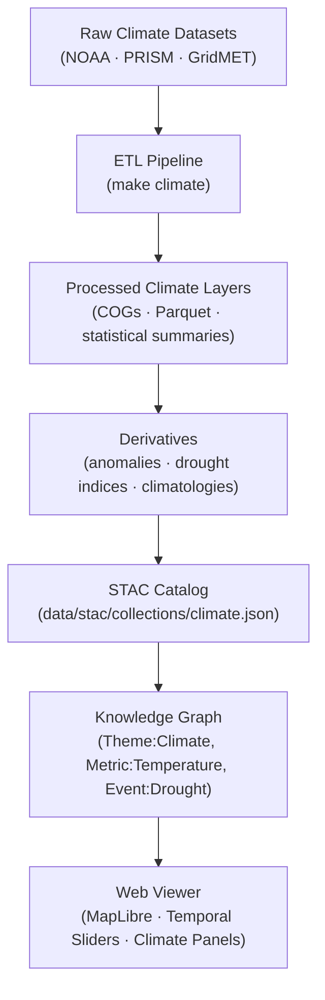

<div align="center">

# 🌦️ Kansas Frontier Matrix — Raw Climate Data  
`data/raw/climate/`

### **Temperature · Precipitation · Provenance**  
*Immutable, authoritative climate datasets forming the foundation for Kansas Frontier Matrix atmospheric and environmental analyses.*

[](../../../.github/workflows/site.yml)  
[](../../../.github/workflows/stac-validate.yml)  
[](../../../.github/workflows/codeql.yml)  
[](../../../.github/workflows/trivy.yml)  
[](../../../docs/)  
[](../../../LICENSE)

</div>

---

## 📘 Overview

The `data/raw/climate/` directory contains **original, unaltered climate datasets**  
that represent the atmospheric foundation of Kansas Frontier Matrix (KFM) analysis systems.  

These datasets include gridded temperature, precipitation, drought indices, and reanalysis products  
used in climate trend detection, hazard modeling, and ecosystem forecasting.

Each dataset is:
- 🧱 **Immutable** — no transformations or regridding  
- 🔗 **Traceable** — linked to official manifests in `data/sources/`  
- 🔐 **Verifiable** — associated with `.sha256` checksums  
- 📚 **Documented** — includes JSON metadata under `metadata/`  

---

## 🗂️ Directory Layout

```bash
data/raw/climate/
├── ncei_noaa_monthly_normals_1991_2020.nc
├── prism_precip_daily_4km_2020.nc
├── gridmet_tmean_2023.nc
├── metadata/
│   ├── ncei_noaa_monthly_normals_1991_2020.json
│   ├── prism_precip_daily_4km_2020.json
│   └── gridmet_tmean_2023.json
├── checksums/
│   ├── ncei_noaa_monthly_normals_1991_2020.nc.sha256
│   ├── prism_precip_daily_4km_2020.nc.sha256
│   └── gridmet_tmean_2023.nc.sha256
└── README.md
````

---

## 🌍 Data Sources & Provenance

| Dataset                              | Provider                 | Resolution | Temporal Span | CRS       | License       | STAC ID                          |
| ------------------------------------ | ------------------------ | ---------- | ------------- | --------- | ------------- | -------------------------------- |
| **NCEI NOAA Normals (1991–2020)**    | NOAA NCEI                | 5 km       | 30 years      | EPSG:4326 | Public Domain | `climate_noaa_normals_1991_2020` |
| **PRISM Daily Precipitation (2020)** | Oregon State Univ. PRISM | 4 km       | 2020          | EPSG:4326 | CC-BY 4.0     | `climate_prism_precip_2020`      |
| **GridMET Temperature (2023)**       | Univ. of Idaho GridMET   | 4 km       | 2023          | EPSG:4326 | CC-BY 4.0     | `climate_gridmet_tmean_2023`     |

All provenance details are mirrored in:

* `data/sources/*.json` (original manifests)
* `data/raw/climate/metadata/*.json`
* `data/stac/items/climate_*.json`

---

## 🔗 Connections

| Layer        | Upstream                      | Downstream                  | Purpose                                |
| ------------ | ----------------------------- | --------------------------- | -------------------------------------- |
| NOAA Normals | `data/sources/noaa_ncei.json` | `data/processed/climate/`   | Long-term temperature/precip baselines |
| PRISM Precip | `data/sources/prism.json`     | `data/processed/climate/`   | Daily precipitation grids              |
| GridMET Temp | `data/sources/gridmet.json`   | `data/derivatives/climate/` | Climate anomaly detection              |

---

## 🧭 Data Lineage Diagram



---

## 🧪 Reproducibility

```bash
# Fetch source data
make fetch CLIMATE=all

# Validate integrity
sha256sum -c checksums/*.sha256

# Validate metadata schema
make validate-metadata TYPE=climate

# Generate STAC entries
make stac CLIMATE=1
```

Outputs populate:

* `data/processed/climate/`
* `data/derivatives/climate/`
* `data/stac/collections/climate.json`

---

## 🧾 Dataset Card

**Title:** PRISM Daily Precipitation (Kansas, 2020)
**Source:** [PRISM Climate Group – Oregon State University](https://prism.oregonstate.edu/)
**Time:** 2020-01-01 → 2020-12-31
**Space:** Kansas extent (EPSG:4326)
**Files:** `prism_precip_daily_4km_2020.nc` (2.3 GB), `.sha256`
**STAC Item:** `data/stac/items/climate_prism_precip_2020.json`
**License:** CC-BY 4.0
**Provenance:** Retrieved 2025-01-05 via PRISM API; checksum verified.

---

## 🧱 Versioning

| Field            | Value                          |
| ---------------- | ------------------------------ |
| **Version**      | `v1.0.0`                       |
| **Status**       | Stable                         |
| **Author**       | Andy Barta                     |
| **Last Updated** | 2025-10-12                     |
| **MCP Stage**    | Documentation-First (Complete) |

---

## 🧠 AI & Knowledge Integration

* **Climate AI Models:** Feed entity extraction for temperature anomalies and drought classifications.
* **Knowledge Graph:** Creates nodes `(Theme:Climate)` and `(Metric:Temperature|Precipitation)` linked to `(Event:Drought)`.
* **Predictive Modeling:** Provides validated inputs for NASA-grade simulation engines per MCP reference.
* **Cross-Domain Integration:** Connects with hydrology, terrain, ecology, and landcover to form climate-driven correlations.

---

## 🧩 Validation & Compliance

| Check             | Tool             | Result     |
| ----------------- | ---------------- | ---------- |
| STAC Schema       | `stac-validator` | ✅ Passed   |
| JSON Schema       | `jsonschema`     | ✅ Valid    |
| SHA-256           | `sha256sum`      | ✅ Verified |
| MCP Documentation | Manual Review    | ✅ Complete |

---

## 🧩 Changelog

| Date           | Version  | Description                                                                                             |
| -------------- | -------- | ------------------------------------------------------------------------------------------------------- |
| **2025-10-12** | `v1.0.0` | Initial release — baseline raw climate data documentation; lineage, badges, and STAC links established. |

---

## 🪪 License

All datasets are distributed under **[CC-BY 4.0](https://creativecommons.org/licenses/by/4.0/)**
unless superseded by the source dataset license. Attribution required in derivative uses.

---

### ✅ Summary

This directory forms the **climate foundation layer** of the Kansas Frontier Matrix,
preserving NOAA, PRISM, and GridMET climate data in their original, verifiable form.
Each file includes full provenance, checksum validation, and metadata linkage —
ensuring scientifically reproducible climate research and historical analysis across Kansas.

```
