<div align="center">

# 🧾 Kansas Frontier Matrix — Raw Climate Checksums  
`data/raw/climate/checksums/`

### **Integrity · Authenticity · Provenance**  
*SHA-256 manifests ensuring immutable and auditable climate datasets across the Kansas Frontier Matrix.*

[](../../../../.github/workflows/site.yml)  
[](../../../../.github/workflows/stac-validate.yml)  
[](../../../../.github/workflows/codeql.yml)  
[](../../../../.github/workflows/trivy.yml)  
[](../../../../docs/)  
[](../../../../LICENSE)

</div>

---

## 📘 Overview

The `data/raw/climate/checksums/` directory stores **cryptographic SHA-256 digest files (`.sha256`)**  
for every unmodified climate dataset in `data/raw/climate/`.  

These checksum manifests guarantee:
- 🔐 **Immutability** — detects any byte-level alteration  
- 🔗 **Traceability** — referenced by metadata + STAC items  
- ⚙️ **Automation** — validated via `make validate-integrity` and CI/CD  
- 🧾 **Transparency** — provides forensic evidence of dataset authenticity  

---

## 🗂️ Directory Layout

```bash
data/raw/climate/checksums/
├── ncei_noaa_monthly_normals_1991_2020.nc.sha256
├── prism_precip_daily_4km_2020.nc.sha256
├── gridmet_tmean_2023.nc.sha256
└── README.md
````

---

## 🔗 Connections

| Relation            | Target                                | Description                       |
| ------------------- | ------------------------------------- | --------------------------------- |
| **Parent Data**     | `../*.nc`                             | Climate NetCDF file verified      |
| **Metadata Record** | `../metadata/*.json`                  | Embeds checksum reference         |
| **STAC Item**       | `data/stac/items/climate_*.json`      | Checksum stored in asset object   |
| **CI/CD Job**       | `.github/workflows/stac-validate.yml` | Automated integrity check         |
| **Graph Node**      | `(Dataset:Climate)`                   | Property `checksum_verified:true` |

---

## 🧭 Integrity Validation Flow

```mermaid
flowchart TD
  A["Raw Climate Files\n(NOAA · PRISM · GridMET)"] --> B["SHA-256 Generation\n(sha256sum)"]
  B --> C["Checksum Manifests\n(.sha256 files)"]
  C --> D["Integrity Validation\n(make validate-integrity · CI/CD)"]
  D --> E["Metadata Embedding\n(data/raw/climate/metadata/*.json)"]
  E --> F["STAC Integration\n(data/stac/items/climate_*.json)"]
  F --> G["Knowledge Graph\n(Dataset:Climate {checksum_verified:true})"]
%%END OF MERMAID%%
```



---

## 🧪 Validation Commands

### 🔍 Manual Verification

```bash
# Verify all climate files
cd data/raw/climate/
sha256sum -c checksums/*.sha256
```

### ⚙️ Automated Validation

```bash
# Run integrity target (CI/CD safe)
make validate-integrity TYPE=climate
```

### 🧮 Example Output

```bash
$ sha256sum -c prism_precip_daily_4km_2020.nc.sha256
prism_precip_daily_4km_2020.nc: OK
```

If a checksum fails, the file must be re-acquired from its manifest in `data/sources/`.

---

## 🧾 Dataset Card

**Title:** Raw Climate Checksums
**Scope:** SHA-256 digests for all raw climate datasets
**Location:** `data/raw/climate/checksums/`
**Datasets Covered:** NOAA Normals (1991–2020), PRISM 2020, GridMET 2023
**Validation:** `sha256sum -c` / `make validate-integrity`
**Purpose:** Guarantee integrity and traceability of KFM climate sources

---

## 🧱 Versioning

| Field            | Value                          |
| ---------------- | ------------------------------ |
| **Version**      | `v1.0.0`                       |
| **Status**       | Stable                         |
| **Author**       | Andy Barta                     |
| **Last Updated** | 2025-10-12                     |
| **MCP Stage**    | Documentation-First (Complete) |

---

## 🧠 AI & Knowledge Integration

* **AI Reliability Scoring:** Checksum results weight dataset trust in ML pipelines.
* **Graph Alignment:** Neo4j nodes `(Dataset:Climate)` carry `checksum_verified=true`.
* **Forensic Provenance:** Supports audit chains in NASA-grade simulation models.
* **ETL Safeguard:** Prevents processing of corrupted data in climate derivative pipelines.

---

## 🧩 Validation & Compliance

| Check             | Tool           | Result     |
| ----------------- | -------------- | ---------- |
| SHA-256 Integrity | `sha256sum`    | ✅ Verified |
| Schema Linkage    | `jsonschema`   | ✅ Valid    |
| CI/CD Automation  | GitHub Actions | ✅ Passed   |
| MCP Documentation | Manual Review  | ✅ Complete |

---

## 🧩 Changelog

| Date           | Version  | Description                                                                                         |
| -------------- | -------- | --------------------------------------------------------------------------------------------------- |
| **2025-10-12** | `v1.0.0` | Initial release — added climate checksum documentation, lineage diagram, and validation references. |

---

## 🪪 License

Checksum files are distributed under **[CC-BY 4.0](https://creativecommons.org/licenses/by/4.0/)**;
source data retain original licenses. Attribution required in derivative workflows.

---

### ✅ Summary

This directory forms the **integrity verification layer** for KFM’s raw climate data.
Each `.sha256` manifest links a climate dataset to its metadata and STAC record, embedding audit trails into the knowledge graph.
Together, they guarantee scientifically reproducible, tamper-proof climate archives for Kansas.

```
