<div align="center">

# 🌦️ Kansas Frontier Matrix — Raw Climate Metadata  
`data/raw/climate/metadata/`

### **Lineage · Provenance · Validation**  
*Structured JSON metadata describing every immutable climate dataset feeding the Kansas Frontier Matrix.*

[](../../../../.github/workflows/site.yml)  
[](../../../../.github/workflows/stac-validate.yml)  
[](../../../../.github/workflows/codeql.yml)  
[](../../../../.github/workflows/trivy.yml)  
[](../../../../docs/)  
[](../../../../LICENSE)

</div>

---

## 📘 Overview

The `data/raw/climate/metadata/` directory contains **JSON metadata files** describing each **unmodified climate dataset** housed in `data/raw/climate/`.

Every record provides:
- 🔗 **Full provenance** — source URL, citation, retrieval date  
- 🧮 **Spatial & temporal coverage** — extent, CRS, observation period  
- 🧾 **License & integrity** — SPDX ID + SHA-256 checksum reference  
- 📜 **Schema compliance** — validated against the official KFM source schema  
- 🌐 **STAC integration** — fields align to STAC 1.0 item structure  

These metadata files ensure transparency, interoperability, and reproducibility across the KFM climate analysis pipeline.

---

## 🗂️ Directory Layout

```bash
data/raw/climate/metadata/
├── ncei_noaa_monthly_normals_1991_2020.json
├── prism_precip_daily_4km_2020.json
├── gridmet_tmean_2023.json
└── README.md
````

---

## 🧩 Metadata Schema Validation

All JSON files conform to:

```text
src/kansas_geo_timeline/schemas/source_schema.json
```

| Field             | Description                          |
| ----------------- | ------------------------------------ |
| `id`              | Unique STAC-style identifier         |
| `source_name`     | Canonical dataset title              |
| `provider`        | Dataset producer or agency           |
| `license`         | SPDX-compliant license string        |
| `spatial_extent`  | `[W,S,E,N]` bounding box (EPSG 4326) |
| `temporal_extent` | Observation / publication date range |
| `crs`             | Coordinate Reference System          |
| `resolution`      | Grid or point spacing                |
| `provenance`      | URL · checksum · retrieval timestamp |
| `validation`      | Schema / checksum / STAC status      |

---

## 🔗 Connections

| Relationship    | Target Path                                          | Description                    |
| --------------- | ---------------------------------------------------- | ------------------------------ |
| **Parent Data** | `data/raw/climate/*.nc`                              | Linked NetCDF file             |
| **Checksum**    | `data/raw/climate/checksums/*.sha256`                | Integrity manifest             |
| **STAC Item**   | `data/stac/items/climate_*.json`                     | Exported metadata record       |
| **Schema**      | `src/kansas_geo_timeline/schemas/source_schema.json` | Validation template            |
| **Graph Node**  | `neo4j://Theme:Climate`                              | Knowledge-graph representation |

---

## 🧭 Metadata Lineage Flow

```mermaid
flowchart TD
  A["Raw Climate Metadata\n(JSON: NOAA · PRISM · GridMET)"] --> B["Schema Validation\n(source_schema.json)"]
  B --> C["STAC Item Creation\n(data/stac/items/climate_*.json)"]
  C --> D["STAC Collection Assembly\n(climate.json)"]
  D --> E["Knowledge Graph Integration\n(Theme: Climate, Metric: Temperature / Precipitation)"]
  C --> F["AI /NLP Enrichment\n(Entity extraction · Climate trend classification)"]
%%END OF MERMAID%%
```



---

## 🧪 Validation Commands

```bash
# Validate all climate metadata JSONs
make validate-metadata TYPE=climate

# Manual schema validation
python scripts/validate_schema.py \
  --schema src/kansas_geo_timeline/schemas/source_schema.json \
  --input data/raw/climate/metadata/

# Verify linked checksum references
sha256sum -c ../checksums/*.sha256
```

---

## 🧾 Example Metadata Snippet

```json
{
  "id": "climate_prism_precip_2020",
  "source_name": "PRISM Daily Precipitation (2020)",
  "provider": "PRISM Climate Group, Oregon State University",
  "license": "CC-BY-4.0",
  "spatial_extent": [-102.05, 36.99, -94.60, 40.00],
  "temporal_extent": ["2020-01-01", "2020-12-31"],
  "crs": "EPSG:4326",
  "resolution": "4 km",
  "provenance": {
    "url": "https://prism.oregonstate.edu/",
    "sha256": "ad41b7e31f92b7e6ff82e0bd4f43ce2a3a98d15b...",
    "retrieved": "2025-01-05"
  },
  "validation": {
    "schema": "Passed",
    "checksum": "Verified",
    "stac_export": "Generated"
  }
}
```

---

## 🧱 Versioning

| Field            | Value                          |
| ---------------- | ------------------------------ |
| **Version**      | `v1.0.0`                       |
| **Status**       | Stable                         |
| **Author**       | Andy Barta                     |
| **Last Updated** | 2025-10-12                     |
| **MCP Stage**    | Documentation-First (Complete) |

---

## 🧠 AI & Knowledge Integration

* **Semantic Extraction:** Metadata keywords populate the Climate ontology (temperature, precipitation, drought).
* **Graph Mapping:** Creates Neo4j nodes `(Dataset:Climate)` and `(Theme:Atmosphere)` with `HAS_PROVENANCE` links.
* **Predictive Modeling:** Metadata parameters feed uncertainty propagation models in simulation pipelines.
* **Cross-Domain Linkage:** Connects climate data with hydrology, terrain, landcover and ecology for multi-domain correlation.

---

## 🧩 Validation & Compliance

| Check             | Tool             | Result     |
| ----------------- | ---------------- | ---------- |
| JSON Schema       | `jsonschema`     | ✅ Passed   |
| STAC Export       | `stac-validator` | ✅ Valid    |
| Checksum Link     | `sha256sum`      | ✅ Verified |
| MCP Documentation | Manual Review    | ✅ Complete |

---

## 🧩 Changelog

| Date           | Version  | Description                                                                                             |
| -------------- | -------- | ------------------------------------------------------------------------------------------------------- |
| **2025-10-12** | `v1.0.0` | Initial release — added climate metadata documentation, schema validation, and Mermaid lineage diagram. |

---

## 🪪 License

All metadata files are distributed under **[CC-BY 4.0](https://creativecommons.org/licenses/by/4.0/)**
unless overridden by the originating dataset license. Attribution is required in all derivative works.

---

### ✅ Summary

This folder anchors the **metadata layer** for Kansas Frontier Matrix climate datasets.
Each record links original NOAA, PRISM, and GridMET sources to STAC items, checksums, and the knowledge graph,
ensuring full provenance, validation, and reproducibility for climate science in Kansas.

```
