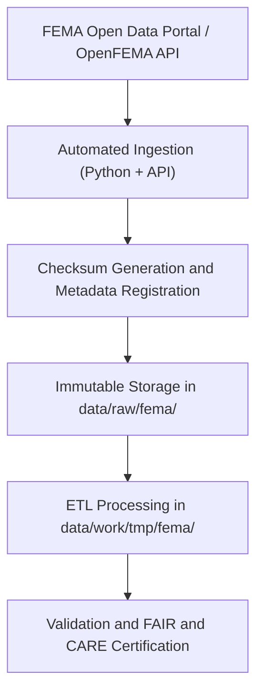

<div align="center">

# 🚨 Kansas Frontier Matrix — **FEMA Raw Data Repository**
`data/raw/fema/README.md`

**Purpose:** Contains unaltered datasets acquired from the **Federal Emergency Management Agency (FEMA)**, including flood hazard maps, disaster declarations, and mitigation project data.  
These files provide the core foundation for hazard modeling and FAIR+CARE-aligned governance workflows within the Kansas Frontier Matrix (KFM).

[](https://www.fema.gov/openfema-data-page)
[](../../../docs/standards/faircare-validation.md)
[](../../../LICENSE)
[](../../../docs/architecture/repo-focus.md)

</div>

---

## 📚 Overview

The `data/raw/fema/` directory contains original FEMA datasets related to flood zones, declared disasters, and hazard mitigation efforts within Kansas.  
All data are retrieved directly from the **OpenFEMA API** or official FEMA GIS repositories and are preserved in their original format for transparency, reproducibility, and archival traceability.

Each dataset:
- Is stored **exactly as downloaded** from FEMA’s Open Data portal.  
- Contains accompanying `metadata.json` and `license.txt`.  
- Is immutable and used for validation within KFM’s ETL pipelines.  
- Conforms to FAIR+CARE ethical and data governance frameworks.

---

## 🗂️ Directory Layout

```plaintext
data/raw/fema/
├── README.md                              # This file — FEMA raw data overview
│
├── flood_zones/                           # FEMA National Flood Hazard Layer (NFHL)
│   ├── kansas_flood_zones_2025.geojson
│   ├── nfhl_coverage_metadata.json
│   └── license.txt
│
├── disaster_declarations/                 # FEMA disaster declarations for Kansas
│   ├── disaster_declarations_2025.csv
│   ├── metadata.json
│   └── license.txt
│
├── mitigation_projects/                   # Hazard mitigation and recovery project data
│   ├── mitigation_projects_ks_2025.csv
│   ├── metadata.json
│   └── license.txt
│
└── metadata.json                          # Master metadata for FEMA datasets
```

---

## ⚙️ Data Governance Workflow



### Summary:
1. **Ingestion:** Datasets automatically fetched via OpenFEMA API or FEMA GIS downloads.  
2. **Metadata:** Provenance and licensing info saved as `metadata.json`.  
3. **Checksum:** Integrity hash generated for each file and recorded in manifest.  
4. **Storage:** Files stored read-only to preserve provenance integrity.  
5. **Processing:** Downstream ETL pipelines normalize, validate, and convert data into KFM standards.

---

## 🧩 Example Metadata Record

```json
{
  "id": "fema_disaster_declarations_2025",
  "title": "FEMA Disaster Declarations Summary - Kansas",
  "description": "List of federally declared disasters affecting Kansas, including disaster type, county, and declaration date.",
  "source_url": "https://www.fema.gov/openfema-data-page/disaster-declarations-summaries-v2",
  "provider": "Federal Emergency Management Agency (FEMA)",
  "license": "Public Domain",
  "checksum": "sha256:82ab492f53a7e67f4d7dc3c6a91f12d5e5b7c2fa...",
  "spatial_extent": [-102.05, 36.99, -94.61, 40.00],
  "temporal_extent": ["1953-05-11", "2025-10-28"]
}
```

---

## 🌍 Dataset Categories

| Dataset | Description | Source | Format |
|----------|--------------|--------|--------|
| `flood_zones` | FEMA National Flood Hazard Layer (NFHL) — base floodplain zones. | FEMA NFHL | GeoJSON |
| `disaster_declarations` | Federally declared disasters for Kansas (DR, EM, FM codes). | OpenFEMA | CSV |
| `mitigation_projects` | FEMA-funded hazard mitigation and resilience projects. | OpenFEMA | CSV |

Spatial Reference: **EPSG:4326 (WGS84)**  
Temporal Coverage: **1953–Present**

---

## ⚖️ Licensing & Attribution

| Source | License | Access Link |
|---------|----------|-------------|
| **FEMA NFHL** | Public Domain | [https://www.fema.gov/nfhl](https://www.fema.gov/nfhl) |
| **OpenFEMA API** | Public Domain | [https://www.fema.gov/openfema-data-page](https://www.fema.gov/openfema-data-page) |
| **Mitigation Datasets** | Public Domain | [https://www.fema.gov/openfema-data-page/mitigation-projects-v2](https://www.fema.gov/openfema-data-page/mitigation-projects-v2) |

FEMA data are public domain under U.S. federal law; attribution recommended for derivative works.

---

## 🧠 FAIR+CARE Compliance Overview

| Principle | Implementation |
|------------|----------------|
| **Findable** | Indexed with dataset IDs in STAC and global manifest. |
| **Accessible** | Open CSV/GeoJSON formats and public APIs. |
| **Interoperable** | Schema aligned with STAC/DCAT metadata standards. |
| **Reusable** | Includes license, provenance, and validation metadata. |
| **Collective Benefit** | Enables public awareness of flood and disaster risk. |
| **Authority to Control** | Attribution retained to FEMA as data custodian. |
| **Responsibility** | Governance workflows monitor ethical use and accuracy. |
| **Ethics** | Contains no personal or restricted data; supports public safety. |

Governance and validation records available in:  
`data/reports/audit/data_provenance_ledger.json` and `data/reports/fair/data_fair_summary.json`.

---

## 🔍 Example Schema (Disaster Declarations CSV)

| Column | Description | Example |
|---------|--------------|----------|
| `disasterNumber` | FEMA disaster number | `4785` |
| `state` | U.S. state abbreviation | `KS` |
| `incidentType` | Disaster type | `Flood` |
| `declarationDate` | Date declared | `2025-03-22` |
| `designatedArea` | Affected county or region | `Johnson County` |
| `fyDeclared` | Fiscal year declared | `2025` |

---

## ⚙️ Governance & Provenance Integration

| File | Purpose |
|------|----------|
| `metadata.json` | Records dataset lineage, license, and checksum. |
| `data/reports/audit/data_provenance_ledger.json` | Logs ingestion and governance metadata. |
| `data/reports/fair/data_care_assessment.json` | FAIR+CARE compliance results. |
| `releases/v9.3.2/manifest.zip` | Master checksum registry for all raw data. |

---

## 🧾 Citation

```text
Kansas Frontier Matrix (2025). FEMA Raw Data Repository (v9.3.2).
Contains unaltered FEMA datasets including flood zones, disaster declarations, and mitigation projects for Kansas.
Available at: https://github.com/bartytime4life/Kansas-Frontier-Matrix/tree/main/data/raw/fema
License: Public Domain (U.S. Federal Data)
```

---

## 🧾 Version Notes

| Version | Date | Notes |
|----------|------|--------|
| v9.3.2 | 2025-10-28 | Added 2025 flood hazard and disaster declaration updates; revalidated metadata schema. |
| v9.2.0 | 2024-07-10 | Introduced mitigation projects dataset. |
| v9.0.0 | 2023-01-15 | Established FEMA raw data ingestion directory; baseline flood zone import. |

---

<div align="center">

**Kansas Frontier Matrix** · *Hazard Governance × FAIR+CARE Transparency × Open Federal Data*  
[🔗 Repository](https://github.com/bartytime4life/Kansas-Frontier-Matrix) • [🧭 Docs Portal](../../../docs/) • [⚖️ Governance Ledger](../../../docs/standards/governance/)

</div>
