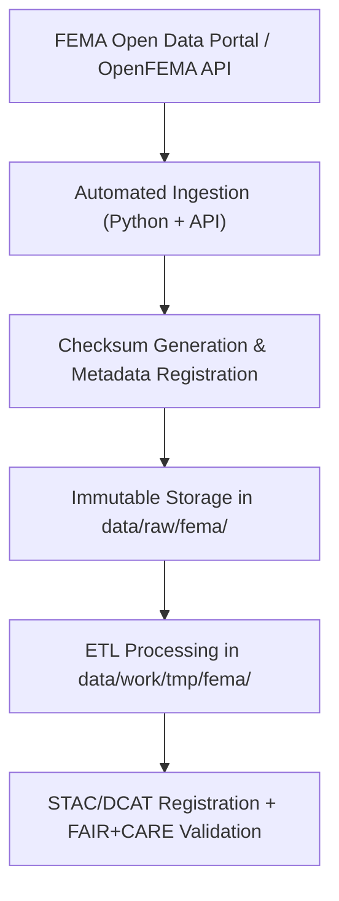

<div align="center">

# 🚨 Kansas Frontier Matrix — **FEMA Raw Data Repository**  
`data/raw/fema/README.md`

**Purpose:** Preserves **unaltered FEMA datasets** (NFHL flood hazards, disaster declarations, mitigation projects) used for hazard modeling and governance within the Kansas Frontier Matrix (KFM).  
All content is managed under **FAIR+CARE** and **MCP-DL v6.4.3** for transparency, provenance, and ethical reuse.

[](https://www.fema.gov/openfema-data-page)
[](../../../docs/standards/faircare-validation.md)
[](../../../LICENSE)
[](../../../docs/architecture/repo-focus.md)

</div>

---

## 📚 Overview

The `data/raw/fema/` directory contains **original FEMA datasets** for Kansas, including flood zone geometries (NFHL), declared disasters, and mitigation projects.  
Files are preserved **exactly as downloaded** from the **OpenFEMA API** or official FEMA GIS portals to ensure reproducibility and auditability.

Each dataset:
- Stores **source-format files** (CSV/GeoJSON/ESRI packages) as delivered by FEMA.  
- Includes `metadata.json` and `license.txt` for license and provenance.  
- Is immutable and referenced by ETL pipelines for normalization.  
- Aligns with STAC/DCAT metadata and FAIR+CARE governance policies.

---

## 🗂️ Directory Layout

```plaintext
data/raw/fema/
├── README.md                              # This file — FEMA raw data overview
│
├── flood_zones/                           # FEMA National Flood Hazard Layer (NFHL)
│   ├── kansas_flood_zones_2025.geojson
│   ├── nfhl_coverage_metadata.json
│   └── license.txt
│
├── disaster_declarations/                 # FEMA disaster declarations for Kansas
│   ├── disaster_declarations_2025.csv
│   ├── metadata.json
│   └── license.txt
│
├── mitigation_projects/                   # Hazard mitigation and recovery project data
│   ├── mitigation_projects_ks_2025.csv
│   ├── metadata.json
│   └── license.txt
│
└── metadata.json                          # Master metadata summary for FEMA datasets
```

---

## ⚙️ Data Governance Workflow



**Summary**
1. **Ingestion:** Automated retrieval using OpenFEMA API or official FEMA GIS downloads.  
2. **Metadata:** License, temporal coverage, and checksum recorded in `metadata.json`.  
3. **Integrity:** SHA-256 checksums added to the global manifest (`releases/v9.5.0/manifest.zip`).  
4. **ETL:** Normalization performed in `/src/pipelines/etl/`, with validated outputs to `data/work/processed/`.  
5. **Governance:** Provenance logged to `reports/audit/data_provenance_ledger.json`.

---

## 🧩 Example Metadata Record

```json
{
  "id": "fema_disaster_declarations_2025",
  "title": "FEMA Disaster Declarations Summary — Kansas",
  "description": "Federally declared disasters affecting Kansas, with declaration date, incident type, and designated areas.",
  "provider": "Federal Emergency Management Agency (FEMA)",
  "source_url": "https://www.fema.gov/openfema-data-page/disaster-declarations-summaries-v2",
  "license": "Public Domain",
  "format": "CSV",
  "spatial_extent": [-102.05, 36.99, -94.61, 40.00],
  "temporal_extent": ["1953-05-11", "2025-12-31"],
  "checksum": "sha256:82ab492f53a7e67f4d7dc3c6a91f12d5e5b7c2fabcd9e1c1f2b3d4e5a6b7c8d",
  "governance_ref": "docs/standards/governance/DATA-GOVERNANCE.md"
}
```

---

## 🌍 Dataset Categories

| Dataset | Description | Source | Format |
|----------|--------------|--------|--------|
| `flood_zones` | National Flood Hazard Layer (NFHL) base floodplain zones. | FEMA NFHL | GeoJSON |
| `disaster_declarations` | Disaster declarations (DR, EM, FM codes) with county designations. | OpenFEMA | CSV |
| `mitigation_projects` | FEMA-backed mitigation and resilience projects (grants, outcomes). | OpenFEMA | CSV |

**Spatial Reference:** EPSG:4326 (WGS84)  
**Temporal Coverage:** 1953–Present

---

## ⚖️ Licensing & Attribution

| Source | License | Access Link |
|---------|----------|-------------|
| **FEMA NFHL** | Public Domain | [https://www.fema.gov/nfhl](https://www.fema.gov/nfhl) |
| **OpenFEMA API** | Public Domain | [https://www.fema.gov/openfema-data-page](https://www.fema.gov/openfema-data-page) |
| **Mitigation Datasets** | Public Domain | [https://www.fema.gov/openfema-data-page/mitigation-projects-v2](https://www.fema.gov/openfema-data-page/mitigation-projects-v2) |

FEMA datasets are **U.S. Government Works** (public domain). Attribution is recommended for derivative work.

---

## 🧠 FAIR+CARE Compliance

| Principle | Implementation |
|------------|----------------|
| **Findable** | STAC/DCAT-indexed; searchable through Focus Mode catalog. |
| **Accessible** | Stored in open formats (CSV/GeoJSON) and accessible via public endpoints. |
| **Interoperable** | Metadata conforms to STAC 1.0 and DCAT 3.0. |
| **Reusable** | License, checksum, and provenance recorded for each dataset. |
| **Collective Benefit** | Advances hazard awareness, planning, and public safety. |
| **Authority to Control** | Recognizes FEMA as data steward; preserves attribution. |
| **Responsibility** | Automated governance workflows ensure accuracy and ethical use. |
| **Ethics** | Contains no PII; aligned with public data standards. |

FAIR+CARE audit trails:  
`data/reports/audit/data_provenance_ledger.json` · `data/reports/fair/data_fair_summary.json`

---

## 🔍 Sample Schema (Disaster Declarations CSV)

| Column | Description | Example |
|---------|--------------|----------|
| `disasterNumber` | FEMA disaster number | `4785` |
| `state` | State | `KS` |
| `incidentType` | Disaster type | `Flood` |
| `declarationDate` | Date declared | `2025-03-22` |
| `designatedArea` | Affected county / area | `Johnson County` |
| `fyDeclared` | Fiscal year declared | `2025` |

---

## 🔒 Governance & Provenance Artifacts

| File | Purpose |
|------|----------|
| `metadata.json` | Dataset lineage, license, and checksum metadata |
| `data/reports/audit/data_provenance_ledger.json` | Governance/provenance record |
| `data/reports/validation/stac_validation_report.json` | STAC/DCAT validation results |
| `../../../releases/v9.5.0/manifest.zip` | Master checksum registry |

---

## 🧾 Citation

```text
Kansas Frontier Matrix (2025). FEMA Raw Data Repository (v9.5.0).
Contains unaltered FEMA datasets including flood zones, disaster declarations, and mitigation projects for Kansas.
Available at: https://github.com/bartytime4life/Kansas-Frontier-Matrix/tree/main/data/raw/fema
License: Public Domain (U.S. Government Works)
```

---

## 🧾 Version History

| Version | Date | Author | Summary |
|----------|------|---------|----------|
| v9.5.0 | 2025-10-30 | @kfm-data-lab | Upgraded to MCP-DL v6.4.3; added DCAT exports and enhanced governance telemetry. |
| v9.3.2 | 2025-10-28 | @kfm-architecture | Added 2025 flood hazard and disaster declaration updates; schema revalidated. |
| v9.2.0 | 2024-07-10 | @kfm-etl-ops | Introduced mitigation projects dataset ingestion. |
| v9.0.0 | 2023-01-15 | @kfm-architecture | Established FEMA raw data ingestion directory; baseline NFHL import. |

---

<div align="center">

**Kansas Frontier Matrix** · *Hazard Governance × FAIR+CARE Transparency × Open Federal Data*  
[🔗 Repository](https://github.com/bartytime4life/Kansas-Frontier-Matrix) • [🧭 Docs Portal](../../../docs/) • [⚖️ Governance Ledger](../../../docs/standards/governance/)

</div>
