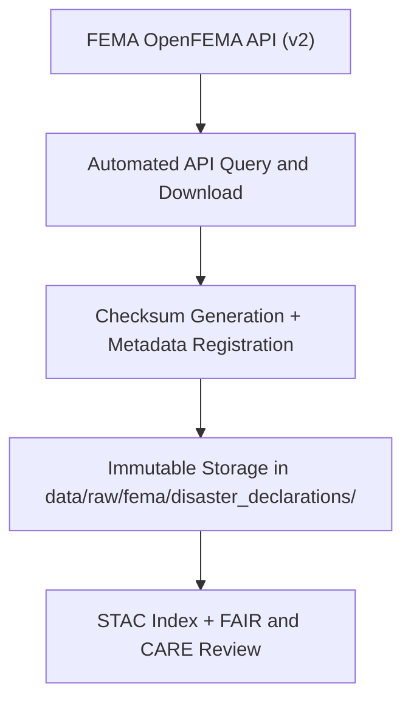

<div align="center">

# ⚠️ Kansas Frontier Matrix — **FEMA Disaster Declarations**
`data/raw/fema/disaster_declarations/README.md`

**Purpose:** Contains unmodified records of federally declared disasters affecting Kansas, sourced directly from FEMA’s **OpenFEMA API**.  
Used by Kansas Frontier Matrix (KFM) to track disaster frequency, type, and spatial impact across counties for FAIR+CARE-compliant hazard analytics.

[](https://www.fema.gov/openfema-data-page/disaster-declarations-summaries-v2)
[](../../../../docs/standards/faircare-validation.md)
[](../../../../LICENSE)
[](../../../../docs/architecture/repo-focus.md)

</div>

---

## 📚 Overview

The `data/raw/fema/disaster_declarations/` directory includes all FEMA disaster declaration summaries from 1953 to 2025.  
These data represent official federal disaster declarations (DR, EM, FM codes) and contain incident information, declaration types, affected counties, and fiscal years.  

All datasets are:
- Downloaded directly from the **FEMA OpenFEMA API (v2)**.  
- Stored in raw CSV format for transparency and provenance retention.  
- Accompanied by metadata describing schema, checksum, and source URL.  
- Validated and logged within KFM’s FAIR+CARE governance framework.

---

## 🗂️ Directory Layout

```plaintext
data/raw/fema/disaster_declarations/
├── README.md                            # This file — documentation of disaster declaration datasets
│
├── disaster_declarations_2025.csv       # Current disaster declaration records for Kansas
├── metadata.json                        # Provenance, schema, and temporal coverage details
└── license.txt                          # FEMA public domain license
```

---

## ⚙️ Data Ingestion Workflow



### Description:
1. **Ingestion:** Automated nightly ingestion from FEMA OpenFEMA endpoint.  
2. **Metadata:** Created automatically with `source_url`, `record_count`, and temporal range.  
3. **Checksum:** SHA-256 hash generated for file integrity validation.  
4. **Validation:** Ensures data completeness, schema compliance, and FAIR+CARE governance.  

---

## 🧩 Example Metadata Record

```json
{
  "id": "fema_disaster_declarations_2025",
  "title": "FEMA Disaster Declarations Summaries - Kansas",
  "description": "List of federally declared disasters impacting Kansas, including incident type, declaration date, and affected counties.",
  "source_url": "https://www.fema.gov/openfema-data-page/disaster-declarations-summaries-v2",
  "provider": "Federal Emergency Management Agency (FEMA)",
  "license": "Public Domain",
  "checksum": "sha256:5e7e12c39a59e7a0fd8c8b2e90b30f8ccdc6f0ab...",
  "record_count": 3152,
  "spatial_extent": [-102.05, 36.99, -94.61, 40.00],
  "temporal_extent": ["1953-05-11", "2025-10-28"]
}
```

---

## 🌍 Dataset Schema

| Column | Description | Example |
|---------|--------------|----------|
| `disasterNumber` | Unique FEMA disaster number | `4785` |
| `state` | State abbreviation | `KS` |
| `incidentType` | Type of disaster | `Flood` |
| `declarationTitle` | Official name of declaration | `Severe Storms and Flooding` |
| `declarationDate` | Date disaster declared | `2025-03-22` |
| `designatedArea` | County or area affected | `Johnson County` |
| `fyDeclared` | Fiscal year of declaration | `2025` |
| `ihProgramDeclared` | Individual Housing Program activated | `TRUE` |
| `paProgramDeclared` | Public Assistance Program activated | `TRUE` |

---

## ⚖️ Licensing & Attribution

```
FEMA OpenFEMA Data
Public Domain Data under U.S. Federal Law.
Users may use, distribute, and adapt the data freely with proper citation.
Source: Federal Emergency Management Agency (FEMA)
```

**Recommended Citation:**
```text
Federal Emergency Management Agency (FEMA). "Disaster Declarations Summaries (v2)".
Accessed via OpenFEMA API on 2025-10-28. Public Domain.
```

---

## 🧠 FAIR+CARE Compliance Overview

| Principle | Implementation |
|------------|----------------|
| **Findable** | Indexed in KFM STAC catalog with unique dataset ID. |
| **Accessible** | Public CSV format downloadable under open license. |
| **Interoperable** | Metadata schema aligns with STAC 1.0 and DCAT 3.0. |
| **Reusable** | Includes license, provenance, and checksum fields. |
| **Collective Benefit** | Supports transparency in disaster response data. |
| **Authority to Control** | FEMA as authoritative source; attribution retained. |
| **Responsibility** | Dataset validated for consistency and completeness. |
| **Ethics** | Contains no personal or sensitive data; fully public record. |

Audit references stored in:  
`data/reports/audit/data_provenance_ledger.json`  
and `data/reports/fair/data_fair_summary.json`.

---

## 🔍 Governance Integration

| Record | Description |
|---------|-------------|
| `metadata.json` | Captures source, temporal, and spatial metadata. |
| `data/reports/audit/data_provenance_ledger.json` | Logs ingestion event and checksum. |
| `data/reports/fair/data_care_assessment.json` | FAIR+CARE audit summary. |
| `releases/v9.3.2/manifest.zip` | Master checksum manifest for validation. |

---

## 🧾 Citation (KFM Context)

```text
Kansas Frontier Matrix (2025). FEMA Disaster Declarations (v9.3.2).
Unmodified FEMA OpenFEMA dataset of disaster declarations for Kansas, spanning 1953–2025.
Available at: https://github.com/bartytime4life/Kansas-Frontier-Matrix/tree/main/data/raw/fema/disaster_declarations
License: Public Domain (U.S. Federal Data)
```

---

## 🧾 Version Notes

| Version | Date | Notes |
|----------|------|--------|
| v9.3.2 | 2025-10-28 | Updated disaster records through 2025; validated schema and checksum. |
| v9.2.0 | 2024-07-10 | Added record_count field to metadata and automated nightly ingestion. |
| v9.0.0 | 2023-01-15 | Established initial ingestion and metadata schema for FEMA OpenFEMA API. |

---

<div align="center">

**Kansas Frontier Matrix** · *Disaster Data × FAIR+CARE Governance × Open Federal Transparency*  
[🔗 Repository](https://github.com/bartytime4life/Kansas-Frontier-Matrix) • [🧭 Docs Portal](../../../../docs/) • [⚖️ Governance Ledger](../../../../docs/standards/governance/)

</div>
