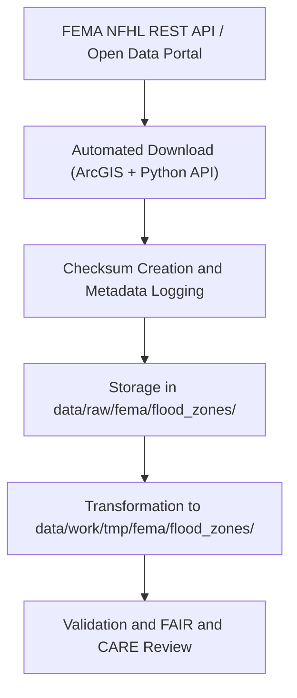

<div align="center">

# 🌊 Kansas Frontier Matrix — **FEMA Flood Zones**
`data/raw/fema/flood_zones/README.md`

**Purpose:** Contains unmodified FEMA **National Flood Hazard Layer (NFHL)** datasets used by the Kansas Frontier Matrix (KFM) to model hydrologic risk, floodplain extents, and disaster vulnerability.  
Data are directly ingested from FEMA’s official GIS repositories under FAIR+CARE governance for transparency and reproducibility.

[](https://www.fema.gov/national-flood-hazard-layer-nfhl)
[](../../../../docs/standards/faircare-validation.md)
[](../../../../LICENSE)
[](../../../../docs/architecture/repo-focus.md)

</div>

---

## 📚 Overview

The `data/raw/fema/flood_zones/` directory holds FEMA’s **National Flood Hazard Layer (NFHL)** data specific to Kansas.  
This dataset includes digital floodplain boundaries, floodway delineations, and base flood elevations (BFEs), which serve as the foundation for KFM’s hazard and resilience analyses.

All datasets are:
- Pulled directly from FEMA’s Open Data Portal or ArcGIS REST services.  
- Preserved in **GeoJSON** format for interoperability.  
- Accompanied by metadata and checksum validation.  
- Governed under FAIR+CARE ethical data standards.

---

## 🗂️ Directory Layout

```plaintext
data/raw/fema/flood_zones/
├── README.md                          # This file — overview of FEMA flood zone datasets
│
├── kansas_flood_zones_2025.geojson    # NFHL flood hazard boundaries for Kansas
├── nfhl_coverage_metadata.json        # Metadata and CRS definition for flood zone data
└── license.txt                        # FEMA Public Domain license
```

---

## ⚙️ Ingestion & Governance Workflow



**Process Summary:**
1. Data retrieved directly from FEMA NFHL REST endpoint (`https://hazards.fema.gov/nfhl/rest/services/public/NFHL`).  
2. Metadata, coordinate system, and acquisition date recorded in `nfhl_coverage_metadata.json`.  
3. Checksum generated for integrity tracking.  
4. FAIR+CARE validation ensures public accessibility and ethical data use.

---

## 🧩 Example Metadata Record

```json
{
  "id": "fema_nfhl_kansas_2025",
  "title": "FEMA National Flood Hazard Layer (NFHL) - Kansas",
  "description": "Digital flood hazard boundaries and base flood elevations (BFE) for Kansas, provided by FEMA NFHL.",
  "source_url": "https://www.fema.gov/national-flood-hazard-layer-nfhl",
  "provider": "Federal Emergency Management Agency (FEMA)",
  "license": "Public Domain",
  "checksum": "sha256:54ad88cc3a20cce5974c71c73aa9a76f02a6b6e3...",
  "spatial_extent": [-102.05, 36.99, -94.61, 40.00],
  "temporal_extent": ["2025-01-01", "2025-12-31"],
  "crs": "EPSG:4326"
}
```

---

## 🌍 Dataset Details

| Attribute | Description |
|------------|-------------|
| **Layer Name** | FEMA NFHL — Kansas Flood Hazard Boundaries |
| **Data Type** | Vector (Polygon / Line) |
| **Coordinate System** | EPSG:4326 (WGS84) |
| **Source** | FEMA Open Data Portal (NFHL) |
| **License** | Public Domain (U.S. Federal Data) |
| **File Format** | GeoJSON |
| **Data Size** | ~420 MB (Kansas statewide coverage) |

---

## ⚖️ Licensing & Attribution

```
FEMA National Flood Hazard Layer (NFHL)
Public Domain Data under U.S. Federal Law.
Users may copy, distribute, and adapt the data with proper attribution.
Source: Federal Emergency Management Agency (FEMA)
```

### Recommended Citation
```text
Federal Emergency Management Agency (FEMA). "National Flood Hazard Layer (NFHL) - Kansas".
Accessed via OpenFEMA API on 2025-10-28. Public Domain.
```

---

## 🧠 FAIR+CARE Compliance Overview

| Principle | Implementation |
|------------|----------------|
| **Findable** | Indexed in STAC with global dataset ID and manifest entry. |
| **Accessible** | Publicly available via FEMA’s Open Data Portal and repository. |
| **Interoperable** | Standardized GeoJSON format and WGS84 CRS. |
| **Reusable** | Accompanied by full metadata and checksum validation. |
| **Collective Benefit** | Enables flood risk management and hazard awareness. |
| **Authority to Control** | Data managed and published by FEMA. |
| **Responsibility** | ETL pipelines verify data integrity and lineage. |
| **Ethics** | Contains no private or sensitive information; supports civic resilience. |

Audit references available in:  
- `data/reports/audit/data_provenance_ledger.json`  
- `data/reports/fair/data_fair_summary.json`  

---

## 🔍 Governance & Validation Integration

| Record | Description |
|---------|-------------|
| `nfhl_coverage_metadata.json` | Dataset metadata, source URL, CRS, checksum. |
| `data/reports/validation/stac_validation_report.json` | STAC schema validation record. |
| `data/reports/audit/data_provenance_ledger.json` | Governance log and checksum record. |
| `releases/v9.3.2/manifest.zip` | Global checksum manifest. |

All ingestion actions are automatically logged through `governance-ledger.yml`.

---

## 🧾 Citation (KFM Context)

```text
Kansas Frontier Matrix (2025). FEMA National Flood Hazard Layer (NFHL) - Kansas (v9.3.2).
Unaltered FEMA flood hazard dataset retrieved from official FEMA GIS repositories.
Available at: https://github.com/bartytime4life/Kansas-Frontier-Matrix/tree/main/data/raw/fema/flood_zones
License: Public Domain (U.S. Federal Data)
```

---

## 🧾 Version Notes

| Version | Date | Notes |
|----------|------|--------|
| v9.3.2 | 2025-10-28 | Updated statewide NFHL dataset; metadata schema validated. |
| v9.2.0 | 2024-07-10 | Added BFE attributes and standardized CRS. |
| v9.0.0 | 2023-01-15 | Initial ingestion of FEMA NFHL Kansas dataset. |

---

<div align="center">

**Kansas Frontier Matrix** · *Flood Risk × FAIR+CARE Stewardship × Open Hazard Governance*  
[🔗 Repository](https://github.com/bartytime4life/Kansas-Frontier-Matrix) • [🧭 Docs Portal](../../../../docs/) • [⚖️ Governance Ledger](../../../../docs/standards/governance/)

</div>
