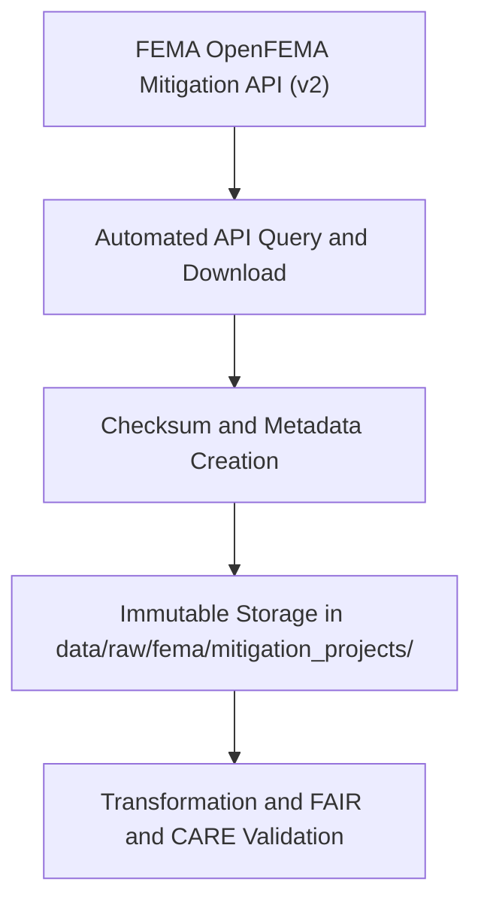

<div align="center">

# 🛠️ Kansas Frontier Matrix — **FEMA Mitigation Projects**
`data/raw/fema/mitigation_projects/README.md`

**Purpose:** Contains unmodified datasets from FEMA’s **OpenFEMA Mitigation Projects** catalog, documenting hazard mitigation and disaster recovery efforts in Kansas.  
These datasets form the foundation for resilience assessment, infrastructure recovery analytics, and FAIR+CARE-compliant project governance within the Kansas Frontier Matrix (KFM).

[](https://www.fema.gov/openfema-data-page/mitigation-projects-v2)
[](../../../../docs/standards/faircare-validation.md)
[](../../../../LICENSE)
[](../../../../docs/architecture/repo-focus.md)

</div>

---

## 📚 Overview

The `data/raw/fema/mitigation_projects/` directory houses datasets describing **FEMA-funded mitigation projects** across Kansas, including project types, costs, and hazard categories.  
These records are drawn from the FEMA OpenFEMA API (v2) and are maintained in raw CSV format to ensure provenance integrity.

Each dataset:
- Is sourced directly from FEMA’s public Open Data API.  
- Contains records of approved, active, and closed mitigation projects.  
- Is accompanied by complete metadata for governance and validation.  
- Serves as a primary reference for KFM’s resilience modeling pipelines.

---

## 🗂️ Directory Layout

```plaintext
data/raw/fema/mitigation_projects/
├── README.md                            # This file — documentation of FEMA mitigation projects
│
├── mitigation_projects_ks_2025.csv      # Raw mitigation project data (Kansas only)
├── metadata.json                        # Provenance, temporal coverage, and schema metadata
└── license.txt                          # FEMA public domain license
```

---

## ⚙️ Ingestion Workflow



### Workflow Details:
1. Data fetched via OpenFEMA API query filtered for Kansas projects.  
2. Metadata file generated with source URL, schema fields, and ingestion date.  
3. SHA-256 checksums generated and stored in manifest.  
4. Raw CSV stored unaltered; FAIR+CARE audit confirms provenance and accessibility.  

---

## 🧩 Example Metadata Record

```json
{
  "id": "fema_mitigation_projects_ks_2025",
  "title": "FEMA Hazard Mitigation Assistance Projects - Kansas",
  "description": "Dataset containing hazard mitigation projects funded by FEMA in Kansas, including project types, funding sources, and hazard categories.",
  "source_url": "https://www.fema.gov/openfema-data-page/mitigation-projects-v2",
  "provider": "Federal Emergency Management Agency (FEMA)",
  "license": "Public Domain",
  "checksum": "sha256:ae9b3d2c97aef4325d14b6fbb6e01a87134527cd...",
  "spatial_extent": [-102.05, 36.99, -94.61, 40.00],
  "temporal_extent": ["1989-01-01", "2025-10-28"],
  "record_count": 4285
}
```

---

## 🌍 Dataset Schema (Excerpt)

| Column | Description | Example |
|---------|--------------|----------|
| `projectIdentifier` | FEMA project ID | `123456` |
| `projectTitle` | Title or description of mitigation project | `Storm Shelter Installation in Pratt County` |
| `state` | U.S. state abbreviation | `KS` |
| `county` | County where project is located | `Pratt` |
| `hazardMitigated` | Primary hazard mitigated | `Tornado` |
| `federalShareObligated` | Amount of FEMA federal funding obligated | `250000.00` |
| `totalProjectCost` | Total project cost | `312000.00` |
| `status` | Project status (Open/Closed) | `Closed` |
| `dateApproved` | FEMA approval date | `2024-09-15` |

---

## ⚖️ Licensing & Attribution

```
FEMA Open Data — Hazard Mitigation Assistance Projects
Public Domain Data under U.S. Federal Law.
Users may copy, distribute, and adapt the data freely with attribution to FEMA.
Source: Federal Emergency Management Agency (FEMA)
```

### Recommended Citation
```text
Federal Emergency Management Agency (FEMA). "Hazard Mitigation Assistance Projects (v2)".
Accessed via OpenFEMA API on 2025-10-28. Public Domain.
```

---

## 🧠 FAIR+CARE Compliance Overview

| Principle | Implementation |
|------------|----------------|
| **Findable** | Indexed in STAC and global manifest with dataset ID. |
| **Accessible** | Stored in open CSV format; accessible through GitHub and OpenFEMA. |
| **Interoperable** | Schema aligns with STAC/DCAT 3.0 and OpenFEMA documentation. |
| **Reusable** | Metadata includes license, checksum, and provenance details. |
| **Collective Benefit** | Enhances understanding of FEMA-funded resilience projects. |
| **Authority to Control** | Attribution retained to FEMA. |
| **Responsibility** | Validated for data quality and completeness. |
| **Ethics** | Contains no sensitive data; publicly funded and open for reuse. |

Governance validation recorded in:  
`data/reports/audit/data_provenance_ledger.json`  
and `data/reports/fair/data_care_assessment.json`.

---

## 🔍 Governance Integration

| Record | Description |
|---------|-------------|
| `metadata.json` | Contains temporal, schema, and provenance information. |
| `data/reports/audit/data_provenance_ledger.json` | Logs ingestion and checksum validation. |
| `data/reports/fair/data_fair_summary.json` | Records FAIR scoring results. |
| `releases/v9.3.2/manifest.zip` | Global checksum and manifest reference. |

---

## 🧾 Citation (KFM Context)

```text
Kansas Frontier Matrix (2025). FEMA Mitigation Projects Dataset (v9.3.2).
Unmodified FEMA OpenFEMA dataset of hazard mitigation and resilience projects for Kansas.
Available at: https://github.com/bartytime4life/Kansas-Frontier-Matrix/tree/main/data/raw/fema/mitigation_projects
License: Public Domain (U.S. Federal Data)
```

---

## 🧾 Version Notes

| Version | Date | Notes |
|----------|------|--------|
| v9.3.2 | 2025-10-28 | Added 2025 mitigation project updates; validated metadata schema. |
| v9.2.0 | 2024-07-10 | Introduced automated ingestion and checksum validation. |
| v9.0.0 | 2023-01-15 | Established baseline directory for FEMA mitigation datasets. |

---

<div align="center">

**Kansas Frontier Matrix** · *Resilience Data × FAIR+CARE Governance × Open Science Integrity*  
[🔗 Repository](https://github.com/bartytime4life/Kansas-Frontier-Matrix) • [🧭 Docs Portal](../../../../docs/) • [⚖️ Governance Ledger](../../../../docs/standards/governance/)

</div>
