<div align="center">

# ⚠️ Kansas Frontier Matrix — Raw Hazards Data  
`data/raw/hazards/`

### **Tornadoes · Floods · Wildfires · Droughts**  
*Immutable hazard datasets forming the scientific and historical foundation of Kansas Frontier Matrix disaster analysis.*

[](../../../.github/workflows/site.yml)  
[](../../../.github/workflows/stac-validate.yml)  
[](../../../.github/workflows/codeql.yml)  
[](../../../.github/workflows/trivy.yml)  
[](../../../docs/)  
[](../../../LICENSE)

</div>

---

## 📘 Overview

The `data/raw/hazards/` directory contains **original, unmodified hazard datasets**  
used by the Kansas Frontier Matrix (KFM) for historical and environmental disaster analysis.  

These datasets serve as **ground truth** for modeling and visualization of:
- 🌪️ Tornado tracks and severity (NOAA Storm Events)  
- 🌊 Flood extents and historical floodplains (FEMA NFHL)  
- 🔥 Wildfire perimeters and burn severity (USGS/NIFC)  
- 🌾 Drought indices and severity maps (USDM/NOAA)  

All data here is:
- **Immutable** — unaltered from the source provider  
- **Traceable** — linked to `data/sources/*.json` manifests  
- **Verifiable** — accompanied by SHA-256 checksums  
- **Reproducible** — with metadata and STAC lineage  

---

## 🗂️ Directory Layout

```bash
data/raw/hazards/
├── tornado_tracks_noaa_1950_2024.geojson
├── fema_flood_zones_nfhl.shp
├── wildfire_perimeters_usgs_2010_2024.gpkg
├── drought_usdm_2024.tif
├── metadata/
│   ├── tornado_tracks_noaa_1950_2024.json
│   ├── fema_flood_zones_nfhl.json
│   ├── wildfire_perimeters_usgs_2010_2024.json
│   └── drought_usdm_2024.json
├── checksums/
│   ├── tornado_tracks_noaa_1950_2024.geojson.sha256
│   ├── fema_flood_zones_nfhl.shp.sha256
│   ├── wildfire_perimeters_usgs_2010_2024.gpkg.sha256
│   └── drought_usdm_2024.tif.sha256
└── README.md
````

---

## 🌍 Data Sources & Provenance

| Dataset                      | Provider    | Format     | Temporal Range | License       | STAC ID                       |
| ---------------------------- | ----------- | ---------- | -------------- | ------------- | ----------------------------- |
| **NOAA Tornado Tracks**      | NOAA SPC    | GeoJSON    | 1950–2024      | Public Domain | `hazards_tornado_tracks_noaa` |
| **FEMA Flood Zones (NFHL)**  | FEMA        | Shapefile  | 2015–2024      | Public Domain | `hazards_fema_floodzones`     |
| **USGS Wildfire Perimeters** | NIFC / USGS | GeoPackage | 2010–2024      | CC-BY 4.0     | `hazards_usgs_wildfires`      |
| **USDM Drought Index Maps**  | NOAA / USDA | GeoTIFF    | 2024           | Public Domain | `hazards_usdm_drought_2024`   |

All sources documented in [`data/sources/*.json`](../../../data/sources/) and
validated against STAC schemas in [`data/stac/items/`](../../../data/stac/items/).

---

## 🔗 Connections

| Layer               | Upstream                          | Downstream                  | Purpose                         |
| ------------------- | --------------------------------- | --------------------------- | ------------------------------- |
| Tornado Tracks      | `data/sources/noaa_storms.json`   | `data/processed/hazards/`   | Severe weather analytics        |
| FEMA Flood Zones    | `data/sources/fema_nfhl.json`     | `data/derivatives/hazards/` | Flood risk mapping              |
| Wildfire Perimeters | `data/sources/usgs_wildfire.json` | `data/derivatives/hazards/` | Fire frequency analysis         |
| Drought Maps        | `data/sources/noaa_usdm.json`     | `data/derivatives/climate/` | Drought and aridity correlation |

---

## 🧭 Data Lineage Diagram

```mermaid
flowchart TD
  A["Raw Hazard Datasets\n(NOAA · FEMA · USGS · USDM)"] --> B["ETL Pipeline\n(make hazards)"]
  B --> C["Processed Hazard Layers\n(COGs · GeoJSON · Parquet)"]
  C --> D["Derivatives\n(frequency maps · exposure models · hazard composites)"]
  D --> E["STAC Catalog\n(data/stac/collections/hazards.json)"]
  E --> F["Knowledge Graph\n(Event:Tornado · Event:Wildfire · Region:Floodplain)"]
  F --> G["Web Viewer\n(MapLibre · Hazard Layers · Timeline Visualization)"]
%%END OF MERMAID%%
```



---

## 🧪 Reproducibility

```bash
# Fetch all hazard datasets
make fetch HAZARDS=all

# Verify checksums
sha256sum -c checksums/*.sha256

# Validate metadata schema
make validate-metadata TYPE=hazards

# Build STAC entries
make stac HAZARDS=1
```

Outputs flow into:

* `data/processed/hazards/`
* `data/derivatives/hazards/`
* `data/stac/collections/hazards.json`

---

## 🧾 Dataset Card

**Title:** NOAA Tornado Tracks (1950–2024)
**Source:** [NOAA Storm Prediction Center](https://www.spc.noaa.gov/wcm/#data)
**Time:** 1950 → 2024
**Space:** Kansas + surrounding regions (EPSG:4326)
**Files:** `tornado_tracks_noaa_1950_2024.geojson` (120 MB) + `.sha256`
**STAC Item:** `data/stac/items/hazards_tornado_tracks_noaa.json`
**License:** Public Domain
**Provenance:** Retrieved 2025-01-09; checksum verified.

---

## 🧱 Versioning

| Field            | Value                          |
| ---------------- | ------------------------------ |
| **Version**      | `v1.0.0`                       |
| **Status**       | Stable                         |
| **Author**       | Andy Barta                     |
| **Last Updated** | 2025-10-12                     |
| **MCP Stage**    | Documentation-First (Complete) |

---

## 🧠 AI & Knowledge Integration

* **Event Recognition:** Hazard datasets populate AI event extraction and geospatial clustering models.
* **Knowledge Graph Mapping:** Creates nodes `(Event:Tornado|Flood|Fire|Drought)` linked to `(Region:Kansas)` with `OCCURRED_AT` and `IMPACTED` relations.
* **Predictive Modeling:** Feeds temporal hazard forecasting (e.g., tornado recurrence and drought propagation).
* **Cross-Domain Links:** Hazards are correlated with climate, terrain, and hydrology layers to assess compound risks.

---

## 🧩 Validation & Compliance

| Check             | Tool             | Result     |
| ----------------- | ---------------- | ---------- |
| STAC Schema       | `stac-validator` | ✅ Passed   |
| JSON Schema       | `jsonschema`     | ✅ Valid    |
| SHA-256 Integrity | `sha256sum`      | ✅ Verified |
| MCP Documentation | Manual Review    | ✅ Complete |

---

## 🧩 Changelog

| Date           | Version  | Description                                                                                                          |
| -------------- | -------- | -------------------------------------------------------------------------------------------------------------------- |
| **2025-10-12** | `v1.0.0` | Initial release — baseline hazards dataset documentation; provenance, lineage, and integrity validation established. |

---

## 🪪 License

All datasets are distributed under **[CC-BY 4.0](https://creativecommons.org/licenses/by/4.0/)**
unless otherwise noted by the source provider. Attribution is required in derivative works.

---

### ✅ Summary

This directory anchors the **hazards domain** of the Kansas Frontier Matrix —
housing unmodified datasets for tornadoes, floods, droughts, and wildfires.
Each file is immutable, checksum-verified, and cross-linked with metadata and STAC entries,
ensuring transparent, reproducible, and scientifically defensible disaster research for Kansas.

```
