<div align="center">

# 🧾 Kansas Frontier Matrix — Raw Hazards Checksums  
`data/raw/hazards/checksums/`

### **Integrity · Authenticity · Provenance**  
*SHA-256 checksum manifests ensuring immutability and verifiable provenance of all hazard datasets within the Kansas Frontier Matrix.*

[](../../../../.github/workflows/site.yml)  
[](../../../../.github/workflows/stac-validate.yml)  
[](../../../../.github/workflows/codeql.yml)  
[](../../../../.github/workflows/trivy.yml)  
[](../../../../docs/)  
[](../../../../LICENSE)

</div>

---

## 📘 Overview

The `data/raw/hazards/checksums/` directory stores **SHA-256 checksum manifests (`.sha256`)**  
verifying the integrity and immutability of every hazard dataset in `data/raw/hazards/`.

These checksum files ensure:
- 🔐 **Data integrity** — detect and prevent corruption or alteration  
- 🔗 **Provenance linkage** — embedded in metadata and STAC items  
- ⚙️ **Automation** — used by CI/CD and `make validate-integrity`  
- 🧾 **Transparency** — part of MCP reproducibility and audit chain  

Each checksum is generated automatically during ingestion and is **never manually edited**.

---

## 🗂️ Directory Layout

```bash
data/raw/hazards/checksums/
├── tornado_tracks_noaa_1950_2024.geojson.sha256
├── fema_flood_zones_nfhl.shp.sha256
├── wildfire_perimeters_usgs_2010_2024.gpkg.sha256
├── drought_usdm_2024.tif.sha256
└── README.md
````

---

## 🔗 Connections

| Relation                 | Target                                | Description                                |       |        |                                    |
| ------------------------ | ------------------------------------- | ------------------------------------------ | ----- | ------ | ---------------------------------- |
| **Parent Data**          | `../*.geojson                         | *.gpkg                                     | *.tif | *.shp` | Hazard data verified for integrity |
| **Metadata Record**      | `../metadata/*.json`                  | References SHA-256 hash                    |       |        |                                    |
| **STAC Item**            | `data/stac/items/hazards_*.json`      | Stores checksum under `assets.data.sha256` |       |        |                                    |
| **CI/CD Job**            | `.github/workflows/stac-validate.yml` | Auto-verifies integrity                    |       |        |                                    |
| **Knowledge Graph Node** | `(Dataset:Hazards)`                   | `checksum_verified:true` attribute         |       |        |                                    |

---

## 🧭 Integrity Validation Flow

```mermaid
flowchart TD
  A["Raw Hazard Files\n(NOAA · FEMA · USGS · USDM)"] --> B["SHA-256 Generation\n(sha256sum)"]
  B --> C["Checksum Manifests\n(.sha256 files)"]
  C --> D["Integrity Validation\n(make validate-integrity · CI/CD)"]
  D --> E["Metadata Embedding\n(data/raw/hazards/metadata/*.json)"]
  E --> F["STAC Integration\n(data/stac/items/hazards_*.json)"]
  F --> G["Knowledge Graph\n(Dataset:Hazards {checksum_verified:true})"]
%%END OF MERMAID%%
```



---

## 🧪 Validation Commands

### 🔍 Manual Verification

```bash
# Validate all raw hazard datasets
cd data/raw/hazards/
sha256sum -c checksums/*.sha256
```

### ⚙️ Automated Validation

```bash
# Integrity check integrated with CI/CD
make validate-integrity TYPE=hazards
```

### 🧮 Example Output

```bash
$ sha256sum -c wildfire_perimeters_usgs_2010_2024.gpkg.sha256
wildfire_perimeters_usgs_2010_2024.gpkg: OK
```

If validation fails, the dataset must be re-downloaded from its source
as listed in `data/sources/`.

---

## 🧾 Dataset Card

**Title:** Raw Hazards Checksums
**Scope:** SHA-256 integrity verification files for all raw hazard datasets
**Location:** `data/raw/hazards/checksums/`
**Datasets Covered:** Tornadoes, Floods, Wildfires, Droughts
**Validation:** `sha256sum -c` / `make validate-integrity`
**Purpose:** Guarantee data immutability and transparent lineage for hazard analysis

---

## 🧱 Versioning

| Field            | Value                          |
| ---------------- | ------------------------------ |
| **Version**      | `v1.0.0`                       |
| **Status**       | Stable                         |
| **Author**       | Andy Barta                     |
| **Last Updated** | 2025-10-12                     |
| **MCP Stage**    | Documentation-First (Complete) |

---

## 🧠 AI & Knowledge Integration

* **AI Confidence Models:** Checksum verification enhances AI trust scoring for hazard predictions.
* **Knowledge Graph Integration:** Adds attribute `checksum_verified=true` to `(Dataset:Hazards)` nodes.
* **Forensic Provenance:** Enables audit trails across multi-hazard temporal models.
* **ETL Safeguard:** Prevents ingestion or transformation of tampered data during hazard analysis workflows.

---

## 🧩 Validation & Compliance

| Check             | Tool             | Result     |
| ----------------- | ---------------- | ---------- |
| SHA-256 Integrity | `sha256sum`      | ✅ Verified |
| STAC Integration  | `stac-validator` | ✅ Valid    |
| CI/CD Workflow    | GitHub Actions   | ✅ Passed   |
| MCP Documentation | Manual Review    | ✅ Complete |

---

## 🧩 Changelog

| Date           | Version  | Description                                                                                               |
| -------------- | -------- | --------------------------------------------------------------------------------------------------------- |
| **2025-10-12** | `v1.0.0` | Initial release — checksum documentation for hazard datasets; lineage diagram and validation steps added. |

---

## 🪪 License

Checksum manifests are licensed under **[CC-BY 4.0](https://creativecommons.org/licenses/by/4.0/)**.
Source datasets retain their original licenses. Attribution is required for derivative usage.

---

### ✅ Summary

This directory anchors the **integrity verification layer** of the KFM hazards domain.
Each `.sha256` file ensures that tornado, flood, wildfire, and drought datasets remain
unchanged, reproducible, and scientifically verifiable.
These checksums propagate through metadata, STAC items, and the Knowledge Graph,
ensuring long-term trust and provenance for Kansas’s disaster archives.

```
