<div align="center">

# ⚠️ Kansas Frontier Matrix — Raw Hazards Metadata  
`data/raw/hazards/metadata/`

### **Lineage · Provenance · Validation**  
*Structured JSON metadata defining every immutable hazard dataset supporting the Kansas Frontier Matrix.*

[](../../../../.github/workflows/site.yml)  
[](../../../../.github/workflows/stac-validate.yml)  
[](../../../../.github/workflows/codeql.yml)  
[](../../../../.github/workflows/trivy.yml)  
[](../../../../docs/)  
[](../../../../LICENSE)

</div>

---

## 📘 Overview

The `data/raw/hazards/metadata/` directory holds **JSON metadata files**  
describing each **immutable hazard dataset** under `data/raw/hazards/`.  

These files ensure:
- 🔗 **Provenance linkage** — source, retrieval date, checksum  
- 📚 **Schema conformance** — validated against the KFM source schema  
- 🧾 **STAC interoperability** — ready for item generation and catalog inclusion  
- 🧱 **Reproducibility** — every record tied to dataset lineage and validation steps  

Hazard metadata covers **tornadoes**, **floods**, **wildfires**, and **droughts**, ensuring  
each dataset in the hazards domain can be traced, verified, and reused with scientific precision.

---

## 🗂️ Directory Layout

```bash
data/raw/hazards/metadata/
├── tornado_tracks_noaa_1950_2024.json
├── fema_flood_zones_nfhl.json
├── wildfire_perimeters_usgs_2010_2024.json
├── drought_usdm_2024.json
└── README.md
````

---

## 🧩 Metadata Schema Validation

All metadata files comply with:

```text
src/kansas_geo_timeline/schemas/source_schema.json
```

### Key Fields

| Field             | Description                           |
| ----------------- | ------------------------------------- |
| `id`              | Unique STAC-style identifier          |
| `source_name`     | Canonical dataset title               |
| `provider`        | Data publisher or agency              |
| `license`         | SPDX license identifier               |
| `spatial_extent`  | Bounding box `[W,S,E,N]` (EPSG:4326)  |
| `temporal_extent` | Observation period (start/end)        |
| `crs`             | Coordinate Reference System           |
| `provenance`      | Source URL, checksum, retrieval date  |
| `validation`      | Schema + checksum verification status |

---

## 🔗 Connections

| Relationship             | Target                                               | Description                      |          |          |                            |
| ------------------------ | ---------------------------------------------------- | -------------------------------- | -------- | -------- | -------------------------- |
| **Parent Data**          | `data/raw/hazards/*.geojson                          | *.gpkg                           | *.tif    | *.shp`   | Associated raw hazard data |
| **Checksum**             | `data/raw/hazards/checksums/*.sha256`                | Integrity verification reference |          |          |                            |
| **STAC Item**            | `data/stac/items/hazards_*.json`                     | Derived STAC metadata record     |          |          |                            |
| **Schema**               | `src/kansas_geo_timeline/schemas/source_schema.json` | Validation blueprint             |          |          |                            |
| **Knowledge Graph Node** | `neo4j://Event:Tornado                               | Flood                            | Wildfire | Drought` | Graph entity linkage       |

---

## 🧭 Metadata Lineage Flow

```mermaid
flowchart TD
  A["Raw Hazards Metadata\n(JSON: Tornado · Flood · Fire · Drought)"] --> B["Schema Validation\n(source_schema.json)"]
  B --> C["STAC Item Generation\n(data/stac/items/hazards_*.json)"]
  C --> D["STAC Collection Assembly\n(hazards.json)"]
  D --> E["Knowledge Graph Integration\n(Event:Tornado · Flood · Fire · Drought)"]
  C --> F["AI/NLP Enrichment\n(Hazard tagging · Temporal analysis)"]
%%END OF MERMAID%%
```



---

## 🧪 Validation Commands

```bash
# Validate hazard metadata JSONs
make validate-metadata TYPE=hazards

# Run schema validation directly
python scripts/validate_schema.py \
  --schema src/kansas_geo_timeline/schemas/source_schema.json \
  --input data/raw/hazards/metadata/

# Verify linked file integrity
sha256sum -c ../checksums/*.sha256
```

Validation occurs automatically in CI/CD via
`.github/workflows/stac-validate.yml`.

---

## 🧾 Example Metadata Snippet

```json
{
  "id": "hazards_tornado_tracks_noaa",
  "source_name": "NOAA Tornado Tracks (1950–2024)",
  "provider": "National Oceanic and Atmospheric Administration (NOAA)",
  "license": "Public Domain",
  "spatial_extent": [-102.05, 36.99, -94.60, 40.00],
  "temporal_extent": ["1950-01-01", "2024-12-31"],
  "crs": "EPSG:4326",
  "provenance": {
    "url": "https://www.spc.noaa.gov/wcm/#data",
    "sha256": "b5a7fdd9c32a8cfed034df74afccaa32bdeaa763...",
    "retrieved": "2025-01-10"
  },
  "validation": {
    "schema": "Passed",
    "checksum": "Verified",
    "stac_export": "Generated"
  }
}
```

---

## 🧱 Versioning

| Field            | Value                          |
| ---------------- | ------------------------------ |
| **Version**      | `v1.0.0`                       |
| **Status**       | Stable                         |
| **Author**       | Andy Barta                     |
| **Last Updated** | 2025-10-12                     |
| **MCP Stage**    | Documentation-First (Complete) |

---

## 🧠 AI & Knowledge Integration

* **AI Contextual Modeling:** Metadata feeds the AI hazard ontology for event recognition and correlation.
* **Graph Mapping:** Creates nodes `(Dataset:Hazards)` and `(Event:Tornado|Flood|Wildfire|Drought)` with relationships `HAS_PROVENANCE` and `OCCURRED_AT`.
* **Predictive Modeling:** Enables cross-hazard risk forecasting using metadata’s temporal and spatial references.
* **Cross-Domain Linkage:** Connects hazard data with climate, terrain, and hydrology layers to analyze compounding events.

---

## 🧩 Validation & Compliance

| Check             | Tool             | Result     |
| ----------------- | ---------------- | ---------- |
| JSON Schema       | `jsonschema`     | ✅ Passed   |
| STAC Export       | `stac-validator` | ✅ Valid    |
| Checksum Link     | `sha256sum`      | ✅ Verified |
| MCP Documentation | Manual Review    | ✅ Complete |

---

## 🧩 Changelog

| Date           | Version  | Description                                                                                           |
| -------------- | -------- | ----------------------------------------------------------------------------------------------------- |
| **2025-10-12** | `v1.0.0` | Initial release — hazards metadata documentation with lineage flow, schema validation, and changelog. |

---

## 🪪 License

All metadata files are distributed under **[CC-BY 4.0](https://creativecommons.org/licenses/by/4.0/)**
unless superseded by the originating dataset license. Attribution required for derivative use.

---

### ✅ Summary

This directory forms the **metadata foundation** for Kansas Frontier Matrix hazard datasets.
Every file captures the lineage, provenance, and validation status for tornado, flood, wildfire,
and drought data — linking them into STAC catalogs, checksum layers, and the Knowledge Graph.
Together, these records ensure reproducibility, transparency, and scientific integrity
across Kansas’s historical hazard archives.

```
