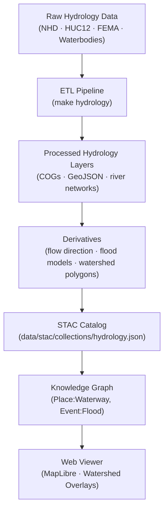

<div align="center">

# 💧 Kansas Frontier Matrix — Raw Hydrology Data  
`data/raw/hydrology/`

### **Flow · Watersheds · Provenance**  
*Immutable hydrologic source datasets forming the foundation of water system modeling across Kansas.*

[](../../../.github/workflows/site.yml)  
[](../../../.github/workflows/stac-validate.yml)  
[](../../../.github/workflows/codeql.yml)  
[](../../../.github/workflows/trivy.yml)  
[](../../../docs/)  
[](../../../LICENSE)

</div>

---

## 📘 Overview

The `data/raw/hydrology/` directory holds all **unmodified hydrologic datasets** used as the  
**primary input layers** for the Kansas Frontier Matrix (KFM) hydrology system — including  
rivers, watersheds, aquifers, floodplains, and waterbody boundaries.

These datasets are **immutable**, meaning:
- 🧱 They represent **original upstream data**, never cleaned or altered.  
- 🔗 Each dataset is linked to a **source manifest** in `data/sources/`.  
- 🧾 Metadata JSONs record **provenance and license details**.  
- 🔐 Each file includes a verified **SHA-256 checksum** for integrity tracking.  

Hydrology data forms the analytical basis for:
- Flow accumulation and direction modeling  
- Floodplain delineation and watershed segmentation  
- Ecological, geological, and climatological correlation studies  

---

## 🗂️ Directory Layout

```bash
data/raw/hydrology/
├── nhd_flowlines.gpkg
├── nhd_waterbodies.gpkg
├── watersheds_huc12.geojson
├── flood_zones_fema.shp
├── metadata/
│   ├── nhd_flowlines.json
│   ├── nhd_waterbodies.json
│   ├── watersheds_huc12.json
│   └── flood_zones_fema.json
├── checksums/
│   ├── nhd_flowlines.gpkg.sha256
│   ├── nhd_waterbodies.gpkg.sha256
│   ├── watersheds_huc12.geojson.sha256
│   └── flood_zones_fema.shp.sha256
└── README.md
````

---

## 🌍 Data Sources & Provenance

| Dataset               | Provider               | Format     | License       | CRS       | STAC ID                  |
| --------------------- | ---------------------- | ---------- | ------------- | --------- | ------------------------ |
| **NHD Flowlines**     | U.S. Geological Survey | GeoPackage | Public Domain | EPSG:4269 | `hydro_nhd_flowlines`    |
| **NHD Waterbodies**   | U.S. Geological Survey | GeoPackage | Public Domain | EPSG:4269 | `hydro_nhd_waterbodies`  |
| **HUC-12 Watersheds** | USDA NRCS              | GeoJSON    | CC-BY 4.0     | EPSG:4326 | `hydro_huc12_watersheds` |
| **FEMA Flood Zones**  | FEMA NFHL              | Shapefile  | Public Domain | EPSG:4269 | `hydro_fema_floodzones`  |

Each dataset is linked to its acquisition record in
[`data/sources/*.json`](../../../data/sources/) and its **STAC item** in
[`data/stac/items/`](../../../data/stac/items/).

---

## 🔗 Connections

| Layer             | Upstream                      | Downstream                    | Purpose                  |
| ----------------- | ----------------------------- | ----------------------------- | ------------------------ |
| NHD Flowlines     | `data/sources/usgs_nhd.json`  | `data/processed/hydrology/`   | Stream network base      |
| HUC-12 Watersheds | `data/sources/usda_nrcs.json` | `data/derivatives/hydrology/` | Basin boundaries         |
| FEMA Flood Zones  | `data/sources/fema_nfhl.json` | `data/derivatives/hazards/`   | Flood hazard analysis    |
| NHD Waterbodies   | `data/sources/usgs_nhd.json`  | `data/processed/hydrology/`   | Lakes, ponds, reservoirs |

---

## 🧭 Data Lineage Diagram



---

## 🧪 Reproducibility

```bash
# Fetch hydrology source datasets
make fetch HYDROLOGY=all

# Validate checksums
sha256sum -c checksums/*.sha256

# Validate metadata against schema
make validate-metadata TYPE=hydrology

# Generate STAC entries for all hydrology assets
make stac HYDROLOGY=1
```

Outputs feed:

* `data/processed/hydrology/`
* `data/derivatives/hydrology/`
* `data/stac/collections/hydrology.json`

---

## 🧾 Dataset Card

**Title:** NHD Flowlines – Kansas Region
**Source:** [USGS National Hydrography Dataset](https://www.usgs.gov/national-hydrography)
**Time:** 2019–present
**Space:** Kansas, EPSG:4269
**Files:** `nhd_flowlines.gpkg` (800 MB) + `.sha256`
**STAC Item:** `data/stac/items/hydro_nhd_flowlines.json`
**License:** Public Domain
**Provenance:** Downloaded from USGS FTP (retrieved 2025-01-07); verified hash match.

---

## 🧱 Versioning

| Field            | Value                          |
| ---------------- | ------------------------------ |
| **Version**      | `v1.0.0`                       |
| **Status**       | Stable                         |
| **Author**       | Andy Barta                     |
| **Last Updated** | 2025-10-12                     |
| **MCP Stage**    | Documentation-First (Complete) |

---

## 🧠 AI & Knowledge Integration

* **AI Enrichment:** Hydrology entities (rivers, lakes, watersheds) are extracted for semantic graph enrichment.
* **Graph Mapping:** Linked to Neo4j nodes `(Place:Waterway)`, `(Region:Watershed)`, `(Event:Flood)`.
* **Predictive Modeling:** Inputs to hazard prediction and water-balance simulations.
* **Cross-Domain Links:** Hydrology joins geology, terrain, ecology, and climate domains for integrated analysis.

---

## 🧩 Validation & Compliance

| Check             | Tool             | Status     |
| ----------------- | ---------------- | ---------- |
| STAC Schema       | `stac-validator` | ✅ Passed   |
| JSON Schema       | `jsonschema`     | ✅ Valid    |
| Checksum          | `sha256sum`      | ✅ Verified |
| MCP Documentation | Manual Review    | ✅ Complete |

---

## 🧩 Changelog

| Date           | Version  | Description                                                                                                                             |
| -------------- | -------- | --------------------------------------------------------------------------------------------------------------------------------------- |
| **2025-10-12** | `v1.0.0` | Initial release — added hydrology raw data documentation; includes provenance, dataset card, validated Mermaid diagram, and versioning. |

---

## 🪪 License

All data in this directory is released under **[CC-BY 4.0](https://creativecommons.org/licenses/by/4.0/)**
unless a dataset’s original license supersedes it. Source attribution and citation are mandatory in derived works.

---

### ✅ Summary

This directory forms the **hydrologic foundation layer** of the Kansas Frontier Matrix.
Every dataset — rivers, basins, and flood zones — is stored in its original form, verified, and fully documented.
Through MCP lineage, these layers feed reproducibly into KFM’s processed and derivative products,
supporting historical, ecological, and predictive water system research across Kansas.

```
