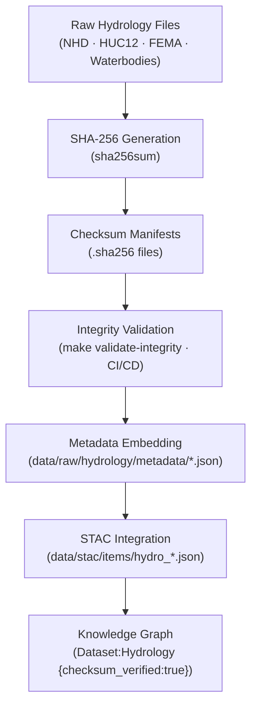

<div align="center">

# 🧾 Kansas Frontier Matrix — Raw Hydrology Checksums  
`data/raw/hydrology/checksums/`

### **Integrity · Authenticity · Provenance**  
*SHA-256 integrity manifests for all unmodified hydrologic source datasets within the Kansas Frontier Matrix.*

[](../../../../.github/workflows/site.yml)  
[](../../../../.github/workflows/stac-validate.yml)  
[](../../../../.github/workflows/codeql.yml)  
[](../../../../.github/workflows/trivy.yml)  
[](../../../../docs/)  
[](../../../../LICENSE)

</div>

---

## 📘 Overview

The `data/raw/hydrology/checksums/` directory stores **SHA-256 digest files (`.sha256`)**  
that verify the **byte-level integrity** of every hydrologic dataset in `data/raw/hydrology/`.

These checksum manifests guarantee:
- 🔐 **Immutability** — files remain unaltered from acquisition  
- 🔗 **Traceability** — linked to metadata + STAC items  
- 🧾 **Accountability** — each checksum is validated in CI/CD  
- ⚙️ **Automation** — leveraged by `make validate-integrity` and workflow actions  

This verification layer ensures every hydrologic dataset can be independently authenticated and reproduced,  
in line with MCP documentation and NASA-grade provenance standards.

---

## 🗂️ Directory Layout

```bash
data/raw/hydrology/checksums/
├── nhd_flowlines.gpkg.sha256
├── nhd_waterbodies.gpkg.sha256
├── watersheds_huc12.geojson.sha256
├── flood_zones_fema.shp.sha256
└── README.md
````

---

## 🔗 Connections

| Relation                 | Target                                | Description                                 |        |                                              |
| ------------------------ | ------------------------------------- | ------------------------------------------- | ------ | -------------------------------------------- |
| **Parent Data**          | `../*.gpkg                            | *.geojson                                   | *.shp` | Hydrologic raster/vector file being verified |
| **Metadata Record**      | `../metadata/*.json`                  | Embeds SHA-256 checksum reference           |        |                                              |
| **STAC Item**            | `data/stac/items/hydro_*.json`        | Carries checksum under `assets.data.sha256` |        |                                              |
| **CI/CD Integrity Job**  | `.github/workflows/stac-validate.yml` | Automated checksum verification             |        |                                              |
| **Knowledge Graph Node** | `(Dataset:Hydrology)`                 | Attribute: `checksum_verified=true`         |        |                                              |

---

## 🧭 Integrity Validation Flow



---

## 🧪 Validation Commands

### 🔍 Manual Verification

```bash
# Verify all hydrology source datasets
cd data/raw/hydrology/
sha256sum -c checksums/*.sha256
```

### ⚙️ Automated Validation

```bash
# CI/CD target
make validate-integrity TYPE=hydrology
```

### 🧮 Example Output

```bash
$ sha256sum -c nhd_flowlines.gpkg.sha256
nhd_flowlines.gpkg: OK
```

If any checksum fails verification, the dataset must be re-acquired
from its source manifest in `data/sources/`.

---

## 🧾 Dataset Card

**Title:** Raw Hydrology Checksums
**Scope:** SHA-256 integrity manifests for raw hydrologic datasets
**Location:** `data/raw/hydrology/checksums/`
**Datasets Covered:** NHD, HUC12, FEMA Flood Zones, Waterbodies
**Validation:** `sha256sum -c` / `make validate-integrity`
**Purpose:** Guarantees dataset authenticity and reproducibility across KFM pipelines

---

## 🧱 Versioning

| Field            | Value                          |
| ---------------- | ------------------------------ |
| **Version**      | `v1.0.0`                       |
| **Status**       | Stable                         |
| **Author**       | Andy Barta                     |
| **Last Updated** | 2025-10-12                     |
| **MCP Stage**    | Documentation-First (Complete) |

---

## 🧠 AI & Knowledge Integration

* **AI Data Trust:** Checksum verifications weight dataset reliability in AI inference chains.
* **Graph Embedding:** Integrity status nodes stored as `(Dataset:Hydrology)` → property `checksum_verified:true`.
* **Forensic Provenance:** Enables historical audit trails and reproducibility chains for hydrologic models.
* **ETL Enforcement:** Prevents processing of corrupted data in terrain-hydrology derivative workflows.

---

## 🧩 Validation & Compliance

| Check             | Tool           | Result     |
| ----------------- | -------------- | ---------- |
| SHA-256 Integrity | `sha256sum`    | ✅ Verified |
| Schema Linkage    | `jsonschema`   | ✅ Valid    |
| CI/CD Check       | GitHub Actions | ✅ Passed   |
| MCP Documentation | Manual Review  | ✅ Complete |

---

## 🧩 Changelog

| Date           | Version  | Description                                                                                                                |
| -------------- | -------- | -------------------------------------------------------------------------------------------------------------------------- |
| **2025-10-12** | `v1.0.0` | Initial release — added hydrology checksum documentation, validated Mermaid diagram, and integrated provenance references. |

---

## 🪪 License

Checksum manifests are published under **[CC-BY 4.0](https://creativecommons.org/licenses/by/4.0/)**.
Source data retains its original license. Attribution is required in derivative works.

---

### ✅ Summary

This directory constitutes the **integrity verification layer** of KFM’s hydrology data pipeline.
Each `.sha256` file cryptographically ties to its hydrologic source dataset,
linking into metadata, STAC, and the knowledge graph. Together, these files ensure
Kansas’s hydrologic archives remain immutable, auditable, and scientifically reproducible.

```
