<div align="center">

# 🗺️ Kansas Frontier Matrix — Raw Hydrology Metadata  
`data/raw/hydrology/metadata/`

### **Lineage · Provenance · Validation**  
*Canonical metadata for immutable hydrologic source datasets within the Kansas Frontier Matrix.*

[](../../../../.github/workflows/site.yml)  
[](../../../../.github/workflows/stac-validate.yml)  
[](../../../../.github/workflows/codeql.yml)  
[](../../../../.github/workflows/trivy.yml)  
[](../../../../docs/)  
[](../../../../LICENSE)

</div>

---

## 📘 Overview

The `data/raw/hydrology/metadata/` directory contains **structured JSON metadata files**  
describing each **unmodified hydrologic dataset** stored in `data/raw/hydrology/`.

Each metadata file serves as a **machine-readable and human-auditable record**, documenting:
- Dataset lineage, provider, and acquisition method  
- Spatial/temporal coverage and coordinate reference system  
- License and usage constraints  
- Associated checksums and validation status  
- STAC integration points for catalog consistency  

These JSON records are validated against the **KFM Source Schema**, ensuring full interoperability  
with downstream pipelines and the Knowledge Graph.

---

## 🗂️ Directory Layout

```bash
data/raw/hydrology/metadata/
├── nhd_flowlines.json
├── nhd_waterbodies.json
├── watersheds_huc12.json
├── flood_zones_fema.json
└── README.md
````

---

## 🧩 Metadata Schema Validation

All metadata files comply with the canonical schema:

```text
src/kansas_geo_timeline/schemas/source_schema.json
```

### Core Fields

| Field             | Description                                   |
| ----------------- | --------------------------------------------- |
| `id`              | Unique STAC-style identifier                  |
| `source_name`     | Official dataset name                         |
| `provider`        | Data origin or agency                         |
| `license`         | SPDX-compatible identifier                    |
| `spatial_extent`  | Bounding box `[W, S, E, N]` (EPSG:4326)       |
| `temporal_extent` | Date range of dataset                         |
| `crs`             | Coordinate Reference System                   |
| `resolution`      | Spatial resolution (if applicable)            |
| `provenance`      | Acquisition URL, retrieval date, and checksum |
| `validation`      | Schema, checksum, and STAC linkage results    |

---

## 🔗 Connections

| Relationship      | Target Path                                          | Description                      |            |                           |
| ----------------- | ---------------------------------------------------- | -------------------------------- | ---------- | ------------------------- |
| **Parent Data**   | `data/raw/hydrology/*.gpkg                           | *.shp                            | *.geojson` | Linked hydrologic dataset |
| **Checksum**      | `data/raw/hydrology/checksums/*.sha256`              | Integrity verification reference |            |                           |
| **STAC Item**     | `data/stac/items/hydro_*.json`                       | Derived STAC metadata            |            |                           |
| **Schema Source** | `src/kansas_geo_timeline/schemas/source_schema.json` | JSON validation schema           |            |                           |
| **Graph Node**    | `neo4j://Place:Waterway`                             | KFM knowledge graph node mapping |            |                           |

---

## 🧭 Metadata Lineage Flow

```mermaid
flowchart TD
  A["Raw Hydrology Metadata\n(JSON: NHD · HUC12 · FEMA · Waterbodies)"] --> B["Schema Validation\n(source_schema.json)"]
  B --> C["STAC Item Creation\n(data/stac/items/hydro_*.json)"]
  C --> D["STAC Collection Assembly\n(hydrology.json)"]
  D --> E["Knowledge Graph Integration\n(Place:Waterway, Region:Watershed)"]
  C --> F["AI/NLP Ingestion\n(Entity linking · Hydrologic terms)"]
%%END OF MERMAID%%
```



---

## 🧪 Validation Commands

```bash
# Validate hydrology metadata JSONs
make validate-metadata TYPE=hydrology

# Run schema validation directly
python scripts/validate_schema.py \
  --schema src/kansas_geo_timeline/schemas/source_schema.json \
  --input data/raw/hydrology/metadata/

# Verify integrity of linked data files
sha256sum -c ../checksums/*.sha256
```

Automated validation occurs during **CI/CD** through
[`stac-validate.yml`](../../../../.github/workflows/stac-validate.yml).

---

## 🧾 Example Metadata Snippet

```json
{
  "id": "hydro_nhd_flowlines",
  "source_name": "USGS National Hydrography Dataset (Flowlines)",
  "provider": "U.S. Geological Survey",
  "license": "Public Domain",
  "spatial_extent": [-102.05, 36.99, -94.60, 40.00],
  "temporal_extent": ["2019-01-01", "2025-01-01"],
  "crs": "EPSG:4269",
  "resolution": "1:24,000",
  "provenance": {
    "url": "https://www.usgs.gov/national-hydrography",
    "sha256": "a48f9e8c2ef01bb3f8f6d7b2c9478a7f5a0de9a3...",
    "retrieved": "2025-01-07"
  },
  "validation": {
    "schema": "Passed",
    "checksum": "Verified",
    "stac_export": "Generated"
  }
}
```

---

## 🧱 Versioning

| Field            | Value                          |
| ---------------- | ------------------------------ |
| **Version**      | `v1.0.0`                       |
| **Status**       | Stable                         |
| **Author**       | Andy Barta                     |
| **Last Updated** | 2025-10-12                     |
| **MCP Stage**    | Documentation-First (Complete) |

---

## 🧠 AI & Knowledge Integration

* **Semantic Enrichment:** Metadata feeds natural language processing (NLP) pipelines that extract hydrologic entities, basin names, and river hierarchies.
* **Knowledge Graph:** Each metadata record maps to `(Dataset:Hydrology)` and `(Place:Waterway)` nodes with relationships `HAS_PROVENANCE` and `REPRESENTS_REGION`.
* **Predictive Modeling:** Metadata attributes (resolution, extent, license) propagate into uncertainty and model reproducibility matrices.
* **Cross-Domain Integration:** Links hydrology with terrain, climate, hazards, and ecology domains for compound analysis.

---

## 🧩 Validation & Compliance

| Check             | Tool             | Result     |
| ----------------- | ---------------- | ---------- |
| JSON Schema       | `jsonschema`     | ✅ Passed   |
| STAC Export       | `stac-validator` | ✅ Valid    |
| Checksum Linkage  | `sha256sum`      | ✅ Verified |
| MCP Documentation | Manual Review    | ✅ Complete |

---

## 🧩 Changelog

| Date           | Version  | Description                                                                                                    |
| -------------- | -------- | -------------------------------------------------------------------------------------------------------------- |
| **2025-10-12** | `v1.0.0` | Initial release — validated hydrology metadata documentation with schema linkage, lineage flow, and changelog. |

---

## 🪪 License

All metadata files are released under **[CC-BY 4.0](https://creativecommons.org/licenses/by/4.0/)**
unless superseded by an originating dataset license. Attribution is required in all derivative uses.

---

### ✅ Summary

This directory defines the **metadata foundation for KFM hydrology datasets**,
anchoring data provenance, schema compliance, and cross-domain traceability.
Each JSON record connects raw hydrologic sources to the STAC catalog and knowledge graph,
ensuring transparent, reproducible hydrological research for Kansas.

```
