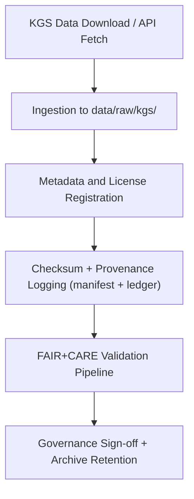

<div align="center">

# 🧱 Kansas Frontier Matrix — **Kansas Geological Survey (KGS) Raw Data Archive**  
`data/raw/kgs/README.md`

**Purpose:** Contains raw, unmodified datasets sourced directly from the **Kansas Geological Survey (KGS)** and affiliated research repositories.  
These files represent foundational geological, hydrological, and stratigraphic records used in Kansas Frontier Matrix (KFM) for long-term environmental modeling, historical land analysis, and geospatial reasoning.

[](../../../docs/contracts/data-contract-v3.json)
[](../../../.github/workflows/stac-validate.yml)
[](../../../docs/standards/faircare-validation.md)
[](../../../docs/architecture/repo-focus.md)

</div>

---

## 📚 Overview

This directory stores **primary raw data** obtained from the **Kansas Geological Survey (KGS)**, one of the state’s principal custodians of hydrological, lithological, and geological data.  
All content remains **unaltered** from its original distribution and is used by KFM’s ETL pipelines (`/src/pipelines/etl/kgs_ingest.py`) to generate normalized, FAIR+CARE-aligned datasets.

Data categories include:
- 💧 **Hydrology** — Groundwater observation wells, aquifer monitoring data, and hydrological shapefiles.  
- 🪨 **Lithologic Logs** — Stratigraphic data, well logs, and subsurface structure layers.  
- 🌎 **Geologic Maps** — County-scale maps and geospatial raster layers (GeoTIFFs).  

---

## 🗂️ Directory Layout

```plaintext
data/raw/kgs/
├── README.md                        # This file — overview of KGS data archive
│
├── hydrology/                       # Hydrological and aquifer data
│   ├── observation_wells.csv
│   ├── aquifer_boundaries.geojson
│   ├── water_levels_2025.csv
│   ├── metadata.json
│   └── license.txt
│
├── wells/                           # Well and borehole data
│   ├── wells_master_index.csv
│   ├── stratigraphic_depths.csv
│   ├── metadata.json
│   └── license.txt
│
├── lithologic_logs/                 # Lithologic and stratigraphic log data
│   ├── logs_ellis_county_2024.csv
│   ├── logs_shawnee_county_2025.csv
│   ├── metadata.json
│   └── license.txt
│
└── geologic_maps/                   # Scanned or digital KGS map data (GeoTIFF / PDF)
    ├── kgs_county_maps/
    ├── kgs_quadrangle_maps/
    ├── metadata.json
    └── license.txt
```

---

## ⚙️ Data Source & Provenance

| Source | URL | License | Access Type |
|--------|-----|----------|--------------|
| **Kansas Geological Survey (KGS)** | [https://www.kgs.ku.edu](https://www.kgs.ku.edu) | CC-BY 4.0 | Public |
| **KGS Water Data Portal** | [https://waterdata.kgs.ku.edu/](https://waterdata.kgs.ku.edu/) | CC-BY 4.0 | API / Download |
| **KGS Geologic Map Portal** | [https://maps.kgs.ku.edu/](https://maps.kgs.ku.edu/) | CC-BY 4.0 | Web Map Service |
| **USGS-KGS Cooperative Datasets** | [https://pubs.usgs.gov/](https://pubs.usgs.gov/) | Public Domain | Open Access |

Each dataset includes a `metadata.json` file containing STAC and DCAT-aligned metadata fields (ID, description, temporal extent, spatial extent, and provenance chain).

---

## 🧩 Example Metadata File

```json
{
  "id": "kgs_hydrology_aquifer_boundaries_2025",
  "title": "KGS Aquifer Boundaries for Kansas (2025)",
  "description": "Boundary polygons for major aquifers in Kansas, derived from the KGS Hydrology Division datasets.",
  "provider": "Kansas Geological Survey",
  "license": "CC-BY 4.0",
  "source_url": "https://maps.kgs.ku.edu/",
  "spatial_extent": [-102.05, 36.99, -94.61, 40.00],
  "temporal_extent": ["2000-01-01", "2025-12-31"],
  "format": "GeoJSON",
  "checksum": "sha256:ab34b7f55e3d9dfcbb1e11b034e8f9f78c90f7b5b2e0fae2e6e05ac...",
  "governance_ref": "docs/standards/governance/DATA-GOVERNANCE.md"
}
```

---

## 🔍 FAIR+CARE Governance Workflow



### Process Overview:
1. **Acquisition:** KGS datasets fetched via direct download, WMS, or REST API.  
2. **Metadata Registration:** STAC/DCAT-aligned metadata file auto-generated via ETL ingestion script.  
3. **Checksum Verification:** Recorded in `releases/v9.5.0/manifest.zip` and logged to governance ledger.  
4. **Validation:** Schema and FAIR+CARE validation workflows (`stac-validate.yml` / `faircare-validate.yml`).  
5. **Governance:** Audit trails appended to `reports/audit/data_provenance_ledger.json`.

---

## ⚖️ Licensing & Attribution

All KGS datasets are distributed under **Creative Commons Attribution 4.0 International (CC-BY 4.0)**.  
Attribution should reference both the **Kansas Geological Survey** and **Kansas Frontier Matrix** as secondary distributors under FAIR+CARE governance.

**Required Citation Format:**
> Kansas Geological Survey (KGS). Data retrieved and curated under the Kansas Frontier Matrix (v9.5.0) governance framework. Licensed under CC-BY 4.0.

---

## 🧠 FAIR+CARE Compliance

| Principle | Implementation |
|------------|----------------|
| **Findable** | Indexed via STAC/DCAT catalogs and linked to `data/meta/hydrology_dcat.jsonld`. |
| **Accessible** | All datasets available in open formats (CSV, GeoJSON, GeoTIFF). |
| **Interoperable** | Schema conforms to STAC 1.0, DCAT 3.0, and ISO 19115 metadata. |
| **Reusable** | License and provenance metadata embedded in each dataset. |
| **Collective Benefit** | Supports hydrological and geological research for Kansas communities. |
| **Authority to Control** | Honors original KGS license terms and data ownership. |
| **Responsibility** | Datasets reviewed for ethical usage and scientific accuracy. |
| **Ethics** | Sensitive or restricted data flagged prior to integration. |

---

## 🧾 Validation & Governance Records

| File | Purpose |
|------|----------|
| `metadata.json` | Dataset metadata file (STAC/DCAT aligned) |
| `license.txt` | KGS CC-BY 4.0 license text |
| `../../../releases/v9.5.0/manifest.zip` | Recorded checksums and versions |
| `../../../reports/audit/data_provenance_ledger.json` | Governance and provenance chain |
| `../../../reports/validation/stac_validation_report.json` | Validation summary |
| `../../../releases/v9.5.0/focus-telemetry.json` | Telemetry and ingestion metrics |

---

## 🧾 Citation

```text
Kansas Geological Survey (2025). Kansas Geological Survey Raw Data Archive (v9.5.0).
Retrieved under FAIR+CARE governance through the Kansas Frontier Matrix (KFM).
Available at: https://github.com/bartytime4life/Kansas-Frontier-Matrix/tree/main/data/raw/kgs
License: CC-BY 4.0
```

---

<div align="center">

**Kansas Frontier Matrix** · *KGS Raw Data × FAIR+CARE Integrity × Provenance Transparency*  
[🔗 Repository](https://github.com/bartytime4life/Kansas-Frontier-Matrix) • [🧭 Docs Portal](../../../docs/) • [⚖️ Governance Ledger](../../../docs/standards/governance/)

</div>

