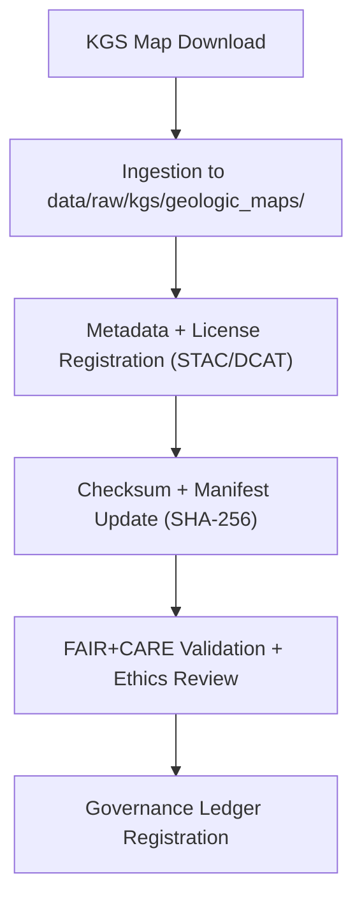

<div align="center">

# 🗺️ Kansas Frontier Matrix — **KGS Geologic Maps Archive**  
`data/raw/kgs/geologic_maps/README.md`

**Purpose:** Stores digitized and scanned **geologic maps** from the **Kansas Geological Survey (KGS)** and cooperating agencies.  
These unmodified datasets provide the foundation for geological, hydrological, and environmental spatial analysis within the Kansas Frontier Matrix (KFM).

[](../../../../docs/contracts/data-contract-v3.json)
[](../../../../.github/workflows/stac-validate.yml)
[](../../../../docs/standards/faircare-validation.md)
[](../../../../docs/architecture/repo-focus.md)

</div>

---

## 📚 Overview

This directory contains **KGS county, quadrangle, and regional geologic maps**, scanned or converted into geospatial formats such as GeoTIFF, PDF, and shapefile/GeoPackage layers.  
These maps serve as key spatial reference datasets for:
- 🪨 Stratigraphic and lithologic analysis.  
- 🧭 Historical geologic mapping projects.  
- 🌎 Environmental correlation with hydrology, soil, and land use.  
- 🧠 AI-driven spatial reasoning in Focus Mode (e.g., terrain–hazard–settlement correlations).

All files are **unaltered** from their official KGS releases and are versioned under FAIR+CARE governance.

---

## 🗂️ Directory Layout

```plaintext
data/raw/kgs/geologic_maps/
├── README.md                          # This file — overview of KGS map datasets
│
├── kgs_county_maps/                   # County-scale geologic maps
│   ├── ellis_county_geologic_map_2023.tif
│   ├── shawnee_county_geologic_map_2022.tif
│   ├── metadata.json
│   └── license.txt
│
├── kgs_quadrangle_maps/               # 7.5-minute quadrangle geologic maps
│   ├── hays_quadrangle_map_2024.tif
│   ├── topeka_quadrangle_map_2023.tif
│   ├── metadata.json
│   └── license.txt
│
└── historical_maps/                   # Legacy or scanned paper maps (PDF/JPEG)
    ├── 1935_statewide_geologic_map.pdf
    ├── 1960_regional_structure_map.jpeg
    ├── metadata.json
    └── license.txt
```

---

## ⚙️ Data Source & Provenance

| Source | URL | License | Access Type |
|--------|-----|----------|--------------|
| **KGS Geologic Map Portal** | [https://maps.kgs.ku.edu/](https://maps.kgs.ku.edu/) | CC-BY 4.0 | Public |
| **KGS Open File Reports** | [https://kgs.ku.edu/OFR/](https://kgs.ku.edu/OFR/) | CC-BY 4.0 | PDF / Download |
| **USGS Cooperative Publications** | [https://pubs.usgs.gov/](https://pubs.usgs.gov/) | Public Domain | Open Access |
| **Kansas Data Access & Support Center (DASC)** | [https://hub.kansasgis.org/](https://hub.kansasgis.org/) | CC-BY 4.0 | Web Feature Service (WFS) |

Each subdirectory includes a **metadata file** following STAC 1.0 and DCAT 3.0 conventions, documenting source URL, license, checksum, spatial coverage, and publication date.

---

## 🧩 Example Metadata File

```json
{
  "id": "kgs_ellis_county_geologic_map_2023",
  "title": "KGS Ellis County Geologic Map (2023)",
  "description": "Digital raster geologic map of Ellis County, Kansas, derived from KGS archives.",
  "provider": "Kansas Geological Survey",
  "source_url": "https://maps.kgs.ku.edu/",
  "license": "CC-BY 4.0",
  "spatial_extent": [-99.45, 38.70, -99.05, 39.05],
  "temporal_extent": ["2023-01-01", "2023-12-31"],
  "format": "GeoTIFF",
  "checksum": "sha256:f7b89e3412faaa7d8e47ff31f3269dd28d4b928c47d887c0b6d72e7e17b95c3a",
  "keywords": ["geology", "Kansas", "Ellis County", "map", "KGS"],
  "governance_ref": "docs/standards/governance/DATA-GOVERNANCE.md"
}
```

---

## 🔍 FAIR+CARE Governance Workflow



### Process Overview:
1. **Acquisition:** Maps downloaded or harvested from KGS or USGS cooperative archives.  
2. **Metadata Registration:** Metadata auto-generated via `src/pipelines/etl/kgs_maps_ingest.py`.  
3. **Checksum Logging:** SHA-256 digests recorded in `releases/v9.5.0/manifest.zip`.  
4. **Validation:** `stac-validate.yml` and `faircare-validate.yml` ensure schema and governance alignment.  
5. **Ledger Registration:** Appended to `reports/audit/data_provenance_ledger.json`.

---

## ⚖️ Licensing & Attribution

All datasets from the **Kansas Geological Survey** are released under **Creative Commons Attribution 4.0 (CC-BY 4.0)**.

**Attribution Statement:**
> Kansas Geological Survey (KGS). Digital Geologic Maps (v9.5.0).  
> Reused under CC-BY 4.0 and republished via Kansas Frontier Matrix (KFM) under FAIR+CARE governance.

Derived datasets must cite both KGS and KFM.

---

## 🧠 FAIR+CARE Implementation

| Principle | Implementation |
|------------|----------------|
| **Findable** | Indexed in STAC/DCAT catalogs and searchable via Focus Mode. |
| **Accessible** | Distributed as GeoTIFF, PDF, or shapefile under open license. |
| **Interoperable** | Metadata conforms to STAC 1.0, DCAT 3.0, ISO 19115 standards. |
| **Reusable** | Attribution metadata and checksums included for every file. |
| **Collective Benefit** | Promotes public access to state geological knowledge. |
| **Authority to Control** | Maintains KGS intellectual property rights under CC-BY 4.0. |
| **Responsibility** | Datasets validated and documented for provenance integrity. |
| **Ethics** | Maps reviewed for accuracy, source integrity, and historical context. |

---

## 🔍 Related Governance Artifacts

| File | Purpose |
|------|----------|
| `metadata.json` | STAC/DCAT metadata for map datasets |
| `license.txt` | CC-BY 4.0 licensing information |
| `../../../../releases/v9.5.0/manifest.zip` | Manifest of dataset checksums |
| `../../../../reports/audit/data_provenance_ledger.json` | Provenance and ethics ledger |
| `../../../../releases/v9.5.0/focus-telemetry.json` | Ingestion telemetry record |

---

## 🧾 Citation

```text
Kansas Geological Survey (2025). Kansas Geologic Maps Archive (v9.5.0).
Digitized and distributed under FAIR+CARE governance via Kansas Frontier Matrix.
Available at: https://github.com/bartytime4life/Kansas-Frontier-Matrix/tree/main/data/raw/kgs/geologic_maps
License: CC-BY 4.0
```

---

<div align="center">

**Kansas Frontier Matrix** · *KGS Geologic Maps × FAIR+CARE Governance × Provenance Integrity*  
[🔗 Repository](https://github.com/bartytime4life/Kansas-Frontier-Matrix) • [🧭 Docs Portal](../../../../docs/) • [⚖️ Governance Ledger](../../../../docs/standards/governance/)

</div>

