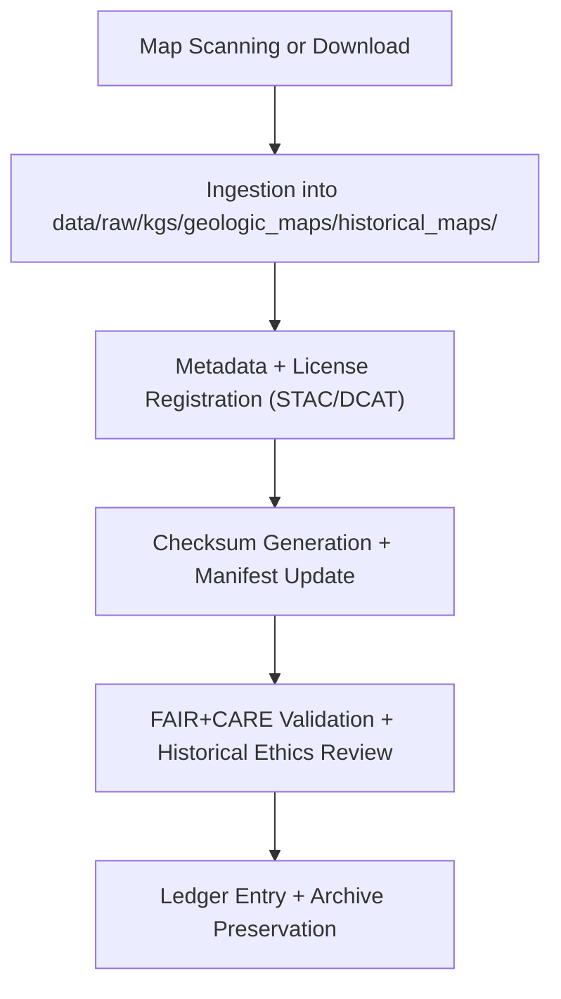

<div align="center">

# 🗺️ Kansas Frontier Matrix — **Historical Geologic Maps Archive**  
`data/raw/kgs/geologic_maps/historical_maps/README.md`

**Purpose:** Preserves **digitized and scanned historical geologic maps** from the Kansas Geological Survey (KGS), USGS, and early 20th-century Kansas mapping initiatives.  
These documents capture the evolution of geological understanding in Kansas and serve as primary references for historical and temporal analysis in the Kansas Frontier Matrix (KFM).

[](../../../../../docs/contracts/data-contract-v3.json)
[](../../../../../.github/workflows/stac-validate.yml)
[](../../../../../docs/standards/faircare-validation.md)
[](../../../../../docs/architecture/repo-focus.md)

</div>

---

## 📚 Overview

The **Historical Geologic Maps Archive** documents more than a century of Kansas geological mapping and fieldwork.  
These maps — often hand-drawn or lithographically printed — are digitized into PDF, JPEG, or GeoTIFF formats for archival and research reuse.

This collection supports:
- 🧭 Temporal analysis of geological mapping and scientific interpretation.  
- 🧱 Historical stratigraphy, structure, and resource mapping.  
- 🧠 AI-assisted comparison between historical and modern datasets.  
- 📖 Public accessibility for educational and heritage preservation purposes.

---

## 🗂️ Directory Layout

```plaintext
data/raw/kgs/geologic_maps/historical_maps/
├── README.md                            # This file — overview of historical geologic maps
│
├── 1935_statewide_geologic_map.pdf      # Original scanned statewide geologic map
├── 1960_regional_structure_map.jpeg     # Legacy structure and lithology compilation
├── 1902_usgs_bulletin_map.pdf           # USGS co-publication with KGS
├── metadata.json                        # Metadata for historical geologic map archive
└── license.txt                          # Public domain / CC-BY license declaration
```

---

## ⚙️ Data Source & Provenance

| Source | URL | License | Period | Access Type |
|--------|-----|----------|---------|--------------|
| **Kansas Geological Survey Archives** | [https://www.kgs.ku.edu/](https://www.kgs.ku.edu/) | CC-BY 4.0 | 1890–1990 | Public Archive |
| **USGS Publications Warehouse** | [https://pubs.er.usgs.gov/](https://pubs.er.usgs.gov/) | Public Domain | 1880–1970 | Download / PDF |
| **Kansas State Historical Society** | [https://www.kshs.org/](https://www.kshs.org/) | CC-BY-NC 4.0 (varies) | 1865–1960 | On Request |
| **Library of Congress Digital Map Archive** | [https://www.loc.gov/maps/](https://www.loc.gov/maps/) | Public Domain | 1800–1950 | Open Access |

All maps are digitized in high resolution and stored with full provenance metadata (source, license, checksum, temporal context).

---

## 🧩 Example Metadata File

```json
{
  "id": "kgs_1935_statewide_geologic_map",
  "title": "Statewide Geologic Map of Kansas (1935)",
  "description": "Digitized lithographic print of the 1935 statewide geologic map compiled by the Kansas Geological Survey.",
  "provider": "Kansas Geological Survey",
  "license": "Public Domain",
  "source_url": "https://www.kgs.ku.edu/General/Geology/index.html",
  "temporal_extent": ["1935-01-01", "1935-12-31"],
  "format": "PDF",
  "spatial_extent": [-102.05, 36.99, -94.61, 40.00],
  "checksum": "sha256:7f41a2a1d3e93f8a897b145b39cd11eaf4b2c8bfe0e847b2de5ab8d5e83a07d6",
  "keywords": ["Kansas", "Geology", "Historical Map", "KGS", "1935"],
  "governance_ref": "docs/standards/governance/DATA-GOVERNANCE.md"
}
```

---

## 🔍 FAIR+CARE Governance Workflow



### Workflow Description:
1. **Digitization or Acquisition:** Maps obtained from archival sources (KGS, USGS, LOC).  
2. **Metadata Registration:** Created automatically using ingestion scripts.  
3. **Checksum Logging:** Added to `releases/v9.5.0/manifest.zip` and verified for integrity.  
4. **Validation:** STAC/DCAT schema and FAIR+CARE checks applied in CI.  
5. **Governance Entry:** Appended to the provenance ledger (`reports/audit/data_provenance_ledger.json`).

---

## ⚖️ Licensing & Attribution

Licensing varies by origin:
- **KGS** materials — **CC-BY 4.0**.  
- **USGS** publications — **Public Domain (U.S. Government Works)**.  
- **LOC / KSHS** scans — **CC-BY-NC 4.0** or unrestricted Public Domain where applicable.  

**Attribution Example:**
> Kansas Geological Survey (1935). Historical Geologic Map Series. Digitized and curated under Kansas Frontier Matrix (v9.5.0) FAIR+CARE governance. License: CC-BY 4.0 / Public Domain.

---

## 🧠 FAIR+CARE Implementation

| Principle | Implementation |
|------------|----------------|
| **Findable** | Indexed in STAC/DCAT catalogs with historical keywords and date ranges. |
| **Accessible** | Stored as open-format scans (PDF, JPEG, GeoTIFF). |
| **Interoperable** | Metadata schema supports temporal and geospatial queries. |
| **Reusable** | Publicly licensed with full citation and provenance metadata. |
| **Collective Benefit** | Preserves historical geological research for public access. |
| **Authority to Control** | Honors original publication and archive terms. |
| **Responsibility** | Sensitive data (land use annotations, personal notes) reviewed and redacted if necessary. |
| **Ethics** | Reviewed by FAIR+CARE Council for historical context and reuse ethics. |

---

## 🧾 Governance & Validation Artifacts

| File | Purpose |
|------|----------|
| `metadata.json` | STAC/DCAT metadata file for historical maps |
| `license.txt` | Source license (Public Domain or CC-BY 4.0) |
| `../../../../../releases/v9.5.0/manifest.zip` | Manifest with checksum validation |
| `../../../../../reports/audit/data_provenance_ledger.json` | Governance ledger entry |
| `../../../../../reports/validation/stac_validation_report.json` | Validation and compliance report |

---

## 🧾 Citation

```text
Kansas Geological Survey (1935–1960). Historical Geologic Maps Archive (v9.5.0).
Digitized and distributed under FAIR+CARE governance via Kansas Frontier Matrix (KFM).
Available at: https://github.com/bartytime4life/Kansas-Frontier-Matrix/tree/main/data/raw/kgs/geologic_maps/historical_maps
License: Public Domain / CC-BY 4.0
```

---

<div align="center">

**Kansas Frontier Matrix** · *Historical Geologic Maps × FAIR+CARE Ethics × Provenance Preservation*  
[🔗 Repository](https://github.com/bartytime4life/Kansas-Frontier-Matrix) • [🧭 Docs Portal](../../../../../docs/) • [⚖️ Governance Ledger](../../../../../docs/standards/governance/)

</div>

