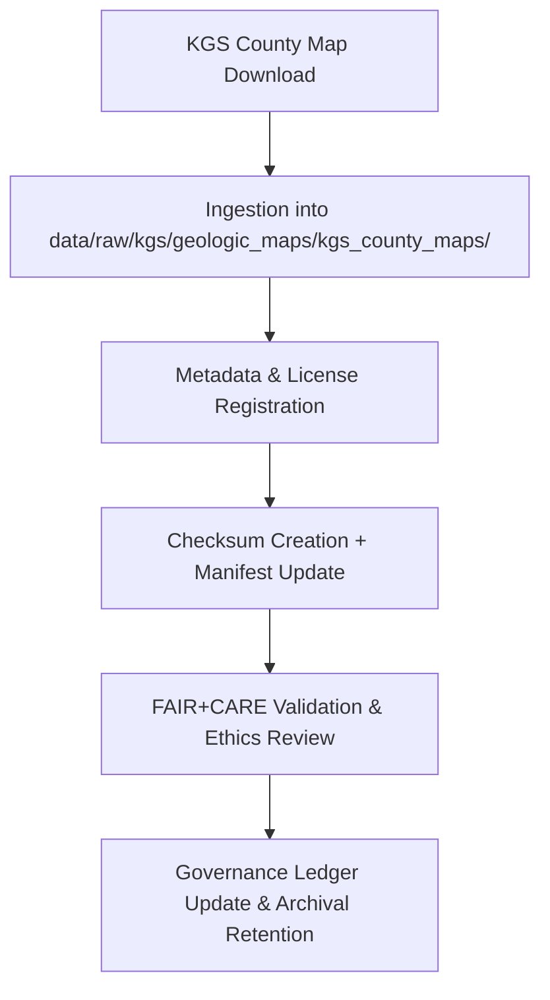

<div align="center">

# 🗺️ Kansas Frontier Matrix — **KGS County Geologic Maps**  
`data/raw/kgs/geologic_maps/kgs_county_maps/README.md`

**Purpose:** Repository for county-scale **geologic maps** produced by the **Kansas Geological Survey (KGS)**.  
These high-resolution raster and vector datasets form the foundation for spatial, stratigraphic, and environmental modeling in the Kansas Frontier Matrix (KFM).

[](../../../../../docs/contracts/data-contract-v3.json)
[](../../../../../.github/workflows/stac-validate.yml)
[](../../../../../docs/standards/faircare-validation.md)
[](../../../../../docs/architecture/repo-focus.md)

</div>

---

## 📚 Overview

This subdirectory contains **KGS County Geologic Maps**, which provide detailed geologic data at the county level across Kansas.  
Each map is stored in its original format (GeoTIFF, PDF, or shapefile) and accompanied by metadata compliant with **STAC 1.0** and **DCAT 3.0** standards.

These datasets support:
- 🪨 **Geologic Framework Modeling** — Stratigraphic, lithologic, and structure interpretations.  
- 💧 **Hydrology Integration** — Aquifer and water-bearing formation mapping.  
- 🧭 **Historical Change Detection** — Temporal comparison of geological mapping.  
- 🧠 **AI / Focus Mode Reasoning** — Training geospatial models for natural resource correlation.

---

## 🗂️ Directory Layout

```plaintext
data/raw/kgs/geologic_maps/kgs_county_maps/
├── README.md                           # This file — KGS County Map overview
│
├── ellis_county_geologic_map_2023.tif  # GeoTIFF raster
├── shawnee_county_geologic_map_2022.tif
├── ford_county_geologic_map_2025.tif
├── metadata.json                       # Metadata for entire collection
└── license.txt                         # CC-BY 4.0 license from KGS
```

Each GeoTIFF or PDF is an **unaltered reproduction** of official KGS releases, stored with precise metadata and checksum validation.

---

## ⚙️ Data Source & Provenance

| Source | URL | License | Format | Scale |
|--------|-----|----------|---------|-------|
| **KGS County Geologic Maps Portal** | [https://maps.kgs.ku.edu/CountyGeology](https://maps.kgs.ku.edu/CountyGeology) | CC-BY 4.0 | GeoTIFF / PDF | 1:50,000 – 1:100,000 |
| **KGS GIS Data Service** | [https://services.kgs.ku.edu/arcgis/rest/services](https://services.kgs.ku.edu/arcgis/rest/services) | CC-BY 4.0 | GeoJSON / WMS | Variable |
| **USGS Cooperative Data** | [https://pubs.usgs.gov/](https://pubs.usgs.gov/) | Public Domain | Shapefile / GeoTIFF | 1:100,000 |

All datasets originate from verified KGS releases and are validated under the FAIR+CARE data governance system.

---

## 🧩 Example Metadata File

```json
{
  "id": "kgs_ellis_county_geologic_map_2023",
  "title": "KGS Ellis County Geologic Map (2023)",
  "description": "Digital raster geologic map for Ellis County, Kansas, showing stratigraphic formations and lithologic contacts.",
  "provider": "Kansas Geological Survey",
  "source_url": "https://maps.kgs.ku.edu/CountyGeology",
  "license": "CC-BY 4.0",
  "format": "GeoTIFF",
  "spatial_extent": [-99.45, 38.70, -99.05, 39.05],
  "temporal_extent": ["2023-01-01", "2023-12-31"],
  "keywords": ["geology", "stratigraphy", "Kansas", "Ellis County"],
  "checksum": "sha256:bdc9a8a5a77e69ac24cf6e34dc7bb79e4f74ab8f7232e938ac8d4e7bb7a219a1",
  "governance_ref": "docs/standards/governance/DATA-GOVERNANCE.md"
}
```

---

## 🔍 FAIR+CARE Governance Workflow



### Workflow Steps:
1. **Download:** Maps fetched directly from KGS portals or services.  
2. **Metadata Creation:** Generated using `src/pipelines/etl/kgs_ingest.py`.  
3. **Checksum Logging:** Recorded in `releases/v9.5.0/manifest.zip`.  
4. **Validation:** STAC and FAIR+CARE schema compliance verified via CI.  
5. **Ledger Update:** Governance log appended in `reports/audit/data_provenance_ledger.json`.

---

## ⚖️ Licensing & Attribution

All map data © Kansas Geological Survey — distributed under **Creative Commons Attribution 4.0 International (CC-BY 4.0)**.  
Users must provide proper credit when reusing, redistributing, or modifying derived works.

**Attribution Example:**
> Kansas Geological Survey (2023). County Geologic Maps [GeoTIFF dataset].  
> Retrieved via the Kansas Frontier Matrix (v9.5.0) FAIR+CARE data infrastructure. Licensed under CC-BY 4.0.

---

## 🧠 FAIR+CARE Implementation

| Principle | Implementation |
|------------|----------------|
| **Findable** | Indexed via STAC/DCAT metadata and searchable through Focus Mode. |
| **Accessible** | Stored in open formats (GeoTIFF/PDF) and accessible without restriction. |
| **Interoperable** | Schema aligned with ISO 19115, STAC 1.0, and DCAT 3.0 standards. |
| **Reusable** | License, checksum, and provenance metadata provided for every map. |
| **Collective Benefit** | Enhances understanding of Kansas geology and supports education/research. |
| **Authority to Control** | Honors KGS ownership and attribution requirements. |
| **Responsibility** | Maps validated for accuracy and completeness. |
| **Ethics** | Historic datasets reviewed for contextual sensitivity and correctness. |

---

## 🧾 Governance & Validation Artifacts

| File | Purpose |
|------|----------|
| `metadata.json` | STAC/DCAT metadata for all county maps |
| `license.txt` | KGS CC-BY 4.0 license text |
| `../../../../../releases/v9.5.0/manifest.zip` | Checksum records for ingestion |
| `../../../../../reports/audit/data_provenance_ledger.json` | Provenance and ethics ledger |
| `../../../../../reports/validation/stac_validation_report.json` | STAC validation summary |

---

## 🧾 Citation

```text
Kansas Geological Survey (2025). Kansas County Geologic Maps (v9.5.0).
Distributed under FAIR+CARE governance through Kansas Frontier Matrix (KFM).
Available at: https://github.com/bartytime4life/Kansas-Frontier-Matrix/tree/main/data/raw/kgs/geologic_maps/kgs_county_maps
License: CC-BY 4.0
```

---

<div align="center">

**Kansas Frontier Matrix** · *KGS County Geologic Maps × FAIR+CARE Data Stewardship × Provenance Integrity*  
[🔗 Repository](https://github.com/bartytime4life/Kansas-Frontier-Matrix) • [🧭 Docs Portal](../../../../../docs/) • [⚖️ Governance Ledger](../../../../../docs/standards/governance/)

</div>
