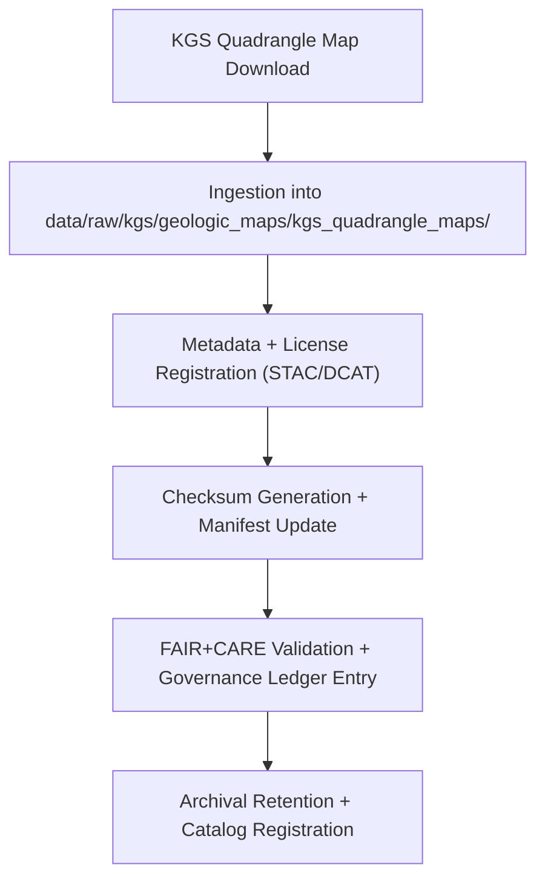

<div align="center">

# 🗺️ Kansas Frontier Matrix — **KGS Quadrangle Geologic Maps**  
`data/raw/kgs/geologic_maps/kgs_quadrangle_maps/README.md`

**Purpose:** Hosts **7.5-minute quadrangle geologic maps** published by the **Kansas Geological Survey (KGS)** and partner institutions.  
These unaltered maps provide high-resolution geological detail for stratigraphic correlation, structure mapping, and spatial modeling across Kansas.

[](../../../../../docs/contracts/data-contract-v3.json)
[](../../../../../.github/workflows/stac-validate.yml)
[](../../../../../docs/standards/faircare-validation.md)
[](../../../../../docs/architecture/repo-focus.md)

</div>

---

## 📚 Overview

The **KGS Quadrangle Geologic Maps** are detailed **7.5-minute series** mapping lithologic, stratigraphic, and structural features across Kansas.  
These datasets form the **high-resolution geological backbone** of the Kansas Frontier Matrix (KFM), supporting Focus Mode analysis, AI reasoning, and environmental research.

Uses include:
- 🪨 Structural and stratigraphic correlation.  
- 🧭 Mapping lithologic boundaries at local scales.  
- 🌎 Integrating surface and subsurface geological datasets.  
- 🧠 AI and geospatial modeling (terrain, slope, hazard mapping).  

All datasets are stored as **unaltered GeoTIFFs or shapefiles** with validated metadata and license documentation.

---

## 🗂️ Directory Layout

```plaintext
data/raw/kgs/geologic_maps/kgs_quadrangle_maps/
├── README.md                             # This file — KGS Quadrangle Map overview
│
├── hays_quadrangle_map_2024.tif          # Example raster GeoTIFF
├── topeka_quadrangle_map_2023.tif
├── dodgecity_quadrangle_map_2022.tif
├── metadata.json                         # Metadata for quadrangle map collection
└── license.txt                           # CC-BY 4.0 license information
```

---

## ⚙️ Data Source & Provenance

| Source | URL | License | Scale | Format |
|--------|-----|----------|--------|--------|
| **KGS Quadrangle Maps Portal** | [https://maps.kgs.ku.edu/QuadMaps](https://maps.kgs.ku.edu/QuadMaps) | CC-BY 4.0 | 1:24,000 | GeoTIFF / PDF |
| **KGS GIS Services (ArcGIS REST)** | [https://services.kgs.ku.edu/arcgis/rest/services](https://services.kgs.ku.edu/arcgis/rest/services) | CC-BY 4.0 | Variable | GeoJSON / WMS |
| **USGS Topographic Base Layers** | [https://apps.nationalmap.gov/](https://apps.nationalmap.gov/) | Public Domain | 1:24,000 | TIFF / GeoTIFF |

Each map is verified for spatial accuracy, completeness, and provenance against the KGS publication database and the U.S. Geological Survey’s map series index.

---

## 🧩 Example Metadata File

```json
{
  "id": "kgs_topeka_quadrangle_map_2023",
  "title": "KGS Topeka Quadrangle Geologic Map (2023)",
  "description": "High-resolution quadrangle map showing geologic formations and faults within the Topeka area.",
  "provider": "Kansas Geological Survey",
  "license": "CC-BY 4.0",
  "source_url": "https://maps.kgs.ku.edu/QuadMaps",
  "spatial_extent": [-95.82, 39.01, -95.52, 39.21],
  "temporal_extent": ["2023-01-01", "2023-12-31"],
  "format": "GeoTIFF",
  "keywords": ["geology", "Topeka", "quadrangle", "Kansas", "KGS"],
  "checksum": "sha256:54b3a11e7f210b7e25f87a3bb93f5144e292e3fd0d814a9c2d377b6b8d6c9e1b",
  "governance_ref": "docs/standards/governance/DATA-GOVERNANCE.md"
}
```

---

## 🔍 FAIR+CARE Governance Workflow



### Workflow Details:
1. **Acquisition:** Maps downloaded from the KGS portal or harvested via ArcGIS REST API.  
2. **Metadata Creation:** Generated automatically by `src/pipelines/etl/kgs_maps_ingest.py`.  
3. **Checksum Validation:** Recorded in `releases/v9.5.0/manifest.zip` for traceability.  
4. **Validation:** STAC + FAIR+CARE schemas enforced via GitHub CI.  
5. **Ledger Entry:** Provenance appended to `reports/audit/data_provenance_ledger.json`.

---

## ⚖️ Licensing & Attribution

All quadrangle maps © Kansas Geological Survey and are released under **Creative Commons Attribution 4.0 (CC-BY 4.0)**.

**Attribution Statement:**
> Kansas Geological Survey (KGS). Quadrangle Geologic Maps (v9.5.0).  
> Published and redistributed under FAIR+CARE governance by Kansas Frontier Matrix (KFM).  
> Licensed under CC-BY 4.0.

---

## 🧠 FAIR+CARE Implementation

| Principle | Implementation |
|------------|----------------|
| **Findable** | Indexed in STAC/DCAT and linked to Focus Mode AI for spatial correlation. |
| **Accessible** | Provided as GeoTIFF or shapefile with open license. |
| **Interoperable** | Aligned with STAC 1.0, DCAT 3.0, and ISO 19115. |
| **Reusable** | Metadata includes license, checksum, and provenance fields. |
| **Collective Benefit** | Supports geologic mapping, education, and environmental analysis. |
| **Authority to Control** | Respects KGS publication rights and attributions. |
| **Responsibility** | Maintains scientific integrity and metadata transparency. |
| **Ethics** | Reviewed for accuracy, attribution, and context prior to publication. |

---

## 🔍 Validation & Governance Artifacts

| File | Purpose |
|------|----------|
| `metadata.json` | STAC/DCAT metadata for quadrangle maps |
| `license.txt` | CC-BY 4.0 license text |
| `../../../../../releases/v9.5.0/manifest.zip` | Manifest with checksums |
| `../../../../../reports/audit/data_provenance_ledger.json` | Provenance and governance log |
| `../../../../../reports/validation/stac_validation_report.json` | Validation results |

---

## 🧾 Citation

```text
Kansas Geological Survey (2025). Kansas Quadrangle Geologic Maps (v9.5.0).
Digitized under FAIR+CARE governance and distributed by the Kansas Frontier Matrix (KFM).
Available at: https://github.com/bartytime4life/Kansas-Frontier-Matrix/tree/main/data/raw/kgs/geologic_maps/kgs_quadrangle_maps
License: CC-BY 4.0
```

---

<div align="center">

**Kansas Frontier Matrix** · *KGS Quadrangle Maps × FAIR+CARE Ethics × Provenance Integrity*  
[🔗 Repository](https://github.com/bartytime4life/Kansas-Frontier-Matrix) • [🧭 Docs Portal](../../../../../docs/) • [⚖️ Governance Ledger](../../../../../docs/standards/governance/)

</div>

