<div align="center">

# 🧾 Kansas Frontier Matrix — Raw Landcover Checksums  
`data/raw/landcover/checksums/`

### **Integrity · Authenticity · Provenance**  
*SHA-256 integrity manifests ensuring byte-level reproducibility of landcover datasets within the Kansas Frontier Matrix.*

[](../../../../.github/workflows/site.yml)  
[](../../../../.github/workflows/stac-validate.yml)  
[](../../../../.github/workflows/codeql.yml)  
[](../../../../.github/workflows/trivy.yml)  
[](../../../../docs/)  
[](../../../../LICENSE)

</div>

---

## 📘 Overview

The `data/raw/landcover/checksums/` directory holds **SHA-256 checksum files (`.sha256`)**  
that guarantee the **authenticity, reproducibility, and immutability** of every raw landcover dataset  
stored in `data/raw/landcover/`.  

These checksum manifests ensure:
- 🔐 **Immutability** — verifies datasets remain unchanged since ingestion  
- 🔗 **Traceability** — referenced in metadata + STAC JSONs  
- ⚙️ **Automation** — verified automatically during `make validate-integrity` and CI workflows  
- 🧾 **Transparency** — supports MCP audit and provenance tracking  

---

## 🗂️ Directory Layout

```bash
data/raw/landcover/checksums/
├── nlcd_2019_landcover.tif.sha256
├── nlcd_2001_landcover.tif.sha256
├── corine_2020_landcover.tif.sha256
└── README.md
````

---

## 🔗 Connections

| Relation                 | Target                                | Description                             |
| ------------------------ | ------------------------------------- | --------------------------------------- |
| **Parent Data**          | `../*.tif`                            | Source raster for checksum verification |
| **Metadata Record**      | `../metadata/*.json`                  | References SHA-256 hash                 |
| **STAC Item**            | `data/stac/items/landcover_*.json`    | Exposes checksum in asset object        |
| **CI/CD Validation**     | `.github/workflows/stac-validate.yml` | Auto-verifies checksums                 |
| **Knowledge Graph Node** | `(Dataset:Landcover)`                 | Property `checksum_verified:true`       |

---

## 🧭 Integrity Validation Flow

```mermaid
flowchart TD
  A["Raw Landcover Files\n(NLCD · CORINE)"] --> B["SHA-256 Generation\n(sha256sum)"]
  B --> C["Checksum Manifests\n(.sha256)"]
  C --> D["Validation\n(make validate-integrity · CI/CD)"]
  D --> E["Metadata Embedding\n(data/raw/landcover/metadata/*.json)"]
  E --> F["STAC Integration\n(data/stac/items/landcover_*.json)"]
  F --> G["Knowledge Graph\n(Dataset:Landcover {checksum_verified:true})"]
%%END OF MERMAID%%
```



---

## 🧪 Validation Commands

### 🔍 Manual Verification

```bash
# Verify all landcover datasets
cd data/raw/landcover/
sha256sum -c checksums/*.sha256
```

### ⚙️ Automated Validation

```bash
# Validate through Makefile and CI/CD
make validate-integrity TYPE=landcover
```

### 🧮 Example Output

```bash
$ sha256sum -c nlcd_2019_landcover.tif.sha256
nlcd_2019_landcover.tif: OK
```

If a checksum mismatch occurs, the dataset must be reacquired
from its manifest in `data/sources/`.

---

## 🧾 Dataset Card

**Title:** Raw Landcover Checksums
**Scope:** SHA-256 integrity manifests for all raw landcover datasets
**Location:** `data/raw/landcover/checksums/`
**Datasets Covered:** NLCD 2001–2019, CORINE 2020
**Validation:** `sha256sum -c` / `make validate-integrity`
**Purpose:** Guarantee dataset authenticity and cross-STAC integrity linkage

---

## 🧱 Versioning

| Field            | Value                          |
| ---------------- | ------------------------------ |
| **Version**      | `v1.0.0`                       |
| **Status**       | Stable                         |
| **Author**       | Andy Barta                     |
| **Last Updated** | 2025-10-12                     |
| **MCP Stage**    | Documentation-First (Complete) |

---

## 🧠 AI & Knowledge Integration

* **AI Provenance Scoring:** Landcover checksum status contributes to dataset trust weighting in ML models.
* **Graph Alignment:** `(Dataset:Landcover)` nodes enriched with `checksum_verified=true`.
* **Cross-Validation:** Supports forensic traceability in data fusion pipelines (e.g., terrain + hydrology).
* **ETL Enforcement:** Ensures all downstream raster transformations originate from verified data only.

---

## 🧩 Validation & Compliance

| Check             | Tool           | Result     |
| ----------------- | -------------- | ---------- |
| SHA-256 Integrity | `sha256sum`    | ✅ Verified |
| Schema Linkage    | `jsonschema`   | ✅ Valid    |
| CI/CD Automation  | GitHub Actions | ✅ Passed   |
| MCP Documentation | Manual Review  | ✅ Complete |

---

## 🧩 Changelog

| Date           | Version  | Description                                                                                                                    |
| -------------- | -------- | ------------------------------------------------------------------------------------------------------------------------------ |
| **2025-10-12** | `v1.0.0` | Initial release — added landcover checksum documentation with lineage diagram, validation references, and full MCP compliance. |

---

## 🪪 License

Checksum manifests are distributed under **[CC-BY 4.0](https://creativecommons.org/licenses/by/4.0/)**.
Source datasets retain their original licenses. Attribution required for derivative uses.

---

### ✅ Summary

This directory serves as the **integrity verification layer** for KFM’s raw landcover datasets.
Each `.sha256` file cryptographically ensures dataset authenticity, feeding validation pipelines,
metadata schemas, STAC items, and the Knowledge Graph.
Together, they guarantee long-term reproducibility and scientific trust across Kansas’s ecological archives.

```
