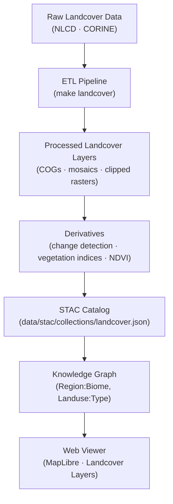

<div align="center">

# 🌾 Kansas Frontier Matrix — Raw Landcover Data  
`data/raw/landcover/`

### **Vegetation · Land Use · Provenance**  
*Immutable, authoritative landcover and vegetation datasets forming the ecological foundation of the Kansas Frontier Matrix.*

[](../../../.github/workflows/site.yml)  
[](../../../.github/workflows/stac-validate.yml)  
[](../../../.github/workflows/codeql.yml)  
[](../../../.github/workflows/trivy.yml)  
[](../../../docs/)  
[](../../../LICENSE)

</div>

---

## 📘 Overview

The `data/raw/landcover/` directory stores **unaltered, authoritative landcover datasets**  
that describe vegetation, land use, and surface characteristics across Kansas.  

These layers provide the **baseline ecological framework** for:
- 🌿 Vegetation classification and change detection  
- 🏞️ Agricultural and land-use analysis  
- 🔥 Wildfire and habitat modeling  
- 🌍 Cross-domain ecological and climate modeling  

All files in this directory are:
- **Immutable** — original datasets, no edits or reprojections  
- **Traceable** — each linked to its `data/sources/*.json` manifest  
- **Verifiable** — each includes a `.sha256` integrity checksum  
- **Documented** — metadata JSON stored under `metadata/`  

---

## 🗂️ Directory Layout

```bash
data/raw/landcover/
├── nlcd_2019_landcover.tif
├── nlcd_2001_landcover.tif
├── corine_2020_landcover.tif
├── metadata/
│   ├── nlcd_2019_landcover.json
│   ├── nlcd_2001_landcover.json
│   └── corine_2020_landcover.json
├── checksums/
│   ├── nlcd_2019_landcover.tif.sha256
│   ├── nlcd_2001_landcover.tif.sha256
│   └── corine_2020_landcover.tif.sha256
└── README.md
````

---

## 🌍 Data Sources & Provenance

| Dataset                            | Provider                    | Resolution | CRS       | License       | STAC ID                 |
| ---------------------------------- | --------------------------- | ---------- | --------- | ------------- | ----------------------- |
| **NLCD 2019 Landcover (U.S.)**     | U.S. Geological Survey      | 30 m       | EPSG:5070 | Public Domain | `landcover_nlcd_2019`   |
| **NLCD 2001 Landcover (U.S.)**     | U.S. Geological Survey      | 30 m       | EPSG:5070 | Public Domain | `landcover_nlcd_2001`   |
| **CORINE 2020 Landcover (Europe)** | European Environment Agency | 100 m      | EPSG:3035 | CC-BY 4.0     | `landcover_corine_2020` |

Each dataset’s provenance is detailed in
[`data/sources/*.json`](../../../data/sources/) and mirrored in STAC Items
under [`data/stac/items/`](../../../data/stac/items/).

---

## 🔗 Connections

| Layer       | Upstream                       | Downstream                           | Purpose                          |
| ----------- | ------------------------------ | ------------------------------------ | -------------------------------- |
| NLCD 2019   | `data/sources/usgs_nlcd.json`  | `data/processed/landcover/`          | Baseline vegetation and land-use |
| CORINE 2020 | `data/sources/eea_corine.json` | `data/derivatives/landcover/`        | Comparative European overlay     |
| NLCD 2001   | `data/sources/usgs_nlcd.json`  | `data/derivatives/change_detection/` | Land-use change analysis         |

---

## 🧭 Data Lineage Diagram



---

## 🧪 Reproducibility

```bash
# Fetch original landcover datasets
make fetch LANDCOVER=all

# Verify integrity
sha256sum -c checksums/*.sha256

# Validate metadata schema
make validate-metadata TYPE=landcover

# Generate STAC items
make stac LANDCOVER=1
```

Outputs populate:

* `data/processed/landcover/`
* `data/derivatives/landcover/`
* `data/stac/collections/landcover.json`

---

## 🧾 Dataset Card

**Title:** NLCD 2019 Landcover – Kansas
**Source:** [USGS National Land Cover Database (NLCD)](https://www.usgs.gov/core-science-systems/land-change-science/nlcd)
**Time:** 2019
**Space:** Kansas extent (EPSG:5070)
**Files:** `nlcd_2019_landcover.tif` (650 MB), `.sha256`
**STAC Item:** `data/stac/items/landcover_nlcd_2019.json`
**License:** Public Domain
**Provenance:** Downloaded 2025-01-07 via USGS API; hash verified.

---

## 🧱 Versioning

| Field            | Value                          |
| ---------------- | ------------------------------ |
| **Version**      | `v1.0.0`                       |
| **Status**       | Stable                         |
| **Author**       | Andy Barta                     |
| **Last Updated** | 2025-10-12                     |
| **MCP Stage**    | Documentation-First (Complete) |

---

## 🧠 AI & Knowledge Integration

* **Semantic Mapping:** Landcover classes feed the KFM AI model for automated classification of geospatial features.
* **Graph Alignment:** Linked to Neo4j entities `(Region:Biome)`, `(Landuse:Type)` with relationships `COVERS` and `CHANGED_TO`.
* **Predictive Modeling:** Inputs to ecosystem resilience simulations and land-use forecasting models.
* **Cross-Domain Links:** Intersects with climate, terrain, and hydrology data to generate composite environmental indicators.

---

## 🧩 Validation & Compliance

| Check             | Tool             | Result     |
| ----------------- | ---------------- | ---------- |
| STAC Schema       | `stac-validator` | ✅ Passed   |
| JSON Schema       | `jsonschema`     | ✅ Valid    |
| SHA-256           | `sha256sum`      | ✅ Verified |
| MCP Documentation | Manual Review    | ✅ Complete |

---

## 🧩 Changelog

| Date           | Version  | Description                                                                                                  |
| -------------- | -------- | ------------------------------------------------------------------------------------------------------------ |
| **2025-10-12** | `v1.0.0` | Initial release — landcover raw dataset documentation with verified lineage, badges, Mermaid, and changelog. |

---

## 🪪 License

All data in this directory is released under **[CC-BY 4.0](https://creativecommons.org/licenses/by/4.0/)**
unless superseded by the source dataset license. Attribution required for all derivative uses.

---

### ✅ Summary

This directory anchors the **ecological base layer** of the Kansas Frontier Matrix.
It preserves original landcover datasets with full provenance, integrity verification,
and metadata lineage. Through STAC + MCP documentation, these sources fuel reproducible
analysis of land-use change, vegetation dynamics, and ecosystem evolution across Kansas.

```

