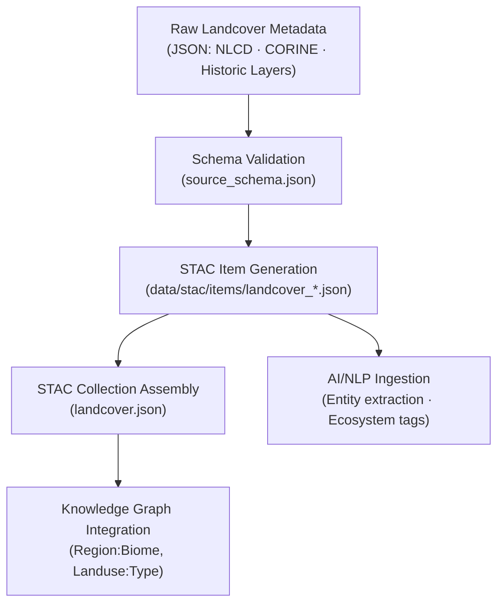

<div align="center">

# 🗺️ Kansas Frontier Matrix — Raw Landcover Metadata  
`data/raw/landcover/metadata/`

### **Lineage · Provenance · Validation**  
*Structured JSON metadata defining every unmodified landcover dataset within the Kansas Frontier Matrix.*

[](../../../../.github/workflows/site.yml)  
[](../../../../.github/workflows/stac-validate.yml)  
[](../../../../.github/workflows/codeql.yml)  
[](../../../../.github/workflows/trivy.yml)  
[](../../../../docs/)  
[](../../../../LICENSE)

</div>

---

## 📘 Overview

The `data/raw/landcover/metadata/` directory contains **structured JSON metadata files**  
that describe each **immutable landcover dataset** stored in `data/raw/landcover/`.  

These metadata records ensure:
- 🔗 **Provenance traceability** — each dataset linked to its source manifest and checksum  
- 📚 **Schema compliance** — validated against the KFM `source_schema.json`  
- 🌍 **Spatial awareness** — explicit extents and CRS declarations  
- 🧾 **STAC compatibility** — fields directly map to STAC 1.0.0 attributes  
- 🔒 **Integrity linkage** — embedded SHA-256 references  

---

## 🗂️ Directory Layout

```bash
data/raw/landcover/metadata/
├── nlcd_2019_landcover.json
├── nlcd_2001_landcover.json
├── corine_2020_landcover.json
└── README.md
````

---

## 🧩 Metadata Schema Validation

All JSON metadata conform to:

```text
src/kansas_geo_timeline/schemas/source_schema.json
```

### Core Fields

| Field             | Description                             |
| ----------------- | --------------------------------------- |
| `id`              | Unique STAC-style identifier            |
| `source_name`     | Canonical dataset title                 |
| `provider`        | Data publisher or agency                |
| `license`         | SPDX-compatible license ID              |
| `spatial_extent`  | `[W, S, E, N]` bounding box (EPSG:4326) |
| `temporal_extent` | Time range of observation/publication   |
| `crs`             | Coordinate Reference System             |
| `resolution`      | Spatial resolution                      |
| `provenance`      | Source URL · retrieval date · checksum  |
| `validation`      | Schema / checksum / STAC status         |

---

## 🔗 Connections

| Relation        | Target Path                                          | Description                   |
| --------------- | ---------------------------------------------------- | ----------------------------- |
| **Parent Data** | `data/raw/landcover/*.tif`                           | Source raster                 |
| **Checksum**    | `data/raw/landcover/checksums/*.sha256`              | Integrity manifest            |
| **STAC Item**   | `data/stac/items/landcover_*.json`                   | Exported STAC record          |
| **Schema**      | `src/kansas_geo_timeline/schemas/source_schema.json` | Validation schema             |
| **Graph Node**  | `neo4j://Region:Biome`                               | Linked Knowledge Graph entity |

---

## 🧭 Metadata Lineage Flow



---

## 🧪 Validation Commands

```bash
# Validate all landcover metadata JSONs
make validate-metadata TYPE=landcover

# Manual schema validation
python scripts/validate_schema.py \
  --schema src/kansas_geo_timeline/schemas/source_schema.json \
  --input data/raw/landcover/metadata/

# Verify linked data integrity
sha256sum -c ../checksums/*.sha256
```

---

## 🧾 Example Metadata Snippet

```json
{
  "id": "landcover_nlcd_2019",
  "source_name": "USGS NLCD 2019 Landcover (Kansas)",
  "provider": "U.S. Geological Survey",
  "license": "Public Domain",
  "spatial_extent": [-102.05, 36.99, -94.60, 40.00],
  "temporal_extent": ["2019-01-01", "2019-12-31"],
  "crs": "EPSG:5070",
  "resolution": "30m",
  "provenance": {
    "url": "https://www.usgs.gov/core-science-systems/land-change-science/nlcd",
    "sha256": "e31f7c8a5bf9d4f1a41c5f6da92e83ef123d9b62...",
    "retrieved": "2025-01-07"
  },
  "validation": {
    "schema": "Passed",
    "checksum": "Verified",
    "stac_export": "Generated"
  }
}
```

---

## 🧱 Versioning

| Field            | Value                          |
| ---------------- | ------------------------------ |
| **Version**      | `v1.0.0`                       |
| **Status**       | Stable                         |
| **Author**       | Andy Barta                     |
| **Last Updated** | 2025-10-12                     |
| **MCP Stage**    | Documentation-First (Complete) |

---

## 🧠 AI & Knowledge Integration

* **AI Enrichment:** Metadata terms power the AI ecological ontology for land-use classification.
* **Graph Mapping:** Nodes `(Dataset:Landcover)` and `(Region:Biome)` with relations `HAS_PROVENANCE` · `COVERS_AREA`.
* **Predictive Modeling:** Metadata attributes inform temporal change detection and NDVI simulations.
* **Cross-Domain Links:** Connects landcover to terrain, hydrology, and climate for integrated system models.

---

## 🧩 Validation & Compliance

| Check             | Tool             | Result     |
| ----------------- | ---------------- | ---------- |
| JSON Schema       | `jsonschema`     | ✅ Passed   |
| STAC Export       | `stac-validator` | ✅ Valid    |
| Checksum Link     | `sha256sum`      | ✅ Verified |
| MCP Documentation | Manual Review    | ✅ Complete |

---

## 🧩 Changelog

| Date           | Version  | Description                                                                                               |
| -------------- | -------- | --------------------------------------------------------------------------------------------------------- |
| **2025-10-12** | `v1.0.0` | Initial release — added landcover metadata documentation, schema validation, and Mermaid lineage diagram. |

---

## 🪪 License

All metadata files are distributed under **[CC-BY 4.0](https://creativecommons.org/licenses/by/4.0/)**
unless superseded by the originating dataset license. Attribution required for derivative use.

---

### ✅ Summary

This directory serves as the **metadata anchor for Kansas landcover datasets**,
linking raw raster layers to STAC items, provenance records, and the Knowledge Graph.
Through MCP validation and checksum integration, it ensures transparent,
auditable, and reproducible ecological research across Kansas.

```

