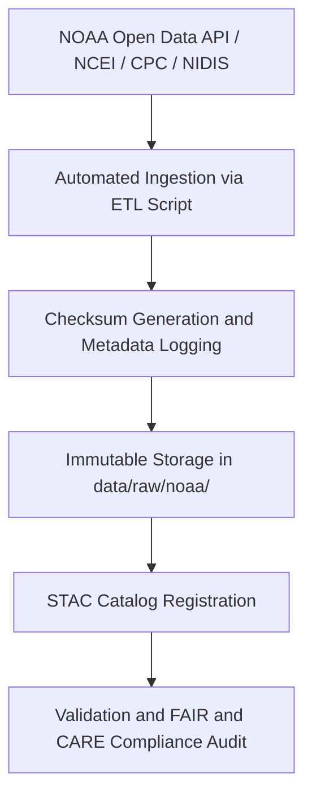

<div align="center">

# 🌦️ Kansas Frontier Matrix — **NOAA Raw Data Repository**
`data/raw/noaa/README.md`

**Purpose:** Stores unmodified datasets obtained from the **National Oceanic and Atmospheric Administration (NOAA)** and its affiliates (NCEI, CPC, NIDIS, NWS).  
These data represent the foundation for climate, weather, and hazard modeling workflows in the Kansas Frontier Matrix (KFM), maintained under FAIR+CARE ethical governance.

[](https://www.noaa.gov/open)
[](../../../docs/standards/faircare-validation.md)
[](../../../LICENSE)
[](../../../docs/architecture/repo-focus.md)

</div>

---

## 📚 Overview

The `data/raw/noaa/` directory contains **raw, unprocessed data from NOAA** and partner institutions.  
These datasets include historical weather observations, climate summaries, drought indices, and severe storm event data covering the state of Kansas.  

Each dataset:
- Is stored in its **original downloaded form** from NOAA repositories or APIs.  
- Includes `metadata.json` describing source, license, and spatial/temporal coverage.  
- Has checksum and governance records ensuring traceability.  
- Is used in downstream ETL pipelines for normalized FAIR+CARE analysis.

---

## 🗂️ Directory Layout

```plaintext
data/raw/noaa/
├── README.md                            # This file — overview of NOAA raw data
│
├── storm_events/                        # NOAA Storm Events Database (hazards and severe weather)
│   ├── storm_events_2025.csv
│   ├── metadata.json
│   └── license.txt
│
├── drought_monitor/                     # Drought Monitor and Climate Index data (USDM, SPI)
│   ├── drought_monitor_2025.csv
│   ├── metadata.json
│   └── license.txt
│
├── temperature_anomalies/               # Global and Kansas climate anomaly datasets
│   ├── kansas_temp_anomalies_2025.csv
│   ├── metadata.json
│   └── license.txt
│
└── metadata.json                        # Master metadata summary for NOAA datasets
```

---

## ⚙️ Data Lifecycle & Governance Workflow



### Workflow Summary:
1. **Ingestion:** Data downloaded via NOAA APIs, FTP endpoints, or web services (e.g., NCEI, CPC, NWS).  
2. **Metadata Registration:** Each file’s metadata recorded (license, temporal coverage, checksum).  
3. **Checksum Generation:** SHA-256 verification added to manifest for integrity validation.  
4. **Validation:** Schema verified for conformance to FAIR+CARE metadata and governance standards.  
5. **Governance:** Entries logged in provenance ledger and FAIR+CARE compliance reports.

---

## 🧩 Example Metadata Record

```json
{
  "id": "noaa_storm_events_2025",
  "title": "NOAA Storm Events Database - Kansas",
  "description": "Official NOAA dataset documenting severe weather events in Kansas including floods, tornadoes, and hail occurrences.",
  "source_url": "https://www.ncdc.noaa.gov/stormevents/",
  "provider": "NOAA National Centers for Environmental Information (NCEI)",
  "license": "Public Domain",
  "checksum": "sha256:d4a71abfe21f30c0d72b0d7a94b9e77a6c85f438...",
  "spatial_extent": [-102.05, 36.99, -94.61, 40.00],
  "temporal_extent": ["1950-01-01", "2025-12-31"]
}
```

---

## 🌍 Dataset Categories

| Dataset | Description | Source | Format |
|----------|--------------|--------|--------|
| `storm_events` | Severe weather event logs (tornadoes, hail, floods, wind). | NOAA NCEI | CSV |
| `drought_monitor` | Drought classification indices (USDM, SPI, PDSI). | NOAA CPC / NIDIS | CSV |
| `temperature_anomalies` | Historical and current temperature anomalies. | NOAA NCEI / NASA GISS | CSV |

Spatial Reference: **EPSG:4326 (WGS84)**  
Temporal Range: **1900–Present**

---

## ⚖️ Licensing & Attribution

| Source | License | Access URL |
|---------|----------|-------------|
| NOAA NCEI | Public Domain | [https://www.ncei.noaa.gov/](https://www.ncei.noaa.gov/) |
| NOAA CPC | Public Domain | [https://www.cpc.ncep.noaa.gov/](https://www.cpc.ncep.noaa.gov/) |
| NOAA NIDIS | Public Domain | [https://www.drought.gov/](https://www.drought.gov/) |
| NOAA NWS | Public Domain | [https://www.weather.gov/](https://www.weather.gov/) |

> NOAA data are federal open data products in the **U.S. public domain**. Attribution is encouraged when using in derivative work.

---

## 🧠 FAIR+CARE Compliance Overview

| Principle | Implementation |
|------------|----------------|
| **Findable** | Datasets indexed with unique STAC IDs and metadata manifest. |
| **Accessible** | Stored in open CSV/GeoJSON formats; accessible through public NOAA APIs. |
| **Interoperable** | Metadata conforms to STAC 1.0 and DCAT 3.0 schemas. |
| **Reusable** | Includes license, checksum, and provenance metadata. |
| **Collective Benefit** | Supports weather safety, education, and climate science. |
| **Authority to Control** | Attribution retained to NOAA as official data steward. |
| **Responsibility** | Governance reviews ensure ethical and accurate data usage. |
| **Ethics** | No private or restricted data; fully public, federally published datasets. |

Audit results stored in:  
`data/reports/audit/data_provenance_ledger.json` and `data/reports/fair/data_fair_summary.json`.

---

## 🔍 Governance Integration

| Record | Purpose |
|---------|----------|
| `metadata.json` | Defines provenance, temporal, and license metadata. |
| `data/reports/audit/data_provenance_ledger.json` | Logs ingestion and checksum validation. |
| `data/reports/validation/stac_validation_report.json` | Verifies metadata schema and completeness. |
| `releases/v9.3.2/manifest.zip` | Global checksum registry. |

---

## 🧾 Citation

```text
Kansas Frontier Matrix (2025). NOAA Raw Data Repository (v9.3.2).
Unaltered NOAA datasets including storm events, drought monitor data, and temperature anomalies for Kansas.
Available at: https://github.com/bartytime4life/Kansas-Frontier-Matrix/tree/main/data/raw/noaa
License: Public Domain (U.S. Federal Data)
```

---

## 🧾 Version Notes

| Version | Date | Notes |
|----------|------|--------|
| v9.3.2 | 2025-10-28 | Added 2025 storm event and drought monitor updates; validated FAIR+CARE schema. |
| v9.2.0 | 2024-07-10 | Integrated CPC SPI and NIDIS drought datasets. |
| v9.0.0 | 2023-01-15 | Established NOAA raw data ingestion pipeline for storm events and temperature data. |

---

<div align="center">

**Kansas Frontier Matrix** · *Climate Science × FAIR+CARE Governance × Open Federal Data Stewardship*  
[🔗 Repository](https://github.com/bartytime4life/Kansas-Frontier-Matrix) • [🧭 Docs Portal](../../../docs/) • [⚖️ Governance Ledger](../../../docs/standards/governance/)

</div>
