<div align="center">

# 🌦️ Kansas Frontier Matrix — **NOAA Raw Data Repository**  
`data/raw/noaa/README.md`

**Purpose:** Preserves **unaltered datasets** from the **National Oceanic and Atmospheric Administration (NOAA)** and affiliates (NCEI, CPC, NIDIS, NWS).  
These datasets form the **climate and weather foundation** of the Kansas Frontier Matrix (KFM) and power climate, hazard, and AI-focused modeling workflows under **FAIR+CARE** governance.

[](https://www.noaa.gov/open)
[](../../../docs/standards/faircare-validation.md)
[](../../../LICENSE)
[](../../../docs/architecture/repo-focus.md)

</div>

---

## 📚 Overview

The `data/raw/noaa/` directory stores **raw, immutable datasets** from NOAA repositories and web services.  
Each dataset is preserved exactly as obtained and includes provenance metadata (STAC/DCAT schema), license documentation, and checksum validation.

**Key Roles:**
- Supports **hazard modeling** (tornadoes, floods, droughts).  
- Enables **climate change trend analysis** for Kansas.  
- Feeds **AI/Focus Mode models** for geospatial reasoning.  
- Contributes to **FAIR+CARE transparency** and scientific reproducibility.

---

## 🗂️ Directory Layout

```plaintext
data/raw/noaa/
├── README.md                           # This file — NOAA data overview
│
├── storm_events/                       # NOAA Storm Events Database (hazards and severe weather)
│   ├── storm_events_2025.csv
│   ├── metadata.json
│   └── license.txt
│
├── drought_monitor/                    # Drought Monitor and Climate Index data (USDM, SPI, PDSI)
│   ├── drought_monitor_2025.csv
│   ├── metadata.json
│   └── license.txt
│
├── temperature_anomalies/              # Historical and real-time temperature anomaly datasets
│   ├── kansas_temp_anomalies_2025.csv
│   ├── metadata.json
│   └── license.txt
│
└── metadata.json                       # Master metadata summary for NOAA datasets
```

---

## ⚙️ Data Lifecycle & Governance Workflow

```mermaid
flowchart TD
  A["NOAA Open Data APIs (NCEI · CPC · NIDIS · NWS)"] --> B["ETL Ingestion (data/raw/noaa/)"]
  B --> C["Checksum Generation + Metadata Registration"]
  C --> D["Immutable Storage & Manifest Update"]
  D --> E["STAC/DCAT Catalog Integration"]
  E --> F["FAIR+CARE Validation + Governance Ledger Logging"]
```



**Lifecycle Steps**
1. **Ingestion:** Data retrieved through NOAA APIs, FTP endpoints, or direct bulk downloads.  
2. **Metadata Creation:** JSON metadata built per FAIR+CARE schema (license, provider, temporal coverage).  
3. **Checksum Logging:** SHA-256 digests added to manifest (`releases/v9.5.1/manifest.zip`).  
4. **Validation:** Schema conformance verified using STAC/DCAT validators.  
5. **Governance:** Logged to provenance ledger and FAIR+CARE audit trail.

---

## 🧩 Example Metadata File

```json
{
  "id": "noaa_storm_events_2025",
  "title": "NOAA Storm Events Database – Kansas",
  "description": "Official NOAA dataset cataloging floods, tornadoes, hail, and severe weather across Kansas.",
  "provider": "NOAA National Centers for Environmental Information (NCEI)",
  "license": "Public Domain",
  "source_url": "https://www.ncdc.noaa.gov/stormevents/",
  "format": "CSV",
  "spatial_extent": [-102.05, 36.99, -94.61, 40.00],
  "temporal_extent": ["1950-01-01", "2025-12-31"],
  "checksum": "sha256:d4a71abfe21f30c0d72b0d7a94b9e77a6c85f438d12a42f0f4c8f3a1c07e3921",
  "governance_ref": "docs/standards/governance/DATA-GOVERNANCE.md"
}
```

---

## 🌍 Dataset Categories

| Dataset | Description | Source | Format |
|----------|--------------|--------|--------|
| `storm_events` | Severe weather events (tornadoes, hail, floods, wind). | NOAA NCEI | CSV |
| `drought_monitor` | Drought classification indices (USDM, SPI, PDSI). | NOAA CPC / NIDIS | CSV |
| `temperature_anomalies` | Historical and current temperature anomalies. | NOAA NCEI / NASA GISS | CSV |

**Spatial Reference:** EPSG:4326 (WGS84)  
**Temporal Range:** 1900–Present

---

## ⚖️ Licensing & Attribution

| Source | License | Access URL |
|---------|----------|-------------|
| **NOAA NCEI** | Public Domain | [https://www.ncei.noaa.gov/](https://www.ncei.noaa.gov/) |
| **NOAA CPC** | Public Domain | [https://www.cpc.ncep.noaa.gov/](https://www.cpc.ncep.noaa.gov/) |
| **NOAA NIDIS** | Public Domain | [https://www.drought.gov/](https://www.drought.gov/) |
| **NOAA NWS** | Public Domain | [https://www.weather.gov/](https://www.weather.gov/) |

> All NOAA data are **U.S. Government Works** and fall under the **Public Domain**. Attribution is encouraged:  
> *“Data provided by the National Oceanic and Atmospheric Administration (NOAA).”*

---

## 🧠 FAIR+CARE Implementation

| Principle | Implementation |
|------------|----------------|
| **Findable** | Indexed in STAC/DCAT catalogs and linked to Focus Mode API. |
| **Accessible** | Stored as CSV/GeoJSON and accessible through public NOAA endpoints. |
| **Interoperable** | Uses open metadata (STAC 1.0, DCAT 3.0, ISO 19115). |
| **Reusable** | Includes license, checksum, and provenance metadata. |
| **Collective Benefit** | Enhances understanding of Kansas climate, weather, and risk. |
| **Authority to Control** | NOAA acknowledged as original data steward. |
| **Responsibility** | Governance verification ensures proper attribution and ethics. |
| **Ethics** | Contains no personal or restricted data; aligns with U.S. open-data policy. |

FAIR+CARE audit reports located at:  
`data/reports/audit/data_provenance_ledger.json`  
`data/reports/fair/data_fair_summary.json`

---

## 🔍 Provenance & Governance Artifacts

| File | Purpose |
|------|----------|
| `metadata.json` | Dataset-level metadata (STAC/DCAT aligned). |
| `license.txt` | NOAA public domain declaration. |
| `../../../releases/v9.5.1/manifest.zip` | SHA-256 checksum registry. |
| `../../../reports/audit/data_provenance_ledger.json` | Provenance and ethics log. |
| `../../../reports/validation/stac_validation_report.json` | Metadata validation results. |

---

## 🧾 Citation

```text
Kansas Frontier Matrix (2025). NOAA Raw Data Repository (v9.5.1).
Unaltered NOAA datasets including storm events, drought monitor data, and temperature anomalies for Kansas.
Retrieved under FAIR+CARE governance.  
Available at: https://github.com/bartytime4life/Kansas-Frontier-Matrix/tree/main/data/raw/noaa  
License: Public Domain (U.S. Government Works)
```

---

## 🧾 Version History

| Version | Date | Author | Summary |
|----------|------|---------|----------|
| v9.5.1 | 2025-10-30 | @kfm-data-lab | Clarified governance artifacts; bumped manifest/SBOM references to v9.5.1. |
| v9.5.0 | 2025-10-30 | @kfm-data-lab | Upgraded to MCP-DL v6.4.3; added DCAT 3.0 crosswalk and telemetry integration. |
| v9.3.2 | 2025-10-28 | @bartytime4life | Added 2025 updates to storm and drought datasets; verified checksum and governance compliance. |
| v9.2.0 | 2024-07-10 | @kfm-etl-ops | Integrated CPC SPI and NIDIS drought data ingestion pipeline. |
| v9.0.0 | 2023-01-15 | @kfm-architecture | Established NOAA raw data ingestion and STAC metadata framework. |

---

<div align="center">

**Kansas Frontier Matrix** · *NOAA Climate Data × FAIR+CARE Governance × Open Federal Science*  
[🔗 Repository](https://github.com/bartytime4life/Kansas-Frontier-Matrix) • [🧭 Docs Portal](../../../docs/) • [⚖️ Governance Ledger](../../../docs/standards/governance/)

</div>
