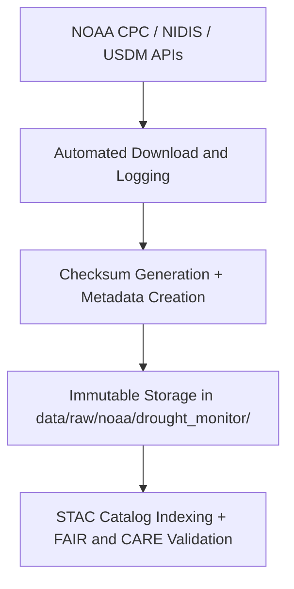

<div align="center">

# 🌾 Kansas Frontier Matrix — **NOAA Drought Monitor Data**
`data/raw/noaa/drought_monitor/README.md`

**Purpose:** Contains unaltered drought monitoring and index datasets sourced from NOAA’s **Climate Prediction Center (CPC)**, **National Integrated Drought Information System (NIDIS)**, and **U.S. Drought Monitor (USDM)**.  
These data underpin drought intensity mapping, agricultural risk modeling, and FAIR+CARE-aligned environmental governance in the Kansas Frontier Matrix (KFM).

[](https://www.drought.gov/)
[](../../../../docs/standards/faircare-validation.md)
[](../../../../LICENSE)
[](../../../../docs/architecture/repo-focus.md)

</div>

---

## 📚 Overview

The `data/raw/noaa/drought_monitor/` directory holds **drought condition and index data** for Kansas, published by NOAA and affiliated agencies.  
Datasets include weekly drought intensity classifications, drought indices (PDSI, SPI), and related climatological summaries.  

All datasets are:
- Downloaded directly from NOAA CPC/NIDIS or USDM APIs.  
- Stored in open CSV format with associated metadata.  
- Immutable — serving as source data for processed ETL pipelines.  
- Validated for FAIR+CARE provenance, schema, and ethics compliance.

---

## 🗂️ Directory Layout

```plaintext
data/raw/noaa/drought_monitor/
├── README.md                          # This file — documentation of NOAA drought datasets
│
├── drought_monitor_2025.csv           # Weekly drought classification data for Kansas (USDM)
├── metadata.json                      # Provenance, license, and schema information
└── license.txt                        # NOAA / USDA public domain data license
```

---

## ⚙️ Data Ingestion Workflow



### Workflow Description:
1. Datasets retrieved automatically from NOAA CPC, NIDIS, and U.S. Drought Monitor APIs.  
2. Metadata registered with temporal range, CRS, and license.  
3. Checksums generated for integrity assurance.  
4. FAIR+CARE audits validate accessibility and documentation completeness.  

---

## 🧩 Example Metadata Record

```json
{
  "id": "noaa_drought_monitor_2025",
  "title": "NOAA Drought Monitor - Kansas",
  "description": "Weekly drought intensity classifications for Kansas, including D0–D4 categories and PDSI/SPI drought indices.",
  "source_url": "https://www.drought.gov/",
  "provider": "National Integrated Drought Information System (NIDIS), NOAA CPC, USDA",
  "license": "Public Domain",
  "checksum": "sha256:56de7b9a98aa12f8345b4c77f7b2c3aa7fa9ac0e...",
  "spatial_extent": [-102.05, 36.99, -94.61, 40.00],
  "temporal_extent": ["2000-01-04", "2025-10-21"],
  "record_count": 1350
}
```

---

## 🌍 Dataset Schema (Excerpt)

| Column | Description | Example |
|---------|--------------|----------|
| `valid_date` | Date of drought classification | `2025-10-21` |
| `state` | State abbreviation | `KS` |
| `d0` | Percent area in "Abnormally Dry" category | `25.6` |
| `d1` | Percent area in "Moderate Drought" category | `19.3` |
| `d2` | Percent area in "Severe Drought" category | `12.5` |
| `d3` | Percent area in "Extreme Drought" category | `7.1` |
| `d4` | Percent area in "Exceptional Drought" category | `0.0` |
| `pdsi` | Palmer Drought Severity Index | `-2.3` |
| `spi_3m` | 3-month Standardized Precipitation Index | `-1.5` |

---

## ⚖️ Licensing & Attribution

```
NOAA / NIDIS / USDA Drought Data
Public Domain Data under U.S. Federal Law.
Users may use, share, and distribute these datasets freely with attribution.
Source: National Integrated Drought Information System (NIDIS) and NOAA CPC.
```

**Recommended Citation**
```text
National Integrated Drought Information System (NIDIS), NOAA, and USDA.
“U.S. Drought Monitor Data - Kansas.” Accessed via drought.gov on 2025-10-28. Public Domain.
```

---

## 🧠 FAIR+CARE Compliance Overview

| Principle | Implementation |
|------------|----------------|
| **Findable** | Indexed in STAC catalog and manifest with unique dataset ID. |
| **Accessible** | Publicly available via NOAA/NIDIS APIs and open CSV format. |
| **Interoperable** | Schema aligned with STAC 1.0 and DCAT 3.0 metadata standards. |
| **Reusable** | Metadata includes full provenance and checksum fields. |
| **Collective Benefit** | Supports drought mitigation, agriculture, and water management efforts. |
| **Authority to Control** | Attribution retained to NOAA, NIDIS, and USDA. |
| **Responsibility** | Governance ensures transparent provenance and FAIR access. |
| **Ethics** | Data reviewed for neutrality and non-sensitive content. |

FAIR+CARE validation results stored in:  
`data/reports/fair/data_fair_summary.json`  
and `data/reports/audit/data_provenance_ledger.json`.

---

## 🔍 Governance Integration

| Record | Description |
|---------|-------------|
| `metadata.json` | Details source URL, CRS, temporal range, and checksum. |
| `data/reports/validation/stac_validation_report.json` | STAC schema validation log. |
| `data/reports/audit/data_provenance_ledger.json` | Ingestion and governance ledger. |
| `releases/v9.3.2/manifest.zip` | Global checksum and manifest reference. |

---

## 🧾 Citation (KFM Context)

```text
Kansas Frontier Matrix (2025). NOAA Drought Monitor Data (v9.3.2).
Raw unaltered drought intensity and index datasets for Kansas from NOAA CPC and NIDIS.
Available at: https://github.com/bartytime4life/Kansas-Frontier-Matrix/tree/main/data/raw/noaa/drought_monitor
License: Public Domain (U.S. Federal Data)
```

---

## 🧾 Version Notes

| Version | Date | Notes |
|----------|------|--------|
| v9.3.2 | 2025-10-28 | Added 2025 drought monitor updates; verified FAIR+CARE compliance. |
| v9.2.0 | 2024-07-10 | Integrated SPI and PDSI indices from CPC and NIDIS. |
| v9.0.0 | 2023-01-15 | Established base NOAA drought monitor ingestion schema. |

---

<div align="center">

**Kansas Frontier Matrix** · *Climate Resilience × FAIR+CARE Governance × Open Environmental Data*  
[🔗 Repository](https://github.com/bartytime4life/Kansas-Frontier-Matrix) • [🧭 Docs Portal](../../../../docs/) • [⚖️ Governance Ledger](../../../../docs/standards/governance/)

</div>