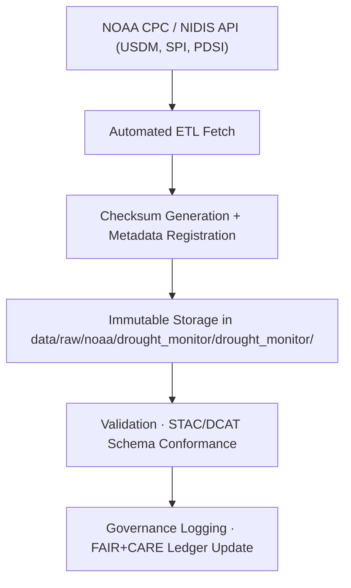

<div align="center">

# 🌵 Kansas Frontier Matrix — **NOAA Drought Monitor Archive**  
`data/raw/noaa/drought_monitor/drought_monitor/README.md`

**Purpose:** Preserves **weekly drought monitoring datasets** from the **NOAA Climate Prediction Center (CPC)** and the **U.S. Drought Monitor (USDM)**.  
These datasets form the backbone for KFM’s hydrologic drought, agricultural risk, and environmental resilience modeling — managed under **FAIR+CARE Diamond⁹ Ω** data governance.

[](https://www.drought.gov/)
[](../../../../../../docs/standards/faircare-validation.md)
[](../../../../../../LICENSE)
[](../../../../../../docs/architecture/repo-focus.md)

</div>

---

## 📚 Overview

This subdirectory stores **NOAA and USDM drought index datasets**, including:
- 🌡️ **Standardized Precipitation Index (SPI)**  
- 🌾 **Palmer Drought Severity Index (PDSI)**  
- 🌍 **U.S. Drought Monitor (USDM)**  

Each dataset is archived in its original NOAA-provided CSV format, accompanied by metadata documenting provenance, license, and checksum validation.  
These datasets support climate analytics, Focus Mode drought reasoning, and hydrological research.

---

## 🗂️ Directory Layout

```plaintext
data/raw/noaa/drought_monitor/drought_monitor/
├── README.md                           # This file — drought dataset overview
│
├── drought_monitor_kansas_2025.csv     # USDM drought severity classification (Kansas)
├── spi_index_kansas_2025.csv           # Standardized Precipitation Index
├── pdsi_index_kansas_2025.csv          # Palmer Drought Severity Index
├── metadata.json                       # Metadata for drought datasets
└── license.txt                         # Public Domain / NOAA license declaration
```

---

## ⚙️ Data Source & Provenance

| Dataset | NOAA Division | URL | License |
|----------|----------------|-----|----------|
| **USDM Weekly Drought Data** | NIDIS / CPC | [https://www.drought.gov/](https://www.drought.gov/) | Public Domain |
| **PDSI (Palmer Drought Severity Index)** | CPC | [https://www.cpc.ncep.noaa.gov/](https://www.cpc.ncep.noaa.gov/) | Public Domain |
| **SPI (Standardized Precipitation Index)** | CPC | [https://www.cpc.ncep.noaa.gov/](https://www.cpc.ncep.noaa.gov/) | Public Domain |

Each dataset is fetched weekly or monthly through NOAA’s REST API and stored immutably within this archive.

---

## 🧩 Example Metadata File

```json
{
  "id": "noaa_drought_monitor_2025",
  "title": "NOAA U.S. Drought Monitor (Kansas, 2025)",
  "description": "Weekly drought severity data (D0–D4) for Kansas counties, published by NOAA and NIDIS.",
  "provider": "NOAA CPC / NIDIS / USDM",
  "license": "Public Domain",
  "source_urls": [
    "https://www.drought.gov/",
    "https://www.cpc.ncep.noaa.gov/"
  ],
  "spatial_extent": [-102.05, 36.99, -94.61, 40.00],
  "temporal_extent": ["2000-01-01", "2025-12-31"],
  "format": "CSV",
  "keywords": ["drought", "USDM", "Kansas", "climate", "SPI", "PDSI"],
  "checksum": "sha256:fa02d9b7d3b11d4cc8a7e6b5f92d4aaf34f7b18302ce5b46f7d2a5f0ac178d20",
  "governance_ref": "docs/standards/governance/DATA-GOVERNANCE.md"
}
```

---

## 🔍 FAIR+CARE Governance Workflow



### Process Overview:
1. **Ingestion:** NOAA drought datasets fetched automatically from CPC/NIDIS endpoints.  
2. **Metadata:** Created and validated using KFM ETL metadata tools.  
3. **Checksum:** Recorded in `releases/v9.5.1/manifest.zip` for data integrity.  
4. **Validation:** Performed via STAC/DCAT schema validators and FAIR+CARE audit.  
5. **Governance:** Logged in `reports/audit/data_provenance_ledger.json`.

---

## ⚖️ Licensing & Attribution

| Source | License | Notes |
|---------|----------|-------|
| **NOAA CPC / NIDIS / USDM** | Public Domain | Free for research and educational reuse. |

> Attribution is encouraged:  
> *“Data provided by the National Oceanic and Atmospheric Administration (NOAA) and U.S. Drought Monitor (USDM).”*

---

## 🧠 FAIR+CARE Implementation

| Principle | Implementation |
|------------|----------------|
| **Findable** | Indexed in STAC/DCAT catalogs and searchable by Focus Mode. |
| **Accessible** | Openly accessible CSV data from NOAA public APIs. |
| **Interoperable** | Schema aligns with STAC 1.0, DCAT 3.0, ISO 19115 standards. |
| **Reusable** | Metadata includes license, checksum, and provenance. |
| **Collective Benefit** | Enables water resource planning and drought response. |
| **Authority to Control** | NOAA/USDM acknowledged as original stewards. |
| **Responsibility** | Data validated for accuracy, governance logs maintained. |
| **Ethics** | Public-domain data with ethical FAIR+CARE compliance. |

---

## 🔍 Dataset Fields (USDM Example)

| Field | Description | Example |
|--------|--------------|----------|
| `valid_date` | Observation date | `2025-10-15` |
| `state` | U.S. state code | `KS` |
| `county` | County name | `Reno` |
| `d0_percent_area` | Abnormally Dry area (%) | `12.3` |
| `d1_percent_area` | Moderate Drought area (%) | `6.7` |
| `d2_percent_area` | Severe Drought area (%) | `1.4` |
| `d3_percent_area` | Extreme Drought area (%) | `0.0` |
| `d4_percent_area` | Exceptional Drought area (%) | `0.0` |

---

## 🧩 Governance & Provenance Artifacts

| File | Purpose |
|------|----------|
| `metadata.json` | Describes dataset lineage and license metadata. |
| `license.txt` | NOAA/USDM public domain declaration. |
| `../../../../../../releases/v9.5.1/manifest.zip` | Dataset checksum registry. |
| `../../../../../../reports/audit/data_provenance_ledger.json` | Governance and provenance ledger. |
| `../../../../../../reports/validation/stac_validation_report.json` | Validation log and audit output. |

---

## 🧾 Citation

```text
Kansas Frontier Matrix (2025). NOAA Drought Monitor Archive (v9.5.1).
Includes NOAA CPC SPI, PDSI, and USDM drought indices for Kansas.
Preserved under FAIR+CARE governance within the Kansas Frontier Matrix (KFM).
Available at: https://github.com/bartytime4life/Kansas-Frontier-Matrix/tree/main/data/raw/noaa/drought_monitor/drought_monitor  
License: Public Domain (U.S. Government Works)
```

---

<div align="center">

**Kansas Frontier Matrix** · *NOAA Drought Monitor × FAIR+CARE Governance × Climate Resilience Data*  
[🔗 Repository](https://github.com/bartytime4life/Kansas-Frontier-Matrix) • [🧭 Docs Portal](../../../../../../docs/) • [⚖️ Governance Ledger](../../../../../../docs/standards/governance/)

</div>

