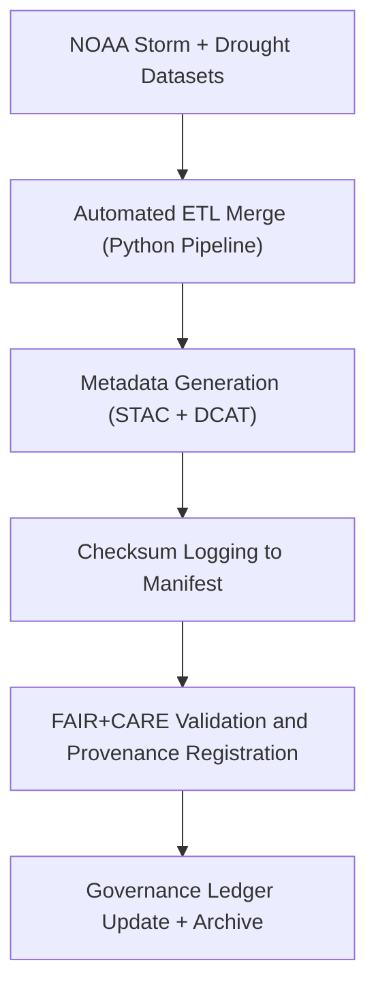

<div align="center">

# ⛈️ Kansas Frontier Matrix — **NOAA Storm Events (Drought & Severe Weather Integration Archive)**  
`data/raw/noaa/drought_monitor/storm_events/README.md`

**Purpose:** Integrates NOAA **Storm Events Database** and **Drought Monitor** datasets to analyze severe weather–drought interactions across Kansas.  
These datasets serve as the **primary source for hazard impact modeling**, AI-driven Focus Mode reasoning, and long-term resilience research under **FAIR+CARE Diamond⁹ Ω governance**.

[](https://www.ncdc.noaa.gov/stormevents/)
[](../../../../../docs/standards/faircare-validation.md)
[](../../../../../LICENSE)
[](../../../../../docs/architecture/repo-focus.md)

</div>

---

## 📚 Overview

This directory contains **integrated NOAA datasets** combining drought severity metrics and severe storm events for Kansas.  
It links **short-term weather impacts (storms, floods, hail, tornadoes)** with **long-term drought conditions (USDM, SPI, PDSI)** to enable spatiotemporal hazard correlation analysis.

**Applications include:**
- 🧩 Temporal correlation of drought and storm occurrence.  
- 🧠 Focus Mode AI event-chain inference (e.g., drought → flood → soil instability).  
- 🌾 Agricultural risk modeling and drought recovery forecasting.  
- ⚙️ FAIR+CARE audit of climate-driven hazard response metadata.

---

## 🗂️ Directory Layout

```plaintext
data/raw/noaa/drought_monitor/storm_events/
├── README.md                           # This file — overview of drought + storm integration data
│
├── storm_drought_combined_2025.csv     # Integrated dataset combining drought and storm indices
├── storm_events_kansas_2025.csv        # Original NOAA storm event log
├── drought_monitor_kansas_2025.csv     # Original NOAA drought data (SPI, PDSI, USDM)
├── metadata.json                       # Combined metadata record
└── license.txt                         # Public Domain declaration
```

---

## ⚙️ Data Source & Provenance

| Dataset | NOAA Division | URL | License |
|----------|----------------|-----|----------|
| **Storm Events Database** | NCEI | [https://www.ncdc.noaa.gov/stormevents/](https://www.ncdc.noaa.gov/stormevents/) | Public Domain |
| **Drought Monitor (USDM)** | CPC / NIDIS | [https://www.drought.gov/](https://www.drought.gov/) | Public Domain |
| **Climate Prediction Center (SPI, PDSI)** | CPC | [https://www.cpc.ncep.noaa.gov/](https://www.cpc.ncep.noaa.gov/) | Public Domain |

Data are ingested automatically from NOAA endpoints, validated for completeness, and preserved as CSV in immutable raw form.

---

## 🧩 Example Metadata Record

```json
{
  "id": "noaa_storm_drought_combined_2025",
  "title": "NOAA Drought–Storm Integrated Dataset (Kansas, 2025)",
  "description": "Combined NOAA datasets linking weekly drought severity indices with storm event occurrences in Kansas.",
  "provider": "NOAA NCEI / CPC / NIDIS",
  "license": "Public Domain",
  "source_urls": [
    "https://www.ncdc.noaa.gov/stormevents/",
    "https://www.drought.gov/",
    "https://www.cpc.ncep.noaa.gov/"
  ],
  "spatial_extent": [-102.05, 36.99, -94.61, 40.00],
  "temporal_extent": ["1950-01-01", "2025-12-31"],
  "format": "CSV",
  "keywords": ["NOAA", "Kansas", "Drought", "Storm Events", "Hazards", "Climate"],
  "checksum": "sha256:a4cfb8a62e4d1bfa93b2f0e01e87d9bcdedfd1b1d0f1a7e7e3e22b7a2bdb0fa1",
  "governance_ref": "docs/standards/governance/DATA-GOVERNANCE.md"
}
```

---

## 🔍 FAIR+CARE Governance Workflow



**Workflow Details:**
1. **Acquisition:** Storm and drought datasets fetched weekly from NOAA NCEI/CPC/NIDIS APIs.  
2. **Integration:** Combined using temporal alignment (by week, county, and event type).  
3. **Metadata:** Generated automatically and validated under STAC/DCAT schemas.  
4. **Checksum:** Recorded in `releases/v9.5.1/manifest.zip`.  
5. **Governance:** Logged to provenance ledger and FAIR+CARE audit reports.

---

## ⚖️ Licensing & Attribution

| Source | License | Notes |
|---------|----------|--------|
| **NOAA NCEI / CPC / NIDIS** | Public Domain (U.S. Government Works) | Free for research, education, and public use. |

> Attribution is recommended when using derived data:  
> *“Data provided by the National Oceanic and Atmospheric Administration (NOAA). Integrated by Kansas Frontier Matrix (KFM) under FAIR+CARE governance.”*

---

## 🧠 FAIR+CARE Compliance

| Principle | Implementation |
|------------|----------------|
| **Findable** | Indexed in STAC/DCAT catalogs and searchable through Focus Mode. |
| **Accessible** | Stored in open CSV format; accessible via NOAA endpoints. |
| **Interoperable** | Harmonized schema aligns STAC 1.0 + DCAT 3.0 for temporal linkage. |
| **Reusable** | Includes license, checksum, provenance, and integration logic. |
| **Collective Benefit** | Enables hazard co-occurrence analysis for community resilience planning. |
| **Authority to Control** | NOAA retained as authoritative data steward. |
| **Responsibility** | All processing follows NOAA metadata integrity guidelines. |
| **Ethics** | Contains no private/sensitive data; promotes public safety and knowledge. |

Audit records:
- `data/reports/audit/data_provenance_ledger.json`  
- `data/reports/fair/data_fair_summary.json`

---

## 🔍 Example Combined Schema

| Field | Description | Example |
|--------|--------------|----------|
| `event_id` | NOAA storm event ID | `125987` |
| `event_type` | Type of weather event | `Tornado` |
| `event_date` | Event date | `2025-06-15` |
| `county` | County affected | `Sedgwick` |
| `drought_index_spi` | Standardized Precipitation Index | `-2.1` |
| `drought_category_usdm` | USDM drought category | `D2 (Severe Drought)` |
| `pdsi` | Palmer Drought Severity Index | `-3.5` |

---

## 🧩 Governance & Provenance Artifacts

| File | Purpose |
|------|----------|
| `metadata.json` | Metadata describing integrated dataset provenance. |
| `license.txt` | NOAA public domain declaration. |
| `../../../../../releases/v9.5.1/manifest.zip` | Manifest of dataset checksums. |
| `../../../../../reports/audit/data_provenance_ledger.json` | Provenance ledger of merged datasets. |
| `../../../../../reports/validation/stac_validation_report.json` | Validation log for metadata structure. |

---

## 🧾 Citation

```text
Kansas Frontier Matrix (2025). NOAA Drought–Storm Integrated Dataset (v9.5.1).
Combined NOAA NCEI storm events and CPC/NIDIS drought data under FAIR+CARE governance.
Available at: https://github.com/bartytime4life/Kansas-Frontier-Matrix/tree/main/data/raw/noaa/drought_monitor/storm_events  
License: Public Domain (U.S. Government Works)
```

---

<div align="center">

**Kansas Frontier Matrix** · *NOAA Storm + Drought Integration × FAIR+CARE Data Ethics × Climate Hazard Science*  
[🔗 Repository](https://github.com/bartytime4life/Kansas-Frontier-Matrix) • [🧭 Docs Portal](../../../../../docs/) • [⚖️ Governance Ledger](../../../../../docs/standards/governance/)

</div>

