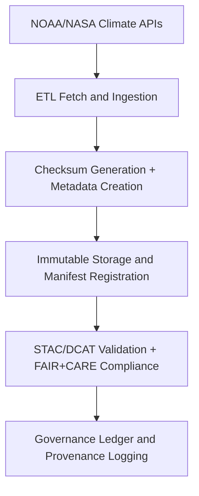

<div align="center">

# 🌡️ Kansas Frontier Matrix — **NOAA Temperature Anomalies Archive**  
`data/raw/noaa/drought_monitor/temperature_anomalies/README.md`

**Purpose:** Archives **historical and near-real-time temperature anomaly datasets** from the **National Oceanic and Atmospheric Administration (NOAA)** and partner agencies (NCEI, CPC, NASA GISS).  
These unmodified datasets represent the empirical foundation for KFM’s climate monitoring, anomaly analysis, and AI-driven environmental modeling workflows.

[](https://www.ncei.noaa.gov/)
[](../../../../../../docs/standards/faircare-validation.md)
[](../../../../../../LICENSE)
[](../../../../../../docs/architecture/repo-focus.md)

</div>

---

## 📚 Overview

This directory houses **NOAA temperature anomaly data** for the state of Kansas and surrounding regions.  
It includes monthly, seasonal, and annual mean anomalies in surface temperature relative to 20th-century climatological baselines.  
These datasets are central to **KFM’s Focus Mode** for long-term climate trend analysis, drought correlation, and hazard forecasting.

---

## 🗂️ Directory Layout

```plaintext
data/raw/noaa/drought_monitor/temperature_anomalies/
├── README.md                              # This file — NOAA temperature anomaly data overview
│
├── kansas_temp_anomalies_2025.csv         # Statewide temperature anomalies
├── regional_temp_anomalies_1900_2025.csv  # Extended historical records (1900–2025)
├── global_baseline_anomalies.csv          # Global reference dataset for anomaly normalization
├── metadata.json                          # STAC/DCAT metadata for datasets
└── license.txt                            # NOAA Public Domain declaration
```

---

## ⚙️ Data Source & Provenance

| Dataset | Provider | URL | License |
|----------|-----------|-----|----------|
| **Kansas Temperature Anomalies (NCEI)** | NOAA NCEI | [https://www.ncei.noaa.gov/](https://www.ncei.noaa.gov/) | Public Domain |
| **CPC Climate Monitoring Data** | NOAA CPC | [https://www.cpc.ncep.noaa.gov/](https://www.cpc.ncep.noaa.gov/) | Public Domain |
| **Global Surface Temperature Analysis (GISTEMP v4)** | NASA GISS | [https://data.giss.nasa.gov/gistemp/](https://data.giss.nasa.gov/gistemp/) | Public Domain |

Data are obtained automatically via REST APIs, validated for completeness, and stored immutably in FAIR+CARE-compliant structure.

---

## 🧩 Example Metadata Record

```json
{
  "id": "noaa_kansas_temp_anomalies_2025",
  "title": "NOAA Kansas Temperature Anomalies (2025)",
  "description": "Monthly temperature anomalies (°C) relative to 20th-century averages for Kansas, provided by NOAA NCEI and CPC.",
  "provider": "NOAA NCEI / CPC / NASA GISS",
  "license": "Public Domain",
  "source_urls": [
    "https://www.ncei.noaa.gov/",
    "https://www.cpc.ncep.noaa.gov/",
    "https://data.giss.nasa.gov/gistemp/"
  ],
  "spatial_extent": [-102.05, 36.99, -94.61, 40.00],
  "temporal_extent": ["1900-01-01", "2025-12-31"],
  "format": "CSV",
  "checksum": "sha256:9f7a22cb58b7e231c1b34e45dbf8e1a6d3f0cb5e1271c4dbf87240b3828b913a",
  "keywords": ["temperature", "anomalies", "climate", "Kansas", "NOAA", "NCEI", "NASA GISS"],
  "governance_ref": "docs/standards/governance/DATA-GOVERNANCE.md"
}
```

---

## 🔍 FAIR+CARE Governance Workflow



### Workflow Description:
1. **Ingestion:** Automated fetch from NOAA NCEI, CPC, and NASA GISS data servers.  
2. **Metadata Creation:** STAC/DCAT metadata generated via ETL scripts.  
3. **Checksum Logging:** SHA-256 digests appended to `releases/v9.5.1/manifest.zip`.  
4. **Validation:** FAIR+CARE conformance and governance schema checks run automatically.  
5. **Governance Ledger:** Updates stored in `reports/audit/data_provenance_ledger.json`.

---

## ⚖️ Licensing & Attribution

| Source | License | Access Notes |
|---------|----------|--------------|
| **NOAA NCEI / CPC** | Public Domain | U.S. Government Works; attribution recommended. |
| **NASA GISS** | Public Domain | Attribution: “NASA GISTEMP v4 Dataset.” |

> Attribution example:  
> *“Data provided by NOAA National Centers for Environmental Information (NCEI) and NASA Goddard Institute for Space Studies (GISS).”*

---

## 🧠 FAIR+CARE Implementation

| Principle | Implementation |
|------------|----------------|
| **Findable** | Indexed under STAC/DCAT and Focus Mode’s temporal graph. |
| **Accessible** | Published as open CSV files and accessible via NOAA endpoints. |
| **Interoperable** | Metadata harmonized under STAC 1.0 and DCAT 3.0 schemas. |
| **Reusable** | Each dataset includes license, checksum, and provenance. |
| **Collective Benefit** | Supports climate risk analysis and educational research. |
| **Authority to Control** | NOAA and NASA recognized as official data stewards. |
| **Responsibility** | Datasets validated for integrity and metadata completeness. |
| **Ethics** | Publicly available climate data; no privacy-sensitive information. |

Audit records:  
- `data/reports/audit/data_provenance_ledger.json`  
- `data/reports/fair/data_fair_summary.json`

---

## 🔍 Example Data Schema (Temperature Anomalies CSV)

| Field | Description | Example |
|--------|--------------|----------|
| `year` | Year of observation | `2025` |
| `month` | Month of observation | `07` |
| `temp_anomaly_c` | Temperature anomaly in °C | `+1.3` |
| `station_id` | NOAA station identifier | `USC00147892` |
| `county` | County name | `Douglas` |
| `source` | Data source (NCEI/CPC/GISS) | `NCEI` |

---

## 🧾 Governance & Provenance Artifacts

| File | Purpose |
|------|----------|
| `metadata.json` | Metadata describing dataset lineage and schema. |
| `license.txt` | NOAA/NASA public domain license. |
| `../../../../../../releases/v9.5.1/manifest.zip` | Global checksum registry. |
| `../../../../../../reports/audit/data_provenance_ledger.json` | Governance and ethics ledger. |
| `../../../../../../reports/validation/stac_validation_report.json` | Metadata validation results. |

---

## 🧾 Citation

```text
Kansas Frontier Matrix (2025). NOAA Temperature Anomalies Archive (v9.5.1).
Includes NOAA NCEI, CPC, and NASA GISS temperature anomaly datasets for Kansas and global reference.
Curated under FAIR+CARE governance by the Kansas Frontier Matrix (KFM).
Available at: https://github.com/bartytime4life/Kansas-Frontier-Matrix/tree/main/data/raw/noaa/drought_monitor/temperature_anomalies  
License: Public Domain (U.S. Government Works)
```

---

<div align="center">

**Kansas Frontier Matrix** · *NOAA Temperature Anomalies × FAIR+CARE Climate Science × Provenance Integrity*  
[🔗 Repository](https://github.com/bartytime4life/Kansas-Frontier-Matrix) • [🧭 Docs Portal](../../../../../../docs/) • [⚖️ Governance Ledger](../../../../../../docs/standards/governance/)

</div>
