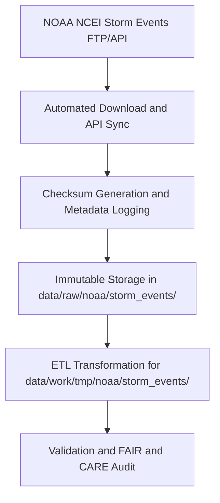

<div align="center">

# 🌩️ Kansas Frontier Matrix — **NOAA Storm Events**
`data/raw/noaa/storm_events/README.md`

**Purpose:** Contains unaltered records from the **NOAA Storm Events Database**, documenting severe weather events—tornadoes, floods, hail, and windstorms—affecting Kansas.  
Serves as the primary raw dataset for hazard modeling, validation, and FAIR+CARE-aligned disaster trend analysis within the Kansas Frontier Matrix (KFM).

[](https://www.ncdc.noaa.gov/stormevents/)
[](../../../../docs/standards/faircare-validation.md)
[](../../../../LICENSE)
[](../../../../docs/architecture/repo-focus.md)

</div>

---

## 📚 Overview

The `data/raw/noaa/storm_events/` directory stores **raw CSV exports** from NOAA’s **National Centers for Environmental Information (NCEI)** Storm Events Database.  
This collection includes detailed records of severe weather events that occurred in Kansas from 1950 to 2025, including metadata on fatalities, property damage, and spatial boundaries.

Each dataset:
- Is downloaded directly from NOAA’s public FTP or API endpoint.  
- Preserves original column names and schema for reproducibility.  
- Includes metadata with provenance, temporal coverage, and checksum.  
- Serves as input for hazard ETL pipelines and FAIR+CARE validation workflows.

---

## 🗂️ Directory Layout

```plaintext
data/raw/noaa/storm_events/
├── README.md                        # This file — documentation of storm events data
│
├── storm_events_2025.csv             # NOAA NCEI storm event records for Kansas
├── metadata.json                     # Dataset metadata and provenance info
└── license.txt                       # NOAA public domain license
```

---

## ⚙️ Data Ingestion Workflow



### Description:
1. Data pulled automatically from NCEI’s FTP or REST API (monthly sync).  
2. Metadata recorded with temporal range, spatial bounds, and source reference.  
3. Checksum created for file integrity verification.  
4. Stored unmodified; ETL pipelines apply transformations in temporary workspace.  

---

## 🧩 Example Metadata Record

```json
{
  "id": "noaa_storm_events_2025",
  "title": "NOAA Storm Events Database - Kansas",
  "description": "Raw NOAA dataset of tornadoes, floods, hail, and severe wind events in Kansas (1950–2025).",
  "source_url": "https://www.ncdc.noaa.gov/stormevents/",
  "provider": "National Centers for Environmental Information (NCEI), NOAA",
  "license": "Public Domain",
  "checksum": "sha256:3a9b2e8c7e0415b4f12adf96536a8d9c7e50a74a...",
  "spatial_extent": [-102.05, 36.99, -94.61, 40.00],
  "temporal_extent": ["1950-01-01", "2025-12-31"],
  "record_count": 195432
}
```

---

## 🌪️ Dataset Schema (Excerpt)

| Column | Description | Example |
|---------|--------------|----------|
| `BEGIN_DATE_TIME` | Start date/time of event | `2025-05-21 14:45:00` |
| `END_DATE_TIME` | End date/time of event | `2025-05-21 15:30:00` |
| `STATE` | U.S. state name | `KANSAS` |
| `CZ_NAME` | County or zone name | `Johnson` |
| `EVENT_TYPE` | Type of event | `Tornado` |
| `INJURIES_DIRECT` | Number of direct injuries | `2` |
| `DEATHS_DIRECT` | Number of direct fatalities | `0` |
| `DAMAGE_PROPERTY` | Estimated property damage | `$1.5M` |
| `SOURCE` | Primary data source | `NWS` |

---

## ⚖️ Licensing & Attribution

```
NOAA NCEI Storm Events Database
Public Domain Data under U.S. Federal Law.
Users may use, copy, and distribute these data freely with appropriate attribution.
Source: National Oceanic and Atmospheric Administration (NOAA)
```

**Recommended Citation**
```text
National Centers for Environmental Information (NCEI), NOAA.
“Storm Events Database - Kansas.” Accessed 2025-10-28. Public Domain.
```

---

## 🧠 FAIR+CARE Compliance Overview

| Principle | Implementation |
|------------|----------------|
| **Findable** | Indexed in STAC and manifest with unique dataset ID. |
| **Accessible** | Stored in open CSV format and publicly accessible. |
| **Interoperable** | Schema mapped to STAC/DCAT 3.0-compatible metadata. |
| **Reusable** | Includes metadata, license, and checksum validation. |
| **Collective Benefit** | Enables research in public safety, resilience, and hazard forecasting. |
| **Authority to Control** | NOAA as primary data steward; attribution preserved. |
| **Responsibility** | Pipeline verifies accuracy and temporal completeness. |
| **Ethics** | No private or restricted data; supports open science principles. |

FAIR+CARE audit references:  
`data/reports/fair/data_fair_summary.json`  
`data/reports/audit/data_provenance_ledger.json`

---

## 🔍 Governance Integration

| Record | Description |
|---------|-------------|
| `metadata.json` | Describes dataset provenance, checksum, and schema. |
| `data/reports/audit/data_provenance_ledger.json` | Logs ingestion and governance metadata. |
| `data/reports/validation/stac_validation_report.json` | Confirms schema and metadata validity. |
| `releases/v9.3.2/manifest.zip` | Contains global checksum record. |

---

## 🧾 Citation (KFM Context)

```text
Kansas Frontier Matrix (2025). NOAA Storm Events Database (v9.3.2).
Raw unaltered severe weather event data from NOAA NCEI, spanning 1950–2025.
Available at: https://github.com/bartytime4life/Kansas-Frontier-Matrix/tree/main/data/raw/noaa/storm_events
License: Public Domain (U.S. Federal Data)
```

---

## 🧾 Version Notes

| Version | Date | Notes |
|----------|------|--------|
| v9.3.2 | 2025-10-28 | Updated 2025 storm events; verified schema and checksum. |
| v9.2.0 | 2024-07-10 | Added automation for monthly NOAA FTP sync. |
| v9.0.0 | 2023-01-15 | Established raw data ingestion for NOAA Storm Events Database. |

---

<div align="center">

**Kansas Frontier Matrix** · *Hazard Science × FAIR+CARE Stewardship × Open Meteorological Data*  
[🔗 Repository](https://github.com/bartytime4life/Kansas-Frontier-Matrix) • [🧭 Docs Portal](../../../../docs/) • [⚖️ Governance Ledger](../../../../docs/standards/governance/)

</div>
