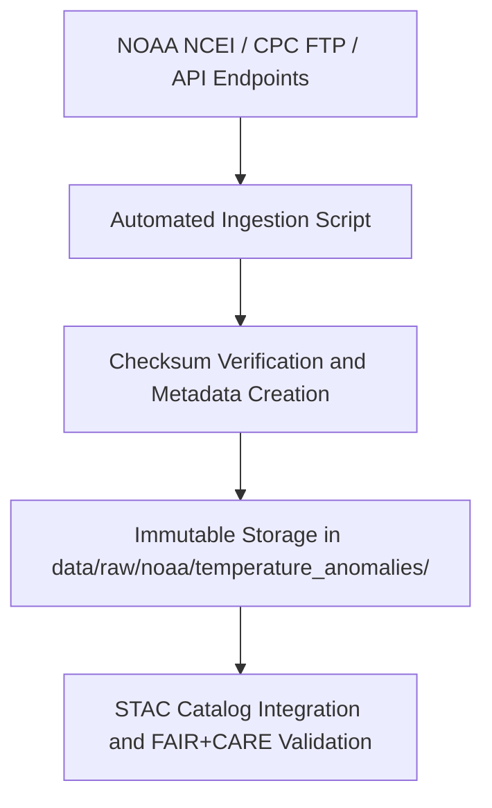

<div align="center">

# 🌡️ Kansas Frontier Matrix — **NOAA Temperature Anomalies**
`data/raw/noaa/temperature_anomalies/README.md`

**Purpose:** Contains unaltered NOAA temperature anomaly datasets representing long-term deviations from climatological averages across Kansas.  
These data form the foundation for temperature trend analysis, Focus Mode AI climate reasoning, and FAIR+CARE-compliant environmental stewardship within the Kansas Frontier Matrix (KFM).

[](https://www.ncei.noaa.gov/)
[](../../../../docs/standards/faircare-validation.md)
[](../../../../LICENSE)
[](../../../../docs/architecture/repo-focus.md)

</div>

---

## 📚 Overview

The `data/raw/noaa/temperature_anomalies/` directory stores **climate anomaly datasets** published by NOAA’s National Centers for Environmental Information (NCEI) and Climate Prediction Center (CPC).  
These files capture deviations from the 1901–2000 climatological baseline for mean temperature, precipitation, and extreme temperature indices across Kansas.

All datasets are:
- Downloaded directly from NOAA or NCEI open FTP repositories.  
- Stored in open CSV format with metadata and checksums.  
- Immutable — no modification occurs post-ingestion.  
- Governed under FAIR+CARE frameworks for reproducibility and ethical transparency.

---

## 🗂️ Directory Layout

```plaintext
data/raw/noaa/temperature_anomalies/
├── README.md                             # This file — documentation for temperature anomaly datasets
│
├── kansas_temp_anomalies_2025.csv        # NOAA NCEI temperature anomaly dataset (1900–2025)
├── metadata.json                         # Provenance and schema information
└── license.txt                           # NOAA public domain license
```

---

## ⚙️ Data Ingestion Workflow



### Workflow Steps:
1. Datasets retrieved from NOAA NCEI’s Climate Monitoring repositories.  
2. Metadata logged with provenance, temporal range, and CRS information.  
3. Checksums generated to ensure data integrity and tracked in manifest.  
4. Files stored as-is, preserving NOAA’s native CSV formatting and field structure.  
5. FAIR+CARE review ensures openness, provenance, and ethical data use.

---

## 🧩 Example Metadata Record

```json
{
  "id": "noaa_temperature_anomalies_2025",
  "title": "NOAA Kansas Temperature Anomalies (1900–2025)",
  "description": "Monthly mean temperature anomalies for Kansas, relative to the 1901–2000 climatological average.",
  "source_url": "https://www.ncei.noaa.gov/access/monitoring/climate-at-a-glance/statewide/time-series/",
  "provider": "NOAA National Centers for Environmental Information (NCEI)",
  "license": "Public Domain",
  "checksum": "sha256:9ac5e4e12f3c89a7bda0c4b8b9f25d4e1a63b7d2...",
  "spatial_extent": [-102.05, 36.99, -94.61, 40.00],
  "temporal_extent": ["1900-01-01", "2025-12-31"],
  "record_count": 1500
}
```

---

## 🌍 Dataset Schema (Excerpt)

| Column | Description | Example |
|---------|--------------|----------|
| `date` | Month and year of record | `2025-07` |
| `state` | State abbreviation | `KS` |
| `mean_temp_anomaly_c` | Mean temperature anomaly in °C | `+1.54` |
| `max_temp_anomaly_c` | Maximum temperature anomaly in °C | `+2.13` |
| `min_temp_anomaly_c` | Minimum temperature anomaly in °C | `+0.89` |
| `precip_anomaly_mm` | Precipitation anomaly in millimeters | `-12.5` |
| `data_quality_flag` | NOAA QC indicator | `A` |

---

## ⚖️ Licensing & Attribution

```
NOAA Climate Data
Public Domain Data under U.S. Federal Law.
Users may use, copy, and distribute freely, provided appropriate citation.
Source: National Oceanic and Atmospheric Administration (NOAA)
```

**Recommended Citation**
```text
National Centers for Environmental Information (NCEI), NOAA.
“Statewide Temperature and Precipitation Anomalies - Kansas.” Accessed 2025-10-28. Public Domain.
```

---

## 🧠 FAIR+CARE Compliance Overview

| Principle | Implementation |
|------------|----------------|
| **Findable** | Indexed via STAC metadata and manifest with unique ID. |
| **Accessible** | Available in open CSV format; public domain licensing. |
| **Interoperable** | Metadata schema adheres to STAC/DCAT 3.0 specifications. |
| **Reusable** | Provenance and license fields ensure transparency. |
| **Collective Benefit** | Supports climate resilience and policy development. |
| **Authority to Control** | NOAA recognized as data authority and steward. |
| **Responsibility** | Data validated for temporal continuity and metadata accuracy. |
| **Ethics** | Data free of sensitive or personal content; ethically neutral. |

Audit results stored in:  
`data/reports/fair/data_fair_summary.json` and `data/reports/audit/data_provenance_ledger.json`.

---

## 🔍 Governance Integration

| Record | Description |
|---------|-------------|
| `metadata.json` | Contains provenance, license, checksum, and temporal range. |
| `data/reports/audit/data_provenance_ledger.json` | Records ingestion and governance actions. |
| `data/reports/validation/stac_validation_report.json` | STAC schema validation outcomes. |
| `releases/v9.3.2/manifest.zip` | Global checksum verification registry. |

---

## 🧾 Citation (KFM Context)

```text
Kansas Frontier Matrix (2025). NOAA Temperature Anomalies (v9.3.2).
Unaltered NOAA NCEI dataset of statewide temperature and precipitation anomalies for Kansas (1900–2025).
Available at: https://github.com/bartytime4life/Kansas-Frontier-Matrix/tree/main/data/raw/noaa/temperature_anomalies
License: Public Domain (U.S. Federal Data)
```

---

## 🧾 Version Notes

| Version | Date | Notes |
|----------|------|--------|
| v9.3.2 | 2025-10-28 | Added 2025 anomaly records; verified FAIR+CARE metadata schema. |
| v9.2.0 | 2024-07-10 | Updated 2024 anomaly data and schema alignment. |
| v9.0.0 | 2023-01-15 | Established temperature anomaly ingestion process for NOAA datasets. |

---

<div align="center">

**Kansas Frontier Matrix** · *Climate Science × FAIR+CARE Stewardship × Provenance Integrity*  
[🔗 Repository](https://github.com/bartytime4life/Kansas-Frontier-Matrix) • [🧭 Docs Portal](../../../../docs/) • [⚖️ Governance Ledger](../../../../docs/standards/governance/)

</div>