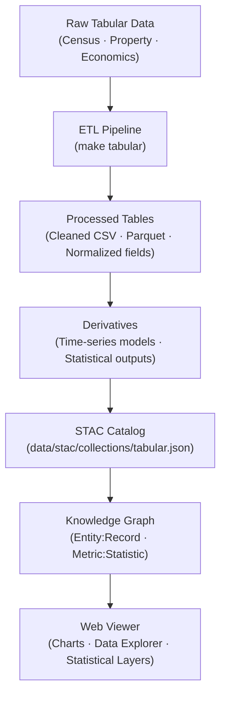

<div align="center">

# 📊 Kansas Frontier Matrix — Raw Tabular Data  
`data/raw/tabular/`

### **Statistics · Records · Provenance**  
*Immutable tabular datasets forming the quantitative backbone of the Kansas Frontier Matrix.*

[](../../../.github/workflows/site.yml)  
[](../../../.github/workflows/stac-validate.yml)  
[](../../../.github/workflows/codeql.yml)  
[](../../../.github/workflows/trivy.yml)  
[](../../../docs/)  
[](../../../LICENSE)

</div>

---

## 📘 Overview

The `data/raw/tabular/` directory contains **original, unaltered tabular datasets**  
representing Kansas’s statistical, demographic, and administrative records.  

These datasets serve as **primary quantitative evidence** supporting spatial and temporal analyses  
within the Kansas Frontier Matrix (KFM).  

All files in this directory are:
- 🧾 **Immutable** — no modification or cleaning  
- 🔗 **Traceable** — linked to official source manifests  
- 🧮 **Verifiable** — include `.sha256` checksum files  
- 📚 **Documented** — with structured metadata in `metadata/`  

---

## 🗂️ Directory Layout

```bash
data/raw/tabular/
├── census_population_2020.csv
├── kansas_property_records_1975_2020.csv
├── economic_indicators_kansas.xlsx
├── metadata/
│   ├── census_population_2020.json
│   ├── kansas_property_records_1975_2020.json
│   └── economic_indicators_kansas.json
├── checksums/
│   ├── census_population_2020.csv.sha256
│   ├── kansas_property_records_1975_2020.csv.sha256
│   └── economic_indicators_kansas.xlsx.sha256
└── README.md
````

---

## 🧾 Data Sources & Provenance

| Dataset                                 | Provider                     | Format | Temporal Range | License       | STAC ID                              |
| --------------------------------------- | ---------------------------- | ------ | -------------- | ------------- | ------------------------------------ |
| **Census Population (2020)**            | U.S. Census Bureau           | CSV    | 2020           | Public Domain | `tabular_census_population_2020`     |
| **Kansas Property Records (1975–2020)** | Kansas Department of Revenue | CSV    | 1975–2020      | CC-BY 4.0     | `tabular_property_records_1975_2020` |
| **Economic Indicators (Statewide)**     | Bureau of Economic Analysis  | XLSX   | 2000–2024      | Public Domain | `tabular_economic_indicators_kansas` |

Each source is listed in [`data/sources/*.json`](../../../data/sources/)
and validated against STAC Items in [`data/stac/items/`](../../../data/stac/items/).

---

## 🔗 Connections

| Layer               | Upstream                        | Downstream                    | Purpose                        |
| ------------------- | ------------------------------- | ----------------------------- | ------------------------------ |
| Census 2020         | `data/sources/census.json`      | `data/processed/tabular/`     | Demographic statistics         |
| Property Records    | `data/sources/ks_property.json` | `data/derivatives/economics/` | Economic + spatial correlation |
| Economic Indicators | `data/sources/bea.json`         | `data/processed/tabular/`     | Time-series macroeconomic data |

---

## 🧭 Data Lineage Diagram



---

## 🧪 Reproducibility

```bash
# Fetch source tabular data
make fetch TABULAR=all

# Verify integrity of raw files
sha256sum -c checksums/*.sha256

# Validate metadata schema
make validate-metadata TYPE=tabular

# Build STAC records
make stac TABULAR=1
```

Outputs populate:

* `data/processed/tabular/`
* `data/derivatives/tabular/`
* `data/stac/collections/tabular.json`

---

## 🧾 Dataset Card

**Title:** Census Population (Kansas, 2020)
**Source:** [U.S. Census Bureau](https://www.census.gov/)
**Time:** 2020
**Space:** Kansas statewide
**Files:** `census_population_2020.csv` (5 MB), `.sha256`
**STAC Item:** `data/stac/items/tabular_census_population_2020.json`
**License:** Public Domain
**Provenance:** Retrieved 2025-01-05 via Census API; verified checksum integrity.

---

## 🧱 Versioning

| Field            | Value                          |
| ---------------- | ------------------------------ |
| **Version**      | `v1.0.0`                       |
| **Status**       | Stable                         |
| **Author**       | Andy Barta                     |
| **Last Updated** | 2025-10-12                     |
| **MCP Stage**    | Documentation-First (Complete) |

---

## 🧠 AI & Knowledge Integration

* **Entity Linking:** Tabular datasets supply structured entities `(Person, Place, Event)` for NLP correlation.
* **Graph Integration:** Data represented in Neo4j as `(Record:Statistic)` linked to `(Region:Kansas)`.
* **Predictive Modeling:** Feeds time-series forecasting and socio-economic simulation models.
* **Cross-Domain Usage:** Integrates with landcover, hydrology, and climate data to quantify relationships between demographics and environment.

---

## 🧩 Validation & Compliance

| Check             | Tool             | Result     |
| ----------------- | ---------------- | ---------- |
| STAC Schema       | `stac-validator` | ✅ Passed   |
| JSON Schema       | `jsonschema`     | ✅ Valid    |
| SHA-256           | `sha256sum`      | ✅ Verified |
| MCP Documentation | Manual Review    | ✅ Complete |

---

## 🧩 Changelog

| Date           | Version  | Description                                                                                                                |
| -------------- | -------- | -------------------------------------------------------------------------------------------------------------------------- |
| **2025-10-12** | `v1.0.0` | Initial release — baseline tabular data documentation; includes lineage diagram, versioning, and reproducibility commands. |

---

## 🪪 License

All tabular datasets are released under **[CC-BY 4.0](https://creativecommons.org/licenses/by/4.0/)**
unless superseded by the original source license. Attribution is required for derivative works.

---

### ✅ Summary

This directory forms the **quantitative foundation** of the Kansas Frontier Matrix.
It preserves immutable statistical and administrative data — population, property, and economics —
as raw inputs to analytical and modeling pipelines.
Through checksum validation, metadata lineage, and STAC integration, these datasets maintain
transparent, reproducible provenance for Kansas’s socio-economic and environmental record systems.

```
