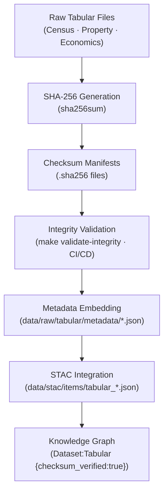

<div align="center">

# 🧾 Kansas Frontier Matrix — Raw Tabular Checksums  
`data/raw/tabular/checksums/`

### **Integrity · Authenticity · Provenance**  
*SHA-256 manifests guaranteeing data immutability and reproducibility for Kansas Frontier Matrix tabular archives.*

[](../../../../.github/workflows/site.yml)  
[](../../../../.github/workflows/stac-validate.yml)  
[](../../../../.github/workflows/codeql.yml)  
[](../../../../.github/workflows/trivy.yml)  
[](../../../../docs/)  
[](../../../../LICENSE)

</div>

---

## 📘 Overview

The `data/raw/tabular/checksums/` directory contains **SHA-256 checksum files (`.sha256`)**  
verifying the integrity of every tabular dataset under `data/raw/tabular/`.  

These manifests ensure that Kansas’s quantitative archives remain:
- 🔐 **Immutable** — no silent data alteration  
- 🔗 **Traceable** — checksums referenced in metadata & STAC items  
- ⚙️ **Automated** — verified via CI/CD and `make validate-integrity`  
- 🧾 **Auditable** — forming a reproducible provenance chain under MCP

---

## 🗂️ Directory Layout

```bash
data/raw/tabular/checksums/
├── census_population_2020.csv.sha256
├── kansas_property_records_1975_2020.csv.sha256
├── economic_indicators_kansas.xlsx.sha256
└── README.md
````

---

## 🔗 Connections

| Relation                 | Target                                | Description                        |                                       |
| ------------------------ | ------------------------------------- | ---------------------------------- | ------------------------------------- |
| **Parent Data**          | `../*.csv                             | *.xlsx`                            | Source tabular dataset being verified |
| **Metadata Record**      | `../metadata/*.json`                  | Embeds checksum reference          |                                       |
| **STAC Item**            | `data/stac/items/tabular_*.json`      | Stores checksum in asset object    |                                       |
| **CI/CD Job**            | `.github/workflows/stac-validate.yml` | Auto-verifies integrity            |                                       |
| **Knowledge Graph Node** | `(Dataset:Tabular)`                   | Attribute `checksum_verified:true` |                                       |

---

## 🧭 Integrity Validation Flow



---

## 🧪 Validation Commands

### 🔍 Manual Verification

```bash
# Check all tabular datasets
cd data/raw/tabular/
sha256sum -c checksums/*.sha256
```

### ⚙️ Automated Verification

```bash
# Run integrity target (used in CI/CD)
make validate-integrity TYPE=tabular
```

### 🧮 Example Output

```bash
$ sha256sum -c census_population_2020.csv.sha256
census_population_2020.csv: OK
```

If verification fails, the dataset must be re-downloaded from its entry in `data/sources/`.

---

## 🧾 Dataset Card

**Title:** Raw Tabular Checksums
**Scope:** SHA-256 digests for all raw tabular datasets
**Location:** `data/raw/tabular/checksums/`
**Datasets Covered:** Census 2020 · Property 1975–2020 · Economic Indicators
**Validation:** `sha256sum -c` / `make validate-integrity`
**Purpose:** Guarantee dataset authenticity and MCP provenance continuity

---

## 🧱 Versioning

| Field            | Value                          |
| ---------------- | ------------------------------ |
| **Version**      | `v1.0.0`                       |
| **Status**       | Stable                         |
| **Author**       | Andy Barta                     |
| **Last Updated** | 2025-10-12                     |
| **MCP Stage**    | Documentation-First (Complete) |

---

## 🧠 AI & Knowledge Integration

* **AI Confidence Scoring:** Checksum verification feeds model trust weights for tabular data inputs.
* **Graph Alignment:** Neo4j nodes `(Dataset:Tabular)` include `checksum_verified:true`.
* **Audit Lineage:** Allows temporal forensics for historical data changes.
* **ETL Safeguard:** Blocks non-verified files from entering processed pipelines.

---

## 🧩 Validation & Compliance

| Check             | Tool           | Result     |
| ----------------- | -------------- | ---------- |
| SHA-256 Integrity | `sha256sum`    | ✅ Verified |
| Schema Linkage    | `jsonschema`   | ✅ Valid    |
| CI/CD Workflow    | GitHub Actions | ✅ Passed   |
| MCP Documentation | Manual Review  | ✅ Complete |

---

## 🧩 Changelog

| Date           | Version  | Description                                                                                              |
| -------------- | -------- | -------------------------------------------------------------------------------------------------------- |
| **2025-10-12** | `v1.0.0` | Initial release — checksum documentation for tabular datasets with lineage diagram and validation steps. |

---

## 🪪 License

Checksum manifests are published under **[CC-BY 4.0](https://creativecommons.org/licenses/by/4.0/)**.
Original data retain their respective licenses. Attribution is required for derivative use.

---

### ✅ Summary

This directory forms the **integrity verification layer** of KFM’s tabular data architecture.
Each `.sha256` file is cryptographically bound to its source dataset and embedded in metadata and STAC items.
Together, they ensure Kansas’s statistical and economic records remain immutable, verifiable, and scientifically reproducible.

```
