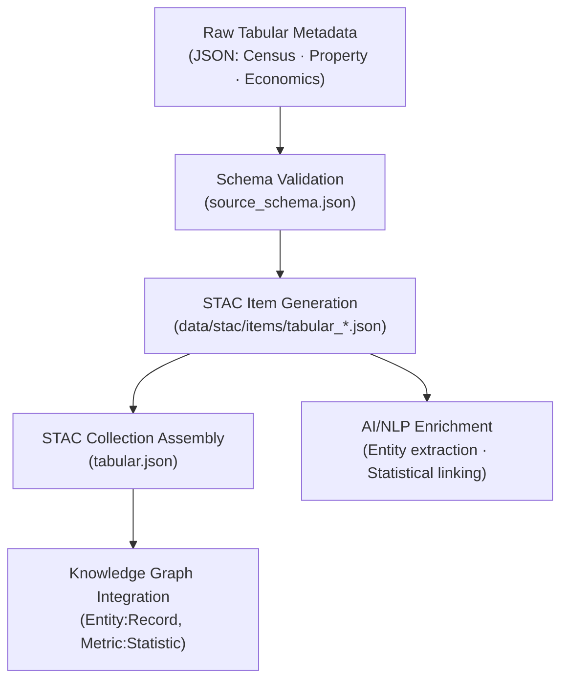

<div align="center">

# 📊 Kansas Frontier Matrix — Raw Tabular Metadata  
`data/raw/tabular/metadata/`

### **Lineage · Provenance · Validation**  
*Structured metadata defining every immutable statistical or administrative dataset within the Kansas Frontier Matrix.*

[](../../../../.github/workflows/site.yml)  
[](../../../../.github/workflows/stac-validate.yml)  
[](../../../../.github/workflows/codeql.yml)  
[](../../../../.github/workflows/trivy.yml)  
[](../../../../docs/)  
[](../../../../LICENSE)

</div>

---

## 📘 Overview

The `data/raw/tabular/metadata/` directory contains **JSON metadata files**  
that describe each **immutable tabular dataset** stored in `data/raw/tabular/`.  

These metadata files provide:
- 🔗 **Provenance and lineage tracking** — source URLs, retrieval dates, and checksum references  
- 🧾 **Schema-compliant structure** — validated against `source_schema.json`  
- 🧮 **Integration hooks** — for STAC items, checksums, and graph entities  
- 📚 **Documentation parity** — ensuring transparency and reproducibility across KFM pipelines  

---

## 🗂️ Directory Layout

```bash
data/raw/tabular/metadata/
├── census_population_2020.json
├── kansas_property_records_1975_2020.json
├── economic_indicators_kansas.json
└── README.md
````

---

## 🧩 Metadata Schema Validation

All JSON files conform to:

```text
src/kansas_geo_timeline/schemas/source_schema.json
```

| Field             | Description                             |
| ----------------- | --------------------------------------- |
| `id`              | Unique STAC-style identifier            |
| `source_name`     | Canonical dataset title                 |
| `provider`        | Data-producing agency                   |
| `license`         | SPDX-compliant license                  |
| `spatial_extent`  | `[W, S, E, N]` bounding box (EPSG 4326) |
| `temporal_extent` | Observation/publication range           |
| `crs`             | Coordinate Reference System             |
| `resolution`      | Optional data granularity               |
| `provenance`      | URL · checksum · retrieval date         |
| `validation`      | Schema + checksum + STAC status         |

---

## 🔗 Connections

| Relationship             | Target                                               | Description                              |                     |
| ------------------------ | ---------------------------------------------------- | ---------------------------------------- | ------------------- |
| **Parent Data**          | `data/raw/tabular/*.csv                              | *.xlsx`                                  | Raw tabular dataset |
| **Checksum**             | `data/raw/tabular/checksums/*.sha256`                | Integrity file reference                 |                     |
| **STAC Item**            | `data/stac/items/tabular_*.json`                     | Metadata export                          |                     |
| **Schema Source**        | `src/kansas_geo_timeline/schemas/source_schema.json` | Validation blueprint                     |                     |
| **Knowledge Graph Node** | `neo4j://Entity:Record`                              | Graph representation of tabular entities |                     |

---

## 🧭 Metadata Lineage Flow



---

## 🧪 Validation Commands

```bash
# Validate all tabular metadata JSONs
make validate-metadata TYPE=tabular

# Manual schema validation
python scripts/validate_schema.py \
  --schema src/kansas_geo_timeline/schemas/source_schema.json \
  --input data/raw/tabular/metadata/

# Verify referenced checksums
sha256sum -c ../checksums/*.sha256
```

Automated schema and STAC validation occur during CI/CD
via `.github/workflows/stac-validate.yml`.

---

## 🧾 Example Metadata Snippet

```json
{
  "id": "tabular_census_population_2020",
  "source_name": "Census Population 2020 (Kansas)",
  "provider": "U.S. Census Bureau",
  "license": "Public Domain",
  "spatial_extent": [-102.05, 36.99, -94.60, 40.00],
  "temporal_extent": ["2020-01-01", "2020-12-31"],
  "crs": "EPSG:4326",
  "provenance": {
    "url": "https://www.census.gov/",
    "sha256": "a6f4b89da16c3f0e9b274baad4c98db47e5e4e3d...",
    "retrieved": "2025-01-05"
  },
  "validation": {
    "schema": "Passed",
    "checksum": "Verified",
    "stac_export": "Generated"
  }
}
```

---

## 🧱 Versioning

| Field            | Value                          |
| ---------------- | ------------------------------ |
| **Version**      | `v1.0.0`                       |
| **Status**       | Stable                         |
| **Author**       | Andy Barta                     |
| **Last Updated** | 2025-10-12                     |
| **MCP Stage**    | Documentation-First (Complete) |

---

## 🧠 AI & Knowledge Integration

* **Semantic Enrichment:** Metadata fields support NLP entity recognition of statistical categories.
* **Graph Mapping:** Creates Neo4j nodes `(Dataset:Tabular)` and `(Entity:Record)` linked by `HAS_PROVENANCE`.
* **Predictive Modeling:** Metadata informs feature selection for time-series and correlation analyses.
* **Cross-Domain Linkage:** Ties tabular data with terrain, hydrology, and climate layers for socio-environmental modeling.

---

## 🧩 Validation & Compliance

| Check             | Tool             | Result     |
| ----------------- | ---------------- | ---------- |
| JSON Schema       | `jsonschema`     | ✅ Passed   |
| STAC Export       | `stac-validator` | ✅ Valid    |
| Checksum Linkage  | `sha256sum`      | ✅ Verified |
| MCP Documentation | Manual Review    | ✅ Complete |

---

## 🧩 Changelog

| Date           | Version  | Description                                                                                          |
| -------------- | -------- | ---------------------------------------------------------------------------------------------------- |
| **2025-10-12** | `v1.0.0` | Initial release — added tabular metadata documentation, schema validation, and Mermaid lineage flow. |

---

## 🪪 License

All metadata files are distributed under **[CC-BY 4.0](https://creativecommons.org/licenses/by/4.0/)**
unless superseded by the originating dataset’s license. Attribution required in derivative use.

---

### ✅ Summary

This directory defines the **metadata layer for tabular datasets** in the Kansas Frontier Matrix.
Each JSON record binds raw CSV / XLSX files to STAC items, checksums, and the Knowledge Graph,
ensuring transparent, auditable, and reproducible documentation of Kansas’s statistical and administrative records.

```
