<div align="center">

# 🏔️ Kansas Frontier Matrix — Raw Terrain Data  
`data/raw/terrain/`

### **Elevation · Relief · Provenance**  
*Immutable foundational elevation datasets for the Kansas Frontier Matrix (KFM)*

[](../../../.github/workflows/site.yml)  
[](../../../.github/workflows/stac-validate.yml)  
[](../../../.github/workflows/codeql.yml)  
[](../../../.github/workflows/trivy.yml)  
[](../../../docs/)  
[](../../../LICENSE)

</div>

---

## 📚 Overview

The `data/raw/terrain/` directory houses all **original, unmodified elevation and topographic datasets**  
used as **ground truth sources** for derivative products within the Kansas Frontier Matrix (KFM).  

These datasets form the **base layer** for hydrologic modeling, geomorphological analysis,  
and visualization pipelines (e.g., hillshade, slope, aspect, and DEM-derived flow models).

All files here are:
- 📦 **Immutable** — no cleaning, resampling, or reprojection  
- 🔗 **Traceable** — linked to STAC Items and source manifests  
- 🧮 **Verifiable** — each dataset has a `.sha256` checksum  
- 🪪 **Licensed** — open-access data under public domain or CC-BY terms  

---

## 🗂️ Directory Layout

```bash
data/raw/terrain/
├── usgs_3dep_1m_dem.tif
├── nasadem_global_30m.tif
├── srtm_90m_v4.tif
├── metadata/
│   ├── usgs_3dep_1m_dem.json
│   ├── nasadem_global_30m.json
│   └── srtm_90m_v4.json
├── checksums/
│   ├── usgs_3dep_1m_dem.tif.sha256
│   ├── nasadem_global_30m.tif.sha256
│   └── srtm_90m_v4.tif.sha256
└── README.md
````

---

## 🌍 Data Sources & Provenance

| Dataset              | Provider               | Resolution | CRS       | License       | STAC ID                |
| -------------------- | ---------------------- | ---------- | --------- | ------------- | ---------------------- |
| **USGS 3DEP 1m DEM** | U.S. Geological Survey | 1 m        | EPSG:4269 | Public Domain | `terrain_usgs_3dep_1m` |
| **NASADEM Global**   | NASA JPL               | 30 m       | EPSG:4326 | Public Domain | `terrain_nasadem_30m`  |
| **SRTM v4 Global**   | CGIAR-CSI              | 90 m       | EPSG:4326 | CC-BY 4.0     | `terrain_srtm_v4_90m`  |

All provenance and metadata JSONs are validated against
[`src/kansas_geo_timeline/schemas/source_schema.json`](../../../src/kansas_geo_timeline/schemas/source_schema.json).

---

## 🔗 Connections

| Layer     | Upstream                      | Downstream                  | Purpose                            |
| --------- | ----------------------------- | --------------------------- | ---------------------------------- |
| USGS 3DEP | `data/sources/usgs_3dep.json` | `data/processed/terrain/`   | Core 1m DEM base                   |
| NASADEM   | `data/sources/nasadem.json`   | `data/derivatives/terrain/` | Gap-filling + cross-validation     |
| SRTM v4   | `data/sources/srtm.json`      | `data/derivatives/hazards/` | Coarse context for hazard overlays |

---

## 🧭 Data Lineage Diagram

```mermaid
flowchart TD
  A["Raw Terrain Data\n(USGS · NASADEM · SRTM)"] --> B["ETL Pipeline\n(make terrain)"]
  B --> C["Processed Terrain Layers\n(COGs · hillshade · slope · aspect)"]
  C --> D["Derivative Products\n(flow direction · hydrology · hazards)"]
  D --> E["STAC Catalog\n(data/stac/collections/terrain.json)"]
  C --> F["Knowledge Graph\n(Place:Elevation, Event:Geomorphology)"]
  E --> G["Web Viewer\n(MapLibre · 3D DEM Tiles)"]
```



%%END OF MERMAID%%

---

## 🧪 Reproducibility

```bash
# Fetch original terrain datasets
make fetch TERRAIN=all

# Verify integrity
sha256sum -c checksums/*.sha256

# Generate STAC Items and validate
make stac-validate

# (Optional) Build derived terrain layers
make terrain
```

Outputs feed directly into:

* `data/processed/terrain/`
* `data/derivatives/terrain/`
* `data/stac/collections/terrain.json`

---

## 🧾 Dataset Card

**Title:** USGS 3DEP 1m DEM (Kansas)
**Source:** [USGS National Map](https://apps.nationalmap.gov/tnmaccess/#/)
**Time:** Continuous update (2018–present)
**Space:** Kansas extent (WGS84, EPSG:4269)
**Files:** `usgs_3dep_1m_dem.tif` (1.2 GB), `.sha256`
**STAC Item:** `data/stac/items/terrain_usgs_3dep_1m.json`
**License:** Public Domain
**Provenance:** Downloaded via USGS API, no modification; checksum verified.

---

## 🧩 Validation & Compliance

| Check             | Tool             | Status     |
| ----------------- | ---------------- | ---------- |
| STAC Schema       | `stac-validator` | ✅ Passed   |
| MCP Documentation | Manual Review    | ✅ Complete |
| Checksums         | `sha256sum`      | ✅ Verified |
| Metadata Schema   | JSON Schema      | ✅ Valid    |

---

## 🧱 Versioning

| Field            | Value                          |
| ---------------- | ------------------------------ |
| **Version**      | `v1.0.0`                       |
| **Status**       | Stable                         |
| **Author**       | Andy Barta                     |
| **Last Updated** | 2025-10-12                     |
| **MCP Stage**    | Documentation-First (Complete) |

---

## 🧩 Changelog

| Date           | Version  | Description                                                                                                                |
| -------------- | -------- | -------------------------------------------------------------------------------------------------------------------------- |
| **2025-10-12** | `v1.0.0` | Initial release — baseline README for `data/raw/terrain/` including versioning, provenance, and validated Mermaid diagram. |

---

## 🧠 AI & Knowledge Integration

* **AI extraction:** Terrain layers feed entity recognition (elevation patterns, relief zones).
* **Graph links:** Creates nodes in Neo4j `(Place:Elevation)`, `(Event:GeomorphChange)`.
* **Cross-domain:** Supports geology, hydrology, hazard modeling, and ecology simulations.
* **Predictive modeling:** Inputs for NASA-grade simulation pipelines per MCP standards.

---

## 🪪 License

Data licensed under **[Creative Commons BY 4.0](https://creativecommons.org/licenses/by/4.0/)**
unless otherwise specified by the source provider.

```

---
