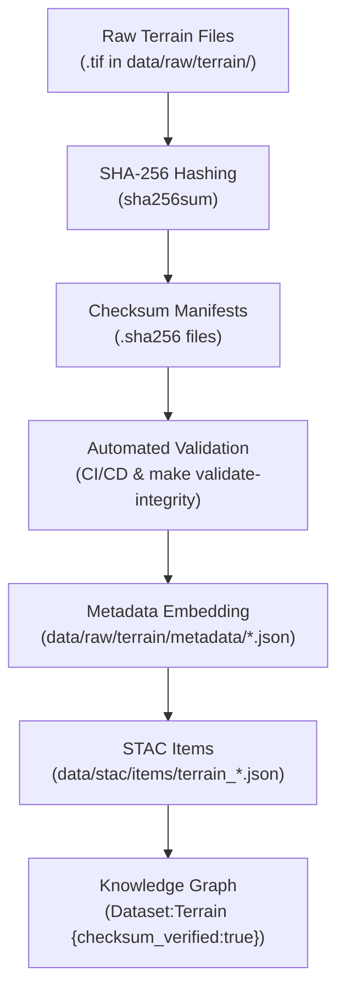

<div align="center">

# 🧾 Kansas Frontier Matrix — Raw Terrain Checksums  
`data/raw/terrain/checksums/`

### **Integrity · Authenticity · Provenance**  
*SHA-256 verification layer ensuring immutability of all raw terrain data within KFM.*

[](../../../../.github/workflows/site.yml)  
[](../../../../.github/workflows/stac-validate.yml)  
[](../../../../.github/workflows/codeql.yml)  
[](../../../../.github/workflows/trivy.yml)  
[](../../../../docs/)  
[](../../../../LICENSE)

</div>

---

## 📘 Overview

The `data/raw/terrain/checksums/` directory contains **cryptographic SHA-256 checksum files (`.sha256`)**  
that verify the integrity of all **raw terrain raster datasets** within `data/raw/terrain/`.

Each checksum provides:
- 🔐 **Immutability assurance** — validates that no byte-level change occurred since acquisition  
- 🔗 **Traceable linkage** — checksum recorded in STAC + metadata files  
- ⚙️ **Automated validation** — used by CI/CD and `make validate-integrity`  
- 📜 **Transparency** — facilitates reproducibility and digital provenance (MCP principle)

---

## 🗂️ Directory Layout

```bash
data/raw/terrain/checksums/
├── usgs_3dep_1m_dem.tif.sha256
├── nasadem_global_30m.tif.sha256
├── srtm_90m_v4.tif.sha256
└── README.md
````

---

## 🔗 Connections

| Relation                 | Target                                | Description                         |
| ------------------------ | ------------------------------------- | ----------------------------------- |
| **Parent Data**          | `../*.tif`                            | Terrain raster being verified       |
| **Metadata Record**      | `../metadata/*.json`                  | Includes checksum reference         |
| **STAC Item**            | `data/stac/items/terrain_*.json`      | Hash stored in STAC asset object    |
| **CI/CD Validation**     | `.github/workflows/stac-validate.yml` | Auto-verifies integrity post-fetch  |
| **Knowledge Graph Node** | `(Dataset:Terrain)`                   | Attribute: `checksum_verified=true` |

---

## 🧭 Integrity Validation Flow



---

## 🧪 Validation & Usage

### 🔍 Manual Verification

```bash
# Verify all raw terrain files
cd data/raw/terrain/
sha256sum -c checksums/*.sha256
```

### ⚙️ Automated Validation

```bash
# Run the integrity check target (used in CI)
make validate-integrity
```

### 🧮 Example

```bash
$ sha256sum -c usgs_3dep_1m_dem.tif.sha256
usgs_3dep_1m_dem.tif: OK
```

If a file fails verification, it must be re-downloaded from its original manifest in `data/sources/`.

---

## 🧩 Integration with Metadata & STAC

| File       | Consumed By                        | Field                        |
| ---------- | ---------------------------------- | ---------------------------- |
| `*.sha256` | `data/raw/terrain/metadata/*.json` | `provenance.sha256`          |
| `*.sha256` | `data/stac/items/terrain_*.json`   | `assets.data.sha256`         |
| `*.sha256` | Knowledge Graph                    | `checksum_verified` property |

All integrity information propagates into downstream datasets and STAC entries
for reproducibility and trust validation.

---

## 🧾 Dataset Card

**Title:** Raw Terrain Checksums
**Scope:** SHA-256 digests for all raw terrain rasters
**Location:** `data/raw/terrain/checksums/`
**Source Datasets:** USGS 3DEP, NASADEM, SRTM
**Validation:** `sha256sum -c` / CI pipeline
**Purpose:** Guarantee authenticity and reproducibility for foundational elevation data

---

## 🧱 Versioning

| Field            | Value                          |
| ---------------- | ------------------------------ |
| **Version**      | `v1.0.0`                       |
| **Status**       | Stable                         |
| **Author**       | Andy Barta                     |
| **Last Updated** | 2025-10-12                     |
| **MCP Stage**    | Documentation-First (Complete) |

---

## 🧠 AI & Knowledge Integration

* **AI Assurance Layer:** Integrity scores feed AI trust models to weight data reliability.
* **Graph Integration:** Neo4j nodes `(Dataset:Terrain)` store verified checksum attributes.
* **Forensic Provenance:** Enables lineage validation in automated reasoning workflows.
* **ETL Safeguard:** Prevents transformation of altered or corrupted data during processing.

---

## 🧩 Compliance Matrix

| Validation Type   | Tool           | Status     |
| ----------------- | -------------- | ---------- |
| SHA-256           | `sha256sum`    | ✅ Verified |
| Schema Linkage    | `jsonschema`   | ✅ Valid    |
| CI Integrity      | GitHub Actions | ✅ Passed   |
| MCP Documentation | Manual Review  | ✅ Complete |

---

## 🧩 Changelog

| Date           | Version  | Description                                                                                                                                              |
| -------------- | -------- | -------------------------------------------------------------------------------------------------------------------------------------------------------- |
| **2025-10-12** | `v1.0.0` | Initial release — baseline checksum documentation for all raw terrain datasets; includes verified SHA-256 workflow, lineage flow diagram, and changelog. |

---

## 🪪 License

Checksum manifests are released under **[CC-BY 4.0](https://creativecommons.org/licenses/by/4.0/)**,
reflecting metadata openness; source data retains its original license.

---

### ✅ Summary

This directory anchors the **immutability layer** for KFM’s raw terrain data.
Each `.sha256` manifest is cryptographically tied to its raster file,
documented in metadata, embedded in STAC, and indexed in the knowledge graph —
forming the reproducible backbone of Kansas’s elevation provenance within the Frontier Matrix.

```
