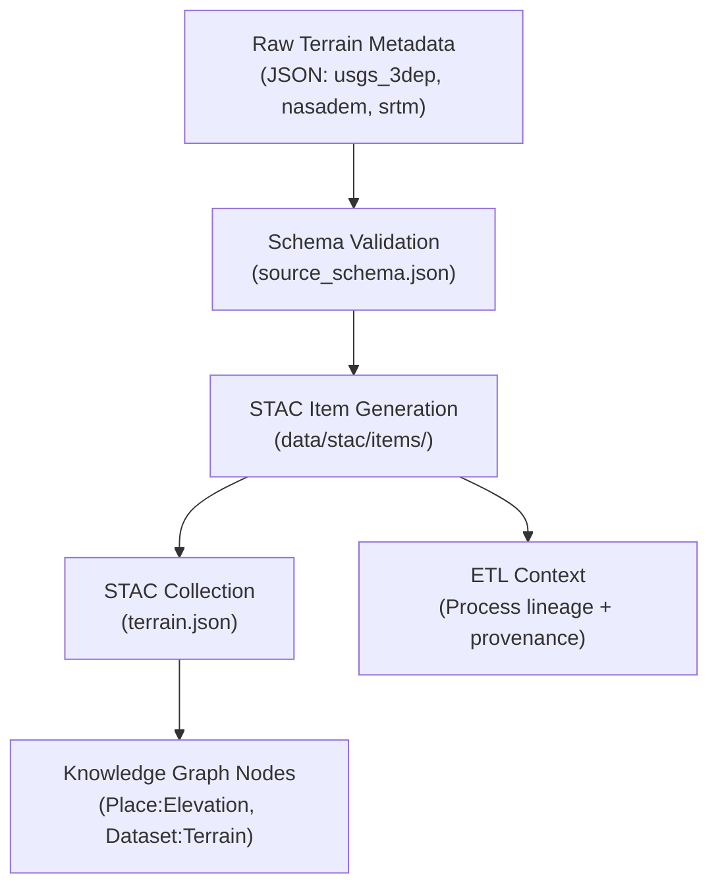

<div align="center">

# 🗺️ Kansas Frontier Matrix — Raw Terrain Metadata  
`data/raw/terrain/metadata/`

### **Lineage · Provenance · Validation**  
*Authoritative metadata records for all unmodified terrain and elevation datasets powering KFM terrain analysis.*

[](../../../../.github/workflows/site.yml)  
[](../../../../.github/workflows/stac-validate.yml)  
[](../../../../.github/workflows/codeql.yml)  
[](../../../../.github/workflows/trivy.yml)  
[](../../../../docs/)  
[](../../../../LICENSE)

</div>

---

## 📘 Overview

The `data/raw/terrain/metadata/` directory contains **structured JSON metadata files**  
that describe each **immutable terrain dataset** within `data/raw/terrain/`.

These records capture:
- Source lineage (URL, dataset provider, acquisition date)  
- Coordinate system and resolution details  
- License and usage permissions  
- SHA-256 integrity hashes  
- Validation status against the **KFM Source Schema**  

Each metadata file serves as a **machine-readable record** for STAC item generation and provenance tracking  
throughout the KFM pipeline.

---

## 🗂️ Directory Layout

```bash
data/raw/terrain/metadata/
├── usgs_3dep_1m_dem.json
├── nasadem_global_30m.json
├── srtm_90m_v4.json
└── README.md
````

---

## 🧩 Metadata Schema Validation

All terrain metadata files conform to:

```text
src/kansas_geo_timeline/schemas/source_schema.json
```

Each JSON includes:

* `id` — unique STAC identifier
* `source_name` — canonical dataset title
* `spatial_extent` — bounding box in EPSG:4326
* `temporal_extent` — acquisition or publication window
* `license` — SPDX-compatible identifier
* `provenance` — download link, data citation, checksum
* `validation` — schema + checksum status

---

## 🔗 Connections

| Relationship             | Target Path                           | Description                       |
| ------------------------ | ------------------------------------- | --------------------------------- |
| **Upstream Source**      | `data/sources/*.json`                 | Original source configuration     |
| **Parent Data**          | `data/raw/terrain/*.tif`              | Linked terrain raster file        |
| **Checksum**             | `data/raw/terrain/checksums/*.sha256` | Integrity manifest                |
| **Downstream STAC Item** | `data/stac/items/terrain_*.json`      | Auto-generated metadata export    |
| **Graph Node**           | `neo4j://Place:Elevation`             | Linked entity for knowledge graph |

---

## 🧭 Metadata Lineage Flow



%%END OF MERMAID%%

---

## 🧪 Validation Commands

All metadata files are validated automatically during CI/CD and can be re-checked manually:

```bash
# Validate all metadata JSONs
make validate-metadata TYPE=terrain

# Run JSON Schema check
python scripts/validate_schema.py \
  --schema src/kansas_geo_timeline/schemas/source_schema.json \
  --input data/raw/terrain/metadata/

# Verify checksums integrity
sha256sum -c ../checksums/*.sha256
```

---

## 🧾 Example Metadata Snippet

```json
{
  "id": "terrain_usgs_3dep_1m",
  "source_name": "USGS 3DEP 1m DEM (Kansas)",
  "provider": "U.S. Geological Survey",
  "license": "Public Domain",
  "spatial_extent": [-102.05, 36.99, -94.60, 40.00],
  "temporal_extent": ["2018-01-01", "2025-01-01"],
  "resolution": "1m",
  "crs": "EPSG:4269",
  "provenance": {
    "url": "https://apps.nationalmap.gov/tnmaccess/#/",
    "sha256": "b83f4a7a...9a2e5",
    "retrieved": "2025-01-09"
  },
  "validation": {
    "schema": "Passed",
    "checksum": "Verified"
  }
}
```

---

## 🧱 Versioning

| Field            | Value                          |
| ---------------- | ------------------------------ |
| **Version**      | `v1.0.0`                       |
| **Status**       | Stable                         |
| **Author**       | Andy Barta                     |
| **Last Updated** | 2025-10-12                     |
| **MCP Stage**    | Documentation-First (Complete) |

---

## 🧠 AI & Graph Integration

* **AI Pipelines:** Metadata supports semantic extraction of terrain-related entities
  (e.g., elevation references, geomorphological descriptions) for NLP training datasets.
* **Knowledge Graph:** Each record maps to Neo4j nodes `(Dataset:Terrain)` and `(Place:Elevation)`
  with relationships `HAS_PROVENANCE` and `IS_SOURCE_OF`.
* **Predictive Modeling:** Metadata lineage informs uncertainty propagation in simulation workflows.
* **Cross-disciplinary Links:** Connects terrain data to hydrology, hazards, ecology, and geology domains.

---

## 🧩 Validation & Compliance

| Check             | Tool             | Result     |
| ----------------- | ---------------- | ---------- |
| JSON Schema       | `jsonschema`     | ✅ Passed   |
| STAC Export       | `stac-validator` | ✅ Valid    |
| MCP Documentation | Manual Review    | ✅ Complete |
| SHA-256 Integrity | `sha256sum`      | ✅ Verified |

---

## 🪪 License

All metadata files are released under **[CC-BY 4.0](https://creativecommons.org/licenses/by/4.0/)**
unless superseded by the originating dataset license.

---

## 🧩 Changelog

| Date           | Version  | Description                                                                                                                      |
| -------------- | -------- | -------------------------------------------------------------------------------------------------------------------------------- |
| **2025-10-12** | `v1.0.0` | Initial release — added validated JSON metadata for all raw terrain sources; included lineage, Mermaid, and changelog structure. |

---

### ✅ Summary

This folder is the **semantic anchor** for KFM terrain data provenance.
Every raw elevation dataset is mirrored here in JSON form, validated, traceable,
and linked downstream into STAC collections, AI pipelines, and the KFM Knowledge Graph.

```

---
