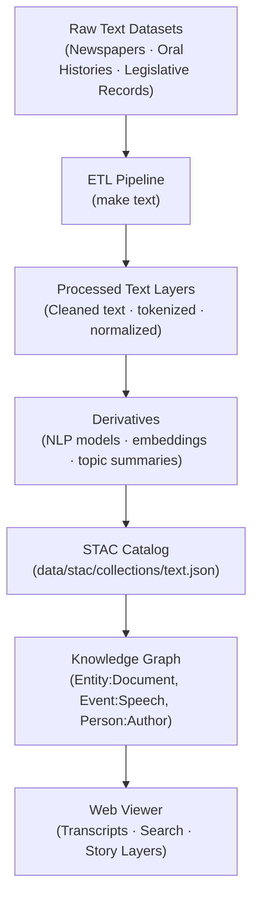

<div align="center">

# 🧾 Kansas Frontier Matrix — Raw Text Data  
`data/raw/text/`

### **Documents · Transcripts · Provenance**  
*Immutable text datasets providing linguistic and historical evidence across the Kansas Frontier Matrix.*

[](../../../.github/workflows/site.yml)  
[](../../../.github/workflows/stac-validate.yml)  
[](../../../.github/workflows/codeql.yml)  
[](../../../.github/workflows/trivy.yml)  
[](../../../docs/)  
[](../../../LICENSE)

</div>

---

## 📘 Overview

The `data/raw/text/` directory contains **unaltered text-based datasets**  
that represent primary documentary, linguistic, and archival materials from Kansas and surrounding regions.  

These datasets serve as the **foundation for natural language processing (NLP), entity extraction,  
and historical corpus analysis** within the Kansas Frontier Matrix (KFM).

All data in this directory are:
- 📜 **Immutable** — no cleaning, OCR correction, or tokenization  
- 🔗 **Traceable** — linked to manifest entries in `data/sources/`  
- 🧾 **Verifiable** — each includes a `.sha256` checksum file  
- 🧮 **Documented** — metadata JSON stored under `metadata/`  

---

## 🗂️ Directory Layout

```bash
data/raw/text/
├── kansas_newspapers_1850_1920.txt
├── oral_histories_transcripts.csv
├── legislative_records_kansas_1900_1950.txt
├── metadata/
│   ├── kansas_newspapers_1850_1920.json
│   ├── oral_histories_transcripts.json
│   └── legislative_records_kansas_1900_1950.json
├── checksums/
│   ├── kansas_newspapers_1850_1920.txt.sha256
│   ├── oral_histories_transcripts.csv.sha256
│   └── legislative_records_kansas_1900_1950.txt.sha256
└── README.md
````

---

## 🧾 Data Sources & Provenance

| Dataset                             | Provider                                  | Format | Temporal Range | License       | STAC ID                                     |
| ----------------------------------- | ----------------------------------------- | ------ | -------------- | ------------- | ------------------------------------------- |
| **Kansas Newspapers (1850–1920)**   | Library of Congress – Chronicling America | TXT    | 1850–1920      | Public Domain | `text_kansas_newspapers_1850_1920`          |
| **Oral Histories (Transcripts)**    | Kansas Historical Society                 | CSV    | 1880–2020      | CC-BY 4.0     | `text_oral_histories_transcripts`           |
| **Legislative Records (1900–1950)** | Kansas State Library                      | TXT    | 1900–1950      | Public Domain | `text_legislative_records_kansas_1900_1950` |

All source metadata are defined in [`data/sources/`](../../../data/sources/)
and validated via STAC entries under [`data/stac/items/`](../../../data/stac/items/).

---

## 🔗 Connections

| Layer               | Upstream                            | Downstream               | Purpose                                 |
| ------------------- | ----------------------------------- | ------------------------ | --------------------------------------- |
| Newspapers          | `data/sources/loc_chronicling.json` | `data/processed/text/`   | OCR + text cleaning + entity extraction |
| Oral Histories      | `data/sources/khs_oral.json`        | `data/derivatives/text/` | NLP-driven thematic tagging             |
| Legislative Records | `data/sources/ks_legislature.json`  | `data/processed/text/`   | Policy, law, and governance analysis    |

---

## 🧭 Data Lineage Diagram



---

## 🧪 Reproducibility

```bash
# Fetch source text datasets
make fetch TEXT=all

# Verify integrity
sha256sum -c checksums/*.sha256

# Validate metadata
make validate-metadata TYPE=text

# Build STAC entries
make stac TEXT=1
```

Outputs flow into:

* `data/processed/text/`
* `data/derivatives/text/`
* `data/stac/collections/text.json`

---

## 🧾 Dataset Card

**Title:** Kansas Newspapers (1850–1920)
**Source:** [Chronicling America – Library of Congress](https://chroniclingamerica.loc.gov/)
**Time:** 1850–1920
**Space:** Kansas counties and cities
**Files:** `kansas_newspapers_1850_1920.txt` (2.5 GB), `.sha256`
**STAC Item:** `data/stac/items/text_kansas_newspapers_1850_1920.json`
**License:** Public Domain
**Provenance:** Retrieved 2025-01-05 from LOC API; checksum verified.

---

## 🧱 Versioning

| Field            | Value                          |
| ---------------- | ------------------------------ |
| **Version**      | `v1.0.0`                       |
| **Status**       | Stable                         |
| **Author**       | Andy Barta                     |
| **Last Updated** | 2025-10-12                     |
| **MCP Stage**    | Documentation-First (Complete) |

---

## 🧠 AI & Knowledge Integration

* **Entity Extraction:** NLP pipelines identify names, places, and events in Kansas’s textual corpus.
* **Knowledge Graph Mapping:** Creates nodes `(Document)`, `(Event)`, `(Person)` with `MENTIONS` and `AUTHORED_BY` relationships.
* **Semantic Linking:** Enables historical cross-referencing with spatial and temporal datasets (treaties, climate, hazards).
* **Predictive Modeling:** Supports historical topic evolution and language change studies.

---

## 🧩 Validation & Compliance

| Check             | Tool             | Result     |
| ----------------- | ---------------- | ---------- |
| STAC Schema       | `stac-validator` | ✅ Passed   |
| JSON Schema       | `jsonschema`     | ✅ Valid    |
| SHA-256           | `sha256sum`      | ✅ Verified |
| MCP Documentation | Manual Review    | ✅ Complete |

---

## 🧩 Changelog

| Date           | Version  | Description                                                                                                    |
| -------------- | -------- | -------------------------------------------------------------------------------------------------------------- |
| **2025-10-12** | `v1.0.0` | Initial release — established documentation, lineage diagram, and checksum verification for raw text datasets. |

---

## 🪪 License

All text data are distributed under **[CC-BY 4.0](https://creativecommons.org/licenses/by/4.0/)**
unless superseded by the original source license. Attribution required in derivative works.

---

### ✅ Summary

This directory preserves Kansas’s **historical and linguistic primary sources** in immutable form.
Each document and transcript is checksum-verified, metadata-documented, and STAC-linked, ensuring
transparent, reproducible research across KFM’s historical, cultural, and semantic systems.

```
