<div align="center">

# 🧾 Kansas Frontier Matrix — Raw Text Checksums  
`data/raw/text/checksums/`

### **Integrity · Authenticity · Provenance**  
*SHA-256 integrity manifests ensuring immutability and reproducibility of all raw text-based datasets within the Kansas Frontier Matrix.*

[](../../../../.github/workflows/site.yml)  
[](../../../../.github/workflows/stac-validate.yml)  
[](../../../../.github/workflows/codeql.yml)  
[](../../../../.github/workflows/trivy.yml)  
[](../../../../docs/)  
[](../../../../LICENSE)

</div>

---

## 📘 Overview

The `data/raw/text/checksums/` directory contains **SHA-256 checksum files (`.sha256`)**  
verifying the integrity of each raw text dataset located in `data/raw/text/`.

These manifests ensure that Kansas’s textual archives remain:
- 🔐 **Immutable** — detects byte-level alterations across large corpora  
- 🔗 **Traceable** — referenced within metadata and STAC records  
- ⚙️ **Automated** — validated by CI/CD and `make validate-integrity`  
- 🧾 **Auditable** — providing forensic provenance in line with MCP standards  

---

## 🗂️ Directory Layout

```bash
data/raw/text/checksums/
├── kansas_newspapers_1850_1920.txt.sha256
├── oral_histories_transcripts.csv.sha256
├── legislative_records_kansas_1900_1950.txt.sha256
└── README.md
````

---

## 🔗 Connections

| Relation                 | Target                                | Description                                   |                                      |
| ------------------------ | ------------------------------------- | --------------------------------------------- | ------------------------------------ |
| **Parent Data**          | `../*.txt                             | *.csv`                                        | Raw text file verified for integrity |
| **Metadata Record**      | `../metadata/*.json`                  | References checksum under `provenance.sha256` |                                      |
| **STAC Item**            | `data/stac/items/text_*.json`         | Exposes checksum field for reproducibility    |                                      |
| **CI/CD Validation**     | `.github/workflows/stac-validate.yml` | Auto-verifies integrity per commit            |                                      |
| **Knowledge Graph Node** | `(Dataset:Text)`                      | Node attribute `checksum_verified:true`       |                                      |

---

## 🧭 Integrity Validation Flow

```mermaid
flowchart TD
  A["Raw Text Files\n(Newspapers · Oral Histories · Legislative Records)"] --> B["SHA-256 Generation\n(sha256sum)"]
  B --> C["Checksum Manifests\n(.sha256)"]
  C --> D["Integrity Validation\n(make validate-integrity · CI/CD)"]
  D --> E["Metadata Embedding\n(data/raw/text/metadata/*.json)"]
  E --> F["STAC Integration\n(data/stac/items/text_*.json)"]
  F --> G["Knowledge Graph\n(Dataset:Text {checksum_verified:true})"]
%%END OF MERMAID%%
```



---

## 🧪 Validation Commands

### 🔍 Manual Verification

```bash
# Verify all text dataset integrity
cd data/raw/text/
sha256sum -c checksums/*.sha256
```

### ⚙️ Automated Validation

```bash
# CI/CD-integrated target
make validate-integrity TYPE=text
```

### 🧮 Example Output

```bash
$ sha256sum -c kansas_newspapers_1850_1920.txt.sha256
kansas_newspapers_1850_1920.txt: OK
```

If a mismatch is detected, re-acquire the dataset from its source
as defined in `data/sources/`.

---

## 🧾 Dataset Card

**Title:** Raw Text Checksums
**Scope:** SHA-256 digest files for all raw text archives
**Location:** `data/raw/text/checksums/`
**Datasets Covered:** Newspapers (1850–1920), Oral Histories, Legislative Records
**Validation:** `sha256sum -c` / `make validate-integrity`
**Purpose:** Preserve immutable textual provenance and MCP-compliant verification

---

## 🧱 Versioning

| Field            | Value                          |
| ---------------- | ------------------------------ |
| **Version**      | `v1.0.0`                       |
| **Status**       | Stable                         |
| **Author**       | Andy Barta                     |
| **Last Updated** | 2025-10-12                     |
| **MCP Stage**    | Documentation-First (Complete) |

---

## 🧠 AI & Knowledge Integration

* **AI Provenance Assurance:** Checksum validation contributes to data trust weighting in AI models.
* **Knowledge Graph Alignment:** Neo4j nodes `(Dataset:Text)` enriched with checksum status metadata.
* **Audit Trail:** Provides forensic traceability for NLP training datasets and semantic linking models.
* **ETL Protection:** Ensures only verified and reproducible textual sources are ingested into NLP pipelines.

---

## 🧩 Validation & Compliance

| Check             | Tool             | Result     |
| ----------------- | ---------------- | ---------- |
| SHA-256 Integrity | `sha256sum`      | ✅ Verified |
| STAC Integration  | `stac-validator` | ✅ Valid    |
| CI/CD Workflow    | GitHub Actions   | ✅ Passed   |
| MCP Documentation | Manual Review    | ✅ Complete |

---

## 🧩 Changelog

| Date           | Version  | Description                                                                                              |
| -------------- | -------- | -------------------------------------------------------------------------------------------------------- |
| **2025-10-12** | `v1.0.0` | Initial release — added checksum documentation, lineage diagram, and validation steps for text datasets. |

---

## 🪪 License

Checksum manifests are distributed under **[CC-BY 4.0](https://creativecommons.org/licenses/by/4.0/)**.
Original data remain under their source-specific licenses. Attribution required for reuse or redistribution.

---

### ✅ Summary

This directory serves as the **integrity verification layer** for the Kansas Frontier Matrix’s text archives.
Each `.sha256` file cryptographically guarantees dataset authenticity and reproducibility,
linking directly to metadata, STAC, and Knowledge Graph structures — ensuring the historical
and linguistic corpus of Kansas remains scientifically trustworthy and digitally immutable.

```
