<div align="center">

# 🧾 Kansas Frontier Matrix — Raw Text Metadata  
`data/raw/text/metadata/`

### **Lineage · Provenance · Validation**  
*Structured JSON metadata defining every immutable text-based dataset within the Kansas Frontier Matrix.*

[](../../../../.github/workflows/site.yml)  
[](../../../../.github/workflows/stac-validate.yml)  
[](../../../../.github/workflows/codeql.yml)  
[](../../../../.github/workflows/trivy.yml)  
[](../../../../docs/)  
[](../../../../LICENSE)

</div>

---

## 📘 Overview

The `data/raw/text/metadata/` directory contains **structured JSON metadata**  
describing each unaltered text dataset stored in `data/raw/text/`.  

These records define:
- 🔗 **Source lineage** — provider, citation, acquisition date, and checksum  
- 🧾 **Schema validation** — MCP + STAC-compatible field structure  
- 🧮 **Temporal and spatial extent** — contextual range of textual data  
- 📜 **Legal and ethical notes** — copyright or usage constraints  
- 🧩 **Cross-domain connections** — linkages to Knowledge Graph and AI/NLP pipelines  

Each file is validated against the canonical schema and serves as the authoritative descriptor for reproducibility and transparency.

---

## 🗂️ Directory Layout

```bash
data/raw/text/metadata/
├── kansas_newspapers_1850_1920.json
├── oral_histories_transcripts.json
├── legislative_records_kansas_1900_1950.json
└── README.md
````

---

## 🧩 Metadata Schema Validation

All metadata conform to:

```text
src/kansas_geo_timeline/schemas/source_schema.json
```

### Core Fields

| Field             | Description                             |
| ----------------- | --------------------------------------- |
| `id`              | Unique STAC-style identifier            |
| `source_name`     | Dataset title                           |
| `provider`        | Data-producing institution              |
| `license`         | SPDX license identifier                 |
| `spatial_extent`  | `[W, S, E, N]` bounding box (EPSG:4326) |
| `temporal_extent` | Coverage range (start/end year)         |
| `format`          | Original file type (TXT, CSV, etc.)     |
| `provenance`      | Source URL, retrieval date, checksum    |
| `validation`      | Schema + checksum + STAC export status  |

---

## 🔗 Connections

| Relationship             | Target                                               | Description               |                          |                             |
| ------------------------ | ---------------------------------------------------- | ------------------------- | ------------------------ | --------------------------- |
| **Parent Data**          | `data/raw/text/*.txt                                 | *.csv`                    | Associated raw text file |                             |
| **Checksum**             | `data/raw/text/checksums/*.sha256`                   | Integrity reference       |                          |                             |
| **STAC Item**            | `data/stac/items/text_*.json`                        | Published metadata record |                          |                             |
| **Schema**               | `src/kansas_geo_timeline/schemas/source_schema.json` | Validation schema         |                          |                             |
| **Knowledge Graph Node** | `neo4j://Document                                    | Event                     | Person`                  | AI/NLP cross-domain linkage |

---

## 🧭 Metadata Lineage Flow

```mermaid
flowchart TD
  A["Raw Text Metadata\n(JSON: Newspapers · Oral Histories · Legislative Records)"] --> B["Schema Validation\n(source_schema.json)"]
  B --> C["STAC Item Creation\n(data/stac/items/text_*.json)"]
  C --> D["STAC Collection Assembly\n(text.json)"]
  D --> E["Knowledge Graph Integration\n(Document · Person · Event nodes)"]
  C --> F["AI/NLP Enrichment\n(Entity linking · Topic extraction · Sentiment tagging)"]
%%END OF MERMAID%%
```



---

## 🧪 Validation Commands

```bash
# Validate all text metadata JSONs
make validate-metadata TYPE=text

# Manual schema validation
python scripts/validate_schema.py \
  --schema src/kansas_geo_timeline/schemas/source_schema.json \
  --input data/raw/text/metadata/

# Verify checksum references
sha256sum -c ../checksums/*.sha256
```

CI/CD automatically executes metadata validation during
[`stac-validate.yml`](../../../../.github/workflows/stac-validate.yml).

---

## 🧾 Example Metadata Snippet

```json
{
  "id": "text_kansas_newspapers_1850_1920",
  "source_name": "Kansas Historical Newspapers (1850–1920)",
  "provider": "Library of Congress – Chronicling America",
  "license": "Public Domain",
  "spatial_extent": [-102.05, 36.99, -94.60, 40.00],
  "temporal_extent": ["1850-01-01", "1920-12-31"],
  "format": "text/plain",
  "provenance": {
    "url": "https://chroniclingamerica.loc.gov/",
    "sha256": "a7b4f8d2e9c5a1be347e9f51c89df3c6de8a9a4b...",
    "retrieved": "2025-01-06"
  },
  "validation": {
    "schema": "Passed",
    "checksum": "Verified",
    "stac_export": "Generated"
  }
}
```

---

## 🧱 Versioning

| Field            | Value                          |
| ---------------- | ------------------------------ |
| **Version**      | `v1.0.0`                       |
| **Status**       | Stable                         |
| **Author**       | Andy Barta                     |
| **Last Updated** | 2025-10-12                     |
| **MCP Stage**    | Documentation-First (Complete) |

---

## 🧠 AI & Knowledge Integration

* **AI Enrichment:** Metadata keywords feed entity extraction models for NLP pipelines (e.g., topic modeling and named entity linking).
* **Knowledge Graph Mapping:** Nodes `(Document)`, `(Person)`, `(Event)` linked via `HAS_SOURCE`, `MENTIONS`, and `REFERENCES`.
* **Predictive Modeling:** Temporal ranges contribute to text-evolution analysis and semantic shift modeling.
* **Cross-Domain Integration:** Connects with hydrology, climate, and landcover data for contextual historical studies.

---

## 🧩 Validation & Compliance

| Check             | Tool             | Result     |
| ----------------- | ---------------- | ---------- |
| JSON Schema       | `jsonschema`     | ✅ Passed   |
| STAC Export       | `stac-validator` | ✅ Valid    |
| Checksum Link     | `sha256sum`      | ✅ Verified |
| MCP Documentation | Manual Review    | ✅ Complete |

---

## 🧩 Changelog

| Date           | Version  | Description                                                                                       |
| -------------- | -------- | ------------------------------------------------------------------------------------------------- |
| **2025-10-12** | `v1.0.0` | Initial release — full hazards metadata schema for raw text datasets with validated Mermaid flow. |

---

## 🪪 License

All metadata files are distributed under **[CC-BY 4.0](https://creativecommons.org/licenses/by/4.0/)**
unless the originating dataset’s license specifies otherwise. Attribution is required for derivative use.

---

### ✅ Summary

This directory forms the **metadata foundation for textual archives** within the Kansas Frontier Matrix.
Each JSON file describes lineage, provenance, and validation for documentary and linguistic materials —
integrating with STAC catalogs, checksum verification, and the Knowledge Graph to ensure
transparent, reproducible, and AI-ready preservation of Kansas’s textual history.

```
