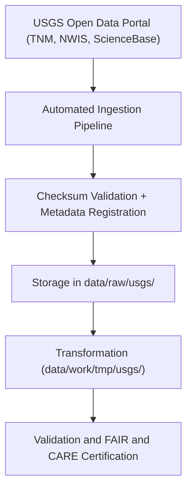

<div align="center">

# 🗻 Kansas Frontier Matrix — **USGS Raw Data Repository**
`data/raw/usgs/README.md`

**Purpose:** Hosts original, unaltered datasets sourced from the **U.S. Geological Survey (USGS)**.  
Includes elevation, groundwater, and geological datasets that serve as foundational inputs for KFM’s ETL, hydrology, and hazard modeling pipelines.

[](https://www.usgs.gov/products/data-and-tools/open-data)
[](../../../LICENSE)
[](../../../docs/standards/faircare-validation.md)
[](../../../docs/architecture/repo-focus.md)

</div>

---

## 📚 Overview

The `data/raw/usgs/` directory is a structured repository of **raw U.S. Geological Survey (USGS) datasets**, acquired through open data programs such as:
- The **National Map (TNM)**  
- **National Water Information System (NWIS)**  
- **ScienceBase Catalog**  

Each dataset:
- Is unmodified from its source.  
- Includes metadata and checksum verification.  
- Retains provenance for full traceability in ETL pipelines.  
- Adheres to FAIR+CARE ethical and reproducibility standards.

These files form the baseline for all USGS-derived layers in `data/work/tmp/` and `data/archive/`.

---

## 🗂️ Directory Layout

```plaintext
data/raw/usgs/
├── README.md                          # This file — documentation of all USGS raw datasets
│
├── elevation_models/                  # DEMs and LiDAR elevation data (terrain analysis)
│   ├── kansas_dem_10m.tif
│   ├── kansas_dem_30m.tif
│   ├── metadata.json
│   └── license.txt
│
├── groundwater_levels/                # Observation well data and aquifer extents
│   ├── observation_wells.csv
│   ├── aquifer_extent.geojson
│   ├── metadata.json
│   └── license.txt
│
├── geology/                           # Lithology, formations, and faults
│   ├── formations_ks.geojson
│   ├── faults_ks.geojson
│   ├── metadata.json
│   └── license.txt
│
└── metadata.json                      # Root metadata summarizing all USGS sources
```

---

## ⚙️ USGS Data Lifecycle



### Summary:
1. **Ingestion:** Datasets retrieved via official USGS APIs, S3 buckets, or FTP.  
2. **Metadata Registration:** Each dataset includes `metadata.json` capturing provenance and license.  
3. **Checksum Validation:** All files hashed via SHA-256 for immutability assurance.  
4. **Storage:** Raw files preserved under `data/raw/usgs/` with no alteration.  
5. **Transformation:** Reprocessed into KFM schemas and stored in `data/work/tmp/usgs/`.

---

## 🧩 Example Root Metadata Record

```json
{
  "id": "usgs_repository_kansas",
  "title": "USGS Open Data for Kansas Frontier Matrix",
  "description": "Comprehensive collection of unmodified U.S. Geological Survey datasets (elevation, groundwater, geology) integrated into the Kansas Frontier Matrix system.",
  "provider": "U.S. Geological Survey (USGS)",
  "license": "Public Domain",
  "datasets": [
    {"id": "usgs_kansas_dem_10m", "path": "elevation_models/kansas_dem_10m.tif"},
    {"id": "usgs_groundwater_levels_2025", "path": "groundwater_levels/observation_wells.csv"},
    {"id": "usgs_formations_ks", "path": "geology/formations_ks.geojson"}
  ],
  "checksum_manifest": "releases/v9.3.2/manifest.zip",
  "governance_record": "data/reports/audit/data_provenance_ledger.json"
}
```

---

## ⚖️ License and Attribution

| Dataset Category | License | Source URL | Attribution |
|------------------|----------|-------------|-------------|
| Elevation Models | Public Domain | [USGS National Map](https://www.usgs.gov/the-national-map) | U.S. Geological Survey |
| Groundwater Data | Public Domain | [NWIS Database](https://waterdata.usgs.gov/nwis) | U.S. Geological Survey |
| Geology | Public Domain | [USGS ScienceBase Catalog](https://www.sciencebase.gov/catalog/) | U.S. Geological Survey |

> All data in this directory are U.S. Government works and are in the **public domain** unless otherwise stated.

---

## 🧠 FAIR+CARE Governance

| Principle | Implementation |
|------------|----------------|
| **Findable** | Indexed in STAC with globally unique identifiers. |
| **Accessible** | Stored in open GeoJSON, CSV, and GeoTIFF formats. |
| **Interoperable** | Metadata schema aligns with STAC 1.0 and DCAT 3.0. |
| **Reusable** | Includes provenance, checksum, and licensing. |
| **Collective Benefit** | Supports open environmental and scientific research. |
| **Authority to Control** | Attribution to USGS as authoritative source. |
| **Responsibility** | Verified accuracy and validation through governance workflows. |
| **Ethics** | Publicly accessible; no sensitive or restricted content. |

Governance reports linked to:
- `data/reports/audit/data_provenance_ledger.json`  
- `data/reports/fair/data_fair_summary.json`  
- `data/reports/validation/stac_validation_report.json`

---

## 🔍 Governance and Validation Integration

| File | Function |
|------|-----------|
| `metadata.json` | Summarizes datasets and provenance. |
| `license.txt` | Specifies U.S. Public Domain policy for USGS datasets. |
| `data/reports/audit/data_provenance_ledger.json` | Logs ingestion, validation, and checksums. |
| `data/reports/fair/data_care_assessment.json` | Records FAIR+CARE audit results. |
| `releases/v9.3.2/manifest.zip` | Contains checksum records for all raw USGS datasets. |

---

## 🧾 Citation

```text
Kansas Frontier Matrix (2025). USGS Raw Data Repository (v9.3.2).
Collection of unaltered datasets from the U.S. Geological Survey, including elevation, groundwater, and geology data.
Available at: https://github.com/bartytime4life/Kansas-Frontier-Matrix/tree/main/data/raw/usgs
License: Public Domain (USGS Open Data Policy)
```

---

## 🧾 Version Notes

| Version | Date | Notes |
|----------|------|--------|
| v9.3.2 | 2025-10-28 | Added updated LiDAR DEM and aquifer datasets; metadata harmonized with STAC 1.0. |
| v9.2.0 | 2024-07-15 | Introduced USGS lithologic and groundwater layers. |
| v9.0.0 | 2023-01-10 | Established initial USGS raw data repository with governance integration. |

---

<div align="center">

**Kansas Frontier Matrix** · *Geoscience × FAIR+CARE × Open Data Integrity*  
[🔗 Repository](https://github.com/bartytime4life/Kansas-Frontier-Matrix) • [🧭 Docs Portal](../../../docs/) • [⚖️ Governance Ledger](../../../docs/standards/governance/)

</div>
