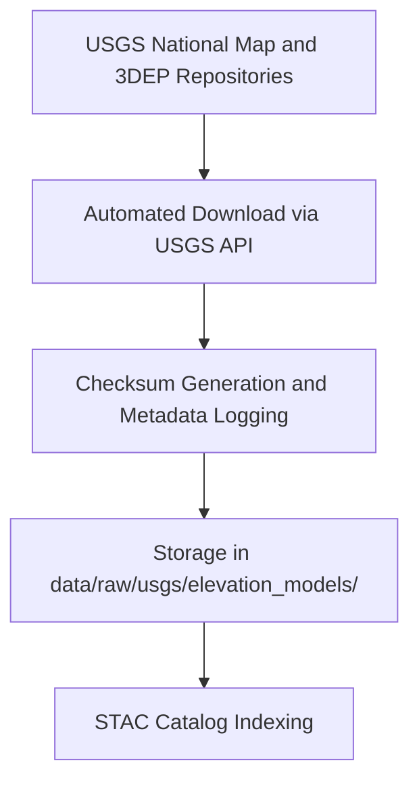

<div align="center">

# 🗺️ Kansas Frontier Matrix — **USGS Elevation Models**
`data/raw/usgs/elevation_models/README.md`

**Purpose:** Contains unaltered USGS **Digital Elevation Models (DEM)** and LiDAR data used as the foundational topographic layer for the Kansas Frontier Matrix (KFM).  
These datasets support terrain analysis, hydrology modeling, hazard assessment, and Focus Mode visualization workflows.

[](https://www.usgs.gov/the-national-map)
[](../../../../docs/standards/faircare-validation.md)
[](../../../../LICENSE)
[](../../../../docs/architecture/repo-focus.md)

</div>

---

## 📚 Overview

The `data/raw/usgs/elevation_models/` directory contains **raw elevation data** provided by the U.S. Geological Survey (USGS) under its Open Data policy.  
These include both **10-meter (1/3 arc-second)** and **30-meter (1 arc-second)** Digital Elevation Models (DEM) for the state of Kansas, plus limited LiDAR coverage for select counties.  

All elevation models are:
- Stored in **GeoTIFF** format for compatibility with GIS software and pipelines.  
- Accompanied by `metadata.json` and `license.txt` for transparency and compliance.  
- Immutable — modifications are made only in `data/work/tmp/` during ETL workflows.  
- Validated via checksum and STAC metadata registration at ingestion.

---

## 🗂️ Directory Layout

```plaintext
data/raw/usgs/elevation_models/
├── README.md                      # This file — documentation of elevation models
│
├── kansas_dem_10m.tif             # Statewide 10-meter DEM (USGS National Map)
├── kansas_dem_30m.tif             # Statewide 30-meter DEM (legacy)
├── kansas_lidar_2020.tif          # Partial LiDAR coverage (NE Kansas)
├── metadata.json                  # Provenance, spatial extent, and validation info
└── license.txt                    # USGS public domain license
```

---

## ⚙️ Data Provenance Workflow



**Process Details:**
1. DEM files retrieved from USGS FTP or AWS-hosted repositories.  
2. Each dataset accompanied by USGS metadata XML and JSON files.  
3. Checksums generated automatically and logged in `releases/v9.3.2/manifest.zip`.  
4. No alterations — files remain identical to USGS originals.  
5. FAIR+CARE validation verifies metadata completeness and provenance linkage.

---

## 🧩 Example Metadata Record

```json
{
  "id": "usgs_kansas_dem_10m",
  "title": "USGS 10-Meter Digital Elevation Model — Kansas",
  "description": "Digital Elevation Model (DEM) at 1/3 arc-second resolution for the state of Kansas, provided by USGS National Map.",
  "source_url": "https://prd-tnm.s3.amazonaws.com/StagedProducts/Elevation/13/TIFF/current/",
  "provider": "U.S. Geological Survey (USGS)",
  "license": "Public Domain (USGS Open Data)",
  "spatial_extent": [-102.05, 36.99, -94.61, 40.00],
  "resolution": "10 meters (1/3 arc-second)",
  "temporal_extent": ["2018-01-01", "2025-01-01"],
  "checksum": "sha256:82c7b913c74a9e05d8ad4f4a87fa02beab1cfe3c..."
}
```

---

## 🧠 FAIR+CARE Compliance Summary

| Principle | Implementation |
|------------|----------------|
| **Findable** | Indexed in STAC and referenced in the data manifest with global ID. |
| **Accessible** | Stored in open GeoTIFF format under public domain license. |
| **Interoperable** | CRS standardized (EPSG:4326); metadata aligns with STAC/DCAT schemas. |
| **Reusable** | Provenance fields and checksums included in metadata. |
| **Collective Benefit** | Supports environmental monitoring and educational research. |
| **Authority to Control** | Attribution retained to USGS and public domain statements. |
| **Responsibility** | Verified source authenticity through checksum comparison. |
| **Ethics** | No sensitive content; publicly accessible elevation data only. |

Compliance verification logged under:  
`data/reports/fair/data_fair_summary.json` and `data/reports/audit/data_provenance_ledger.json`.

---

## ⚖️ Licensing & Use

### License
```
U.S. Geological Survey (USGS) Open Data Policy:
Unless otherwise noted, data, metadata, and related materials are considered
to be in the U.S. public domain. You may use, copy, and distribute these data
freely, provided proper attribution is given where appropriate.
```

### Recommended Citation
```text
U.S. Geological Survey (USGS). "National Elevation Dataset (NED) 1/3 Arc-Second DEM - Kansas".
Accessed via The National Map on 2025-10-15. Public Domain.
```

---

## 🔍 Governance & Provenance Integration

| Governance Artifact | Description |
|----------------------|-------------|
| `data/reports/audit/data_provenance_ledger.json` | Tracks ingestion, checksum, and lineage. |
| `data/reports/validation/stac_validation_report.json` | Records schema and metadata validation results. |
| `data/reports/fair/data_care_assessment.json` | FAIR+CARE ethics and interoperability review. |
| `releases/v9.3.2/manifest.zip` | Master record of dataset checksums. |

All files under this directory are immutable and version-locked for reproducibility.

---

## 🧾 Usage & Citation (KFM Context)

```text
Kansas Frontier Matrix (2025). USGS Elevation Models (v9.3.2).
Includes 10m and 30m statewide DEMs and partial LiDAR datasets for Kansas.
Integrated under FAIR+CARE governance for hydrologic and topographic modeling.
Available at: https://github.com/bartytime4life/Kansas-Frontier-Matrix/tree/main/data/raw/usgs/elevation_models
License: Public Domain (USGS Open Data Policy)
```

---

## 🧾 Version Notes

| Version | Date | Notes |
|----------|------|--------|
| v9.3.2 | 2025-10-28 | Added LiDAR coverage; verified checksums and metadata schema. |
| v9.2.0 | 2024-07-15 | Updated DEM with statewide 10m resolution data. |
| v9.0.0 | 2023-01-10 | Established baseline dataset with 30m legacy DEM. |

---

<div align="center">

**Kansas Frontier Matrix** · *Topography × FAIR+CARE Stewardship × Open Science*  
[🔗 Repository](https://github.com/bartytime4life/Kansas-Frontier-Matrix) • [🧭 Docs Portal](../../../../docs/) • [⚖️ Governance Ledger](../../../../docs/standards/governance/)

</div>
