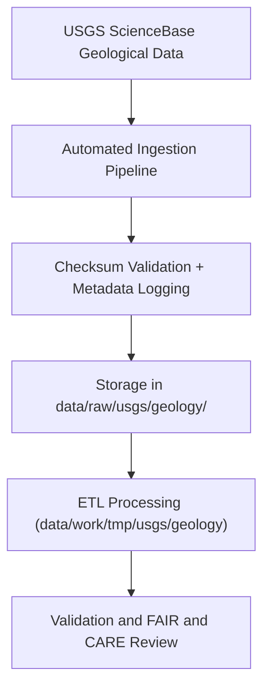

<div align="center">

# 🪨 Kansas Frontier Matrix — **USGS Geology Data**
`data/raw/usgs/geology/README.md`

**Purpose:** Contains unmodified geological datasets from the **U.S. Geological Survey (USGS)**, forming the base layer for Kansas subsurface modeling, lithology analysis, and Focus Mode geological visualization in the Kansas Frontier Matrix (KFM).  
All data are FAIR+CARE monitored and verified for provenance, schema compliance, and ethical stewardship.

[](https://www.sciencebase.gov/catalog/)
[](../../../../docs/standards/faircare-validation.md)
[](../../../../LICENSE)
[](../../../../docs/architecture/repo-focus.md)

</div>

---

## 📚 Overview

The `data/raw/usgs/geology/` directory contains **geological datasets** published by the U.S. Geological Survey (USGS) and Kansas Geological Survey (KGS).  
These include statewide lithologic units, formation boundaries, and fault lines essential to KFM’s geospatial, environmental, and hazard workflows.

All datasets are:
- Stored unmodified as originally downloaded from USGS ScienceBase.  
- Provided in **GeoJSON** format with accompanying metadata and license.  
- Indexed under FAIR+CARE governance for provenance tracking and reproducibility.  
- Integrated into KFM pipelines for subsurface correlation and AI-driven analysis.

---

## 🗂️ Directory Layout

```plaintext
data/raw/usgs/geology/
├── README.md                     # This file — documentation of geological datasets
│
├── formations_ks.geojson         # Kansas lithostratigraphic and bedrock formations
├── faults_ks.geojson             # Fault lines and tectonic structures
├── metadata.json                 # Provenance and schema information
└── license.txt                   # Public domain license notice (USGS Open Data)
```

---

## ⚙️ Data Workflow



**Workflow Summary:**
1. **Ingestion:** Files retrieved from USGS ScienceBase and verified against metadata.  
2. **Registration:** Metadata JSON created with spatial extent, CRS, and license.  
3. **Checksum:** SHA-256 digest computed for each dataset, logged in manifest.  
4. **Storage:** Files remain unmodified to maintain provenance integrity.  
5. **Transformation:** Datasets used in subsurface and hazard analysis pipelines.  

---

## 🧩 Example Metadata Record

```json
{
  "id": "usgs_formations_ks",
  "title": "USGS Kansas Geological Formations",
  "description": "Geospatial dataset depicting bedrock formations, lithologic boundaries, and unit classifications for Kansas.",
  "source_url": "https://www.sciencebase.gov/catalog/item/5f0f35f882ce3b7e7caa12b1",
  "provider": "U.S. Geological Survey (USGS)",
  "license": "Public Domain",
  "checksum": "sha256:3de92b66b65f7832a6b10e7fa31d1cd2b4df6ea8...",
  "spatial_extent": [-102.05, 36.99, -94.61, 40.00],
  "temporal_extent": ["1900-01-01", "2025-01-01"],
  "crs": "EPSG:4326",
  "related_datasets": [
    "usgs_faults_ks",
    "kgs_lithologic_logs"
  ]
}
```

---

## 🌍 Dataset Composition

| File | Description | Source | Format |
|------|--------------|--------|--------|
| `formations_ks.geojson` | Lithologic and stratigraphic units for Kansas (bedrock and surface geology). | USGS / KGS | GeoJSON |
| `faults_ks.geojson` | Known and inferred fault lines, with movement classification. | USGS / KGS | GeoJSON |
| `metadata.json` | Provenance, CRS, checksum, and license data. | KFM Ingestion | JSON |

Spatial Reference: **EPSG:4326 (WGS84)**  
Temporal Coverage: **Geologic Time Scale – Present**

---

## ⚖️ Licensing & Attribution

| Source | License | Notes |
|---------|----------|-------|
| USGS ScienceBase | Public Domain | U.S. Government data; free for public use. |
| Kansas Geological Survey (KGS) | CC-BY 4.0 | Attribution to KGS required for derivative works. |

License terms stored in `license.txt` and referenced in `data/reports/audit/data_provenance_ledger.json`.

---

## 🧠 FAIR+CARE Compliance Overview

| Principle | Implementation |
|------------|----------------|
| **Findable** | Indexed in STAC and manifest with USGS identifiers. |
| **Accessible** | Open formats (GeoJSON) and public domain license. |
| **Interoperable** | CRS standardized and schema conforms to STAC/DCAT 3.0. |
| **Reusable** | Full metadata and provenance documentation. |
| **Collective Benefit** | Enables geological research, education, and resource management. |
| **Authority to Control** | Attribution retained to USGS/KGS. |
| **Responsibility** | Verified authenticity of source datasets. |
| **Ethics** | Contains no proprietary or culturally restricted geological data. |

FAIR+CARE audit records available in:  
`data/reports/fair/data_fair_summary.json` and `data/reports/audit/data_provenance_ledger.json`.

---

## 🔍 Governance Integration

| Record | Description |
|---------|-------------|
| `data/reports/audit/data_provenance_ledger.json` | Logs ingestion, checksum, and validation. |
| `data/reports/validation/stac_validation_report.json` | STAC and schema validation outcomes. |
| `data/reports/fair/data_care_assessment.json` | FAIR+CARE evaluation summary. |
| `releases/v9.3.2/manifest.zip` | Global checksum and validation registry. |

---

## 🧾 Citation

```text
Kansas Frontier Matrix (2025). USGS Geological Datasets (v9.3.2).
Raw unaltered lithology and fault data sourced from the U.S. Geological Survey and Kansas Geological Survey.
Available at: https://github.com/bartytime4life/Kansas-Frontier-Matrix/tree/main/data/raw/usgs/geology
License: Public Domain (USGS Open Data) / CC-BY 4.0 (KGS data)
```

---

## 🧾 Version Notes

| Version | Date | Notes |
|----------|------|--------|
| v9.3.2 | 2025-10-28 | Added fault and lithology datasets; validated schema and CRS. |
| v9.2.0 | 2024-07-15 | Integrated bedrock formations layer from ScienceBase. |
| v9.0.0 | 2023-01-10 | Created USGS geology ingestion directory; baseline data established. |

---

<div align="center">

**Kansas Frontier Matrix** · *Geoscience × FAIR+CARE × Provenance Stewardship*  
[🔗 Repository](https://github.com/bartytime4life/Kansas-Frontier-Matrix) • [🧭 Docs Portal](../../../../docs/) • [⚖️ Governance Ledger](../../../../docs/standards/governance/)

</div>
