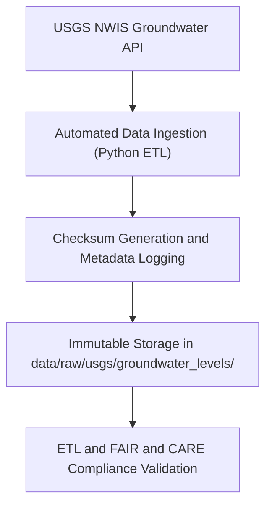

<div align="center">

# 💧 Kansas Frontier Matrix — **USGS Groundwater Levels**
`data/raw/usgs/groundwater_levels/README.md`

**Purpose:** Stores raw groundwater observation datasets from the **U.S. Geological Survey (USGS) National Water Information System (NWIS)** and related hydrologic sources.  
These records form the basis for aquifer modeling, drought analysis, and hydrogeologic studies within the Kansas Frontier Matrix (KFM).

[](https://waterdata.usgs.gov/nwis)
[](../../../../docs/standards/faircare-validation.md)
[](../../../../LICENSE)
[](../../../../docs/architecture/repo-focus.md)

</div>

---

## 📚 Overview

The `data/raw/usgs/groundwater_levels/` directory contains **unaltered data from USGS groundwater observation wells** in Kansas.  
All datasets originate from the **National Water Information System (NWIS)** and related monitoring programs.  
These files capture groundwater depths, aquifer responses, and long-term hydrologic changes.  

Each dataset includes:
- Raw well observation data and aquifer geometries.  
- Spatial metadata for well locations and depth intervals.  
- Licensing and provenance information.  
- Checksums for reproducibility.  

---

## 🗂️ Directory Layout

```plaintext
data/raw/usgs/groundwater_levels/
├── README.md                         # This file — documentation of groundwater datasets
│
├── observation_wells.csv             # Point-based well observation data (depth, location, date)
├── aquifer_extent.geojson            # Statewide aquifer polygons and formations
├── metadata.json                     # Provenance and schema metadata for groundwater datasets
└── license.txt                       # USGS Open Data License (Public Domain)
```

---

## ⚙️ Data Workflow



### Workflow Description:
1. **Ingestion:** Data downloaded via USGS NWIS API (CSV and JSON).  
2. **Metadata Registration:** Metadata automatically parsed from NWIS API responses.  
3. **Checksum Generation:** SHA-256 hashes logged in `releases/v9.3.2/manifest.zip`.  
4. **Storage:** Files retained unmodified for provenance continuity.  
5. **Validation:** ETL workflows convert these datasets for hydrological modeling.

---

## 🧩 Example Metadata Record

```json
{
  "id": "usgs_groundwater_levels_2025",
  "title": "USGS Groundwater Observation Wells - Kansas",
  "description": "Observation well data recording groundwater levels, depth to water, and aquifer designations across Kansas.",
  "source_url": "https://waterdata.usgs.gov/nwis/gwlevels",
  "provider": "U.S. Geological Survey (USGS)",
  "license": "Public Domain",
  "checksum": "sha256:1b92cfea52fbd8b4347ec91e5d0a487b9ad390dd...",
  "spatial_extent": [-102.05, 36.99, -94.61, 40.00],
  "temporal_extent": ["1900-01-01", "2025-10-01"]
}
```

---

## 🌎 Dataset Composition

| File | Description | Format | Source |
|------|--------------|---------|--------|
| `observation_wells.csv` | Groundwater depth measurements by well and observation date. | CSV | USGS NWIS |
| `aquifer_extent.geojson` | Spatial boundaries of major Kansas aquifers (High Plains, Dakota, etc.). | GeoJSON | USGS Water Resources Program |
| `metadata.json` | Provenance, spatial extent, license, and checksum data. | JSON | KFM Ingestion Pipeline |

---

## ⚖️ Licensing & Attribution

| Source | License | Notes |
|---------|----------|--------|
| USGS NWIS | Public Domain | Attribution appreciated but not required. |
| USGS Water Resources Program | Public Domain | Derived shapefiles compiled under federal open data law. |

Each dataset’s usage rights and data source are described in its local `license.txt`.

---

## 🧠 FAIR+CARE Compliance Overview

| Principle | Implementation |
|------------|----------------|
| **Findable** | Each dataset assigned a STAC item ID and indexed in manifest. |
| **Accessible** | Data openly available under Public Domain license. |
| **Interoperable** | Stored in open CSV and GeoJSON formats. |
| **Reusable** | Provenance metadata and checksums ensure reproducibility. |
| **Collective Benefit** | Enables sustainable groundwater monitoring and analysis. |
| **Authority to Control** | Maintains attribution to USGS and associated programs. |
| **Responsibility** | Data periodically validated for consistency. |
| **Ethics** | No personally identifiable or restricted data included. |

Governance and validation results available in:  
`data/reports/audit/data_provenance_ledger.json`  
and `data/reports/fair/data_fair_summary.json`.

---

## 🔍 Example Schema (Observation Wells CSV)

| Column | Description | Example |
|---------|--------------|----------|
| `site_id` | USGS observation site identifier | `392849101470401` |
| `latitude` | Latitude (decimal degrees, EPSG:4326) | `39.4748` |
| `longitude` | Longitude (decimal degrees, EPSG:4326) | `-101.7841` |
| `date_measured` | Observation date | `2025-06-30` |
| `depth_to_water_ft` | Depth to water table (feet below ground surface) | `187.3` |
| `aquifer_name` | Name of aquifer | `High Plains Aquifer` |

---

## ⚙️ Governance & Provenance Integration

| Record | Purpose |
|---------|----------|
| `data/reports/audit/data_provenance_ledger.json` | Tracks ingestion and checksum integrity. |
| `data/reports/validation/stac_validation_report.json` | Ensures schema and metadata compliance. |
| `data/reports/fair/data_care_assessment.json` | Logs FAIR+CARE audit results. |
| `releases/v9.3.2/manifest.zip` | Master checksum manifest for validation. |

---

## 🧾 Citation

```text
Kansas Frontier Matrix (2025). USGS Groundwater Levels (v9.3.2).
Raw datasets sourced from the U.S. Geological Survey’s National Water Information System (NWIS).
Available at: https://github.com/bartytime4life/Kansas-Frontier-Matrix/tree/main/data/raw/usgs/groundwater_levels
License: Public Domain (USGS Open Data Policy)
```

---

## 🧾 Version Notes

| Version | Date | Notes |
|----------|------|--------|
| v9.3.2 | 2025-10-28 | Updated NWIS groundwater data; verified checksums and metadata. |
| v9.2.0 | 2024-07-15 | Added aquifer extent shapefile and expanded metadata coverage. |
| v9.0.0 | 2023-01-10 | Established foundational raw groundwater data ingestion directory. |

---

<div align="center">

**Kansas Frontier Matrix** · *Hydrogeology × FAIR+CARE Stewardship × Provenance Integrity*  
[🔗 Repository](https://github.com/bartytime4life/Kansas-Frontier-Matrix) • [🧭 Docs Portal](../../../../docs/) • [⚖️ Governance Ledger](../../../../docs/standards/governance/)

</div>
