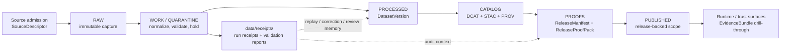

<!-- [KFM_META_BLOCK_V2]
doc_id: kfm://doc/<NEEDS_VERIFICATION_UUID>
title: receipts
type: standard
version: v1
status: draft
owners: @bartytime4life
created: <NEEDS_VERIFICATION_CREATED_DATE>
updated: <NEEDS_VERIFICATION_UPDATED_DATE>
policy_label: <NEEDS_VERIFICATION_POLICY_LABEL>
related: [data/README.md, data/raw/README.md, data/work/README.md, data/quarantine/README.md, data/processed/README.md, data/catalog/README.md, data/published/README.md, data/proofs/README.md, data/registry/README.md, contracts/README.md, schemas/README.md, policy/README.md, tests/README.md, .github/workflows/README.md, .github/CODEOWNERS, .github/PULL_REQUEST_TEMPLATE.md]
tags: [kfm, data, receipts]
notes: [owner confirmed from current public CODEOWNERS, current public main confirms data/receipts exists and the visible directory listing is README.md-only, created/updated/policy_label remain needs verification]
[/KFM_META_BLOCK_V2] -->

<a id="top"></a>

# receipts

Audit-facing process-memory surface for run receipts, validation reports, and replay/correction-ready evidence links in KFM.

> **Status:** experimental  
> **Doc state:** draft  
> **Owners:** `@bartytime4life`  
> **Path:** [`data/receipts/README.md`](./README.md)  
> **Repo fit:** inside [`../README.md`](../README.md); lifecycle neighbors in [`../raw/README.md`](../raw/README.md), [`../work/README.md`](../work/README.md), [`../quarantine/README.md`](../quarantine/README.md), [`../processed/README.md`](../processed/README.md), [`../catalog/README.md`](../catalog/README.md), [`../published/README.md`](../published/README.md), [`../proofs/README.md`](../proofs/README.md), and [`../registry/README.md`](../registry/README.md); shared control surfaces in [`../../contracts/README.md`](../../contracts/README.md), [`../../schemas/README.md`](../../schemas/README.md), [`../../policy/README.md`](../../policy/README.md), [`../../tests/README.md`](../../tests/README.md), [`../../.github/workflows/README.md`](../../.github/workflows/README.md), and [`../../.github/PULL_REQUEST_TEMPLATE.md`](../../.github/PULL_REQUEST_TEMPLATE.md)  
> **Quick jump:** [Scope](#scope) · [Repo fit](#repo-fit) · [Accepted inputs](#accepted-inputs) · [Exclusions](#exclusions) · [Directory tree](#directory-tree) · [Quickstart](#quickstart) · [Usage](#usage) · [Diagram](#diagram) · [Tables](#tables) · [Task list](#task-list) · [FAQ](#faq) · [Appendix](#appendix)  
>      

> [!IMPORTANT]
> `data/receipts/` is a **real directory on the public `main` branch**, and the current public directory listing still shows this lane as **`README.md`-only**.
>
> This README therefore keeps four things distinct:
>
> - **CONFIRMED current public-tree presence**
> - **CONFIRMED KFM doctrine about receipt/process-memory responsibilities**
> - **PROPOSED starter structure** for a fuller receipt surface
> - **UNKNOWN / NEEDS VERIFICATION** details about emitted files, validators, and merge-blocking automation

> [!NOTE]
> In KFM terms, **receipts are not proofs**.
>
> Receipts preserve process memory: ingest, run, validation, and audit-facing evidence needed for replay, correction, and release review.  
> Release-significant manifests, attestations, and proof packs stay separate, typically behind release/proof surfaces.

> [!CAUTION]
> Surrounding contract evidence is now stronger than some older drafts implied:
>
> - root [`../../contracts/README.md`](../../contracts/README.md) now frames `contracts/` as a live contract lane
> - root [`../../schemas/README.md`](../../schemas/README.md) now describes a live nested subtree
> - canonical schema-home authority is **still unresolved**
>
> `data/receipts/` should therefore stay a **process-memory surface**, not a stealth schema home.

---

## Scope

`data/receipts/` is the repo-facing surface for **queryable process memory** inside the broader KFM data lifecycle.

This is **zone-level** documentation. It defines the role, boundaries, and placement rules for receipt-shaped artifacts without pretending that all lower-level filenames, validators, or workflow emitters are already settled.

The surrounding `data/` doctrine makes three things especially clear:

1. process evidence must remain durable enough for replay, rollback, correction, and release review,
2. receipt-like artifacts may live in a central audited surface **or** in version-adjacent packs, and
3. process memory must not silently collapse into release proof, canonical authority, or public runtime truth.

### Evidence posture used here

| Marker | Meaning in this README |
|---|---|
| **CONFIRMED** | Visible on the current public branch or directly aligned with stable KFM lifecycle doctrine already expressed in neighboring repo docs |
| **INFERRED** | A cautious completion that fits the public snapshot and surrounding doctrine, but is not yet directly proven as mounted branch detail |
| **PROPOSED** | Starter structure, placement rule, or naming pattern that fits doctrine but is not yet visible as current branch reality |
| **UNKNOWN / NEEDS VERIFICATION** | Any checked-out branch detail, emitted receipt inventory, exact validator wiring, or canonical schema-home decision not proven from the current public tree |

### Working rule

Use `data/receipts/` for receipt-shaped artifacts that must stay easy to resolve during:

- replay
- correction
- release review
- incident reconstruction
- audit-facing explanation

If a lane keeps receipt packs **beside a dataset version or release**, that is still acceptable.  
This README governs the **boundary** and **role** of receipt artifacts, not one mandatory storage pattern for every lane.

[Back to top](#top)

## Repo fit

`receipts/` sits inside the `data/` lifecycle surface, but it should remain visibly adjacent to sibling zone docs, shared contract/policy surfaces, and workflow/review control.

### Path and adjacent surfaces

| Relation | Surface | Status | Why it matters |
|---|---|---:|---|
| Upstream | [`../README.md`](../README.md) | **CONFIRMED** | Defines the broader `data/` lifecycle role and the receipts-vs-proofs distinction |
| Adjacent lifecycle | [`../raw/README.md`](../raw/README.md) · [`../work/README.md`](../work/README.md) · [`../quarantine/README.md`](../quarantine/README.md) · [`../processed/README.md`](../processed/README.md) · [`../catalog/README.md`](../catalog/README.md) · [`../published/README.md`](../published/README.md) · [`../proofs/README.md`](../proofs/README.md) · [`../registry/README.md`](../registry/README.md) | **CONFIRMED** | These neighboring `data/` surfaces are part of the current public routing story and clarify where receipts stop and stronger or later objects begin |
| Upstream | [`../../contracts/README.md`](../../contracts/README.md) | **CONFIRMED** | Public `main` now treats `contracts/` as a live contract lane; receipt contracts should stay explicit there rather than reappearing ad hoc under `data/receipts/` |
| Upstream | [`../../schemas/README.md`](../../schemas/README.md) | **CONFIRMED** | Public `main` now shows a live nested `schemas/` subtree, but that subtree does **not** settle canonical schema-home authority by itself |
| Upstream | [`../../policy/README.md`](../../policy/README.md) | **CONFIRMED** | Rights, sensitivity, deny-by-default, and obligation logic belong in executable policy surfaces |
| Downstream pressure | [`../../tests/README.md`](../../tests/README.md) | **CONFIRMED** | Tests should exercise receipt behavior, not duplicate receipt ownership |
| Control surfaces | [`../../.github/workflows/README.md`](../../.github/workflows/README.md) · [`../../.github/CODEOWNERS`](../../.github/CODEOWNERS) · [`../../.github/PULL_REQUEST_TEMPLATE.md`](../../.github/PULL_REQUEST_TEMPLATE.md) | **CONFIRMED** | Workflow intent, ownership routing, and PR review expectations are already public control surfaces that shape this lane |

### Current verified snapshot

| Item | Status | Current meaning |
|---|---:|---|
| `data/receipts/` directory exists | **CONFIRMED** | Visible on public `main` |
| `data/receipts/README.md` exists | **CONFIRMED** | Substantive draft README is present on public `main` |
| Current public listing shows additional visible child files or folders under `data/receipts/` | **CONFIRMED no** | Public `main` currently shows `README.md` only in this lane |
| `data/` currently shows sibling child directories including `catalog/`, `processed/`, `proofs/`, `published/`, `quarantine/`, `raw/`, `receipts/`, `registry/`, `specs/`, and `work/` | **CONFIRMED** | The broader lifecycle surface is live on public `main`, though deeper subtree meaning is not automatically proven by path presence alone |
| `data/catalog/` is a visible child lane | **CONFIRMED** | Current public `main` proves the lane exists; deeper `dcat/`, `prov/`, and `stac/` sublane coverage still benefits from direct recheck before stronger claims |
| Current public workflow lane is README-only | **CONFIRMED** | `.github/workflows/README.md` explicitly records `README.md`-only current-tree state on public `main` |
| Root `contracts/` is a live repo lane | **CONFIRMED** | Current public docs now frame it as the contract-first boundary rather than a merely placeholder root surface |
| Root `schemas/` exposes a live nested subtree | **CONFIRMED** | Useful routing signal, but not proof that canonical receipt-schema authority is resolved |
| Current public control-surface ownership resolves to `@bartytime4life` | **CONFIRMED** | Public `CODEOWNERS` maps `/data/` and the global fallback to `@bartytime4life` |
| Authoritative schema home for receipt-shaped contracts is settled | **UNKNOWN / NEEDS VERIFICATION** | Public docs still describe the contract story as split enough that canonical authority should not be flattened prematurely |

> [!WARNING]
> Do **not** treat this directory as a second release lane, a quiet schema registry, or a public runtime surface.  
> Its job is to preserve process memory without confusing where stronger authority lives.

[Back to top](#top)

## Accepted inputs

The following are appropriate for `data/receipts/` when they are stored centrally rather than only version-adjacently:

| Accepted input | Why it belongs here | Typical linkage |
|---|---|---|
| Run receipts | Preserve what ran, when, with what inputs, and with what outcome | run ↔ source / subject / audit |
| Validation reports | Preserve structural, spatial, temporal, or domain QC memory | validation ↔ run / subject |
| Audit-facing process memory | Make replay, correction, and review reconstructable | audit refs ↔ decision / release review |
| Watcher or probe receipts | Preserve operational fetch/probe memory without pretending they are release proofs | watcher ↔ run / artifact / drift check |
| Redacted receipt mirrors | Keep repo-safe traceability when the full operational payload cannot be committed directly | mirror ↔ stronger internal source |
| Lightweight lookup indexes | Help grouped replay/review without becoming a second source of truth | batch ↔ receipt set |

### Minimum bar for anything added here

- It is clearly **receipt-shaped** rather than release-proof-shaped.
- It is small enough to diff and inspect.
- It links to a stronger object or decision when one exists.
- It does not create a second, quieter authority path.
- It can survive replay, correction, or release review without guesswork.

## Exclusions

The following do **not** belong here as the authoritative home:

| Exclusion | Keep it under / behind | Why |
|---|---|---|
| Shared schema files, standards-profile files, shared vocab registries, or machine-readable contract carriers | [`../../contracts/README.md`](../../contracts/README.md) and the still-unsettled canonical schema home described in [`../../schemas/README.md`](../../schemas/README.md) | Prevents a second schema universe |
| Executable policy bundles or rule sources | [`../../policy/README.md`](../../policy/README.md) | Policy must remain independently reviewable and testable |
| Canonical processed dataset authority | [`../processed/README.md`](../processed/README.md) | Receipts should point to authority, not replace it |
| Catalog triplet closure (`DCAT + STAC + PROV`) | [`../catalog/README.md`](../catalog/README.md) | Discoverability and outward lineage closure are a different seam |
| Release manifests, proof packs, attestations, and rollback/correction proof as the primary record | [`../proofs/README.md`](../proofs/README.md) and release-bearing surfaces | Proofs are release-significant, not just process memory |
| Public runtime envelopes, `EvidenceBundle` payloads, or UI-state trust payloads | governed APIs and surface-contract lanes | Runtime trust objects are downstream consumers |
| Raw source bytes or unresolved sensitive material | [`../raw/README.md`](../raw/README.md) or [`../quarantine/README.md`](../quarantine/README.md) | `receipts/` is not a bypass around rights or sensitivity handling |
| Secrets, tokens, host-local credentials, or machine-specific dumps | deployment/runtime secret handling | Auditability is not permission to leak secret material |

> [!WARNING]
> If a file here starts behaving like a release proof, a public runtime object, or a canonical schema, it is in the wrong place.

[Back to top](#top)

## Directory tree

### Current confirmed snapshot

```text
data/receipts/
└── README.md
```

### Confirmed nearby README surfaces on public `main`

```text
data/
├── README.md
├── catalog/README.md
├── processed/README.md
├── proofs/README.md
├── published/README.md
├── quarantine/README.md
├── raw/README.md
├── receipts/README.md
├── registry/README.md
└── work/README.md
```

> [!NOTE]
> The tree above is a **README-surface map**, not a full subtree inventory.  
> It is included here to keep neighboring lifecycle boundaries easy to inspect during review.

### Doctrine-aligned starter shape (`PROPOSED`)

```text
data/receipts/
├── README.md
├── ingest/                 # fetch + landing receipts
├── runs/                   # transform / watcher / pipeline receipts
├── validation/             # validation reports and QC outputs
└── _lookup/                # small indexes for replay / grouped review
```

### Placement rule

Use the tree above as a **starter shape**, not as a claim that those paths already exist on the current branch.

If a lane already keeps receipt packs beside:

- a `DatasetVersion`
- a release bundle
- a lane-local audited surface

prefer **stable linking** over gratuitous duplication.

## Quickstart

### Safe inspection commands

```bash
# inspect the currently checked-in receipts surface
find data/receipts -maxdepth 4 -type f | sort

# inspect neighboring lifecycle and control docs side by side
for p in \
  data/README.md \
  data/raw/README.md \
  data/work/README.md \
  data/quarantine/README.md \
  data/processed/README.md \
  data/catalog/README.md \
  data/published/README.md \
  data/proofs/README.md \
  data/registry/README.md \
  contracts/README.md \
  schemas/README.md \
  policy/README.md \
  tests/README.md \
  .github/workflows/README.md \
  .github/CODEOWNERS \
  .github/PULL_REQUEST_TEMPLATE.md
do
  echo
  echo "== $p =="
  sed -n '1,220p' "$p" 2>/dev/null || true
done

# inspect receipt-shaped terms versus stronger proof/runtime objects
grep -RIn \
  "spec_hash\|run_receipt\|ai_receipt\|IngestReceipt\|ValidationReport\|DecisionEnvelope\|ReviewRecord\|ReleaseManifest\|ReleaseProofPack\|ProjectionBuildReceipt\|EvidenceBundle\|RuntimeResponseEnvelope\|CorrectionNotice\|audit_ref\|attestation" \
  data contracts schemas policy tests docs .github 2>/dev/null || true
```

### First local review pass

1. Confirm whether the checked-out branch still matches public `main` for `data/receipts/`.
2. Confirm whether receipts are stored centrally here, version-adjacently, or as a hybrid.
3. Confirm the authoritative schema home before adding any contract-shaped files.
4. Confirm which workflow checks, if any, actually validate receipt-shaped artifacts.
5. Confirm how receipt files link forward to dataset, decision, release, and correction surfaces.
6. Confirm whether any receipt content must be redacted, linked, or split before commit.

> [!TIP]
> Inspection-first is safer than inventing a validator or path convention in README prose.  
> Let the checked-out branch prove the runner, schema, and gate wiring before this file names them as fact.

## Usage

### What `data/receipts/` is

`data/receipts/` is:

- the repo-facing home for **process memory** when central receipt placement is useful
- the place where replay, correction, and release review can find run/validation context quickly
- a support surface for auditability
- a bridge between lifecycle work and later trust-bearing proof or runtime surfaces

### Placement rules

1. Prefer **diff-friendly, text-first receipt artifacts** over opaque blobs.
2. Preserve **stable join points** across run, subject, decision, release, and audit contexts.
3. Link forward to stronger objects instead of duplicating them wholesale.
4. Keep receipt artifacts easy to resolve during replay, correction, and release review.
5. If a receipt pack is mirrored here from a version-adjacent lane, keep the relationship explicit.
6. When sensitive operational detail is present, commit a redacted mirror here and keep the stronger source elsewhere under policy control.

### What `data/receipts/` is not

`data/receipts/` is **not**:

- a second release lane
- a second contract registry
- a place to bury policy logic
- a replacement for `processed/`, `catalog/`, or `proofs/`
- a generic scratch folder
- a quiet workaround for trust-membrane boundaries

[Back to top](#top)

## Diagram



## Tables

### Receipt boundary map

| Object family | Normal home | Keep in `data/receipts/`? | Why |
|---|---|---:|---|
| `IngestReceipt` | RAW-adjacent or central audited receipt surface | **Sometimes** | Centralization is acceptable if replay remains easy |
| `ValidationReport` | WORK / QUARANTINE or central audited receipt surface | **Yes** | Core process memory |
| Run / watcher / pipeline receipt | Central or lane-adjacent receipt surface | **Yes** | Operational history should stay queryable |
| `DatasetVersion` | `processed/` | **No** | Canonical authority belongs elsewhere |
| `CatalogClosure` | `catalog/` | **No** | Outward metadata closure is a distinct seam |
| `ReleaseManifest` / `ReleaseProofPack` | `proofs/` or release bundle | **No** | Release-significant proof is not just process memory |
| `EvidenceBundle` | runtime / evidence surface | **No** | Inspectable claim support is downstream of receipts |
| `CorrectionNotice` | release / published lineage surface | **No** | Public correction memory must remain visible as correction, not just as a receipt |

### Minimum linkage expectations (`PROPOSED starter rule`)

| Link target | Why it matters |
|---|---|
| source or admission reference | reconstruct what the run or validation event touched |
| subject reference | identify the dataset, feature family, or batch under review |
| decision / review reference | explain why something was allowed, held, generalized, or denied |
| release reference | connect process memory forward to the publishable unit when one exists |
| audit reference | support review, incident reconstruction, or external explanation |

## Task list

- [ ] Replace remaining meta-block placeholders for `doc_id`, dates, and `policy_label`.
- [ ] Recheck whether `data/receipts/` remains `README.md`-only on the target branch before merge.
- [ ] Confirm whether receipts stay central, version-adjacent, or hybrid on the checked-out branch.
- [ ] Confirm the authoritative schema home before adding any schema-like files here.
- [ ] Add at least one real emitted receipt example once the branch exposes it.
- [ ] Add one real linked validation-report example once visible.
- [ ] Verify all relative links against the checked-out branch.
- [ ] Name the first actual validator or workflow path only after it is directly surfaced and reviewable.
- [ ] Confirm that receipt artifacts link cleanly into dataset, decision, release, and correction review paths.

### Definition of done

This README is in a healthy state when:

- it describes the **real current branch** more strongly than it describes hopeful future structure
- it keeps **receipts**, **proofs**, **contracts**, and **runtime trust objects** visibly distinct
- it no longer overstates the surrounding contract lane or schema-home story
- it gives contributors a clear place to put receipt-shaped artifacts without creating a second authority path

[Back to top](#top)

## FAQ

### Is `data/receipts/` different from `data/proofs/`?

Yes.

Receipts preserve process memory such as run receipts, validation reports, and audit-ready context.  
Proofs preserve release-significant evidence such as manifests, attestations, and correction-ready release trace.

### Can a dataset version keep its own receipt pack outside this directory?

Yes.

The surrounding `data/` guidance already allows `data/receipts/` **or** a version-adjacent audited surface.  
What matters is not one mandatory path; what matters is that replay, correction, and release review stay easy.

### Should schemas or policy bundles live here?

No.

This directory may **consume** or **link to** contracts and policy, but it should not quietly become the canonical home for either.

### Can this directory contain protected material?

Only when policy explicitly allows it.

When a receipt contains operational or sensitive detail that should not live in the repo unchanged, prefer a redacted mirror here plus a stronger linked source elsewhere.

## Appendix

<details>
<summary><strong>Illustrative starter conventions</strong> (<code>PROPOSED</code>)</summary>

### Filename pattern ideas

```text
data/receipts/<lane-or-source>/<yyyy-mm-dd>/<receipt-id>.json
data/receipts/<lane-or-source>/<yyyy-mm-dd>/<validation-report-id>.json
```

### Illustrative JSON shape

> [!NOTE]
> This is an illustrative shape only.  
> Use the authoritative contract lane once the target branch confirms where receipt schemas are canonically owned.

```jsonc
{
  "kind": "<RunReceipt|ValidationReport>",
  "schema_version": "<NEEDS_VERIFICATION>",
  "receipt_id": "<stable-id>",
  "created_at": "<RFC3339 timestamp>",
  "refs": {
    "source": "<source-or-admission-ref>",
    "subject": "<optional dataset-or-batch-ref>",
    "decision": "<optional decision-ref>",
    "release": "<optional release-ref>",
    "audit": "<optional audit-ref>"
  },
  "inputs": [],
  "outputs": [],
  "integrity": [],
  "notes": []
}
```

### Small naming rules worth preserving

- Prefer sortable, stable IDs.
- Keep filenames lowercase and diff-friendly.
- Use explicit timestamps instead of ambiguous local date strings.
- Link forward to stronger authority rather than copying large objects into receipts.

</details>

[Back to top](#top)