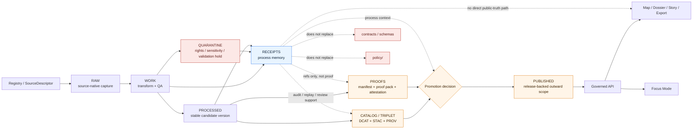

<!-- [KFM_META_BLOCK_V2]
doc_id: kfm://doc/TODO-NEEDS-UUID
title: data/receipts
type: standard
version: v1
status: draft
owners: @bartytime4life
created: TODO-NEEDS-VERIFICATION
updated: 2026-04-22
policy_label: TODO-NEEDS-VERIFICATION
related: [../README.md, ../raw/README.md, ../work/README.md, ../quarantine/README.md, ../processed/README.md, ../catalog/README.md, ../proofs/README.md, ../published/README.md, ../registry/README.md, ../../contracts/README.md, ../../schemas/README.md, ../../policy/README.md, ../../tests/README.md, ../../tools/validators/README.md, ../../.github/workflows/README.md]
tags: [kfm, data, receipts, process-memory, replay, correction, audit, validation, promotion]
notes: [doc_id, created date, and policy_label need active-repo verification before publication; owner is inherited from prior KFM public-main documentation and should be rechecked against current CODEOWNERS; child receipt directories below README are starter guidance unless verified in the active checkout.]
[/KFM_META_BLOCK_V2] -->

<a id="top"></a>

# `data/receipts/`

Audit-facing process-memory surface for receipt-shaped artifacts that support replay, correction, validation review, and governed release decisions.

<div align="left">


</div>

| Impact field | Value |
|---|---|
| **Status** | experimental |
| **Document status** | draft |
| **Owners** | `@bartytime4life` — **NEEDS VERIFICATION** against active `CODEOWNERS` |
| **Path** | `data/receipts/README.md` |
| **Primary role** | central, queryable process memory for receipt-shaped artifacts |
| **Quick jumps** | [Scope](#scope) · [Repo fit](#repo-fit) · [Accepted inputs](#accepted-inputs) · [Exclusions](#exclusions) · [Directory tree](#directory-tree) · [Quickstart](#quickstart) · [Usage](#usage) · [Diagram](#diagram) · [Reference tables](#reference-tables) · [Task list](#task-list) · [FAQ](#faq) · [Appendix](#appendix) |

> [!TIP]
> **receipt ≠ proof ≠ catalog ≠ publication**
>
> Receipts preserve process memory: what ran, what was checked, what was linked, what was held, and what a reviewer needs to replay or investigate later. Release-significant manifests, proof packs, attestations, catalog closure, and published outward scope remain separate surfaces.

> [!CAUTION]
> `data/receipts/` must not become a stealth schema registry, a second release lane, a raw-data hiding place, or a quiet runtime-truth surface.

---

## Scope

`data/receipts/` holds **receipt-shaped process memory** for the KFM data lifecycle. It is a review and audit aid, not the authoritative source of the data, not the public proof of a release, and not a runtime response surface.

Use this lane for small, durable records that help answer questions such as:

- What ran?
- Which source, subject, candidate, or release attempt was involved?
- What validation, policy, or promotion-adjacent checks occurred?
- What outcome was recorded?
- What stronger objects should reviewers inspect next?

### Evidence posture

| Statement | Truth label | Maintainer reading |
|---|---:|---|
| KFM requires a governed lifecycle from source intake through publication. | **CONFIRMED doctrine** | Preserve the lifecycle boundary when adding receipt files. |
| Receipts are process memory and must remain distinct from proofs. | **CONFIRMED doctrine** | A receipt may link to a proof pack; it does not replace one. |
| Prior KFM documentation reports this path as README-first on public `main`. | **CONFIRMED in source corpus / NEEDS VERIFICATION in active checkout** | Re-run the inspection commands below before treating the current branch as equivalent. |
| Child folders such as `validation/`, `watchers/`, or `promotions/` are present now. | **NEEDS VERIFICATION** | Do not document child inventory as current until the branch proves it. |
| Canonical schema home for receipt-shaped contracts is settled. | **UNKNOWN** | Keep schemas and contract carriers in the repo’s contract/schema lanes, not here. |

[Back to top](#top)

---

## Repo fit

**Path:** `data/receipts/README.md`  
**Zone role:** queryable process-memory seam for the KFM data lifecycle.

```text
RAW -> WORK / QUARANTINE -> PROCESSED -> CATALOG / TRIPLET -> PUBLISHED
                  \             \
                   \             -> RECEIPTS support audit/replay/review
                    -> RECEIPTS support blocked-state explanation
```

### Upstream and downstream links

| Relation | Surface | Role | Status |
|---|---|---|---:|
| Parent lifecycle | [`../README.md`](../README.md) | broader data lifecycle rules | **NEEDS VERIFICATION in active checkout** |
| Upstream source identity | [`../registry/README.md`](../registry/README.md) | source descriptors, source admission, refresh context | **NEEDS VERIFICATION** |
| Upstream intake | [`../raw/README.md`](../raw/README.md) | source-native captures and immutable acquisition evidence | **NEEDS VERIFICATION** |
| Upstream work | [`../work/README.md`](../work/README.md) | transform, QA, normalization, redaction candidates | **NEEDS VERIFICATION** |
| Fail-closed neighbor | [`../quarantine/README.md`](../quarantine/README.md) | rights, sensitivity, validation, or review hold | **NEEDS VERIFICATION** |
| Stable candidate handoff | [`../processed/README.md`](../processed/README.md) | stable dataset versions and manifests | **NEEDS VERIFICATION** |
| Catalog closure | [`../catalog/README.md`](../catalog/README.md) | `DCAT + STAC + PROV` discoverability and lineage closure | **NEEDS VERIFICATION** |
| Release proof | [`../proofs/README.md`](../proofs/README.md) | manifests, proof packs, attestations, rollback/correction proof | **NEEDS VERIFICATION** |
| Outward scope | [`../published/README.md`](../published/README.md) | release-backed public or semi-public materialized outputs | **NEEDS VERIFICATION** |
| Contract/schema authority | [`../../contracts/README.md`](../../contracts/README.md) · [`../../schemas/README.md`](../../schemas/README.md) | machine contract and schema lanes | **NEEDS VERIFICATION** |
| Policy authority | [`../../policy/README.md`](../../policy/README.md) | deny/default rules, obligations, policy decisions | **NEEDS VERIFICATION** |
| Validation tooling | [`../../tools/validators/README.md`](../../tools/validators/README.md) | checks that may consume or emit receipt-linked reports | **NEEDS VERIFICATION** |
| Test surface | [`../../tests/README.md`](../../tests/README.md) | valid/invalid fixture and regression expectations | **NEEDS VERIFICATION** |
| Workflow orchestration | [`../../.github/workflows/README.md`](../../.github/workflows/README.md) | CI orchestration; not receipt ownership | **NEEDS VERIFICATION** |

> [!IMPORTANT]
> Public clients and normal UI surfaces should not read `data/receipts/` as truth. They should consume governed APIs, released artifacts, catalog records, and EvidenceBundle-backed response envelopes.

[Back to top](#top)

---

## Accepted inputs

The following belong here when they are **receipt-shaped**, small enough to inspect, and useful for replay, correction, audit, or release review.

| Accepted input | Why it belongs here | Typical linkage |
|---|---|---|
| Ingest receipts | Preserve what entered, when, with what source context, and with what landing outcome. | `source_id` · `run_id` · raw capture refs |
| Run receipts | Preserve one bounded execution and final outcome. | `run_id` · `spec_hash` · candidate refs |
| Validation reports | Preserve structural, spatial, temporal, policy-adjacent, or domain QC memory. | validator · subject · pass/fail refs |
| Watcher or probe receipts | Preserve observation, freshness, drift, or source-check memory without becoming release proof. | watcher/probe · run · source |
| Connector-admission receipts | Preserve allow, deny, abstain, or error memory for source-entry decisions. | connector candidate · policy result |
| Promotion-process receipts | Preserve gate execution, handoff, review, or attestation-verification memory. | promotion candidate · proof refs |
| Redacted receipt mirrors | Keep repo-safe traceability when the full operational receipt cannot be committed. | internal receipt ref · redaction reason |
| Lightweight lookup indexes | Help grouped replay or review without becoming a second source of truth. | batch · receipt set · audit ref |

### Minimum bar for anything added here

A file likely belongs in `data/receipts/` when all of these are true:

1. It is clearly **receipt-shaped**, not release-proof-shaped.
2. It records a bounded action, check, run, decision support event, or review handoff.
3. It links to stronger objects when they exist instead of copying them.
4. It avoids raw source payloads, secrets, exact sensitive geometry, and unpublished restricted content.
5. It can support replay, correction, or release review without guesswork.
6. It remains subordinate to contracts, schemas, policy, proofs, catalog, and publication state.

[Back to top](#top)

---

## Exclusions

The following do **not** belong here as their authoritative home.

| Excluded content | Put it under / behind | Why |
|---|---|---|
| Shared schemas, vocabulary registries, or machine-readable contract carriers | [`../../contracts/README.md`](../../contracts/README.md) and [`../../schemas/README.md`](../../schemas/README.md) | Prevents a second schema universe. |
| Executable policy bundles or rule sources | [`../../policy/README.md`](../../policy/README.md) | Policy must stay independently reviewable and testable. |
| Canonical processed dataset authority | [`../processed/README.md`](../processed/README.md) | Receipts should point to authority, not replace it. |
| Catalog triplet closure: `DCAT + STAC + PROV` | [`../catalog/README.md`](../catalog/README.md) | Discoverability and outward lineage closure are a different seam. |
| Release manifests, proof packs, attestations, and rollback proof as the primary record | [`../proofs/README.md`](../proofs/README.md) or release-bearing surfaces | Proofs are release-significant, not just process memory. |
| Public runtime envelopes, EvidenceBundle payloads, or UI trust payloads | governed API and runtime contract lanes | Runtime trust objects are downstream consumers. |
| Raw source bytes or unresolved sensitive material | [`../raw/README.md`](../raw/README.md) or [`../quarantine/README.md`](../quarantine/README.md) | `receipts/` is not a bypass around rights or sensitivity handling. |
| Temporary working caches or job scratch | [`../work/README.md`](../work/README.md) | Temporary state should stay bounded and disposable. |
| Generic CI artifacts with no replay, correction, or audit role | workflow artifact storage | Not every log deserves governed process-memory status. |
| Secrets, tokens, credentials, host-local dumps, or private keys | secret-management surfaces outside the repo | Auditability is not permission to leak secrets. |

> [!WARNING]
> If a file here starts behaving like a proof pack, public runtime answer, canonical schema, policy bundle, or raw-source store, it is in the wrong place.

[Back to top](#top)

---

## Directory tree

### Reported public-main snapshot

The source corpus reports this lane as README-first. Recheck the active branch before merge.

```text
data/receipts/
└── README.md
```

### Nearby README surface map

```text
data/
├── README.md
├── catalog/README.md
├── processed/README.md
├── proofs/README.md
├── published/README.md
├── quarantine/README.md
├── raw/README.md
├── receipts/README.md
├── registry/README.md
└── work/README.md
```

> [!NOTE]
> The tree above is a **README-surface map**, not a full subtree inventory or maturity claim.

### Doctrine-aligned starter shape (`PROPOSED`)

Use this as starter guidance only after the active branch is inspected.

```text
data/receipts/
├── README.md
├── ingest/                 # fetch, landing, source-admission receipts
├── validation/             # validation reports and QC process memory
├── connectors/             # connector-admission and source-check receipts
├── watchers/               # watcher/probe receipt families when centralized here
├── promotions/             # promotion-process memory, not release proofs
├── audits/                 # replay, correction, incident, or review context
└── _lookup/                # small derived indexes for grouped replay/review
```

### Adjacent run-receipt shape (`PROPOSED / NEEDS VERIFICATION`)

Some KFM source material distinguishes broad receipt memory from run-level receipt memory. If the active branch has a `data/run_receipts/` surface, keep the distinction visible.

```text
data/run_receipts/
├── <collection-or-lane>.<timestamp>.json
└── <run-local process memory only>
```

### Placement rule

Prefer **stable linking** over gratuitous duplication. If a lane already keeps receipt packs beside a `DatasetVersion`, release bundle, or lane-local audited surface, link to that pack rather than copying it into a central folder.

[Back to top](#top)

---

## Quickstart

### 1. Inspect the active checkout

```bash
git status --short
git branch --show-current
git rev-parse --show-toplevel

find data/receipts -maxdepth 4 -type f 2>/dev/null | sort
find data/run_receipts -maxdepth 4 -type f 2>/dev/null | sort
```

### 2. Read adjacent lifecycle boundaries

```bash
for p in \
  data/README.md \
  data/raw/README.md \
  data/work/README.md \
  data/quarantine/README.md \
  data/processed/README.md \
  data/catalog/README.md \
  data/proofs/README.md \
  data/published/README.md \
  data/registry/README.md \
  contracts/README.md \
  schemas/README.md \
  policy/README.md \
  tests/README.md \
  tools/validators/README.md \
  .github/workflows/README.md \
  .github/CODEOWNERS
do
  echo
  echo "== $p =="
  sed -n '1,220p' "$p" 2>/dev/null || true
done
```

### 3. Inspect receipt-shaped vocabulary

```bash
grep -RIn \
  "spec_hash\|run_receipt\|ai_receipt\|IngestReceipt\|ValidationReport\|DecisionEnvelope\|ReviewRecord\|ReleaseManifest\|ProofPack\|EvidenceBundle\|RuntimeResponseEnvelope\|CorrectionNotice\|audit_ref\|attestation\|proof_pack\|data/receipts\|data/run_receipts" \
  data contracts schemas policy tests tools docs .github 2>/dev/null || true
```

### 4. Before adding a receipt

Ask these in order:

1. Does this object record bounded process memory?
2. Is it safe to commit?
3. Does it avoid duplicating stronger objects?
4. Does it link to the run, source, subject, candidate, proof, catalog, or decision it supports?
5. Is the outcome grammar explicitly documented or labeled **PROPOSED**?
6. Would a future reviewer know what to replay or inspect next?

[Back to top](#top)

---

## Usage

### Naming guidance

Use names that preserve the receipt family, date or run identity, subject, and status without hiding meaning in opaque filenames.

```text
data/receipts/<family>/<YYYY-MM-DD>/<subject>.<run_id>.receipt.json
data/receipts/validation/<dataset_key>/<run_id>.validation_report.json
data/receipts/promotions/<promotion_id>/<gate_name>.receipt.json
data/receipts/watchers/<watcher_family>/<YYYY-MM-DD>/<subject>.receipt.json
```

These patterns are **PROPOSED** until an active branch or contract standard locks the exact convention.

### Minimal receipt payload shape (`PROPOSED example`)

```json
{
  "receipt_version": "kfm.receipt.v1",
  "receipt_type": "validation_report",
  "recorded_at": "2026-04-22T00:00:00Z",
  "run_id": "TODO-NEEDS-VERIFICATION",
  "subject_ref": "data/processed/<domain>/<spec_hash>/manifest.json",
  "spec_hash": "sha256:<lowercase-hex>",
  "inputs": [
    {
      "ref": "data/work/<domain>/<run_id>/candidate.json",
      "digest": "sha256:<lowercase-hex>"
    }
  ],
  "outputs": [
    {
      "ref": "data/receipts/validation/<dataset_key>/<run_id>.validation_report.json",
      "digest": "sha256:<lowercase-hex>"
    }
  ],
  "outcome": "PASS",
  "links": {
    "source_descriptor": "data/registry/sources/<source_id>.yaml",
    "quarantine_ref": null,
    "proof_ref": null,
    "catalog_ref": null,
    "audit_ref": "TODO-NEEDS-VERIFICATION"
  },
  "notes": [
    "Illustrative receipt shape only.",
    "Does not replace proof packs, catalog closure, or publication state."
  ]
}
```

### Link, do not flatten

Receipts may carry references to stronger objects. They should not inline or redefine them.

| Stronger object | Receipt behavior |
|---|---|
| `SourceDescriptor` | Link by stable source ID or descriptor path. |
| `EvidenceBundle` | Link only when a governed bundle exists; do not recreate the bundle here. |
| `ReleaseManifest` | Link to release candidate or release scope; do not treat the receipt as the manifest. |
| `ProofPack` / attestation | Link to proof refs; keep proof material in proof surfaces. |
| `CatalogMatrix` / `DCAT + STAC + PROV` | Link to catalog closure; do not store closure objects here. |
| `CorrectionNotice` | Link to correction or rollback lineage when relevant. |

[Back to top](#top)

---

## Diagram



[Back to top](#top)

---

## Reference tables

### Surface boundary matrix

| Surface | Primary job | Do not confuse it with |
|---|---|---|
| `data/registry/` | source admission, descriptor identity, refresh posture | receipt memory or proof packs |
| `data/raw/` | source-native acquisition capture | transform work or public authority |
| `data/work/` | repeatable transform and QA staging | canonical processed authority |
| `data/quarantine/` | fail-closed hold for blocked, ambiguous, sensitive, invalid, or review-needed material | receipt archive or release proof |
| `data/processed/` | stable candidate dataset versions and manifests | final publication decision |
| `data/receipts/` | process memory for replay, correction, validation, audit, and review | proof pack, schema home, catalog closure, runtime truth |
| `data/catalog/` | outward discovery and lineage closure | run memory or release attestation |
| `data/proofs/` | release-significant proof material | run receipts or generic logs |
| `data/published/` | release-backed outward materialized scope | raw truth source or proof source |

### Receipt family matrix

| Receipt family | Typical result grammar | Common next surface | Notes |
|---|---|---|---|
| Ingest | `PASS` · `FAIL` · `ERROR` | raw / work / quarantine | Keep source landing facts visible. |
| Validation | `PASS` · `FAIL` · `SKIPPED` · `ERROR` | work / quarantine / promotion candidate | Do not treat validation success as publication. |
| Policy-adjacent | `ALLOW` · `DENY` · `ABSTAIN` · `ERROR` · `SKIPPED` | quarantine / promotion / review | Policy source remains under `policy/`. |
| Watcher/probe | `NO_CHANGE` · `CHANGED` · `HELD` · `ERROR` | work / receipts / review | Exact grammar needs branch-level standardization. |
| Run receipt | `NO_CHANGE` · `PROMOTED` · `QUARANTINED` · `HELD` · `ERROR` | proof / catalog / quarantine / audit | Run receipts are write-once process memory. |
| Promotion-process | `PASS` · `HOLD` · `DENY` · `ERROR` | proofs / published / rollback | Promotion state is stronger than receipt state. |
| Redaction/generalization | `APPLIED` · `HELD` · `DENY` · `ERROR` | quarantine / proofs / published-safe derivative | Sensitive lanes need policy and steward review. |

> [!NOTE]
> The outcome words above are documentation-aligned starter vocabulary. Lock them only through the active contract/schema lane.

### Good receipt indicators

| Indicator | Healthy signal |
|---|---|
| Identity | includes `run_id`, `subject_ref`, `source_id`, `spec_hash`, or equivalent stable refs |
| Safety | excludes secrets, private tokens, raw payload dumps, exact sensitive geometry, and unpublished restricted data |
| Linkage | points to stronger objects by stable ref or digest |
| Replay value | tells a future maintainer what to rerun or inspect |
| Diffability | small, structured, deterministic enough to review |
| Boundary discipline | does not redefine schemas, policy, release manifests, proof packs, or catalog closure |

[Back to top](#top)

---

## Task list

### Minimum credible definition of done

- [ ] `doc_id`, `created`, and `policy_label` placeholders are resolved or intentionally left as review blockers.
- [ ] Active checkout confirms whether `data/receipts/` is still README-first or has child folders.
- [ ] `CODEOWNERS` confirms the owner for `data/receipts/`.
- [ ] Accepted inputs and exclusions match adjacent lifecycle READMEs.
- [ ] Receipt/proof/catalog/publication separation remains visible in prose, tables, and diagram.
- [ ] Any child folder described as current is backed by branch-visible files.
- [ ] Any outcome grammar is either contract-backed or labeled **PROPOSED**.
- [ ] Any example receipt is clearly illustrative unless it is a checked-in fixture.
- [ ] No raw source payloads, secrets, sensitive exact locations, or unpublished restricted details are stored here.
- [ ] Links to `contracts/`, `schemas/`, `policy/`, `tests/`, `tools/validators/`, and `.github/workflows/` are rechecked from this file location.
- [ ] Adjacent docs stay synchronized: `data/README.md`, `data/quarantine/README.md`, `data/proofs/README.md`, `data/catalog/README.md`, `data/published/README.md`, `contracts/README.md`, `schemas/README.md`, `policy/README.md`, and `tests/README.md`.

### Review gates for new receipt files

- [ ] Does the file preserve process memory rather than asserting final truth?
- [ ] Does it link to stronger objects rather than copying them?
- [ ] Can a reviewer reconstruct the run or decision support path?
- [ ] Is the receipt safe to commit?
- [ ] Does the receipt explain `DENY`, `ABSTAIN`, `HELD`, `QUARANTINED`, or `ERROR` outcomes as first-class states?
- [ ] Does the file avoid implying that a successful receipt is a successful release?
- [ ] Are rollback, correction, or quarantine refs present when the outcome requires them?

[Back to top](#top)

---

## FAQ

### Is `data/receipts/` the same as `data/proofs/`?

No. Receipts record process memory. Proofs carry release-significant trust evidence such as manifests, proof packs, attestations, rollback proof, or correction proof.

### Is a passing validation receipt enough to publish?

No. Validation can support a promotion candidate, but publication requires catalog closure, policy state, review state, proof objects, and a governed promotion decision.

### Can receipt files point to proofs?

Yes. A receipt may link to proof refs, signature bundles, release manifests, or catalog refs. It should not inline or replace them.

### Can receipts include redacted mirrors?

Yes, when the full operational receipt is not safe to commit. The mirror should say what was redacted, why, and where authorized reviewers can resolve the stronger internal source.

### Should schemas for receipts live here?

No. Receipt examples may live here when they are emitted process memory or intentionally reviewed fixtures, but shared schemas and contract definitions belong in the repo’s contract/schema lanes.

### Can runtime UI consume receipts directly?

Ordinary public UI should not treat receipts as runtime truth. UI trust surfaces should consume governed APIs, released artifacts, catalog records, and EvidenceBundle-backed envelopes.

### What should happen to unsupported or sensitive receipt content?

Fail closed. Store a safe mirror, link to quarantine or restricted evidence, or hold the object outside public repo scope. Do not normalize sensitive material into exposure just to make audit easier.

[Back to top](#top)

---

## Appendix

<details>
<summary><strong>Appendix A — local inspection checklist</strong></summary>

Use this when reviewing a receipts PR.

```bash
# 1. Confirm branch and worktree state.
git status --short
git branch --show-current

# 2. Inspect receipt inventory.
find data/receipts -maxdepth 5 -type f 2>/dev/null | sort

# 3. Look for risky payloads.
grep -RIn \
  "BEGIN PRIVATE KEY\|api_key\|token\|secret\|password\|authorization\|set-cookie" \
  data/receipts 2>/dev/null || true

# 4. Look for boundary drift.
grep -RIn \
  "ReleaseManifest\|ProofPack\|EvidenceBundle\|RuntimeResponseEnvelope\|DCAT\|STAC\|PROV\|policy bundle\|schema" \
  data/receipts 2>/dev/null || true

# 5. Confirm adjacent docs still agree.
for p in \
  data/README.md \
  data/proofs/README.md \
  data/catalog/README.md \
  data/published/README.md \
  contracts/README.md \
  schemas/README.md \
  policy/README.md \
  tests/README.md
do
  test -f "$p" && echo "ok: $p" || echo "missing: $p"
done
```

</details>

<details>
<summary><strong>Appendix B — common anti-patterns</strong></summary>

| Anti-pattern | Why it is unsafe | Safer move |
|---|---|---|
| “The receipt says PASS, so publish it.” | Validation and publication are different states. | Require promotion gate, proof refs, catalog closure, and review state. |
| “Store the raw payload in the receipt.” | Receipts become a bypass around RAW and sensitivity controls. | Store refs, digests, and safe excerpts only. |
| “Put the schema beside the receipt.” | Creates a hidden schema lane. | Place contract/schema in the canonical contract/schema home. |
| “Copy the proof pack into receipts for convenience.” | Duplicates release-significant truth and risks drift. | Link to proof pack by stable ref and digest. |
| “Use receipts as a runtime API source.” | Turns process memory into public truth. | Route UI through governed API and EvidenceBundle resolution. |
| “Delete failed receipts after cleanup.” | Erases audit and correction memory. | Preserve failure receipts unless retention policy requires restricted handling. |

</details>

<details>
<summary><strong>Appendix C — glossary</strong></summary>

| Term | Working meaning in this README |
|---|---|
| `receipt` | Bounded process-memory record for a run, check, handoff, validation, admission, or review-support event. |
| `run receipt` | A write-once record of one bounded execution and its outcome. |
| `validation report` | Receipt-like memory from structural, spatial, temporal, domain, or policy-adjacent checks. |
| `proof pack` | Release-significant proof assembly; stronger than a receipt. |
| `EvidenceBundle` | Reviewable evidence object used to support inspectable claims. |
| `ReleaseManifest` | Release-assembly record for outward scope. |
| `CatalogMatrix` | Closure check across catalog/provenance/distribution records. |
| `DecisionEnvelope` | Structured decision payload for policy, promotion, correction, or review boundaries. |
| `spec_hash` | Deterministic identity anchor for a source spec, manifest, contract, or release-relevant configuration. |

</details>

[Back to top](#top)
