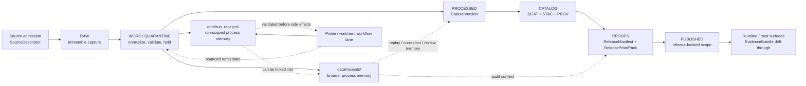

<!--
KFM Meta Block V2
doc_id: kfm://doc/<NEEDS_VERIFICATION_UUID>
title: data/receipts
type: standard
version: v1
status: draft
owners: @bartytime4life
created: <NEEDS_VERIFICATION_CREATED_DATE>
updated: 2026-04-16
policy_label: <NEEDS_VERIFICATION_POLICY_LABEL>
related:
  - ../README.md
  - ../raw/README.md
  - ../work/README.md
  - ../quarantine/README.md
  - ../processed/README.md
  - ../catalog/README.md
  - ../published/README.md
  - ../proofs/README.md
  - ../registry/README.md
  - ../../contracts/README.md
  - ../../schemas/README.md
  - ../../policy/README.md
  - ../../tests/README.md
  - ../../tools/validators/README.md
  - ../../tools/validators/connector_gate/README.md
  - ../../tools/validators/promotion_gate/README.md
  - ../../tools/attest/README.md
  - ../../tools/probes/README.md
  - ../../.github/workflows/README.md
  - ../../.github/watchers/README.md
  - ../../.github/CODEOWNERS
  - ../../.github/PULL_REQUEST_TEMPLATE.md
  - ../run_receipts/
tags:
  - kfm
  - data
  - receipts
  - process-memory
  - replay
  - correction
  - audit
  - workflows
  - watchers
  - run-receipts
notes:
  - Owner confirmed from current public CODEOWNERS coverage for `/data/`.
  - Public-main snapshot indicates `data/receipts/` exists and remains README-first.
  - This revision makes receipt/proof separation and receipts-vs-run-receipts distinctions more explicit.
  - doc_id, created date, and policy_label remain NEEDS VERIFICATION.
-->

<a id="top"></a>

# `data/receipts/`

Audit-facing **process-memory** surface for receipts, validation reports, and replay/correction-ready evidence links in KFM.

<div align="left">


</div>

| Field | Value |
|---|---|
| **Status** | experimental |
| **Document status** | draft |
| **Owners** | `@bartytime4life` |
| **Path** | [`data/receipts/README.md`](./README.md) |
| **Role** | central process-memory surface for receipt-shaped artifacts |
| **Quick jumps** | [Scope](#scope) · [Repo fit](#repo-fit) · [Accepted inputs](#accepted-inputs) · [Exclusions](#exclusions) · [Directory tree](#directory-tree) · [Quickstart](#quickstart) · [Usage](#usage) · [Diagram](#diagram) · [Reference tables](#reference-tables) · [Task list](#task-list) · [FAQ](#faq) · [Appendix](#appendix) |

> [!IMPORTANT]
> `data/receipts/` is a **real directory on public `main`**, and the visible public snapshot still shows this lane as **README-first**.
>
> This README keeps six things distinct:
>
> - **CONFIRMED** current public-tree presence
> - **CONFIRMED** KFM doctrine about receipt/process-memory responsibilities
> - **CONFIRMED in-session doctrine alignment** with probe, validator, policy, workflow, and watcher documentation
> - **CONFIRMED adjacent distinction** between `data/receipts/` and `data/run_receipts/`
> - **PROPOSED** starter structure for a fuller receipt surface
> - **UNKNOWN / NEEDS VERIFICATION** details about emitted files, validators, schemas, and merge-blocking automation

> [!TIP]
> In KFM terms:
>
> **receipt ≠ run receipt ≠ proof ≠ catalog ≠ publication**
>
> - **receipts** preserve broader process memory: ingest, validation, review, correction, and audit-facing context
> - **run receipts** preserve bounded execution memory for a specific run or probe
> - **proofs** preserve release-significant trust objects
>
> These may link to one another, but they should not collapse into one artifact class.

> [!CAUTION]
> `data/receipts/` should stay a **process-memory surface**, not a stealth schema home, a second release lane, a quiet runtime-truth surface, or a generic artifact dump.

---

## Scope

`data/receipts/` is the repo-facing surface for **queryable process memory** inside the broader KFM data lifecycle.

This is **zone-level** documentation. It defines the role, boundaries, and placement rules for receipt-shaped artifacts without pretending that all lower-level filenames, validators, or workflow emitters are already settled.

The surrounding `data/` doctrine and adjacent `.github`, `tools/`, `contracts/`, and `policy` documentation make five things especially clear:

1. process evidence must remain durable enough for replay, rollback, correction, and release review
2. receipt-like artifacts may live in a central audited surface **or** in version-adjacent packs
3. process memory must not silently collapse into release proof, canonical authority, or public runtime truth
4. workflows, probes, watchers, and validators may **emit**, **consume**, or **check** receipts, but they do not change the role of this directory
5. **run receipts** are a narrower adjacent surface, not a synonym for all receipts

### Evidence posture used here

| Marker | Meaning in this README |
|---|---|
| **CONFIRMED** | Visible on the current public branch or directly aligned with stable KFM lifecycle doctrine already expressed in neighboring repo docs |
| **INFERRED** | A cautious completion that fits the public snapshot and surrounding doctrine, but is not yet directly proven as mounted branch detail |
| **PROPOSED** | Starter structure, placement rule, or naming pattern that fits doctrine but is not yet visible as current branch reality |
| **UNKNOWN / NEEDS VERIFICATION** | Any checked-out branch detail, emitted receipt inventory, exact validator wiring, or canonical schema-home decision not proven from the current public tree |

### Working rule

Use `data/receipts/` for receipt-shaped artifacts that must stay easy to resolve during:

- replay
- correction
- release review
- incident reconstruction
- audit-facing explanation

Use `data/run_receipts/` when the object is explicitly **run-scoped process memory** for a bounded execution or probe.

If a lane keeps receipt packs **beside a dataset version or release**, that is still acceptable.  
This README governs the **boundary** and **role** of receipt artifacts, not one mandatory storage pattern for every lane.

### What changed in this revision

This revision makes two governance boundaries more explicit:

- workflows may schedule, validate, and publish receipt artifacts
- probes and watchers may emit **run receipts** as process memory
- validators may consume receipt linkage
- proofs remain separate trust objects even when built from validated receipts
- `data/receipts/` and `data/run_receipts/` should be read as **adjacent but non-identical surfaces**

That distinction matters for new probe-oriented automation and prevents receipts from becoming a quiet replacement for release evidence.

[Back to top](#top)

---

## Repo fit

`receipts/` sits inside the `data/` lifecycle surface, but should remain visibly adjacent to sibling zone docs, shared contract/policy surfaces, and workflow/review control.

### Path and adjacent surfaces

| Relation | Surface | Status | Why it matters |
|---|---|---:|---|
| Upstream | [`../README.md`](../README.md) | **CONFIRMED** | Defines the broader `data/` lifecycle role and the receipts-vs-proofs distinction |
| Adjacent lifecycle | [`../raw/README.md`](../raw/README.md) · [`../work/README.md`](../work/README.md) · [`../quarantine/README.md`](../quarantine/README.md) · [`../processed/README.md`](../processed/README.md) · [`../catalog/README.md`](../catalog/README.md) · [`../published/README.md`](../published/README.md) · [`../proofs/README.md`](../proofs/README.md) · [`../registry/README.md`](../registry/README.md) | **CONFIRMED** | These neighboring `data/` surfaces clarify where receipts stop and stronger or later objects begin |
| Adjacent process-memory surface | [`../run_receipts/`](../run_receipts/) | **CONFIRMED as adjacent documented surface** | Run receipts are a narrower sibling surface for bounded execution memory |
| Upstream authority | [`../../contracts/README.md`](../../contracts/README.md) | **CONFIRMED** | Receipt contracts should stay explicit there rather than reappearing ad hoc under `data/receipts/` |
| Upstream authority | [`../../schemas/README.md`](../../schemas/README.md) | **CONFIRMED** | Public `main` shows a live nested `schemas/` subtree, but that does **not** settle canonical receipt-schema authority by itself |
| Upstream authority | [`../../policy/README.md`](../../policy/README.md) | **CONFIRMED** | Rights, sensitivity, deny-by-default, and obligation logic belong in policy surfaces |
| Adjacent validator pressure | [`../../tools/validators/README.md`](../../tools/validators/README.md) | **CONFIRMED** | Validators may consume receipt linkage, but should not become receipt ownership |
| Adjacent validator pressure | [`../../tools/validators/connector_gate/README.md`](../../tools/validators/connector_gate/README.md) | **INFERRED** | Connector admission should emit receipt-shaped process memory on allow/deny/abstain paths |
| Adjacent validator pressure | [`../../tools/validators/promotion_gate/README.md`](../../tools/validators/promotion_gate/README.md) | **INFERRED** | Promotion validation depends on receipt/proof separation and replayable process memory |
| Adjacent attestation pressure | [`../../tools/attest/README.md`](../../tools/attest/README.md) | **INFERRED** | Proof-pack assembly may consume validated receipt references, but that does not convert receipts into proofs |
| Adjacent probe/watcher pressure | [`../../tools/probes/README.md`](../../tools/probes/README.md) | **CONFIRMED** | Probe surfaces may emit bounded run receipts or central receipts without becoming release lanes |
| Control surfaces | [`../../.github/workflows/README.md`](../../.github/workflows/README.md) · [`../../.github/watchers/README.md`](../../.github/watchers/README.md) · [`../../.github/CODEOWNERS`](../../.github/CODEOWNERS) · [`../../.github/PULL_REQUEST_TEMPLATE.md`](../../.github/PULL_REQUEST_TEMPLATE.md) | **CONFIRMED** | Workflow intent, watcher boundaries, ownership routing, and PR review expectations shape this lane |

### Current verified snapshot

| Item | Status | Current meaning |
|---|---:|---|
| `data/receipts/` directory exists | **CONFIRMED** | Visible on public `main` |
| `data/receipts/README.md` exists | **CONFIRMED** | Substantive draft README is present on public `main` |
| Current public listing shows additional visible child files or folders under `data/receipts/` | **CONFIRMED no** | Public `main` currently shows `README.md` only in this lane |
| `data/run_receipts/` is now an explicitly referenced adjacent surface in repo docs | **CONFIRMED in adjacent documentation** | Run-level process memory is now a distinct documented concern |
| `data/` currently shows sibling child directories including `catalog/`, `processed/`, `proofs/`, `published/`, `quarantine/`, `raw/`, `receipts/`, `registry/`, `specs/`, and `work/` | **CONFIRMED** | The broader lifecycle surface is live on public `main`, though deeper subtree meaning is not automatically proven by path presence alone |
| Current public workflow, probe, validator, and policy docs describe receipts as governed process memory rather than proofs | **CONFIRMED in-session doctrine alignment** | Adjacent docs reinforce the same boundary this README depends on |
| Current public control-surface ownership resolves to `@bartytime4life` | **CONFIRMED** | Public `CODEOWNERS` maps `/data/` and the global fallback to `@bartytime4life` |
| Authoritative schema home for receipt-shaped contracts is settled | **UNKNOWN / NEEDS VERIFICATION** | Public docs still describe the contract story as split enough that canonical authority should not be flattened prematurely |

> [!WARNING]
> Do **not** treat this directory as a second release lane, a quiet schema registry, or a public runtime surface.  
> Its job is to preserve process memory without confusing where stronger authority lives.

[Back to top](#top)

---

## Accepted inputs

The following are appropriate for `data/receipts/` when stored centrally rather than only version-adjacently:

| Accepted input | Why it belongs here | Typical linkage |
|---|---|---|
| Ingest receipts | Preserve what entered, when, and with what landing outcome | ingest ↔ source / subject / audit |
| Validation reports | Preserve structural, spatial, temporal, or domain QC memory | validation ↔ run / subject |
| Audit-facing process memory | Make replay, correction, and review reconstructable | audit refs ↔ decision / release review |
| Watcher receipts | Preserve operational observation memory without pretending they are release proofs | watcher ↔ run / artifact / drift check |
| Connector-admission receipts | Preserve allow / abstain / deny / error process memory for source-entry decisions | connector candidate ↔ decision / subject / audit |
| Promotion-process receipts | Preserve gate execution, attestation verification, and review-stage process memory | promotion candidate ↔ decision / proof / audit |
| Redacted receipt mirrors | Keep repo-safe traceability when the full operational payload cannot be committed directly | mirror ↔ stronger internal source |
| Lightweight lookup indexes | Help grouped replay/review without becoming a second source of truth | batch ↔ receipt set |

### Closely related but usually adjacent

| Object | Better fit | Why |
|---|---|---|
| Bounded probe run receipt | `data/run_receipts/` | run-scoped process memory is more precise there |
| Temporary work cache | `data/work/` | bounded ephemeral state is not durable process memory |
| Release proof pack | `data/proofs/` | proof is stronger than process memory |
| Public runtime envelope | runtime / app surfaces | outward trust objects are downstream consumers |

### Minimum bar for anything added here

- it is clearly **receipt-shaped** rather than release-proof-shaped
- it is small enough to diff and inspect
- it links to a stronger object or decision when one exists
- it does not create a second, quieter authority path
- it can survive replay, correction, or release review without guesswork
- if emitted by a watcher or workflow, it still reads as process memory rather than publish state

---

## Exclusions

The following do **not** belong here as the authoritative home:

| Exclusion | Keep it under / behind | Why |
|---|---|---|
| Shared schema files, standards-profile files, shared vocab registries, or machine-readable contract carriers | [`../../contracts/README.md`](../../contracts/README.md) and the still-unsettled canonical schema home described in [`../../schemas/README.md`](../../schemas/README.md) | Prevents a second schema universe |
| Executable policy bundles or rule sources | [`../../policy/README.md`](../../policy/README.md) | Policy must remain independently reviewable and testable |
| Canonical processed dataset authority | [`../processed/README.md`](../processed/README.md) | Receipts should point to authority, not replace it |
| Catalog triplet closure (`DCAT + STAC + PROV`) | [`../catalog/README.md`](../catalog/README.md) | Discoverability and outward lineage closure are a different seam |
| Release manifests, proof packs, attestations, and rollback/correction proof as the primary record | [`../proofs/README.md`](../proofs/README.md) and release-bearing surfaces | Proofs are release-significant, not just process memory |
| Public runtime envelopes, `EvidenceBundle` payloads, or UI-state trust payloads | governed APIs and surface-contract lanes | Runtime trust objects are downstream consumers |
| Run-scoped receipts whose main value is bounded execution memory | [`../run_receipts/`](../run_receipts/) | preserve lane distinction between broad receipt memory and run-level receipt memory |
| Raw source bytes or unresolved sensitive material | [`../raw/README.md`](../raw/README.md) or [`../quarantine/README.md`](../quarantine/README.md) | `receipts/` is not a bypass around rights or sensitivity handling |
| Working caches or ephemeral job state | [`../work/README.md`](../work/README.md) | Temporary state belongs in bounded work surfaces, not in process-memory archives |
| CI-only generic artifacts with no replay, correction, or audit role | workflow artifact storage only | Not every artifact deserves process-memory status |
| Secrets, tokens, host-local credentials, or machine-specific dumps | deployment/runtime secret handling | Auditability is not permission to leak secret material |

> [!WARNING]
> If a file here starts behaving like a release proof, a public runtime object, a canonical schema, or a run-only ephemeral artifact, it is in the wrong place.

[Back to top](#top)

---

## Directory tree

### Current confirmed snapshot

```text
data/receipts/
└── README.md
```

### Confirmed nearby README surfaces on public `main`

```text
data/
├── README.md
├── catalog/README.md
├── processed/README.md
├── proofs/README.md
├── published/README.md
├── quarantine/README.md
├── raw/README.md
├── receipts/README.md
├── registry/README.md
├── work/README.md
└── <run_receipts/ adjacent surface documented elsewhere>
```

> [!NOTE]
> The tree above is a **README-surface map**, not a full subtree inventory.  
> It is included here to keep neighboring lifecycle boundaries easy to inspect during review.

### Doctrine-aligned starter shape (`PROPOSED`)

```text
data/receipts/
├── README.md
├── ingest/                 # fetch + landing receipts
├── validation/             # validation reports and QC outputs
├── connectors/             # connector-admission receipts
├── promotions/             # promotion-process memory, not release proofs
├── audits/                 # replay / correction / review context
└── _lookup/                # small indexes for grouped replay / review
```

### Adjacent run-receipt shape (`PROPOSED`)

The workflow and probe docs now make a bounded run-receipt family especially relevant:

```text
data/run_receipts/
├── <collection-or-lane>.<timestamp>.json
└── <run-local process memory only>
```

### Placement rule

Use the trees above as **starter shapes**, not as claims that those paths already exist on the current branch.

If a lane already keeps receipt packs beside:

- a `DatasetVersion`
- a release bundle
- a lane-local audited surface

prefer **stable linking** over gratuitous duplication.

---

## Quickstart

### Safe inspection commands

```bash
# inspect the currently checked-in receipts surfaces
find data/receipts -maxdepth 4 -type f | sort
find data/run_receipts -maxdepth 4 -type f 2>/dev/null | sort

# inspect neighboring lifecycle and control docs side by side
for p in \
  data/README.md \
  data/raw/README.md \
  data/work/README.md \
  data/quarantine/README.md \
  data/processed/README.md \
  data/catalog/README.md \
  data/published/README.md \
  data/proofs/README.md \
  data/registry/README.md \
  contracts/README.md \
  schemas/README.md \
  policy/README.md \
  tests/README.md \
  tools/validators/README.md \
  tools/validators/connector_gate/README.md \
  tools/validators/promotion_gate/README.md \
  tools/attest/README.md \
  tools/probes/README.md \
  .github/watchers/README.md \
  .github/workflows/README.md \
  .github/CODEOWNERS \
  .github/PULL_REQUEST_TEMPLATE.md
do
  echo
  echo "== $p =="
  sed -n '1,220p' "$p" 2>/dev/null || true
done

# inspect receipt-shaped terms versus stronger proof/runtime objects
grep -RIn \
  "spec_hash\|run_receipt\|ai_receipt\|IngestReceipt\|ValidationReport\|DecisionEnvelope\|ReviewRecord\|ReleaseManifest\|ReleaseProofPack\|EvidenceBundle\|RuntimeResponseEnvelope\|CorrectionNotice\|audit_ref\|attestation\|proof_pack\|data/receipts\|data/run_receipts" \
  data contracts schemas policy tests tools docs .github 2>/dev/null || true
```

### First local review pass

1. Confirm whether the checked-out branch still matches public `main` for `data/receipts/`.
2. Confirm whether receipts are stored centrally here, version-adjacently, or as a hybrid.
3. Confirm whether `data/run_receipts/` is present, documented, and intentionally narrower than `data/receipts/`.
4. Confirm the authoritative schema home before adding any contract-shaped files.
5. Confirm which workflow checks, if any, actually validate receipt-shaped artifacts.
6. Confirm how receipt files link forward to dataset, decision, release, proof, and correction surfaces.
7. Confirm whether any receipt content must be redacted, linked, or split before commit.
8. Confirm whether probe lanes use `data/work/**` for temporary state and `data/run_receipts/**` for run-scoped process memory.

> [!TIP]
> Inspection-first is safer than inventing a validator or path convention in README prose.  
> Let the checked-out branch prove the runner, schema, and gate wiring before this file names them as fact.

---

## Usage

### What `data/receipts/` is

`data/receipts/` is:

- the repo-facing home for **process memory** when central receipt placement is useful
- the place where replay, correction, and release review can find run/validation context quickly
- a support surface for auditability
- a bridge between lifecycle work and later trust-bearing proof or runtime surfaces

### Placement rules

1. Prefer **diff-friendly, text-first receipt artifacts** over opaque blobs.
2. Preserve **stable join points** across run, subject, decision, release, proof, and audit contexts.
3. Link forward to stronger objects instead of duplicating them wholesale.
4. Keep receipt artifacts easy to resolve during replay, correction, and release review.
5. If a receipt pack is mirrored here from a version-adjacent lane, keep the relationship explicit.
6. When sensitive operational detail is present, commit a redacted mirror here and keep the stronger source elsewhere under policy control.
7. Emit receipts for both successful and blocked paths when the governing lane depends on finite outcomes.
8. If a workflow emits receipts, that workflow should validate them before commit or promotion-facing side effects.
9. If a probe or watcher emits **run receipts**, its temporary working state should remain outside this directory and its run-local process memory should prefer `data/run_receipts/`.

### What `data/receipts/` is not

`data/receipts/` is **not**:

- a second release lane
- a second contract registry
- a place to bury policy logic
- a replacement for `processed/`, `catalog/`, or `proofs/`
- a generic scratch folder
- a quiet workaround for trust-membrane boundaries
- a synonym for Actions artifacts
- an automatic proof-pack home
- a synonym for `data/run_receipts/`

### Receipts vs run receipts

Use this distinction consistently:

| Surface | Best used for | Typical scope |
|---|---|---|
| `data/receipts/` | broader process memory with replay/review/correction value | ingest, validation, admission, promotion, audit |
| `data/run_receipts/` | bounded execution memory for one run or probe | one probe run, one watcher run, one scheduled fetch |

A run receipt may later be referenced by broader receipt, review, or proof objects without being reclassified as proof.

### Probe and workflow posture

The adjacent `tools/` and `.github` docs now make one practical rule clearer:

| Surface | Expected role relative to receipts |
|---|---|
| probe implementation | emits run-scoped process memory when bounded observation occurs |
| watcher implementation | may emit receipt-shaped process memory when runs occur |
| workflow orchestration | schedules, validates, uploads, or commits receipts under governed conditions |
| validator tooling | checks linkage, shape, and fail-closed expectations |
| attestation / proof tooling | may build higher-order proofs from validated state, but does not redefine receipts |

That means a receipt may be **used by** workflow, validator, or attestation logic without ceasing to be a receipt.

[Back to top](#top)

---

## Diagram



---

## Reference tables

### Receipt boundary map

| Object family | Normal home | Keep in `data/receipts/`? | Why |
|---|---|---:|---|
| `IngestReceipt` | RAW-adjacent or central audited receipt surface | **Sometimes** | Centralization is acceptable if replay remains easy |
| `ValidationReport` | WORK / QUARANTINE or central audited receipt surface | **Yes** | Core process memory |
| Connector-admission receipt | Central or lane-adjacent receipt surface | **Yes** | Admission decisions need replayable process memory |
| Promotion-process receipt | Central or promotion-adjacent receipt surface | **Sometimes** | Process memory belongs here; release proofs do not |
| Audit-facing replay receipt | Central receipt surface | **Yes** | correction and review depend on durable process memory |
| Probe run receipt | `data/run_receipts/` or lane-adjacent run surface | **Usually no** | run-scoped memory is narrower than this lane |
| Watcher run receipt | `data/run_receipts/` or lane-adjacent run surface | **Usually no** | bounded execution memory is better kept adjacent unless promoted into broader receipt memory |
| `DatasetVersion` | `processed/` | **No** | Canonical authority belongs elsewhere |
| `CatalogClosure` | `catalog/` | **No** | Outward metadata closure is a distinct seam |
| `ReleaseManifest` / `ReleaseProofPack` | `proofs/` or release bundle | **No** | Release-significant proof is not just process memory |
| `EvidenceBundle` | runtime / evidence surface | **No** | Inspectable claim support is downstream of receipts |
| `CorrectionNotice` | release / published lineage surface | **No** | Public correction memory must remain visible as correction, not just as a receipt |

### Minimum linkage expectations (`PROPOSED starter rule`)

| Link target | Why it matters |
|---|---|
| source or admission reference | reconstruct what the run or validation event touched |
| subject reference | identify the dataset, feature family, or batch under review |
| decision or review reference | explain why something was allowed, held, generalized, denied, or abstained |
| release reference | connect process memory forward to the publishable unit when one exists |
| proof reference | connect process memory to release-significant trust objects without collapsing them |
| audit reference | support review, incident reconstruction, or external explanation |

### Finite outcome pressure

Where adjacent lanes use finite outcomes, receipt artifacts should be able to preserve at least:

| Outcome | Why it matters in receipts |
|---|---|
| `ALLOW` | records the successful governed handoff |
| `ABSTAIN` | records insufficient support without losing process memory |
| `DENY` | records blocked progression and explicit reasons |
| `ERROR` | records validator or runtime failure without ambiguity |

### Probe- and run-oriented receipt pressure

The current probe/workflow doctrine increases pressure on run receipts to preserve at least:

| Concern | Why it matters in run receipts |
|---|---|
| declared source endpoint or family | reconstruct what was being observed |
| bounded work reference | separate temporary state from committed process memory |
| validation result | prove the run receipt was not blindly accepted |
| policy result | prove fail-closed review logic ran where required |
| optional proof reference | connect forward to any higher-order trust object without conflating roles |
| material identity such as `spec_hash` | make drift and replay meaningful rather than descriptive only |

[Back to top](#top)

---

## Task list

- [ ] replace remaining meta-block placeholders for `doc_id`, dates, and `policy_label`
- [ ] recheck whether `data/receipts/` remains README-first on the target branch before merge
- [ ] confirm whether receipts stay central, version-adjacent, or hybrid on the checked-out branch
- [ ] confirm whether `data/run_receipts/` is present and whether it needs its own child README
- [ ] confirm the authoritative schema home before adding any schema-like files here
- [ ] add at least one real emitted receipt example once the branch exposes it
- [ ] add one real linked validation-report example once visible
- [ ] verify all relative links against the checked-out branch
- [ ] name the first actual validator or workflow path only after it is directly surfaced and reviewable
- [ ] confirm that receipt artifacts link cleanly into dataset, decision, proof, release, and correction review paths
- [ ] confirm which workflow lane validates and publishes the first real receipt set
- [ ] keep `data/receipts/` and `data/run_receipts/` distinct in future docs unless repo law intentionally merges them

### Definition of done

This README is in a healthy state when:

- it describes the **real current branch** more strongly than hopeful future structure
- it keeps **receipts**, **run receipts**, **proofs**, **contracts**, **catalog**, and **runtime trust objects** visibly distinct
- it keeps **work state**, **probe/watcher orchestration**, and **process memory** visibly distinct
- it no longer overstates the surrounding contract lane or schema-home story
- it gives contributors a clear place to put receipt-shaped artifacts without creating a second authority path

[Back to top](#top)

---

## FAQ

### Is `data/receipts/` different from `data/proofs/`?

Yes.

Receipts preserve process memory such as ingest receipts, validation reports, and audit-ready context.  
Proofs preserve release-significant evidence such as manifests, attestations, and correction-ready release trace.

### Is `data/receipts/` different from `data/run_receipts/`?

Yes.

`data/receipts/` is the broader process-memory lane.  
`data/run_receipts/` is the narrower run-scoped process-memory lane used by bounded executions such as probes.

### Can a dataset version keep its own receipt pack outside this directory?

Yes.

The surrounding `data/` guidance already allows `data/receipts/` **or** a version-adjacent audited surface.  
What matters is not one mandatory path; what matters is that replay, correction, and release review stay easy.

### Should schemas or policy bundles live here?

No.

This directory may **consume** or **link to** contracts and policy, but it should not quietly become the canonical home for either.

### Can probe or watcher receipts live here?

Yes, but bounded run-scoped receipts usually fit better under `data/run_receipts/`.  
If central receipt placement is useful, they may be linked or mirrored here as broader process memory.

### Can this directory contain protected material?

Only when policy explicitly allows it.

When a receipt contains operational or sensitive detail that should not live in the repo unchanged, prefer a redacted mirror here plus a stronger linked source elsewhere.

### Why does this README mention validator outcomes?

Because connector-admission, probe, watcher, and promotion validators depend more explicitly on replayable process memory. This lane does not own their decisions, but it should be able to preserve the process-memory side of those decisions clearly.

---

## Appendix

<details>
<summary><strong>Illustrative starter conventions</strong> (<code>PROPOSED</code>)</summary>

### Filename pattern ideas

```text
data/receipts/<lane-or-subject>/<yyyy-mm-dd>/<receipt-id>.json
data/receipts/<lane-or-subject>/<yyyy-mm-dd>/<validation-report-id>.json
data/run_receipts/<collection-or-run-family>.<timestamp>.json
```

### Illustrative JSON shape

> [!NOTE]
> This is an illustrative shape only.  
> Use the authoritative contract lane once the target branch confirms where receipt schemas are canonically owned.

```jsonc
{
  "kind": "<RunReceipt|ValidationReport>",
  "schema_version": "<NEEDS_VERIFICATION>",
  "receipt_id": "<stable-id>",
  "created_at": "<RFC3339 timestamp>",
  "refs": {
    "source": "<source-or-admission-ref>",
    "subject": "<optional dataset-or-batch-ref>",
    "decision": "<optional decision-ref>",
    "proof": "<optional proof-ref>",
    "release": "<optional release-ref>",
    "audit": "<optional audit-ref>"
  },
  "inputs": [],
  "outputs": [],
  "integrity": [],
  "notes": []
}
```

### Small naming rules worth preserving

- Prefer sortable, stable IDs.
- Keep filenames lowercase and diff-friendly.
- Use explicit timestamps instead of ambiguous local date strings.
- Link forward to stronger authority rather than copying large objects into receipts.
- Keep receipt IDs stable even when reviewer summaries or proof packs are regenerated later.
- Keep run-receipt filenames scoped to one bounded execution rather than pretending they are release objects.

</details>

[Back to top](#top)
