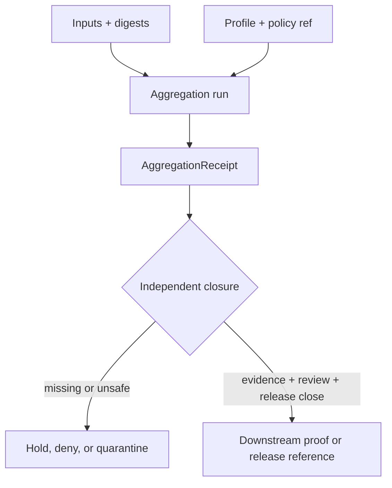

<!-- [KFM_META_BLOCK_V2]
doc_id: kfm://data/receipts/aggregation/readme
name: Aggregation Receipts README
path: data/receipts/aggregation/README.md
type: data-receipts-subroot-readme; boundary-compact; object-family-lane
version: v0.2.0
status: draft; repository-grounded; README-only; placement-hold; enforcement-unverified
owners:
  - NEEDS VERIFICATION — receipt steward assignment
  - NEEDS VERIFICATION — data steward assignment
  - NEEDS VERIFICATION — affected domain steward assignments
  - NEEDS VERIFICATION — policy, rights, and sensitivity steward assignments
  - NEEDS VERIFICATION — contract, schema, validation, proof, and release steward assignments
created: 2026-06-28
updated: 2026-07-26
policy_label: restricted-review; receipt-internal; no-direct-public-path; release-gated
truth_posture: >
  CONFIRMED exact target, prior blob, canonical data/receipts responsibility,
  accepted ADR-0029 adoption of Directory Rules v2, current parent README,
  draft RunReceipt standard, draft Agriculture AggregationReceipt contract,
  permissive scaffold schema, proposed threshold placeholder, docstring-only
  aggregate test, README-only direct validator lane, and Agriculture readiness
  workflow / PROPOSED minimum aggregation-receipt content and future direct-child
  grammar / UNKNOWN recursive payload inventory, active writers and consumers,
  physical storage, retention, signing, emitted receipt instances, runtime use,
  release integration, and public effects / NEEDS VERIFICATION canonical
  aggregation child-lane identity, object-family versus stage/domain ordering,
  accountable owners, accepted semantic and machine contracts, deterministic
  fixtures, executable validator, policy authority, proof/release closure,
  correction propagation, and rollback drills
responsibility_root: data/
authority_owner: receipt process memory
artifact_family: aggregation-receipts
receipt_family: aggregation
readme_profile: BOUNDARY_COMPACT
path_posture: existing-object-family-lane; HOLD_UNRESOLVED for new payload writes
sensitivity_posture: receipt-internal; no-public-path; process-memory-not-proof; aggregation-does-not-launder-rights-or-sensitivity; release-blocked
prepared_under_prompt: KFM Markdown Modernization & GitHub Documentation Implementation Agent v4.0.0
evidence_snapshot:
  repository: bartytime4life/Kansas-Frontier-Matrix
  base_ref: main
  base_commit: 59194561bc6f0813fe6fb3cc505d042747c86948
  prior_blob: b691830881e7787e8118e30fcad4a95186d3610d
  directory_rules_blob: fd49a0b83e55cef52c1124281f093e263526898d
  directory_rules_decision_blob: cd044a38047cc9b3725d2e083eb201eb86109308
  parent_receipts_blob: 041f205dd5e618185fc7c75e95c85872fc9bbf69
  adr_0011_blob: 40b0f47b87d584040803ed76aa6b31f5204b7fca
  run_receipt_standard_blob: 144f6a153ba9223a617e2718bca3e161bf24e605
  agriculture_contract_blob: 7a658c579011dad0636025f502419372294d9086
  agriculture_schema_blob: 16c55157c07d3115bfb540b2064e0401bc71b564
  aggregation_policy_blob: b5482dc8306c225e718e64fe6d5d879742e93654
  threshold_placeholder_blob: 31947ca3e468a967aed3fc5d44699130b7d588fd
  placeholder_test_blob: 97939b939122f029f35ecf12c81f5989df00ae63
  agriculture_validator_readme_blob: 40d268b425d9939ab6a8cda7bd197ba758572d3f
  agriculture_workflow_blob: 1dd9938b92de61c7d905f30170cf6394e6c06ea1
  method: exact target read plus selected connected authority, contract, schema, policy, test, validator, workflow, and generated-receipt inspection; no recursive checkout or runtime execution
related:
  - ../README.md
  - ../agriculture/README.md
  - ../../README.md
  - ../../proofs/README.md
  - ../../catalog/README.md
  - ../../published/README.md
  - ../../../release/manifests/README.md
  - ../../../docs/doctrine/directory-rules.md
  - ../../../docs/adr/ADR-0029-adopt-directory-governance-standard-v2.md
  - ../../../docs/adr/ADR-0011-receipts-vs-proofs-vs-manifests-vs-catalog-separation.md
  - ../../../docs/standards/RUN_RECEIPT.md
  - ../../../contracts/domains/agriculture/aggregation-receipt.md
  - ../../../schemas/contracts/v1/domains/agriculture/aggregation_receipt.schema.json
  - ../../../policy/domains/agriculture/aggregation_thresholds/README.md
  - ../../../policy/sensitivity/agriculture/aggregation_thresholds.yaml
  - ../../../tests/domains/agriculture/test_nass_aggregate_only.py
  - ../../../tools/validators/agriculture/README.md
  - ../../../.github/workflows/domain-agriculture.yml
tags:
  - kfm
  - data
  - receipts
  - aggregation
  - aggregation-receipt
  - process-memory
  - provenance
  - threshold-profile
  - evidence-refs
  - no-public-path
  - evidence-first
notes:
  - "This revision changes only `data/receipts/aggregation/README.md`; it creates no receipt payload, schema, contract, policy, fixture, validator, workflow, proof, release record, or public artifact."
  - "ADR-0029 is accepted and makes `docs/doctrine/directory-rules.md` the single writable Directory Rules authority; the adopted source bytes retain their pre-adoption status text, so effective adoption is established by the ADR and synchronized index."
  - "Directory Rules v2 confirms `data/receipts/` as the durable process-memory lane but does not by itself register `aggregation/` as a canonical child."
  - "The exact aggregation child layout remains HOLD_UNRESOLVED; this README does not authorize new payload writes or choose object-family-first, stage-first, or domain-first placement."
  - "The repository-generated receipt inspected for the Agriculture threshold-policy README is AI provenance for that document, not an emitted AggregationReceipt instance."
[/KFM_META_BLOCK_V2] -->

<a id="top"></a>

# Aggregation Receipts

> **One-line purpose.** Document the bounded `data/receipts/aggregation/` lane for aggregation process memory without treating a receipt, an aggregate, or this README as proof, policy permission, release approval, or publication.

[](#status)
[](#authority-level)
[](#current-repository-evidence)
[](#public-access-and-sensitivity)

> [!IMPORTANT]
> [`ADR-0029`](../../../docs/adr/ADR-0029-adopt-directory-governance-standard-v2.md) is now `accepted`, so [Directory Rules v2](../../../docs/doctrine/directory-rules.md) controls placement. It confirms `data/receipts/` as the process-memory responsibility lane. It does **not** independently register this exact `aggregation/` child or authorize new payload writes here.
>
> Current evidence establishes a README, a draft semantic contract, a permissive empty scaffold schema, documentation-only test and validator boundaries, and an explicit workflow hold. It does not establish an emitted AggregationReceipt, a validating schema, deterministic fixtures, an executable validator, signing, retention, release integration, or public readiness.

**Quick navigation:** [Purpose](#purpose) · [Authority](#authority-level) · [Status](#status) · [Belongs](#what-belongs-here) · [Exclusions](#what-does-not-belong-here) · [Inputs](#inputs) · [Outputs](#outputs) · [Validation](#validation) · [Review](#review-burden) · [Related](#related-folders) · [ADRs](#adrs) · [Last reviewed](#last-reviewed) · [Contract](#operating-contract) · [Evidence](#current-repository-evidence) · [Layout](#directory-map) · [Exit gates](#lifecycle-and-exit-gates) · [Verification](#open-verification-register) · [No-loss](#no-loss-and-change-ledger) · [Rollback](#maintenance-correction-and-rollback)

---

<a id="scope"></a>

## Purpose

`data/receipts/aggregation/` inherits the receipt boundary from [`data/receipts/`](../README.md). Its bounded concern is **aggregation process memory**: records that can identify what aggregation ran, the declared inputs and method, the applicable threshold or policy context, the affected outputs, and the downstream review, correction, or rollback references.

This lane does not own:

- the meaning of `AggregationReceipt`;
- its machine shape;
- aggregation thresholds or disclosure policy;
- source or domain payloads;
- EvidenceBundle or proof authority;
- release decisions;
- public-serving interfaces;
- factual truth.

Those responsibilities remain split across `contracts/`, `schemas/`, `policy/`, governed `data/` lanes, `release/`, and governed applications.

[Back to top](#top)

---

<a id="path-posture"></a>
<a id="repo-fit"></a>

## Authority level

**Inherited canonical root; unresolved child-lane identity.**

[Directory Rules v2 §11](../../../docs/doctrine/directory-rules.md#11-data-evidence-and-release-placement) assigns durable process memory to `data/receipts/`. This README is an existing `BOUNDARY_COMPACT` object-family boundary under that root. The same rules require sparse, evidence-driven lanes and prohibit empty symmetry scaffolding.

### Responsibility signature

| Axis | Bounded value |
|---|---|
| Artifact kind | Nested directory README / object-family boundary |
| Authority owner | Receipt process memory |
| Lifecycle role | Accountability store; not a lifecycle promotion state |
| Execution role | None |
| Scope kind | Proposed object family |
| Scope ID | `aggregation` — registration not verified |
| Exposure | Internal or restricted review; no direct public path |
| Mutability | README is versioned; future receipt instances should be immutable or append-only, but implementation is unverified |
| Retention | `UNKNOWN` |
| Physical storage | README in Git; receipt payload backing `UNKNOWN` |
| Same-path README outcome | `PLACE` — bounded refinement inside the existing receipt root |
| New payload/layout outcome | `HOLD_UNRESOLVED` until placement, identity, contract, schema, writer, retention, and validation authority close |

### Placement conflict

| Observed or documented lane | Current status | Boundary |
|---|---|---|
| `data/receipts/aggregation/` | Existing README; exact child authority unresolved | Object-family-first candidate |
| `data/receipts/agriculture/` | Existing README; exact subtype layout unresolved | Domain-first candidate |
| `data/receipts/pipeline/<domain>/` | Draft RunReceipt standard example | Stage-first candidate; not an accepted aggregation-instance decision |
| `data/receipts/rollback/` | Explicitly named by Directory Rules v2 for executed rollback records | Does not generalize every receipt subtype into a canonical sibling |
| `contracts/domains/agriculture/aggregation-receipt.md` | Draft semantic contract | Defines proposed meaning, not instance placement |
| `schemas/contracts/v1/domains/agriculture/aggregation_receipt.schema.json` | Permissive scaffold | Defines no required fields and cannot settle placement |

This README preserves the existing path while surfacing the conflict. It does not create a second writer, migrate a receipt, or select an ordering convention by assertion.

[Back to top](#top)

---

## Status

| Field | Current result |
|---|---|
| Path | `data/receipts/aggregation/README.md` |
| Document version | `v0.2.0` |
| Prior blob | `b691830881e7787e8118e30fcad4a95186d3610d` |
| Evidence base | `main@59194561bc6f0813fe6fb3cc505d042747c86948` |
| Directory Rules | v2 adopted through accepted ADR-0029 |
| Boundary profile | `BOUNDARY_COMPACT` |
| Path posture | Existing object-family lane; `HOLD_UNRESOLVED` for new payload writes |
| Recursive payload inventory | `UNKNOWN` |
| Active writers and consumers | `UNKNOWN` |
| Contract | Draft and path-conflicted |
| Schema | `PROPOSED` empty scaffold; non-enforcing |
| Fixtures and executable tests | Not established for this receipt family |
| Direct validator | README-only in bounded evidence |
| Agriculture workflow | Explicit readiness holds; not AggregationReceipt validation |
| Public access | `DENY` direct consumption |
| Publication effect of this README | None |

The previous statement that the parent receipt README was a greenfield stub is stale. The current parent is a repository-grounded `v0.4.0` boundary contract.

[Back to top](#top)

---

<a id="accepted-material"></a>

## What belongs here

### Safe while placement remains held

- this README;
- bounded inventory and disposition notes;
- migration or compatibility notes that do not create a second authority;
- links to the owning contract, schema, policy, validator, proof, and release surfaces;
- public-safe summaries of verification gaps that do not expose sensitive values.

### Eligible only after placement and enforcement graduation

- immutable or append-only aggregation receipt instances;
- deterministic input-set and output digests;
- method, recipe, threshold-profile, and policy-decision references;
- source-version, input, output, and evidence references;
- suppression, generalization, and aggregation-context summaries that do not leak protected thresholds or reconstructable detail;
- review, correction, supersession, release-candidate, and rollback references;
- checksums, signatures, and attestation sidecars governed by an accepted profile;
- a receipt-local index that is derived from immutable receipt identity and cannot become proof, catalog, release, or public-serving authority.

Eligibility is not current implementation evidence. New payload writes remain held until the open verification items close.

[Back to top](#top)

---

<a id="exclusions"></a>

## What does NOT belong here

| Prohibited content or authority | Owning home or required action |
|---|---|
| Source rows, source captures, or transformed domain payloads | Applicable `data/raw/`, `data/work/`, `data/quarantine/`, or `data/processed/` lane |
| EvidenceBundle, EvidenceRef closure, ProofPack, citation validation, review proof, or integrity proof | `data/proofs/` |
| STAC, DCAT, PROV, or catalog-closure projections | `data/catalog/` |
| Aggregation threshold values, disclosure logic, or policy source | `policy/` under one accepted authority |
| Semantic meaning of `AggregationReceipt` | `contracts/` |
| JSON Schema or machine shape | `schemas/` |
| Validator implementation, fixtures, tests, or CI orchestration | `tools/`, `fixtures/`, `tests/`, `.github/workflows/` |
| ReleaseManifest, PromotionDecision, ReviewRecord, CorrectionNotice, WithdrawalNotice, RollbackCard, or release signature | `release/` object-family lane |
| Public layers, tiles, reports, stories, downloads, API payloads, or generated public output | `data/published/` only after governed release closure |
| Secrets, credentials, private keys, signed URLs, or unsafe logs | Approved secret or restricted operational systems; never Git |
| Exact private field, parcel, operator, living-person, protected ecological, cultural, archaeological, genomic, infrastructure, or other harmful-precision material | Deny, quarantine, redact, generalize, or use approved restricted storage |
| Generated answer text or vector/search index treated as truth | Governed answer/delivery layer after evidence, policy, review, and release checks |

[Back to top](#top)

---

## Inputs

A future accepted AggregationReceipt profile should resolve, as applicable:

- stable receipt and run identity;
- registered domain, seam, or other scope identity;
- aggregation unit and temporal bucket;
- method or recipe identity and version;
- input refs, deterministic input-set digest, and source-version refs;
- evidence refs that can resolve independently to proof-side support;
- threshold-profile and policy-decision refs;
- rights, privacy, sensitivity, sovereignty, and disclosure obligations;
- suppression, generalization, and anti-reconstruction posture;
- affected output refs and digests;
- actor, tool, code, spec, and environment identity appropriate to audit;
- review, correction, supersession, release-candidate, and rollback refs.

An input reference is not evidence closure. A threshold-profile reference is not proof that the profile is accepted or safely applied.

[Back to top](#top)

---

## Outputs

The intended output is a bounded AggregationReceipt process-memory record plus only its governed sidecars.

| Output | May establish when independently verified | Does not establish |
|---|---|---|
| AggregationReceipt | Declared process, inputs, method, context, outputs, and recorded outcome | Aggregate truth, rights clearance, policy permission, proof closure, or release |
| Digest/checksum | Byte or set identity for the declared scope | Semantic correctness or admissibility |
| Signature/attestation | Integrity and signer/provenance facts within the accepted verification model | Scientific truth, sensitivity safety, independent review, or publication |
| Receipt-local index | Discoverability within the receipt family | Catalog authority, proof index, release manifest, or public API |
| Correction/rollback refs | Where downstream reviewers should inspect lineage | Executed correction, withdrawal, or rollback |

Downstream proof or release objects may reference a valid receipt. They must supply their own authority and closure.

[Back to top](#top)

---

<a id="required-checks-before-use"></a>

## Validation

### Current executable posture

- The paired Agriculture schema exists but has empty `properties`, no required fields, and `additionalProperties: true`.
- The Agriculture aggregate-only test module is a docstring-only `PROPOSED placeholder`; it defines no executable assertion.
- The direct Agriculture validator lane is README-only in bounded repository evidence.
- `.github/workflows/domain-agriculture.yml` is a read-only readiness workflow. It reports explicit validation, proof, and release holds and deliberately requires graduation if executable Agriculture tests or a direct validator appear.
- Repository-wide schema and validator workflows can validate only their declared configured surfaces. Their success would not establish AggregationReceipt closure for this lane.

### Required validation layers

| Layer | Required check | Fail-closed result |
|---|---|---|
| Placement | Accepted child layout, registered scope, one writer, no duplicate authority | `HOLD_UNRESOLVED` |
| Identity | Stable receipt/run IDs, deterministic digests, immutable version refs | `FAIL` or `QUARANTINE` |
| Semantic contract | Method, scope, thresholds, lineage, outputs, and limitations satisfy an accepted contract | `FAIL` |
| Machine shape | Non-permissive schema validates required fields and rejects unknown unsafe shapes | `FAIL` |
| Provenance | Inputs, sources, tool/spec/code, timestamps, and output refs resolve | `HOLD` or `QUARANTINE` |
| Evidence | Evidence refs resolve to admissible proof-side support | `ABSTAIN` or `HOLD` |
| Rights and sensitivity | Rights, privacy, sovereignty, harmful precision, and source obligations close | `DENY`, `HOLD`, or `QUARANTINE` |
| Aggregation policy | Accepted profile and policy decision resolve; obligations are preserved | `DENY` or `HOLD` |
| Anti-reconstruction | Small-cell, dominance, differencing, mosaic, adjacent-tile, and join risks are bounded | `DENY` or `HOLD` |
| Receipt integrity | Bytes are immutable/hash-bound; signature or attestation verifies when required | `FAIL` or `QUARANTINE` |
| Public boundary | No public client, map, API, search, vector index, or AI surface reads the receipt as truth | `DENY` |
| Release lineage | Review, manifest, correction, withdrawal, and rollback refs close independently | `HOLD` |

No repository-native command for validating this exact receipt family is currently established. Do not substitute a Markdown check, schema parse, green readiness hold, or generic validator run for that missing command.

[Back to top](#top)

---

## Review burden

Accountable owners and reviewer assignments remain **NEEDS VERIFICATION**.

| Change class | Minimum review concern |
|---|---|
| README clarification with no changed authority | Receipt/data boundary and documentation review |
| New child lane, alias, or instance layout | Directory governance, receipt owner, migration, and rollback review |
| Contract or schema field change | Semantic contract, schema, compatibility, fixtures, and validator review |
| Threshold or disclosure behavior | Policy, rights, privacy, sensitivity, affected domain, and independent risk review |
| New writer or consumer | Runtime/pipeline owner, receipt owner, access-control, retention, and audit review |
| Proof or release integration | Evidence/proof, policy, release, correction, rollback, and separation-of-duties review |
| Public-facing use | Governed API/UI, sensitivity, security, release, correction, and rollback review |

CODEOWNERS routing, file ownership, authorship, generator identity, or a passing check is not approval evidence.

[Back to top](#top)

---

<a id="related-files"></a>

## Related folders

### Receipt and data boundaries

- Parent receipt contract: [`../README.md`](../README.md)
- Agriculture receipt lane: [`../agriculture/README.md`](../agriculture/README.md)
- Data root: [`../../README.md`](../../README.md)
- Proof support: [`../../proofs/README.md`](../../proofs/README.md)
- Catalog projections: [`../../catalog/README.md`](../../catalog/README.md)
- Published carriers: [`../../published/README.md`](../../published/README.md)
- Release manifests: [`../../../release/manifests/README.md`](../../../release/manifests/README.md)

### Meaning, shape, policy, and enforcement

- RunReceipt standard: [`../../../docs/standards/RUN_RECEIPT.md`](../../../docs/standards/RUN_RECEIPT.md)
- Agriculture semantic contract: [`../../../contracts/domains/agriculture/aggregation-receipt.md`](../../../contracts/domains/agriculture/aggregation-receipt.md)
- Agriculture scaffold schema: [`../../../schemas/contracts/v1/domains/agriculture/aggregation_receipt.schema.json`](../../../schemas/contracts/v1/domains/agriculture/aggregation_receipt.schema.json)
- Aggregation-threshold policy boundary: [`../../../policy/domains/agriculture/aggregation_thresholds/README.md`](../../../policy/domains/agriculture/aggregation_thresholds/README.md)
- Proposed threshold placeholder: [`../../../policy/sensitivity/agriculture/aggregation_thresholds.yaml`](../../../policy/sensitivity/agriculture/aggregation_thresholds.yaml)
- Placeholder aggregate-only test: [`../../../tests/domains/agriculture/test_nass_aggregate_only.py`](../../../tests/domains/agriculture/test_nass_aggregate_only.py)
- Agriculture validator boundary: [`../../../tools/validators/agriculture/README.md`](../../../tools/validators/agriculture/README.md)
- Agriculture readiness workflow: [`../../../.github/workflows/domain-agriculture.yml`](../../../.github/workflows/domain-agriculture.yml)

[Back to top](#top)

---

## ADRs

| Decision or authority | Status | Effect here |
|---|---|---|
| [`ADR-0029`](../../../docs/adr/ADR-0029-adopt-directory-governance-standard-v2.md) | `accepted` | Adopts Directory Rules v2 and makes `docs/doctrine/directory-rules.md` the single writable human-readable authority |
| [Directory Rules v2](../../../docs/doctrine/directory-rules.md) | Adopted bytes; source header retains adoption-era `PROPOSED_FOR_ADOPTION` text | Confirms `data/receipts/` responsibility and `BOUNDARY_COMPACT`; does not register this exact child |
| [`ADR-0011`](../../../docs/adr/ADR-0011-receipts-vs-proofs-vs-manifests-vs-catalog-separation.md) | `proposed` | Documents receipt/proof/catalog/release separation but cannot independently settle placement or authorize migration |
| `ADR-S-03 receipt schema layout` | Referenced in the draft RunReceipt standard; no indexed file exists at the cited path | Lineage label only; not an accepted or assigned decision |

Any future change that creates a canonical child, chooses stage/domain/object-family ordering, adds a compatibility alias, changes an authority owner, or migrates payloads must use the applicable accepted decision and migration process. This README cannot supply that authority.

[Back to top](#top)

---

## Last reviewed

| Field | Value |
|---|---|
| Date | 2026-07-26 |
| Repository | `bartytime4life/Kansas-Frontier-Matrix` |
| Base ref | `main` |
| Pinned evidence commit | `59194561bc6f0813fe6fb3cc505d042747c86948` |
| Review type | Exact target plus selected connected authority, contract, schema, policy, test, validator, workflow, and generated-receipt evidence |
| Scope limit | No recursive checkout, payload inventory, runtime execution, branch-rules inspection, or production/public-state verification |
| Next review trigger | Directory Rules projection, receipt-layout decision, new child/writer/consumer, contract/schema/policy change, fixture/test/validator graduation, emitted receipt, proof/release integration, correction, or rollback change |

[Back to top](#top)

---

<a id="receipt-boundary"></a>

## Operating contract

```text
receipt != proof != catalog != policy decision != release decision != publication
```

### Aggregation-specific invariants

- **Process memory, not truth.** A receipt records a declared aggregation operation; it does not prove the aggregate claim.
- **Provenance survives aggregation.** Input refs, digests, source versions, evidence refs, method identity, and limitations remain inspectable.
- **Source roles do not collapse.** Observed, modeled, reported, estimated, derived, and inferred inputs retain their roles.
- **Threshold context travels.** The accepted profile and decision refs travel with the receipt; this README invents no numeric threshold.
- **Sensitivity is not laundered.** Aggregation does not automatically clear privacy, rights, sovereignty, cultural, ecological, archaeological, genomic, infrastructure, living-person, or location risk.
- **Precision cannot be reconstructed.** Suppression, dominance, differencing, mosaics, adjacent cells, time series, and cross-lane joins require explicit review.
- **Public clients do not read receipts directly.** Governed clients consume release-approved carriers through governed interfaces.
- **Correction and rollback remain visible.** An invalidated input, policy change, or unsafe aggregate must propagate to dependent review and release state.

### Trust flow



The diagram is an authority flow, not evidence that these steps are implemented for this lane.

<a id="forbidden-shortcut"></a>

### Forbidden shortcut

```text
AggregationReceipt
  -> proof by placement
  -> catalog closure by reference
  -> release by workflow success
  -> public truth
```

Every arrow above is denied unless the destination family performs its own governed transition and leaves independently inspectable evidence.

[Back to top](#top)

---

## Minimum future receipt content

The draft Agriculture contract and aggregation-policy boundary propose the following semantic minimum. The current scaffold schema does **not** enforce it.

| Field or field family | Purpose |
|---|---|
| `receipt_id`, `run_id` | Stable receipt and execution identity |
| `aggregation_method` | Method or recipe used |
| `aggregation_unit`, temporal scope | Declared spatial/statistical unit and time bucket |
| `threshold_profile` | Immutable accepted profile identity or ref |
| `input_refs`, `inputs_digest` | Inputs and deterministic set identity |
| `inputs_evidence_refs` | Proof-side support references for inputs |
| source-version and source-role refs | Preserve source identity, version, and authority role |
| `produced_output_refs` | Affected aggregate candidates or outputs |
| suppression/generalization summary | Record applied transformations without leaking protected values |
| `policy_state` or policy-decision ref | Bounded decision and obligations |
| rights and sensitivity refs | Applicable use, redistribution, privacy, and harmful-precision constraints |
| actor/tool/code/spec identity | Reproducibility and audit context |
| timestamps | Event and receipt timing appropriate to the accepted contract |
| `review_state` | Accountable review state when material |
| `release_ref` | Release-candidate or manifest linkage when applicable |
| `correction_refs`, `rollback_target` | Correction, supersession, and prior-known-good lineage |

Writers must not emit this proposed field set as though it were schema-approved closure.

[Back to top](#top)

---

<a id="status-notes"></a>

## Current repository evidence

| Surface | Verified state at the evidence commit | Safe conclusion |
|---|---|---|
| This README | Existing `v0.1.0`; blob `b691830…` | Same-path modernization is permitted; path authority remains bounded |
| Parent `data/receipts/README.md` | Repository-grounded `v0.4.0`; blob `041f205…` | The prior “greenfield stub” claim is stale |
| Directory Rules v2 | Blob `fd49a0…`, adopted by accepted ADR-0029 | `data/receipts/` owns process memory |
| Directory Rules machine projection | `control_plane/root_registry.yaml` not found | Do not claim machine-enforced child registration |
| ADR-0011 | `proposed`; blob `40b0f47…` | Family-separation proposal is useful context, not accepted migration authority |
| RunReceipt standard | Draft `v1`; blob `144f6a1…` | Names `AggregationReceipt` and stage-first examples; field/layout decisions remain draft |
| Agriculture AggregationReceipt contract | Draft `v0.2`; blob `7a658c5…` | Proposed semantics exist; contract filename/home conflict remains |
| Paired Agriculture schema | `PROPOSED` scaffold; blob `16c5515…` | Empty properties and permissive additional fields provide no meaningful conformance |
| Aggregation-threshold policy README | Repository-grounded draft `v0.2`; blob `b5482dc…` | Defines a fail-closed boundary without accepted numeric thresholds |
| Threshold YAML | `status: PROPOSED`; placeholder only; blob `31947ca…` | No executable threshold profile is established |
| Aggregate-only test module | Docstring-only placeholder; blob `97939b9…` | No collected assertion is established by this file |
| Direct Agriculture validator lane | README-only in bounded evidence; blob `40d268b…` | No direct executable AggregationReceipt validator is established |
| Agriculture workflow | Read-only explicit readiness holds; blob `1dd9938…` | Green workflow state is not validation, proof, release, or publication |
| Generated policy-document receipt | AI provenance record for the threshold-policy README | Not an emitted AggregationReceipt and not approval |
| Recursive contents of this subtree | Not exhaustively listed by the available repository read path | Payload inventory and active writer state remain `UNKNOWN` |

[Back to top](#top)

---

<a id="directory-map"></a>

## Directory map

### Verified boundary

| Item | Status |
|---|---|
| `data/receipts/aggregation/README.md` | `CONFIRMED` |
| Other direct children | `UNKNOWN` — no exhaustive tree inventory was available |

<details>
<summary><strong>Proposed direct-child grammar — not authorized for payload writes</strong></summary>

```text
data/receipts/aggregation/
├── README.md
└── <registered-scope>/        # PROPOSED; exact ordering and identity unresolved
```

Under Directory Rules v2, this README may show only its direct children. A future child README owns run-level or record-level detail. Do not materialize the proposed child merely for symmetry.

</details>

A local index, if later accepted, is receipt-local and derived. It cannot be a proof index, catalog record, release manifest, public-layer pointer, search index, vector index, map source, or generated-answer source.

[Back to top](#top)

---

<a id="exit-gates"></a>

## Lifecycle and exit gates

Receipts occupy the accountability plane alongside—not inside—the data lifecycle:

```text
RAW -> WORK / QUARANTINE -> PROCESSED -> CATALOG / TRIPLETS -> PUBLISHED
```

An aggregation run may emit process memory while a separate governed actor controls lifecycle or release state.

| Route | Minimum condition | Authority effect |
|---|---|---|
| Keep README-only | Placement or implementation remains unresolved | No payload authority |
| Record receipt locally | Accepted layout, writer, identity, contract/schema, retention, and integrity checks | Process memory only |
| Hold | Missing method, inputs, profile, evidence, rights, sensitivity, review, or rollback context | No promotion or public use |
| Quarantine/correct | Receipt contradicts inputs, violates policy, leaks sensitivity, or points to unreconcilable outputs | Isolate and preserve correction lineage |
| Reference from proof | Proof object independently resolves evidence and cites the receipt as process support | Receipt does not become proof |
| Reference from release | Release object independently closes proof, policy, review, correction, and rollback | Receipt does not become release approval |
| Public consumption | Direct receipt read | `DENY` |

[Back to top](#top)

---

## Public access and sensitivity

The default exposure posture is **no direct public path**.

- Do not expose receipt payloads through ordinary APIs, MapLibre sources, downloads, search, graph, vector, or AI context.
- Do not record raw sensitive values when stable refs, bounded counts, reason codes, or protected locators are sufficient.
- Do not reveal numeric thresholds or transformation details when doing so increases evasion or reconstruction risk.
- Preserve the most restrictive rights and sensitivity posture across inputs and joins.
- Treat exact field/operator/parcel, living-person, protected ecological, cultural, archaeological, genomic, infrastructure, and other harmful-precision material as deny/hold/quarantine candidates.
- A generalized aggregate remains subject to evidence, policy, review, release, correction, and rollback gates.

[Back to top](#top)

---

## Open verification register

| ID | Item | Status | Required evidence |
|---|---|---|---|
| AGG-RCPT-01 | Register or reject `aggregation` as a receipt child identity | `NEEDS VERIFICATION` | Accepted decision or registry entry plus migration posture |
| AGG-RCPT-02 | Resolve object-family-first, stage-first, and domain-first ordering | `CONFLICTED` | Consumer/writer inventory and one accepted layout |
| AGG-RCPT-03 | Align hyphenated contract path with underscore schema metadata | `CONFLICTED` | Accepted semantic path plus synchronized schema link |
| AGG-RCPT-04 | Replace the empty permissive schema with an accepted version | `NEEDS VERIFICATION` | Required fields, closed shape, valid/invalid fixtures, compatibility plan |
| AGG-RCPT-05 | Establish stable receipt/run/profile identity and canonicalization | `NEEDS VERIFICATION` | Accepted contract, digest algorithm, test vectors |
| AGG-RCPT-06 | Inventory payloads, writers, consumers, and physical storage | `UNKNOWN` | Pinned recursive tree plus runtime/storage inventory |
| AGG-RCPT-07 | Define immutability, retention, legal hold, signing, and deletion | `UNKNOWN` | Policy, storage profile, verification and recovery tests |
| AGG-RCPT-08 | Accept aggregation policy authority without inventing numeric values | `NEEDS VERIFICATION` | Approved profile source, owner, visibility, version, policy tests |
| AGG-RCPT-09 | Add deterministic no-network valid and invalid fixtures | `NEEDS VERIFICATION` | Synthetic fixture matrix and expected reason codes |
| AGG-RCPT-10 | Implement one executable validator and structured report | `NEEDS VERIFICATION` | Source, tests, command, CI wiring, observed run |
| AGG-RCPT-11 | Prove rights, sensitivity, and anti-reconstruction denial | `NEEDS VERIFICATION` | Small-cell, dominance, differencing, mosaic, join, and leakage tests |
| AGG-RCPT-12 | Prove EvidenceRef-to-EvidenceBundle closure | `NEEDS VERIFICATION` | Resolver, missing/stale/conflicting evidence tests |
| AGG-RCPT-13 | Prove public clients cannot consume receipts directly | `NEEDS VERIFICATION` | Governed API/UI/map/export/search/AI negative tests |
| AGG-RCPT-14 | Close release, correction, withdrawal, and rollback integration | `NEEDS VERIFICATION` | Manifest/decision refs, invalidation cascade, rollback drill |
| AGG-RCPT-15 | Assign accountable owners and independent review burden | `NEEDS VERIFICATION` | Stewardship assignments and enforced review route |

Unknowns narrow claims and block higher-risk transitions. They do not invite plausible defaults.

[Back to top](#top)

---

## No-loss and change ledger

| Prior v0.1 element | v0.2 disposition |
|---|---|
| Stable `doc_id`, path, created date, and receipt-family identity | Preserved |
| Scope and process-memory purpose | Preserved and clarified under Directory Rules v2 |
| Requested-subroot uncertainty | Preserved and upgraded to explicit `HOLD_UNRESOLVED` |
| Receipt/proof/catalog/release separation | Preserved and strengthened |
| Input lineage, method, threshold/profile, output, review, correction, and rollback context | Preserved and expanded |
| Rights, privacy, sensitivity, and no-public-path safeguards | Preserved and strengthened with anti-reconstruction controls |
| Accepted-material list | Narrowed into safe-current versus post-graduation content |
| Exclusions | Preserved and reconciled to responsibility roots |
| Proposed deep directory tree | Repaired to a v2-compliant direct-child proposal; unverified children are not presented as current |
| Exit gates and forbidden shortcut | Preserved and made authority-specific |
| Required checks | Preserved and expanded into a validation matrix |
| Status notes | Corrected for the modernized parent, accepted ADR-0029, existing scaffold schema, placeholder test, README-only validator, and explicit workflow holds |
| Legacy anchors | Preserved through explicit anchors for scope, path posture, repo fit, receipt boundary, accepted material, exclusions, directory map, exit gates, forbidden shortcut, required checks, status notes, and related files |
| Legacy architecture Directory Rules link | Repaired to the ADR-0029 canonical doctrine path |
| Badge strip | Reduced to four evidence-backed orientation badges; no workflow-success badge added |
| Payload, move, rename, deletion, migration, release, or public-state change | None |

[Back to top](#top)

---

## Maintenance, correction, and rollback

### Maintenance triggers

Re-review this README when:

- the receipt root registry or Directory Rules projection is implemented;
- a receipt-layout ADR or migration record is accepted;
- a child lane, writer, consumer, payload, or storage backing appears;
- the AggregationReceipt contract or schema changes;
- an aggregation threshold profile or evaluator is accepted;
- fixtures, tests, validator, structured report, or CI graduate;
- proof, release, public-client, correction, withdrawal, or rollback integration changes;
- rights, sensitivity, privacy, sovereignty, or anti-reconstruction requirements change.

### Correction

If a receipt or this README overstates closure:

1. preserve the affected version, receipt IDs, digests, and downstream refs;
2. stop new writes or public reliance;
3. identify affected proofs, candidates, releases, and public carriers;
4. correct through the owning contract, schema, policy, validator, or release surface;
5. replay deterministically where authorized;
6. issue correction or withdrawal records when downstream state changed;
7. update this README and the verification register.

### Documentation rollback

Before merge, leave or close the review PR without merging. After merge, use a reviewed revert or restore prior blob:

```text
b691830881e7787e8118e30fcad4a95186d3610d
```

This revision changes Markdown only. No receipt payload, contract, schema, policy, fixture, validator, workflow, proof, release record, deployment, or public state requires operational rollback.

[Back to top](#top)

---

## Change history

| Version | Date | Change | Effect |
|---|---|---|---|
| `v0.1.0` | 2026-06-28 | Replaced placeholder content with a proposed aggregation receipt boundary | Documentation only |
| `v0.2.0` | 2026-07-26 | Re-grounded the lane under accepted Directory Rules v2; corrected stale parent and ADR claims; surfaced the unresolved child layout; recorded current contract/schema/policy/test/validator/workflow maturity; added validation, evidence, public-access, verification, no-loss, and rollback controls | Documentation only; no payload or authority transition |

---

**KFM rule:** aggregation process memory can support audit, proof review, release review, correction, and rollback. It cannot turn an aggregate into truth, erase provenance or sensitivity, authorize release, or become a direct public data source.

[Back to top](#top)
